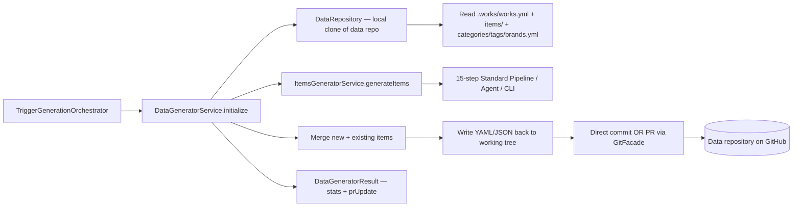

# Implementation Plan: Data Generator

**Feature ID**: `data-generator`
**Spec**: `./spec.md`
**Tasks**: `./tasks.md`
**Status**: `Done` (Retrospective)
**Last updated**: 2026-05-02

---

## 1. Architecture



The data generator owns **everything between the pipeline result and
the data repository on GitHub** — pipeline output to YAML/JSON to
commit/PR. It does not own the pipeline itself (lives in
`items-generator`) and does not own the website/markdown generation
(those run after, in their own orchestrator phases).

## 2. Tech Choices

| Concern              | Choice                                           | Rationale                                                               |
| -------------------- | ------------------------------------------------ | ----------------------------------------------------------------------- |
| Working tree         | Local clone via `isomorphic-git`                 | Pure-JS git; no system git binary required in the worker container      |
| File format — config | YAML (`js-yaml`)                                 | Human-readable, edits-friendly, the format works grew up with           |
| File format — items  | One JSON file per item under `items/`            | Diff-friendly, low merge conflict surface, slug == filename             |
| Item merge unit      | `slug`                                           | Stable identity; preserves user-edited fields (`featured`, `order`)     |
| Commit strategy      | Direct push **or** PR per work setting           | PR mode supports review-driven works; direct mode for single-owner      |
| Branch naming        | `ever-update-<unix-timestamp>` for PR mode       | Sortable, no collision risk                                             |
| Version field        | Auto-increment integer in `.works/works.yml`     | Cache-busting signal for the markdown / website / API consumers         |
| Error recovery       | Idempotent writes; retry clone/push with backoff | Network-related failures are common; everything else fails the run loud |

## 3. Data Model

The data generator does not own a TypeORM entity. Its persistent
state is the **data repository on GitHub**:

```text
{owner}/{work-slug}-data/
├── .works/works.yml          # WorkConfig (name, slug, version, metadata)
├── items/              # One JSON file per item (filename = slug)
│   ├── tool-a.json
│   └── tool-b.json
├── categories.yml      # Category[] — id, name, priority
├── tags.yml            # Tag[] — id, name
└── brands.yml          # Brand[] — id, name, logo_url
```

`.works/works.yml.metadata.last_request_data` stores the most recent
`CreateItemsGeneratorDto` so subsequent runs can be diffed and
re-runs reproduce the prior parameters.

## 4. API Surface

The data generator is invoked from inside the work-generation
trigger task; it has no public HTTP surface. The work-level
endpoints `POST /api/works/:id/generate` and
`POST /api/works/:id/regenerate` (see `data-management` spec)
are the user-visible entry points and ultimately call
`DataGeneratorService.initialize`.

Inputs / outputs:

```ts
type DataGeneratorPayload = {
	workId: string;
	userId: string;
	mode: 'create' | 'update';
	dto: CreateItemsGeneratorDto;
	historyId: string;
};

type DataGeneratorResult = {
	success: boolean;
	prUpdate?: { branch: string; title: string; body: string; number: number; url: string };
	hasExistingItems: boolean;
	stats: {
		newItemsCount: number;
		updatedItemsCount: number;
		totalItemsCount: number;
		metrics: ItemsGeneratorMetrics;
	};
	error?: { code: string; message: string; cause?: Error };
	warnings?: string[];
};
```

## 5. Plugin Surface

- **Git operations** flow through `GitFacadeService` — clone, push,
  branch, PR creation. The default plugin is `git-github`; the
  facade also routes to OAuth-token-based auth via the same
  `GitProvider` capability.
- **AI / search / extraction** are handled inside the items pipeline,
  not directly here.

## 6. Web / CLI Surface

- Web: the work generation trigger lives on the work detail
  page; results (stats, PR link) surface in the generation history
  panel and the recent-logs stream.
- CLI: `everworks generate <workId>` triggers the same flow
  through the public CLI.

## 7. Background Jobs

The full generation runs inside the Trigger.dev `work-generation`
task (see [`trigger-integration`](../../architecture/trigger-integration.md)).
The data generator runs **inline** within that task — it is not its
own task.

## 8. Security & Permissions

- Authorization is enforced upstream in
  `WorkOwnershipService.ensureAccess` before the trigger task
  receives the payload.
- Git access tokens are fetched via `GitFacadeService.getAccessToken`,
  which reads encrypted credentials from `auth_accounts` and is the
  only place tokens are materialised in worker memory.
- `.works/works.yml` and `last_request_data` may contain user prompts;
  the activity log records only the field names that changed, never
  the prompt content (mirrors the `advanced-prompts` policy).

## 9. Observability

- `GenerationLogCollector` streams structured logs back to the
  `work_generation_history.logs` JSONB column and a recent-logs
  ring buffer.
- Activity log emits `work_generation_started` /
  `work_generation_completed` with the resolved stats.
- PostHog: `event.generation.completed` with item counts and
  duration.
- Sentry: any uncaught error inside `initialize()` is captured by
  the worker's `MonitoringModule`.

## 10. Phased Rollout

Shipped pre-Spec-Kit; the retrospective set covers production
behaviour. Future changes follow the standard /specify → /plan →
/tasks loop.

## 11. Risks & Mitigations

| Risk                                                          | Mitigation                                                                            |
| ------------------------------------------------------------- | ------------------------------------------------------------------------------------- |
| Concurrent runs on the same work clobber each other's commits | Schedule dispatcher claims runs via CAS; manual triggers respect `GENERATING` status  |
| User edits to `featured` / `order` get reset by RECREATE      | Documented as expected RECREATE behaviour; UI warns before triggering RECREATE        |
| GitHub rate limits during many-works generation               | Token rotation + per-user clone cache + retry-with-backoff in `GitFacade`             |
| Item slug collision between AI-generated names                | Slugs deduplicated inside the items pipeline (Step 8 — `AiDeduplicator`) before write |
| Partial write on push failure leaves the working tree dirty   | Commits are atomic; failed push retries the same commit, never a recomputed one       |

## 12. Constitution Reconciliation

- **I (Plugin-first)**: Git provider is a plugin (`git-github`); facade routes through capability
- **II (Capability-driven)**: `GitProviderCapability` covers clone / branch / commit / push / PR
- **III (Source-of-truth repos)**: this _is_ the data repo writer — the source-of-truth contract is what this feature implements
- **IV (Trigger.dev)**: runs inside the `work-generation` Trigger.dev task
- **V (Forward-only migrations)**: schema is the data repo layout; `version` field allows additive evolution
- **VI (Tests)**: unit tests cover merge logic, write/read round-trips, mode switching; e2e covers PR creation
- **VII (Secret hygiene)**: tokens never logged; activity log records change names only
- **VIII (Plugin counts)**: `git-github` is the canonical git provider plugin
- **IX (Behaviour-first)**: spec describes observable behaviour — repository structure, modes, merge semantics
- **X (Backwards-compat)**: `.works/works.yml.version` allows additive schema changes without breaking older clones

## 13. References

- Spec: `./spec.md`
- Implementation: `packages/agent/src/data-generator/data-generator.service.ts`,
  `packages/agent/src/data-generator/data-repository.ts`
- Pipeline: [`features/markdown-generator`](../markdown-generator/spec.md),
  [`features/website-generator`](../website-generator/spec.md)
- Architecture: [`architecture/pipeline-overview`](../../architecture/pipeline-overview.md),
  [`architecture/trigger-integration`](../../architecture/trigger-integration.md)
