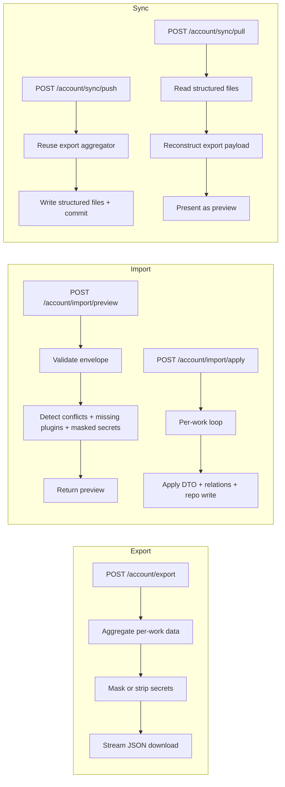

# Implementation Plan: Data Management

**Feature ID**: `data-management`
**Spec**: `./spec.md`
**Status**: `Done` (Retrospective)
**Last updated**: 2026-05-01

---

## 1. Architecture

## 2. Tech Choices

| Concern             | Choice                                       | Rationale                            |
| ------------------- | -------------------------------------------- | ------------------------------------ |
| Aggregation         | Per-work iterator over relations + repo | Keeps memory bounded                 |
| Secret redaction    | `redactSecretsFromSettings(plugin, value)`   | Single helper enforces Principle VII |
| Masked detection    | Prefix `MASKED:` is reserved                 | Simple, unambiguous                  |
| Conflict resolution | Stateless: client supplies `resolutions[]`   | Idempotent retries                   |
| Path safety         | `path.basename(slug)` on every IO            | Cheap defence-in-depth               |
| Sync transport      | `GitFacadeService` against user's repo       | Principle II                         |

## 3. Data Model

No core schema changes. The transient export envelope is the only new
structure; nothing persisted.

The settings store schemas already include `x-secret`; the redactor
consults the JSON schema, not a hardcoded list.

## 4. API Surface

| Method   | Endpoint                       | Description                     |
| -------- | ------------------------------ | ------------------------------- |
| `POST`   | `/api/account/export`          | Download JSON                   |
| `POST`   | `/api/account/import/preview`  | Validate + summarise            |
| `POST`   | `/api/account/import/apply`    | Apply with conflict resolutions |
| `GET`    | `/api/account/sync/status`     | Read sync configuration         |
| `POST`   | `/api/account/sync/configure`  | Set up the GitHub repo          |
| `POST`   | `/api/account/sync/push`       | Push to GitHub                  |
| `POST`   | `/api/account/sync/pull`       | Pull (returns preview)          |
| `POST`   | `/api/account/sync/apply-pull` | Apply pulled preview            |
| `DELETE` | `/api/account/sync`            | Disconnect sync                 |

## 5. Plugin / Web / CLI

- Plugins: GitHub plugin handles the repo IO (add/remove/list/get-content).
- Web: **Settings → Data** with three panels (Export, Import, GitHub Sync).
- CLI: not exposed.

## 6. Background Jobs

None — all sync operations are user-initiated.

## 7. Security & Permissions

- All endpoints require JWT.
- Pull always ignores secret values regardless of file contents.
- Path traversal blocked via `path.basename`.

## 8. Observability

- Import returns `ImportResult` with `worksCreated`,
  `worksUpdated`, `worksSkipped`, `userPluginsImported`,
  `warnings[]`, `errors[]`.
- Activity log entries: `account_exported`, `account_imported`,
  `sync_pushed`, `sync_pulled`.

## 9. Risks & Mitigations

| Risk                                   | Mitigation                                       |
| -------------------------------------- | ------------------------------------------------ |
| Real secret leaks via export           | Redactor enforced for every secret-flagged field |
| Masked secrets imported as real values | `MASKED:` detection skips them with warning      |
| Path traversal in sync repo            | `path.basename(slug)` on read and write          |
| Slug collision corrupts existing data  | Conflict-resolution flow forces explicit choice  |

## 10. Constitution Reconciliation

See `spec.md` §9. Principle VII is the dominant constraint here; every
transport boundary enforces it.

## 11. References

- Spec: `./spec.md`
- Implementation: `apps/api/src/account/` (export, import, sync services)
