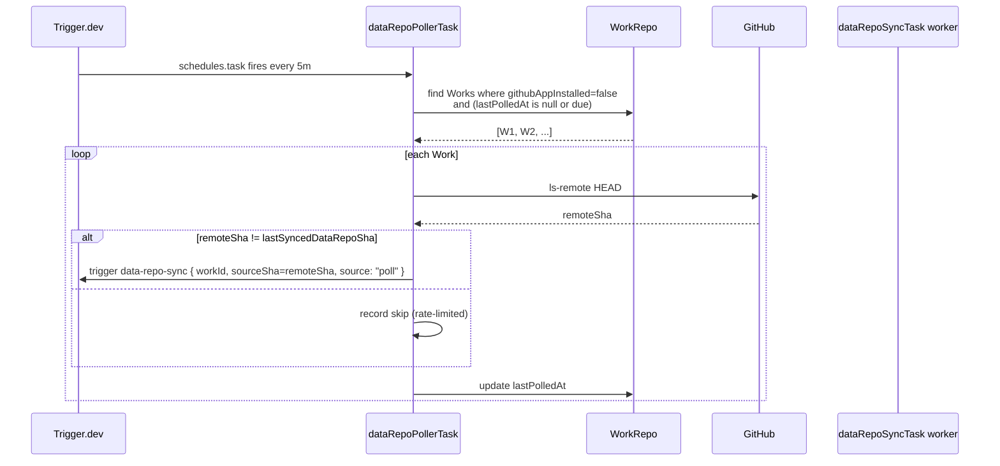

# Implementation Plan: Instant Data-Repo → Main-Repo Sync

**Feature ID**: `data-repo-instant-sync`
**Spec**: [`./spec.md`](./spec.md)
**Tasks**: [`./tasks.md`](./tasks.md)
**Status**: `Draft`
**Last updated**: 2026-05-16

---

## 1. Module layout

```text
apps/api/src/
├── integrations/github-app/
│   ├── github-app-webhook.controller.ts          # add `push` branch
│   └── github-app-sync.service.ts                # add handlePushEvent()
├── work/
│   ├── work.entity.ts                            # +4 columns
│   └── work.module.ts                            # wire DataRepoSyncController
├── data-sync/                                    # NEW
│   ├── data-sync.module.ts
│   ├── data-sync.service.ts                      # acquireLock / releaseLock / record activity
│   ├── data-sync.controller.ts                   # POST /api/works/:id/sync (force-sync)
│   └── data-sync.types.ts                        # SyncSource, SyncReason enums
└── database/migrations/<ts>-data-repo-instant-sync.ts

packages/agent/src/generators/markdown-generator/
├── markdown-generator.service.ts                 # add public syncFromDataRepo()
└── markdown-generator.service.spec.ts            # cover the new entry

packages/tasks/src/tasks/trigger/
├── data-repo-sync.task.ts                        # NEW — render-only worker
└── data-repo-poller.task.ts                      # NEW — schedules.task */5 * * * *

apps/web/src/
├── components/works/activity/
│   ├── sync-event-row.tsx                        # NEW — render `data-sync.*` rows
│   └── activity-filter-chips.tsx                 # extend with `Sync` chip
└── lib/i18n/en/works.json                        # new strings for the activity feed

docs/specs/features/data-repo-instant-sync/       # this folder
```

## 2. Tech choices

| Concern                           | Choice                                                                   | Rationale                                                                  |
| --------------------------------- | ------------------------------------------------------------------------ | -------------------------------------------------------------------------- |
| Debounce store                    | Redis ZSET keyed `data-sync:debounce:<workId>` with member = first-seen timestamp | Survives worker restarts; coalesces across multiple webhook workers        |
| Lock store                        | Redis `SET data-sync:lock:<workId> 1 NX EX 300`                          | Atomic, TTL self-recovers from crash. Existing Redis already used by BullMQ |
| Render-only entry                 | New public `syncFromDataRepo(workId, opts)` on `MarkdownGeneratorService` | Reuses 95% of existing `initialize()` body; clearly separates from full pipeline path |
| Remote SHA probe                  | `git ls-remote <url> HEAD` via `isomorphic-git` (no shell)               | Matches existing data-generator git layer; works inside the Trigger.dev sandbox |
| Activity feed integration         | Reuse `ActivityLogService.record()` from EW-120                          | Avoids a parallel logging schema; one truth                                |
| Trigger.dev poller                | `schedules.task` cron — registered at deploy via existing `pnpm deploy:trigger` | Same pattern as `WorkScheduleDispatcherTask`                               |
| Migration                         | One TypeORM migration adding 4 columns + 2 indexes (`lastSyncedDataRepoSha`, `(githubAppInstalled, syncIntervalMinutes)`) | Single commit revertable                                                   |
| Force-sync endpoint               | Authenticated `POST /api/works/:id/sync` returning activity-row id       | Matches existing `POST /api/works/:id/generate` ergonomics                 |

## 3. Sequence — Path A (webhook)

```mermaid
sequenceDiagram
    participant GH as GitHub (data repo)
    participant CT as GithubAppWebhookController
    participant SV as GithubAppSyncService
    participant RD as Redis (debounce ZSET)
    participant TR as Trigger.dev
    participant W as dataRepoSyncTask worker
    participant MG as MarkdownGeneratorService
    participant AC as ActivityLogService
    GH->>CT: POST /api/github-app/webhooks push
    CT->>SV: handlePushEvent(payload)
    SV->>SV: resolveWorkByRepoFullName()
    SV->>RD: ZADD debounce key NX, score = now+30s
    Note over RD: First arrival schedules; later arrivals coalesce
    RD-->>SV: scheduled at T+30s
    Note over RD,TR: At T+30s a job in the API process<br/>(via in-mem timer or Redis-scheduled BullMQ delay)<br/>fires the enqueue
    SV->>TR: tasks.trigger("data-repo-sync", { workId, sourceSha, source: "webhook" })
    TR->>W: invoke
    W->>SV: dataSyncService.acquireLock(workId)
    W->>MG: syncFromDataRepo({ workId, sourceSha })
    MG-->>W: { beforeSha, afterSha, filesChanged }
    W->>AC: record(data-sync.success, payload)
    W->>SV: dataSyncService.releaseLock(workId)
```

## 4. Sequence — Path B (poller)



## 5. `MarkdownGeneratorService.syncFromDataRepo()` shape

```ts
async syncFromDataRepo(input: {
    workId: string;
    expectedSourceSha?: string;        // optional optimistic check
    abortSignal?: AbortSignal;
}): Promise<{
    beforeSha: string;
    afterSha: string;
    filesChanged: number;
    durationMs: number;
}> {
    // 1. Resolve Work + credentials (unchanged from initialize())
    // 2. Clone or pull data repo (unchanged)
    // 3. If expectedSourceSha provided and HEAD ≠ expectedSourceSha:
    //    proceed anyway — webhook may be stale, render against current HEAD.
    //    Recorded in activity row as a note, not an error.
    // 4. Clone or pull main repo (unchanged)
    // 5. Run the existing render block (lines 144-224 of current initialize()):
    //    - readDetails / writeDetails per item slug
    //    - generateReadme() with ReadmeBuilder
    // 6. Commit + push main repo (unchanged)
    // 7. Return stats
}
```

The body extracts into a private `renderToMainRepo(ctx)` helper. Both `initialize()` (full pipeline) and `syncFromDataRepo()` call it. No behaviour change for the existing pipeline.

## 6. Lock semantics — exact pseudo-code

```ts
// data-sync.service.ts
async tryAcquireSyncLock(workId: string): Promise<{ acquired: boolean; reason?: 'sync-in-progress' | 'generation-in-progress' }> {
    const acquired = await this.redis.set(`data-sync:lock:${workId}`, '1', 'NX', 'EX', this.lockTtlSeconds);
    if (!acquired) return { acquired: false, reason: 'sync-in-progress' };

    const work = await this.workRepo.findOne(workId);
    if (work.pipelineStatus === 'RUNNING') {
        await this.redis.del(`data-sync:lock:${workId}`);
        return { acquired: false, reason: 'generation-in-progress' };
    }
    return { acquired: true };
}

async releaseSyncLock(workId: string): Promise<void> {
    await this.redis.del(`data-sync:lock:${workId}`);
}
```

`WorkScheduleDispatcherService.dispatchDue()` is amended to skip a Work if `redis.exists('data-sync:lock:<workId>')`. Sync wins ties — a single sync run is short (~30–60s); a generation run that gets deferred picks up next tick.

## 7. Migration

```ts
// <ts>-data-repo-instant-sync.ts
export class DataRepoInstantSync1747400000000 implements MigrationInterface {
    public async up(q: QueryRunner): Promise<void> {
        await q.query(`
            ALTER TABLE "work"
            ADD COLUMN "last_synced_data_repo_sha" varchar(40) NULL,
            ADD COLUMN "sync_interval_minutes" int NOT NULL DEFAULT 5,
            ADD COLUMN "github_app_installed" boolean NOT NULL DEFAULT false,
            ADD COLUMN "last_polled_at" timestamptz NULL
        `);
        await q.query(`
            CREATE INDEX "idx_work_sync_poller"
            ON "work" ("github_app_installed", "sync_interval_minutes", "last_polled_at")
            WHERE "github_app_installed" = false
        `);
    }
    public async down(q: QueryRunner): Promise<void> {
        await q.query(`DROP INDEX "idx_work_sync_poller"`);
        await q.query(`
            ALTER TABLE "work"
            DROP COLUMN "last_synced_data_repo_sha",
            DROP COLUMN "sync_interval_minutes",
            DROP COLUMN "github_app_installed",
            DROP COLUMN "last_polled_at"
        `);
    }
}
```

`github_app_installed` is denormalised from the existing `github_app_installation` table to keep the poller's bulk filter cheap. Updated by webhook on `installation` / `installation_repositories` events (already routed through `github-app-sync.service.ts`).

## 8. Testing strategy

- **Unit (`packages/agent`, Jest)**: `syncFromDataRepo()` — happy path, expectedSourceSha mismatch, abort signal, empty data repo, idempotent re-run on the same SHA.
- **Unit (`apps/api`, Jest)**: `data-sync.service.ts` — lock contention, generation-in-progress check, release on exception.
- **Unit (`apps/api`, Jest)**: `github-app-sync.service.ts` — `handlePushEvent` resolves repo → Work, drops unknown, debounce coalesces.
- **Unit (`packages/tasks`, Vitest)**: `dataRepoPollerTask` SHA-diff branch, skip branch, rate-limited no-change row.
- **Integration (`apps/api`, Supertest)**: `POST /api/works/:id/sync` returns 202 + activity-row id; emits `data-sync.success` after the worker finishes; emits `data-sync.skipped reason=generation-in-progress` when pipeline is mocked RUNNING.
- **E2E**: not in this PR — covered by manual smoke per acceptance.md.

## 9. Rollout

1. Land spec PR (this) — review + approval.
2. Code PR to `develop`:
   - Migration
   - `syncFromDataRepo()` extraction (no behaviour change)
   - Data-sync module
   - Webhook push handler (subscribed but gated behind `subscriptions.dataSync.webhookEnabled` flag, default `false` to be safe)
   - Poller task (also gated by `subscriptions.dataSync.pollerEnabled`, default `false`)
   - Activity feed UI
3. After CI green + reviewer sign-off, flip `webhookEnabled = true` and `pollerEnabled = true` on `develop` via env. Soak for 24h.
4. Cascade to `stage` and `main` per the project's release flow (develop → stage → main).
5. Remove the feature flags after 1 week of clean runs on `main`.

## 10. Backwards compatibility

- The full generation pipeline is unchanged. Existing scheduled runs render the main repo as today.
- The four new columns are nullable / have sensible defaults — existing rows backfill via migration defaults.
- Activity feed adds three new event types; UI gracefully ignores them if the front-end is older than the API (chip just doesn't appear).

## 11. Out-of-scope follow-ups (filed if not done here)

- Dashboard control to set per-Work `syncIntervalMinutes` (UI). Initial release ships with the DB column + API but no UI control; users get the 5-min default.
- Webhook for the main repo (e.g. customer hand-edits `details/foo.md` — what should we do?). Currently the next sync overwrites; documenting this contract in onboarding copy is the resolution.
- Multi-repo data sources (1 Work → N data repos).
