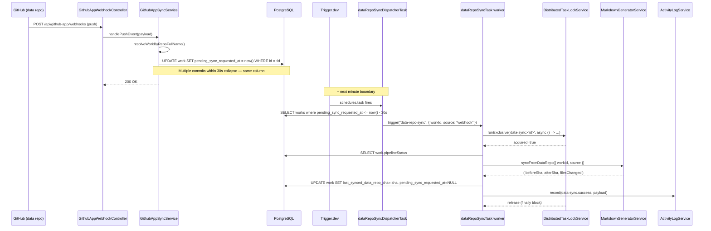
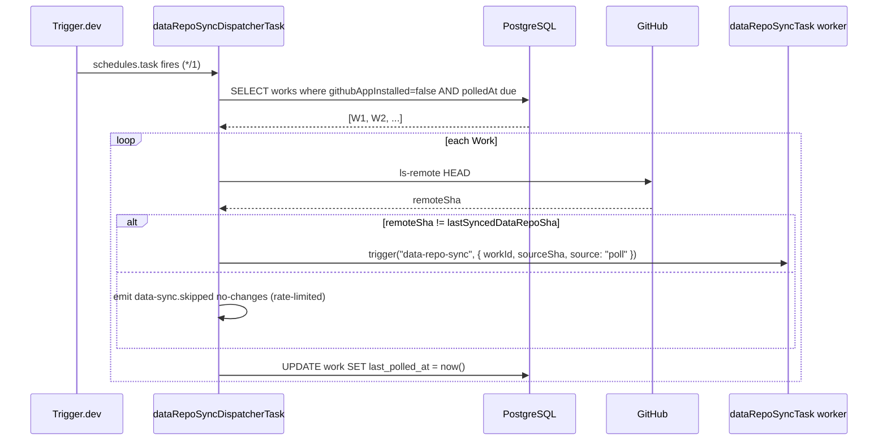

# Implementation Plan: Instant Data-Repo → Main-Repo Sync

**Feature ID**: `data-repo-instant-sync`
**Spec**: [`./spec.md`](./spec.md)
**Tasks**: [`./tasks.md`](./tasks.md)
**Status**: `Draft` (revised 2026-05-16 — no Redis; uses `DistributedTaskLockService` + `cache_entries`)
**Last updated**: 2026-05-16

---

## 1. Module layout

```text
apps/api/src/
├── integrations/github-app/
│   ├── github-app-webhook.controller.ts          # add `push` branch
│   └── github-app-sync.service.ts                # add handlePushEvent()
├── work/
│   ├── work.entity.ts                            # +5 columns (see spec §6)
│   └── work.module.ts                            # wire DataSyncModule
├── data-sync/                                    # NEW
│   ├── data-sync.module.ts                       # imports CacheEntry; provides DistributedTaskLockService
│   ├── data-sync.service.ts                      # webhookFlag, mutexCheck, activity emission
│   ├── data-sync.controller.ts                   # POST /api/works/:id/sync (force-sync)
│   └── data-sync.types.ts                        # SyncSource, SyncReason enums
└── database/migrations/<ts>-data-repo-instant-sync.ts

packages/agent/src/generators/markdown-generator/
├── markdown-generator.service.ts                 # extract renderToMainRepo(); add syncFromDataRepo()
└── markdown-generator.service.spec.ts            # cover the new entry

packages/tasks/src/tasks/trigger/
└── data-repo-sync-dispatcher.task.ts             # NEW — */1 * * * * runs BOTH paths
   (renders happen inline via a child Trigger.dev task call;
    no separate poller task — see spec §5.3)

apps/web/src/
├── components/works/activity/
│   ├── sync-event-row.tsx                        # NEW — render `data-sync.*` rows
│   └── activity-filter-chips.tsx                 # extend with `Sync` chip
└── lib/i18n/en/works.json                        # new strings for the activity feed

docs/specs/features/data-repo-instant-sync/       # this folder
docs/specs/decisions/005-cache-and-lock-pluggability.md  # forward-looking ADR
docs/agent-services/distributed-task-lock.md      # add "Future Considerations" section
docs/architecture/caching.md                      # add "Future Considerations" section
```

## 2. Tech choices

| Concern                           | Choice                                                                                              | Rationale                                                                                |
| --------------------------------- | --------------------------------------------------------------------------------------------------- | ---------------------------------------------------------------------------------------- |
| Debounce mechanism                | Single `Work.pendingSyncRequestedAt` column + dispatcher's 30-s quiet-period eligibility filter      | No queue, no Redis, no in-process timer. Multiple webhooks within 30 s naturally collapse |
| Mutex                             | `DistributedTaskLockService.runExclusive('data-sync:<workId>', fn, { ttlMs: 300_000 })`             | Already in `packages/agent/src/cache/`. Token-bound release, heartbeat refresh, 24-h cap |
| Mutex backend                     | `cache_entries` table (PostgreSQL) — same as community-PR locks                                      | No new infrastructure. Redis option deferred to [EW-629](#) (see ADR 005)                |
| Background task scheduler         | One Trigger.dev `schedules.task` (`*/1 * * * *`) handling both webhook flush and poller             | Halves the moving parts vs. two tasks. Matches `WorkScheduleDispatcherTask` style        |
| Remote SHA probe                  | `git ls-remote <url> HEAD` via `isomorphic-git`                                                     | Matches existing data-generator git layer; works inside the Trigger.dev sandbox          |
| Render-only entry                 | New public `syncFromDataRepo(workId, opts)` on `MarkdownGeneratorService`                            | Reuses 95% of existing `initialize()` body via a private `renderToMainRepo(ctx)` helper  |
| Activity feed integration         | Reuse `ActivityLogService.record()` from EW-120                                                      | Avoids a parallel logging schema                                                         |
| Migration                         | One TypeORM migration: 5 columns + 1 composite index for the dispatcher's poller query              | Single commit revertable                                                                 |
| Force-sync endpoint               | Authenticated `POST /api/works/:id/sync` returning `{ activityRowId, status }`                       | Matches existing `POST /api/works/:id/generate` ergonomics                               |

## 3. Sequence — Path A (webhook)



## 4. Sequence — Path B (poller)



## 5. `MarkdownGeneratorService.syncFromDataRepo()` shape

```ts
async syncFromDataRepo(input: {
    workId: string;
    expectedSourceSha?: string;
    abortSignal?: AbortSignal;
}): Promise<{
    beforeSha: string;
    afterSha: string;
    filesChanged: number;
    durationMs: number;
}> {
    // 1. Resolve Work + credentials (unchanged from initialize())
    // 2. Clone or pull data repo (unchanged)
    // 3. If expectedSourceSha provided and HEAD ≠ expectedSourceSha:
    //    proceed anyway — render against current HEAD; note in activity row.
    // 4. Clone or pull main repo (unchanged)
    // 5. Run the existing render block (lines 144-224 of current initialize()):
    //    - readDetails / writeDetails per item slug
    //    - generateReadme() with ReadmeBuilder
    // 6. Commit + push main repo (unchanged)
    // 7. Return stats
}
```

The body extracts into a private `renderToMainRepo(ctx)` helper. Both `initialize()` (full pipeline) and `syncFromDataRepo()` call it. No behaviour change for the existing pipeline.

## 6. Lock semantics — exact pseudo-code

```ts
// data-sync.service.ts
async runDataSync(workId: string, source: SyncSource): Promise<DataSyncOutcome> {
    return this.taskLockService.runExclusive(
        `data-sync:${workId}`,
        async () => {
            const work = await this.workRepo.findOneOrFail(workId);
            if (work.pipelineStatus === 'RUNNING') {
                await this.activity.record('data-sync.skipped', {
                    workId, source, reason: 'generation-in-progress',
                });
                return { status: 'skipped' as const, reason: 'generation-in-progress' as const };
            }

            try {
                const stats = await this.markdownGen.syncFromDataRepo({ workId });
                await this.workRepo.update(workId, {
                    lastSyncedDataRepoSha: stats.afterSha,
                    pendingSyncRequestedAt: null,
                    lastPolledAt: () => 'now()',
                });
                await this.activity.record('data-sync.success', { workId, source, ...stats });
                return { status: 'success' as const, stats };
            } catch (err) {
                await this.activity.record('data-sync.failed', {
                    workId, source,
                    errorClass: classifyError(err),
                    errorTail: tail(err.stderr ?? err.message, 200),
                });
                // pendingSyncRequestedAt intentionally NOT cleared — dispatcher retries.
                // Short backoff via cache_entries to avoid hot-looping a broken Work.
                await this.cache.set(`data-sync:retry-after:${workId}`, '1', this.retryBackoffSeconds);
                return { status: 'failed' as const, error: err };
            }
        },
        { ttlMs: this.lockTtlSeconds * 1000, onLocked: () => this.activity.record('data-sync.skipped', { workId, source, reason: 'sync-in-progress' }) },
    ).then(r => r.result ?? { status: 'skipped' as const, reason: 'sync-in-progress' as const });
}
```

`WorkScheduleDispatcherService.dispatchDue()` is amended to skip a Work if a `task-lock:data-sync:<workId>` row exists in `cache_entries`. (Service exposes a `isLocked(key): Promise<boolean>` peek helper — see [`distributed-task-lock.md`](../../../agent-services/distributed-task-lock.md) "Future Considerations".)

Sync wins ties — a single sync run is short (~30–60 s); a generation run that gets deferred picks up next tick.

## 7. Migration

```ts
// <ts>-data-repo-instant-sync.ts
export class DataRepoInstantSync1747400000000 implements MigrationInterface {
    public async up(q: QueryRunner): Promise<void> {
        await q.query(`
            ALTER TABLE "work"
            ADD COLUMN "last_synced_data_repo_sha" varchar(40) NULL,
            ADD COLUMN "pending_sync_requested_at" timestamptz NULL,
            ADD COLUMN "sync_interval_minutes" int NOT NULL DEFAULT 5,
            ADD COLUMN "github_app_installed" boolean NOT NULL DEFAULT false,
            ADD COLUMN "last_polled_at" timestamptz NULL
        `);
        // Composite index for the dispatcher's poller-path query
        await q.query(`
            CREATE INDEX "idx_work_sync_poller"
            ON "work" ("github_app_installed", "sync_interval_minutes", "last_polled_at")
            WHERE "github_app_installed" = false
        `);
        // Partial index for the dispatcher's webhook-flush query
        await q.query(`
            CREATE INDEX "idx_work_sync_webhook"
            ON "work" ("pending_sync_requested_at")
            WHERE "pending_sync_requested_at" IS NOT NULL
        `);
        // Backfill App-installed flag for existing Works with installation rows
        await q.query(`
            UPDATE "work" SET "github_app_installed" = true
            WHERE "github_app_installation_id" IS NOT NULL
        `);
    }
    public async down(q: QueryRunner): Promise<void> {
        await q.query(`DROP INDEX "idx_work_sync_webhook"`);
        await q.query(`DROP INDEX "idx_work_sync_poller"`);
        await q.query(`
            ALTER TABLE "work"
            DROP COLUMN "last_polled_at",
            DROP COLUMN "github_app_installed",
            DROP COLUMN "sync_interval_minutes",
            DROP COLUMN "pending_sync_requested_at",
            DROP COLUMN "last_synced_data_repo_sha"
        `);
    }
}
```

## 8. Testing strategy

- **Unit (`packages/agent`, Jest)**: `syncFromDataRepo()` — happy path, expectedSourceSha mismatch (proceeds with note), abort signal, empty data repo, idempotent re-run on the same SHA (`filesChanged: 0`).
- **Unit (`apps/api`, Jest)**: `data-sync.service.ts.runDataSync()` — lock contention (`onLocked` fires), `pipelineStatus = RUNNING` path, failure path leaves `pendingSyncRequestedAt` and writes retry-backoff.
- **Unit (`apps/api`, Jest)**: `github-app-sync.service.ts.handlePushEvent` — known repo → UPDATE column; unknown repo → no-op; invalid signature handled by existing controller logic.
- **Unit (`packages/tasks`, Vitest)**: `dataRepoSyncDispatcherTask` eligibility SQL produces correct rows (uses a test DB fixture).
- **Integration (`apps/api`, Supertest)**: `POST /api/works/:id/sync` returns 202 + activity-row id; emits `data-sync.success` after worker finishes; emits `data-sync.skipped reason=generation-in-progress` when pipeline mocked RUNNING.
- **No new infrastructure mocks** — `DistributedTaskLockService` already has unit tests covering the lock semantics; we just consume it.

## 9. Rollout

1. Land spec PR (this) — review + approval.
2. Code PR to `develop`:
    - Migration (5 columns + 2 indexes + backfill).
    - `syncFromDataRepo()` extraction (no behaviour change).
    - Data-sync module + service.
    - Webhook push handler (gated behind `subscriptions.dataSync.webhookEnabled`, default `false`).
    - Dispatcher task (gated behind `subscriptions.dataSync.dispatcherEnabled`, default `false`).
    - Activity feed UI.
3. After CI green + reviewer sign-off, flip flags on `develop` via env. Soak 24h.
4. Cascade `develop → stage → main` per project release flow.
5. Remove the feature flags after 1 week of clean runs on `main`.

## 10. Backwards compatibility

- Full generation pipeline unchanged; existing scheduled runs render the main repo as today.
- New columns are nullable / have sensible defaults — existing rows backfilled by migration.
- Activity feed adds three new event types; older UI gracefully ignores them.
- Default flags `false` at first deploy: nothing changes until we flip.

## 11. Out-of-scope follow-ups

- Dashboard control to set per-Work `syncIntervalMinutes` (UI). Initial release ships the DB column + API but no UI control; users get the 5-min default.
- Webhook for the main repo (customer hand-edits `details/foo.md` — what should we do?). Current contract: next sync overwrites. Documented in onboarding.
- Multi-repo data sources (1 Work → N data repos).
- **Redis provider** for `DistributedTaskLockService` and `CacheModule` (tracked separately — see [ADR 005](../../decisions/005-cache-and-lock-pluggability.md) and [EW-629](https://evertech.atlassian.net/browse/EW-629)). This feature is **not blocked** by that work — the PostgreSQL backend handles the load comfortably for the foreseeable Ever Works scale.
