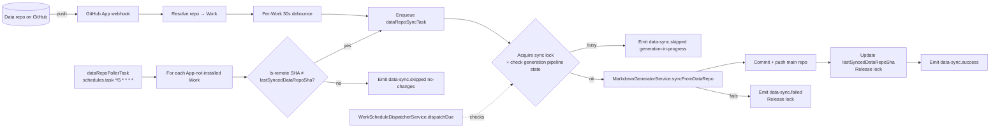

# Instant Data-Repo → Main-Repo Sync

**Feature ID**: `data-repo-instant-sync`
**Jira**: [EW-628](https://evertech.atlassian.net/browse/EW-628)
**Plan**: [`./plan.md`](./plan.md)
**Tasks**: [`./tasks.md`](./tasks.md)
**Acceptance**: [`./acceptance.md`](./acceptance.md)
**Status**: `Draft`
**Last updated**: 2026-05-16

---

## 1. Problem

Every Work has two GitHub repositories:

- **Data repo** (e.g. `awesome-time-tracking-data`) — structured human-editable content: `categories.yml`, `tags.yml`, `markdown/*`, `pages/*`, `.works/works.yml`.
- **Main / awesome-list repo** (e.g. `awesome-time-tracking`) — rendered output: `README.md` + `details/*.md`, derived from the data repo.

The render is performed by [`MarkdownGeneratorService.initialize()`](../../../../packages/agent/src/generators/markdown-generator/markdown-generator.service.ts) (lines 78–242), but only as a **stage inside the full generation pipeline**. The pipeline is dispatched by [`WorkScheduleDispatcherTask`](../../../../packages/tasks/src/tasks/trigger/work-schedule-dispatcher.task.ts) on a per-Work cadence (`hourly` … `monthly`, see [`scheduled-updates`](../scheduled-updates/spec.md)).

The GitHub App webhook handler ([`github-app-sync.service.ts:167-229`](../../../../apps/api/src/integrations/github-app/github-app-sync.service.ts)) currently subscribes to `installation` and `installation_repositories` events only. `push` events are ignored.

**Consequence:** a human commit to the data repo is not reflected in the main repo until the next scheduled tick — up to **7 days** on a `weekly` cadence. There is no way for the user to force a fast sync short of triggering a full generation run (expensive: re-runs the AI items-generator).

## 2. Goal

Keep the main repo in sync with the data repo within seconds (App installed) or ≤ 5 minutes (App not installed), independent of the full generation cadence and **without running the AI items pipeline**.

## 3. Non-goals

- Multi-data-repo Works (1 Work pulling from N data repos).
- Bi-directional sync (main → data). The main repo is a render target.
- Reverting hand-edits to `README.md` / `details/*` in the main repo — the next sync overwrites them. This is the intended contract; surfaced in the Work onboarding copy.
- Replacing the scheduled full-generation pipeline; this feature lives alongside it.

## 4. Concepts

| Term            | Meaning                                                                                                                  |
| --------------- | ------------------------------------------------------------------------------------------------------------------------ |
| **Sync run**    | A single attempt to re-render the main repo from the data repo. Fast (no AI), idempotent, observable in the activity feed. |
| **Sync source** | `webhook` (Path A) or `poll` (Path B). Recorded on every activity row.                                                   |
| **Sync lock**   | A short-lived TTL marker preventing concurrent sync runs **and** preventing collision with a running generation pipeline. |
| **Render-only path** | Re-uses the existing `MarkdownGeneratorService.initialize()` body but skips the upstream `ItemsGeneratorService` call. New public entry: `syncFromDataRepo()`. |

## 5. Architecture

### 5.1 Path A — GitHub App push webhook (preferred, near-instant)

Active when the Ever Works GitHub App is installed on the data repo (`Work.githubAppInstalled = true`).

1. Subscribe the App to `push` events in addition to existing `installation*` events.
2. `github-app-webhook.controller.ts` receives the event → `handlePushEvent()`.
3. Resolve `repository.full_name` to a Work record by `Work.dataRepo.fullName`. If no match, log + drop.
4. Per-Work debounce: 30s sliding window. Multiple commits within the window coalesce into one sync run. Implemented as a `setTimeout`-backed delayed enqueue keyed by `workId`, persisted to Redis so it survives process restarts.
5. After debounce, enqueue `dataRepoSyncTask` with `{ workId, sourceSha, source: 'webhook' }`.

### 5.2 Path B — 5-minute poller (fallback)

Active when `Work.githubAppInstalled = false` but the platform has read credentials for the data repo (typical: classic PAT from the connected GitHub account).

1. New Trigger.dev `dataRepoPollerTask` — `schedules.task` cron `*/5 * * * *`.
2. Selects active Works with `githubAppInstalled = false` and a positive `Work.syncIntervalMinutes` (default 5).
3. For each due Work: `git ls-remote <dataRepo> HEAD` to read the remote `HEAD` SHA. Compare to `Work.lastSyncedDataRepoSha`.
   - If different → enqueue `dataRepoSyncTask` with `{ workId, sourceSha, source: 'poll' }`.
   - If same → emit `data-sync.skipped` with `reason: 'no-changes'` (rate-limited: 1 per Work per hour to avoid activity-feed noise).
4. `syncIntervalMinutes` is configurable per Work in the range 1–60. Allows heavy customers to dial up to 1-min polling and idle Works to back off.

### 5.3 Mutex with the generation pipeline

Both paths converge on `dataRepoSyncTask`, which:

1. Attempts to acquire a Redis lock keyed `data-sync:lock:<workId>` with TTL 5 minutes.
2. If the lock is already held, emits `data-sync.skipped` with `reason: 'sync-in-progress'` and exits.
3. Reads the Work's pipeline status. If `RUNNING`, releases the lock and emits `data-sync.skipped` with `reason: 'generation-in-progress'`.
4. Otherwise runs `MarkdownGeneratorService.syncFromDataRepo({ workId })`.
5. On finish (success or failure), releases the lock.

The dispatcher (`WorkScheduleDispatcherService.dispatchDue`) checks the same lock before starting a full generation run. If held: defers the Work to the next dispatcher tick. This avoids the rare case where a generation starts while a sync is mid-push.

Lock TTL of 5 min is intentional — long enough for a normal sync (typically < 60s for sites with hundreds of items), short enough to auto-recover from a crashed worker.

### 5.4 Activity feed events

Three new event types:

| Event                | Payload                                                                                  |
| -------------------- | ---------------------------------------------------------------------------------------- |
| `data-sync.success`  | `{ source, beforeSha, afterSha, filesChanged, durationMs }`                              |
| `data-sync.skipped`  | `{ source, reason: 'no-changes' \| 'sync-in-progress' \| 'generation-in-progress' \| 'app-not-installed-and-no-credentials', sha }` |
| `data-sync.failed`   | `{ source, sha, errorClass, errorTail: string (last 200 chars of stderr) }`              |

Surfaced on the existing `Works > Activity` page (see [`docs/web-dashboard/work-pages.md`](../../../web-dashboard/work-pages.md)) with a `Sync` filter chip and a distinct icon (e.g. `git-pull-request` vs. `cpu` for Generate).

## 6. Data model

Four new columns on `Work` (`apps/api/src/work/work.entity.ts`, mirrored in `packages/agent`):

| Column                      | Type      | Default | Purpose                                                      |
| --------------------------- | --------- | ------- | ------------------------------------------------------------ |
| `lastSyncedDataRepoSha`     | `varchar(40) nullable` | `null` | Most recent data-repo SHA the main repo has been rendered against. |
| `syncIntervalMinutes`       | `int`     | `5`     | Poller cadence in minutes (1–60). Ignored when App installed. |
| `githubAppInstalled`        | `boolean` | `false` | Selector between Path A / Path B. Already implicitly tracked via `GitHubAppInstallation`; this is a derived denormalised flag for the poller's bulk query. |
| `syncLockReason`            | `varchar(64) nullable` | `null` | Optional fallback if Redis is unavailable; not used in the happy path. |

Migration: `apps/api/src/database/migrations/<timestamp>-data-repo-instant-sync.ts`.

## 7. Configuration

| Setting                             | Source                                          | Default |
| ----------------------------------- | ----------------------------------------------- | ------- |
| Webhook debounce window             | `subscriptions.dataSync.debounceMs`             | `30000` |
| Poller cron                         | hard-coded in `dataRepoPollerTask`              | `*/5 * * * *` |
| Per-Work poller cadence (minutes)   | `Work.syncIntervalMinutes`                      | `5`     |
| Sync lock TTL                       | `subscriptions.dataSync.lockTtlSeconds`         | `300`   |
| Skip-noise rate-limit for `no-changes` | `subscriptions.dataSync.skipNoiseWindowMs`   | `3600000` (1h) |

## 8. Telemetry

PostHog / Sentry counters:

- `data_sync_success_total{source}`
- `data_sync_skipped_total{reason,source}`
- `data_sync_failed_total{errorClass,source}`
- `data_sync_duration_ms` histogram (success runs only)

## 9. Open questions

- **Q1**: Should the debounce be implemented in-process per worker, or via a Redis ZSET keyed by `workId` so a multi-worker deployment doesn't double-fire? *Tentative*: Redis ZSET, matches existing patterns in `packages/tasks`.
- **Q2**: Does `MarkdownGeneratorService` currently mutate any shared state outside the local clone that would make `syncFromDataRepo()` not safe to call out-of-pipeline? *To verify in plan phase.*
- **Q3**: Should we expose an admin "force sync now" endpoint for the dashboard, or only via the existing manual-generate path? *Tentative*: yes, `POST /api/works/:id/sync` (returns the activity-row id) — cheap to add and useful for support.

## 10. Risks

- **Webhook spam / abuse.** Mitigated by per-Work debounce + Redis-backed rate limit on the controller (1k req/min per installation).
- **Polling cost at scale.** `git ls-remote` against a private repo costs ~1 GitHub API request per Work per poll. At 10k Works on 5-min polling that is ~33 req/sec org-wide — well inside GitHub App rate limits (15k/hr per installation; the platform's own PAT bucket is ample for non-App Works).
- **Lock starvation.** Generation runs that hold the pipeline state in `RUNNING` for >5 min would mean sync defers indefinitely. Mitigated by ensuring the pipeline-state check is the second gate (after the sync lock); sync emits a clear `generation-in-progress` row so users see why it's deferred, and the next webhook / poll catches up once generation completes.

## 11. References

- [EW-628 Jira ticket](https://evertech.atlassian.net/browse/EW-628)
- [`MarkdownGeneratorService` source](../../../../packages/agent/src/generators/markdown-generator/markdown-generator.service.ts)
- [`WorkScheduleDispatcherTask` source](../../../../packages/tasks/src/tasks/trigger/work-schedule-dispatcher.task.ts)
- [`github-app-sync.service.ts` source](../../../../apps/api/src/integrations/github-app/github-app-sync.service.ts)
- [Scheduled updates feature](../scheduled-updates/spec.md)
- [Activity feed (EW-120)](../../../web-dashboard/work-pages.md)
