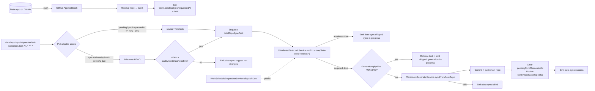

# Instant Data-Repo → Main-Repo Sync

**Feature ID**: `data-repo-instant-sync`
**Jira**: [EW-628](https://evertech.atlassian.net/browse/EW-628)
**Plan**: [`./plan.md`](./plan.md)
**Tasks**: [`./tasks.md`](./tasks.md)
**Acceptance**: [`./acceptance.md`](./acceptance.md)
**Status**: `Draft` (revised 2026-05-16 to drop Redis design — uses house primitives)
**Last updated**: 2026-05-16

---

## 1. Problem

Every Work has two GitHub repositories:

- **Data repo** (e.g. `awesome-time-tracking-data`) — structured human-editable content: `categories.yml`, `tags.yml`, `markdown/*`, `pages/*`, `.works/works.yml`.
- **Main / awesome-list repo** (e.g. `awesome-time-tracking`) — rendered output: `README.md` + `details/*.md`, derived from the data repo.

The render is performed by [`MarkdownGeneratorService.initialize()`](../../../../packages/agent/src/generators/markdown-generator/markdown-generator.service.ts) (lines 78–242), but only as a **stage inside the full generation pipeline**. The pipeline is dispatched by [`WorkScheduleDispatcherTask`](../../../../packages/tasks/src/tasks/trigger/work-schedule-dispatcher.task.ts) on a per-Work cadence (`hourly` … `monthly`, see [`scheduled-updates`](../scheduled-updates/spec.md)).

The GitHub App webhook handler ([`github-app-sync.service.ts:167-229`](../../../../apps/api/src/integrations/github-app/github-app-sync.service.ts)) currently subscribes to `installation` and `installation_repositories` events only. `push` events are ignored.

**Consequence:** a human commit to the data repo is not reflected in the main repo until the next scheduled tick — up to **7 days** on a `weekly` cadence. There is no way for the user to force a fast sync short of triggering a full generation run (expensive: re-runs the AI items-generator).

## 2. Goal

Keep the main repo in sync with the data repo within ~60 seconds (App installed) or ≤ 5 minutes (App not installed), independent of the full generation cadence and **without running the AI items pipeline**.

## 3. Non-goals

- Multi-data-repo Works (1 Work pulling from N data repos).
- Bi-directional sync (main → data). The main repo is a render target.
- Reverting hand-edits to `README.md` / `details/*` in the main repo — the next sync overwrites them. Intended contract, surfaced in onboarding copy.
- Replacing the scheduled full-generation pipeline; this feature lives alongside it.
- Adding Redis to the platform. The mutex, debounce, and caching all run on the existing `cache_entries` PostgreSQL table — same backend as [`DistributedTaskLockService`](../../../agent-services/distributed-task-lock.md). A future ticket explores adding Redis as an _optional, additional_ provider for advanced deployments — see [ADR 005](../../decisions/005-cache-and-lock-pluggability.md) and [EW-629](https://evertech.atlassian.net/browse/EW-629). It does not block or replace this feature.

## 4. Concepts

| Term                       | Meaning                                                                                                                                                                                                                      |
| -------------------------- | ---------------------------------------------------------------------------------------------------------------------------------------------------------------------------------------------------------------------------- |
| **Sync run**               | A single attempt to re-render the main repo from the data repo. Fast (no AI), idempotent, observable in the activity feed.                                                                                                   |
| **Sync source**            | `webhook` (Path A) or `poll` (Path B). Recorded on every activity row.                                                                                                                                                       |
| **Sync lock**              | Per-Work mutex held via `DistributedTaskLockService.runExclusive('data-sync:<workId>', ...)`. Also serves as the cross-task signal that prevents the scheduled generation pipeline from starting while a sync is mid-flight. |
| **Render-only entrypoint** | New public `syncFromDataRepo()` on `MarkdownGeneratorService` that reuses the existing render block but skips `ItemsGeneratorService`.                                                                                       |

## 5. Architecture



### 5.1 Path A — GitHub App push webhook (preferred, near-instant)

Active when the Ever Works GitHub App is installed on the data repo (`Work.githubAppInstalled = true`).

1. Subscribe the App to `push` events in addition to existing `installation*` events.
2. `github-app-webhook.controller.ts` receives the event → `handlePushEvent()`.
3. Resolve `repository.full_name` to a Work record by `Work.dataRepo.fullName`. If no match, log + drop.
4. **Set `Work.pendingSyncRequestedAt = now()`** (idempotent UPDATE — multiple commits within the window collapse to one pending flag). No queue, no Redis, no in-process timer.
5. The next tick of `dataRepoSyncDispatcherTask` (see §5.3) picks it up.

This is the **debounce mechanism**: the dispatcher only enqueues Works whose `pendingSyncRequestedAt` is ≥ 30 seconds old, so a burst of commits within 30 s coalesces into one sync run. Worst-case webhook → enqueue latency is ~60 s (cron granularity is 1 min); typical is 30–60 s.

### 5.2 Path B — Per-Work poller (fallback when App not installed)

Active when `Work.githubAppInstalled = false` but the platform has read credentials for the data repo (typical: classic PAT from the connected GitHub account).

1. The **same** `dataRepoSyncDispatcherTask` (no separate poller task) handles polling.
2. Eligibility: `githubAppInstalled = false AND (lastPolledAt IS NULL OR lastPolledAt + syncIntervalMinutes·minutes <= now())`. Default `syncIntervalMinutes = 5`, range 1–60.
3. For each eligible Work: `git ls-remote <dataRepo> HEAD`. Compare to `Work.lastSyncedDataRepoSha`.
    - If different → enqueue `dataRepoSyncTask` with `source: 'poll'`.
    - If same → emit `data-sync.skipped reason=no-changes` (rate-limited: 1 per Work per hour).
4. `lastPolledAt` is updated regardless.

### 5.3 The dispatcher task — `dataRepoSyncDispatcherTask`

One Trigger.dev `schedules.task` with cron `*/1 * * * *` runs both paths in a single bulk query per minute:

```sql
SELECT id, sync_source_reason
FROM (
    SELECT id, 'webhook' AS sync_source_reason
    FROM work
    WHERE pending_sync_requested_at IS NOT NULL
        AND pending_sync_requested_at <= now() - interval '30 seconds'
    UNION ALL
    SELECT id, 'poll' AS sync_source_reason
    FROM work
    WHERE github_app_installed = false
        AND status = 'ACTIVE'
        AND (last_polled_at IS NULL OR last_polled_at + (sync_interval_minutes * interval '1 minute') <= now())
        AND pending_sync_requested_at IS NULL  -- avoid double-handling
) eligible
ORDER BY id
LIMIT :batch_size;
```

For each row, the dispatcher invokes `dataRepoSyncTask.trigger({ workId, source })`. Path B additionally runs `ls-remote` synchronously inside the dispatcher (fast: 1 HTTP req per Work) so it can skip the enqueue when the SHA is unchanged.

### 5.4 The render task — `dataRepoSyncTask`

A Trigger.dev `task` invoked by the dispatcher:

1. `await taskLockService.runExclusive('data-sync:' + workId, async () => { ... }, { ttlMs: 5 * 60_000 })`.
2. Inside the lock:
    - Read `Work.pipelineStatus`. If `RUNNING` → release lock (via natural return), emit `data-sync.skipped reason=generation-in-progress`, leave `pendingSyncRequestedAt` set so the next dispatcher tick retries.
    - Otherwise call `MarkdownGeneratorService.syncFromDataRepo({ workId, source })`.
    - On success: `UPDATE work SET last_synced_data_repo_sha = :sha, pending_sync_requested_at = NULL, last_polled_at = now() WHERE id = :id`. Emit `data-sync.success`.
    - On failure: emit `data-sync.failed`; `pendingSyncRequestedAt` is **not** cleared so the dispatcher retries on the next tick (with a backoff via `data-sync:retry-after-<workId>` cache entry to avoid hot-looping a broken Work).
3. If `runExclusive` returned `acquired: false` → emit `data-sync.skipped reason=sync-in-progress`, leave `pendingSyncRequestedAt` set, exit cleanly.

### 5.5 Mutex with the scheduled generation pipeline

The same lock key `data-sync:<workId>` does the symmetric job for the generation dispatcher:

- `WorkScheduleDispatcherService.dispatchDue()` adds a non-blocking "is locked?" peek before each Work — using `taskLockService.tryAcquire/release` (no-op acquire) **or** a stored `task-lock:data-sync:<workId>` row probe on the `cache_entries` table.
- If locked → defer this Work for the next dispatcher tick.

We rely on `DistributedTaskLockService`'s 15-min default TTL (we override to 5 min here) and 24-h hard cap to auto-recover from any stuck row. No `setTimeout`s, no Redis.

### 5.6 Activity feed events

Three new event types:

| Event               | Payload                                                                                                                                                |
| ------------------- | ------------------------------------------------------------------------------------------------------------------------------------------------------ |
| `data-sync.success` | `{ source, beforeSha, afterSha, filesChanged, durationMs }`                                                                                            |
| `data-sync.skipped` | `{ source, reason: 'no-changes' \| 'sync-in-progress' \| 'generation-in-progress' \| 'app-not-installed-and-no-credentials' \| 'retry-backoff', sha }` |
| `data-sync.failed`  | `{ source, sha, errorClass, errorTail: string (last 200 chars of stderr) }`                                                                            |

Surfaced on the existing `Works > Activity` page with a `Sync` filter chip and an icon distinct from `Generate`.

## 6. Data model

Five new columns on `Work` (`apps/api/src/work/work.entity.ts`, mirrored in `packages/agent`):

| Column                   | Type          | Default | Purpose                                                                               |
| ------------------------ | ------------- | ------- | ------------------------------------------------------------------------------------- |
| `lastSyncedDataRepoSha`  | `varchar(40)` | `null`  | Most recent data-repo SHA the main repo has been rendered against.                    |
| `pendingSyncRequestedAt` | `timestamptz` | `null`  | Set by webhook handler. Cleared by successful sync. Drives Path A's debounce + retry. |
| `syncIntervalMinutes`    | `int`         | `5`     | Poller cadence in minutes (1–60). Ignored when App installed.                         |
| `githubAppInstalled`     | `boolean`     | `false` | Selector between Path A / Path B. Denormalised from `github_app_installation`.        |
| `lastPolledAt`           | `timestamptz` | `null`  | Last time Path B's `ls-remote` ran. Updated regardless of SHA delta.                  |

No Redis-only fields, no `syncLockReason`. The lock state lives in `cache_entries` and is owned by `DistributedTaskLockService`.

Migration: `apps/api/src/database/migrations/<timestamp>-data-repo-instant-sync.ts`. Backfill `github_app_installed = true` for Works with a non-null `github_app_installation_id`.

## 7. Configuration

| Setting                                | Source                                       | Default         |
| -------------------------------------- | -------------------------------------------- | --------------- |
| Webhook debounce quiet-period          | `subscriptions.dataSync.debounceMs`          | `30000` (30 s)  |
| Dispatcher cron                        | hard-coded in `dataRepoSyncDispatcherTask`   | `*/1 * * * *`   |
| Per-Work poll cadence (min)            | `Work.syncIntervalMinutes`                   | `5`             |
| Sync lock TTL                          | `subscriptions.dataSync.lockTtlSeconds`      | `300` (5 min)   |
| Retry backoff after a failed sync      | `subscriptions.dataSync.retryBackoffSeconds` | `300` (5 min)   |
| Skip-noise rate-limit for `no-changes` | `subscriptions.dataSync.skipNoiseWindowMs`   | `3600000` (1 h) |

## 8. Telemetry

PostHog / Sentry counters:

- `data_sync_success_total{source}`
- `data_sync_skipped_total{reason,source}`
- `data_sync_failed_total{errorClass,source}`
- `data_sync_duration_ms` histogram (success runs only)
- `data_sync_lock_contention_total` (incremented whenever `runExclusive` returns `acquired:false`)

## 9. Open questions

- **Q1**: Should `dataRepoSyncDispatcherTask` run at 30-second granularity (via Trigger.dev `interval`) to halve webhook latency, or keep the 60-s cron to align with other dispatchers? _Tentative_: start at 60 s; revisit if the 30–60 s tail bothers users.
- **Q2**: Does `MarkdownGeneratorService` currently mutate any shared state outside the local clone that would make `syncFromDataRepo()` unsafe to call out-of-pipeline? _To verify in plan phase._
- **Q3**: Should we expose an admin "force sync now" endpoint? _Tentative_: yes, `POST /api/works/:id/sync` (returns the activity-row id) — cheap to add and useful for support.

## 10. Risks

- **Webhook spam / abuse.** Mitigated by the existing per-installation webhook signature check + the `pendingSyncRequestedAt` collapsing to one flag per Work (no queue to flood).
- **Polling cost at scale.** `ls-remote` against a private repo costs ~1 GitHub API request per Work per poll. At 10 k Works on 5-min polling that is ~33 req/sec org-wide — inside GitHub App / PAT rate limits.
- **Lock starvation.** Generation runs that hold the pipeline state in `RUNNING` for >5 min would mean sync defers indefinitely. Mitigated by the dispatcher's per-tick retry; users see clear `generation-in-progress` rows.
- **`cache_entries` heartbeat load.** `DistributedTaskLockService` writes on each refresh. Sync runs are short (typically < 60 s), so the heartbeat fires at most ~2× per run. Negligible vs. existing community-PR lock traffic.

## 11. References

- [EW-628 Jira ticket](https://evertech.atlassian.net/browse/EW-628)
- [`MarkdownGeneratorService` source](../../../../packages/agent/src/generators/markdown-generator/markdown-generator.service.ts)
- [`WorkScheduleDispatcherTask` source](../../../../packages/tasks/src/tasks/trigger/work-schedule-dispatcher.task.ts)
- [`github-app-sync.service.ts` source](../../../../apps/api/src/integrations/github-app/github-app-sync.service.ts)
- [`DistributedTaskLockService` deep dive](../../../agent-services/distributed-task-lock.md)
- [Caching architecture](../../../architecture/caching.md)
- [ADR 005: Cache and lock pluggability (future Redis provider)](../../decisions/005-cache-and-lock-pluggability.md)
- [Scheduled updates feature](../scheduled-updates/spec.md)
