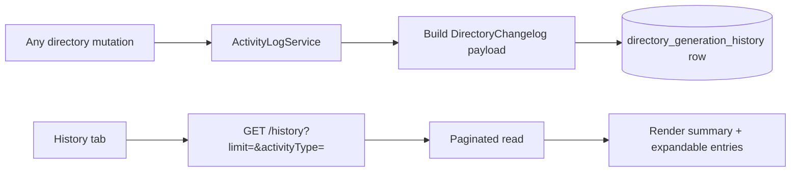

# Implementation Plan: Directory Changelog

**Feature ID**: `directory-changelog`
**Spec**: `./spec.md`
**Status**: `Done` (Retrospective)
**Last updated**: 2026-05-01

---

## 1. Architecture



## 2. Tech Choices

| Concern         | Choice                                             | Rationale                             |
| --------------- | -------------------------------------------------- | ------------------------------------- |
| Storage         | jsonb column `changelog` on existing history table | No new tables; queryable + flexible   |
| Activity types  | Plain string enum                                  | Easy to extend                        |
| Pagination      | Offset-based via `limit` + `offset` params         | Sufficient for typical history sizes  |
| Filter grouping | Server-side mapping from group → activity-type set | UI doesn't need to know the full enum |

## 3. Data Model

```ts
@Entity('directory_generation_history')
export class DirectoryGenerationHistory {
	// ... existing columns
	@Column({ type: 'varchar', nullable: true }) activityType: string | null;
	@Column({ type: 'jsonb', nullable: true }) changelog: DirectoryChangelog | null;
}

interface DirectoryChangelog {
	summary?: string | null;
	addedCount: number;
	updatedCount: number;
	removedCount: number;
	entries: DirectoryChangelogEntry[];
}

interface DirectoryChangelogEntry {
	entityType: 'item' | 'comparison' | 'category' | 'tag' | 'collection';
	action: 'added' | 'updated' | 'removed';
	name: string;
	slug?: string;
	fieldsChanged?: string[];
}
```

Migration: additive — new columns default to `null` for existing rows.

## 4. API Surface

| Method | Endpoint                       | Description                                         |
| ------ | ------------------------------ | --------------------------------------------------- |
| `GET`  | `/api/directories/:id/history` | Paginated history with optional activityType filter |

## 5. Plugin / Web / CLI

- Plugins: pipeline plugins call the activity-log service when they
  finalise a generation; they don't own the changelog format.
- Web: History tab with pagination + filter chips.
- CLI: not exposed.

## 6. Background Jobs

None — changelog writes are inline.

## 7. Security & Permissions

- Read: viewer.
- Write: only platform internals — no public endpoint accepts
  user-supplied changelog payloads.

## 8. Observability

The changelog itself is the observability surface. No additional metrics.

## 9. Risks & Mitigations

| Risk                                   | Mitigation                                                                     |
| -------------------------------------- | ------------------------------------------------------------------------------ |
| Huge entry lists bloat history rows    | Cap entries per row at a configurable limit                                    |
| Forgotten activity-type assignment     | Service requires `activityType` non-null on insert                             |
| Secret leak via changelog `name` field | `name` is the entity name (item/category/etc.), not free text — no secret risk |

## 10. Constitution Reconciliation

See `spec.md` §9.

## 11. References

- Spec: `./spec.md`
- Implementation:
    - `packages/agent/src/activity-log/activity-log.service.ts`
    - `packages/agent/src/entities/directory-generation-history.entity.ts`
