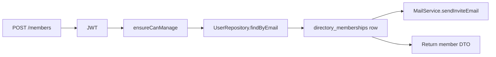

# Implementation Plan: Directory Members

**Feature ID**: `directory-members`
**Spec**: `./spec.md`
**Status**: `Done` (Retrospective)
**Last updated**: 2026-05-01

---

## 1. Architecture



## 2. Tech Choices

| Concern          | Choice                                 | Rationale                              |
| ---------------- | -------------------------------------- | -------------------------------------- |
| Permission model | Static role matrix in code             | Closed enum; matrix is small           |
| Auth check       | `DirectoryOwnershipService.ensureCan*` | Single source of truth across features |
| Notification     | Mail facade                            | Extensible to in-app notifications     |
| Invite mechanism | Direct (no pending tokens)             | Simpler UX for collaborators           |

## 3. Data Model

```ts
@Entity('directory_memberships')
@Index(['directoryId', 'userId'], { unique: true })
export class DirectoryMembership {
	@PrimaryGeneratedColumn('uuid') id: string;
	@Column() directoryId: string;
	@Column() userId: string;
	@Column({ type: 'varchar' }) role: 'manager' | 'editor' | 'viewer';
	@Column() invitedBy: string;
	@CreateDateColumn() createdAt: Date;
}
```

Migration: additive, with composite unique index `(directoryId, userId)`.

## 4. API Surface

| Method   | Endpoint                                 | Required role    |
| -------- | ---------------------------------------- | ---------------- |
| `GET`    | `/api/directories/:id/members`           | viewer           |
| `POST`   | `/api/directories/:id/members`           | manager / owner  |
| `GET`    | `/api/directories/:id/members/:memberId` | viewer           |
| `PUT`    | `/api/directories/:id/members/:memberId` | manager / owner  |
| `DELETE` | `/api/directories/:id/members/:memberId` | manager / owner  |
| `POST`   | `/api/directories/:id/members/leave`     | non-owner member |

## 5. Plugin / Web / CLI

- Plugins: none.
- Web: **Settings → Members** UI with the role matrix and invite form.
- CLI: not exposed.

## 6. Background Jobs

None — invite emails are sent inline.

## 7. Security & Permissions

- Every endpoint runs through `DirectoryOwnershipService`'s
  `ensureCanRead` / `ensureCanEdit` / `ensureCanManage` helpers.
- The Owner role is checked separately because it's implicit on
  `directories.userId`.

## 8. Observability

Activity log: `member_invited`, `member_role_updated`, `member_removed`,
`member_left` with the affected user id and role.

## 9. Risks & Mitigations

| Risk                                | Mitigation                                              |
| ----------------------------------- | ------------------------------------------------------- |
| Race: two managers invite same user | Unique index `(directoryId, userId)` rejects the second |
| Owner accidentally locked out       | Owner role is implicit and immutable                    |
| Permission cache lag                | Permission checks read fresh from DB                    |

## 10. Constitution Reconciliation

See `spec.md` §9.

## 11. References

- Spec: `./spec.md`
- Implementation:
    - `apps/api/src/directories/members/`
    - `packages/agent/src/services/directory-members.service.ts`
    - `packages/agent/src/services/directory-ownership.service.ts`
