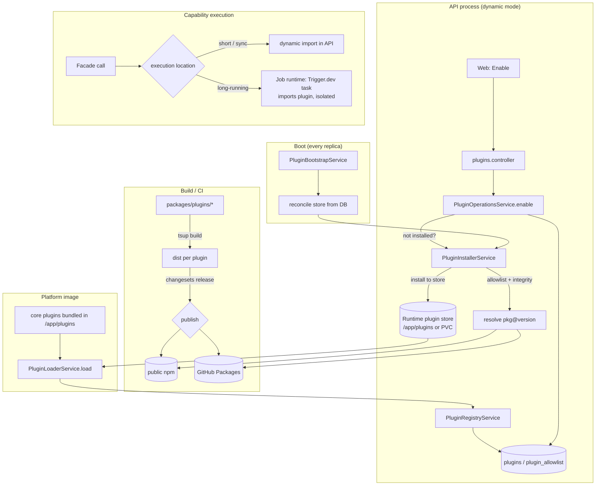

# Implementation Plan: Dynamic Plugin Distribution (dual-mode)

> Translates [`spec.md`](./spec.md) into architecture and tech choices.
> The plan owns implementation details; the spec owns behaviour.

**Feature ID**: `dynamic-plugin-distribution`
**Spec**: `./spec.md`
**Tasks**: `./tasks.md`
**Status**: `Draft`
**Last updated**: 2026-05-28

---

## 1. Architecture Summary



The design is **additive**: it layers a publish pipeline, an installer, a
boot reconciler, an allowlist, and an execution-location router on top of the
existing discover → load → register → enable machinery. The existing loader
(`await import(entryPath)`), registry, lifecycle manager, and per-user/per-work
enable model are reused unchanged. `bundled` mode is the current code path with
the new pieces inert.

## 2. Tech Choices

| Concern | Choice | Rationale |
| ------- | ------ | --------- |
| Distribution flag | `config` constant + env (`PLUGIN_DISTRIBUTION_MODE`) | Matches `apps/api/src/config/constants.ts` lazy-fn + `FEATURE_*` pattern; fail-fast validation. |
| Core vs distributable | New `distribution` manifest field in `everworks.plugin` | Declared on the plugin, not hard-coded (FR-3). Default derived from `systemPlugin`. |
| Publish | **Changesets** → npm + GitHub Packages | Independent per-plugin versioning (FR-7); no platform release coupling; mirrors `publish-cli.yml` auth pattern. |
| Runtime fetch | `npm`/`pnpm` programmatic install (pinned exact version, `--no-save`) into the store, then `import()` | Reuses Node module resolution + integrity; loader already scans `node_modules/@ever-works` and `./plugins`. |
| Integrity | npm package integrity (sha512) + first-party npm provenance | No bespoke signing in v1; verify-before-load (FR-10). |
| Persistence | TypeORM columns on `PluginEntity` + new `PluginAllowlistEntity` | Existing pattern in `packages/agent/src/plugins`. |
| Long-running execution | Pluggable job runtime (Trigger.dev today) | Principle IV; isolation comes "for free" inside the task process. Depends on EW-683. |
| Store location | `PLUGIN_INSTALL_DIR` (default `/app/plugins`); k8s writable volume | API root FS is writable today (`readOnlyRootFilesystem: false`); per-replica reconcile avoids requiring RWX. |

## 3. Data Model

### Changed entity — `PluginEntity` (`packages/agent/src/plugins/entities/plugin.entity.ts`)

Additive columns (all nullable / defaulted — forward-only):

```ts
// Where the plugin came from on this deployment.
@Column({ type: 'varchar', default: 'bundled' })
source: 'bundled' | 'registry';

// npm spec actually installed, e.g. "@ever-works/notion-extractor-plugin@1.2.0".
@Column({ type: 'varchar', nullable: true })
registrySpec?: string;

// Resolved version present on disk (may differ from manifest until upgraded).
@Column({ type: 'varchar', nullable: true })
installedVersion?: string;

// Integrity used to verify the install (sha512 from the registry).
@Column({ type: 'varchar', nullable: true })
integrity?: string;

// Install lifecycle, distinct from the existing load `state`.
@Column({ type: 'varchar', default: 'available' })
installState: 'available' | 'installing' | 'installed' | 'error';
```

`distribution` (core vs registry) is read from the manifest at discovery time;
it is denormalised onto the row for listing convenience but the manifest is the
source of truth.

### New entity — `PluginAllowlistEntity` (`packages/agent/src/plugins/entities/plugin-allowlist.entity.ts`)

```ts
@Entity('plugin_allowlist')
export class PluginAllowlistEntity {
    @PrimaryGeneratedColumn('uuid') id: string;
    @Column({ type: 'varchar', unique: true }) packageName: string; // npm name
    @Column({ type: 'varchar' }) versionRange: string;             // pinned/semver
    @Column({ type: 'varchar', nullable: true }) integrity?: string;
    @Column({ type: 'varchar', default: 'npm' }) source: 'npm' | 'github-packages';
    @Column({ type: 'boolean', default: true }) enabled: boolean;
    @CreateDateColumn() createdAt: Date;
}
```

First-party `@ever-works/*` is implicitly allowed (no row required).

### Migrations

- `apps/api/src/migrations/<unix-millis>-AddPluginDistributionColumns.ts` —
  add the five `PluginEntity` columns. Additive, forward-only, defaults set so
  existing rows become `source='bundled'`, `installState='installed'`.
- `apps/api/src/migrations/<unix-millis>-CreatePluginAllowlist.ts` — create
  `plugin_allowlist`.
- **NN #16 / Principle V**: generated with `pnpm typeorm migration:generate`,
  SQL read by hand, no `DROP`/`ALTER TYPE`. Ship in the same PR as the entity change.

### DTOs / contracts (`packages/contracts`)

- `PluginInstallStateDto`, extend the plugin list/response DTOs with
  `source`, `installState`, `installedVersion`, `available` (catalog) fields.
- Allowlist admin DTOs (`CreateAllowlistEntryDto`, etc.).

## 4. API Surface

| Method | Endpoint | Description | Status |
| ------ | -------- | ----------- | ------ |
| `GET` | `/plugins/catalog` | List distributable plugins available from the registry (manifest summaries), with install state. | New |
| `POST` | `/plugins/:pluginId/install` | Install (resolve+verify+load) a distributable plugin without enabling. | New |
| `POST` | `/plugins/:pluginId/enable` | Existing; in dynamic mode installs first if absent, then enables. | Changed |
| `DELETE` | `/plugins/:pluginId/install` | Uninstall a distributable plugin (refused for core). | New |
| `GET` | `/plugins/:pluginId/install-status` | Poll install progress/state. | New |
| `GET`/`POST`/`DELETE` | `/admin/plugins/allowlist` | Manage the third-party allowlist (admin-gated). | New |

- Auth: user-scoped endpoints use existing `@CurrentUser()`; allowlist endpoints
  are admin-gated. Install is rate-limited (registry protection).
- Errors: `409` plugin not permitted (allowlist), `424` integrity mismatch,
  `502/504` registry unreachable, `422` invalid manifest / version incompatible.

## 5. Plugin Surface

- **SDK (`packages/plugin`)**: add `distribution?: 'core' | 'registry'` and an
  optional execution hint (e.g. `executionProfile?: 'sync' | 'long-running'` at
  capability/operation granularity) to `PluginManifest`
  (`src/contracts/plugin-manifest.types.ts`) + JSON-schema validator update.
  Additive; default derivation keeps old manifests valid.
- **All plugin `package.json`s**: set `distribution` (core for every
  `systemPlugin`; `registry` for the rest, **including** `aws-s3`, `minio`,
  `github-storage`); flip `private: true → false` with `publishConfig` for
  distributable plugins; add per-plugin `release` wiring.
- **Decouple the API from storage plugins**: remove the direct
  `@ever-works/{aws-s3,minio,github-storage}-plugin` dependencies from
  `apps/api/package.json` and resolve storage through the capability
  facade/registry instead of static imports. Keep `local-fs` (a `systemPlugin`)
  bundled as the core default storage so the API boots without any distributable
  storage plugin present. This is what makes those three plugins distributable.
- **Loader (`plugin-loader.service.ts`)**: accept an explicit install path from
  the installer (reuse `loadPluginModule`); no behaviour change in bundled mode.
- **New `PluginInstallerService`** (`packages/agent/src/plugins/services/`):
  resolve → allowlist-check → download → integrity-verify → place in store →
  hand path to loader. Idempotent; concurrency-guarded per plugin id.
- **New `PluginExecutionRouterService`**: given a capability/operation, decide
  in-process vs job-runtime dispatch; reused by facades.

## 6. Web / CLI Surface

- `apps/web/src/app/[locale]/(dashboard)/settings/plugins/[category]/page.tsx`
  and `apps/web/src/lib/api/plugins.ts`: add catalog listing, install state
  chips (available/installing/installed/error), Install action + progress, and
  error surfacing. Enable button triggers install-then-enable in dynamic mode.
- Admin allowlist management page (basic table + add/remove).
- Optional CLI: `ever-works plugins install <id>` mirroring the API.

## 7. Background Jobs

| Trigger | When | What it does | Idempotency strategy |
| ------- | ---- | ------------ | -------------------- |
| **Lazy install-on-use** (`ensurePluginAvailable`) | Before *any* node invokes a distributable plugin (API replica or worker) | Install the pinned package into the local store if missing, then load+register. **The correctness guarantee** — a plugin enabled on one replica works on all replicas/worker with no restart or shared volume. | Per-id concurrency lock + version/integrity pin; skip if present. |
| Boot reconcile (on `onApplicationBootstrap`) | Every API/worker start in dynamic mode | Warm the store by pre-installing the DB-recorded installed/enabled set. Optimisation only (avoids first-request latency), not correctness. | Same `ensurePluginAvailable`; idempotent. |
| Long-running capability dispatch | Per pipeline/long op | In the job-runtime worker, call `ensurePluginAvailable` then run the plugin inside the isolated task. The worker has its own store, so it installs on first use just like the API. | Existing job idempotency / CAS in the task layer. |
| GC | — | Out of scope for v1 (decided: keep installed files on disable, no GC). | n/a |

## 8. Security & Permissions

- Install is gated: first-party `@ever-works/*` OR allowlisted package only
  (FR-11); refusal happens **before** any network fetch.
- Integrity verified before `import()` (FR-10); mismatch → refuse.
- Registry auth tokens (GitHub Packages, private mirrors) are secrets — sourced
  from env/secret store, never logged, never returned by APIs.
- Plugin settings/credentials keep `x-secret` redaction (Principle VII).
- Long-running third-party code executes in the isolated job runtime, limiting
  blast radius inside the API process.
- Allowlist mutation endpoints are admin-only.

## 9. Observability

- Activity-log/events: `plugin.install.requested|succeeded|failed`,
  `plugin.upgrade.*`, `plugin.uninstall.*`, with plugin id, version, source,
  duration, and failure reason.
- Metrics: install count/latency/error-rate per plugin; reconcile duration on
  boot; catalog-fetch failures.
- Sentry tags: `plugin_id`, `plugin_source`, `distribution_mode`.

## 10. Phased Rollout

1. **Phase 1 — SDK & data model**: manifest `distribution`/exec fields + JSON
   schema; `PluginEntity` columns + `PluginAllowlistEntity` + migrations; DTOs;
   **decouple the API from storage plugins** (remove hard imports, resolve via
   facade, keep `local-fs` core). Behind the flag; default `bundled`; no
   behaviour change.
2. **Phase 2 — Publish pipeline**: Changesets + dual-publish CI (npm + GitHub
   Packages); flip `private` + `publishConfig` on distributable plugins;
   dry-run, then first real publishes. Independent of runtime mode.
3. **Phase 3 — Installer & reconcile**: `PluginInstallerService`, allowlist
   enforcement, integrity verify, boot reconcile; wire into enable flow gated by
   dynamic mode. Still default `bundled`.
4. **Phase 4 — Execution router**: classify operations; route long-running plugin
   calls through the job runtime; in-process for short. Depends on EW-683 for
   full provider-pluggability but works against Trigger.dev directly meanwhile.
5. **Phase 5 — Deployment**: dynamic-mode image variant (core-only) + writable
   store/volume + k8s manifest + entrypoint reconcile hook; document Vercel
   read-only-FS limitation (dynamic mode unsupported on read-only serverless).
6. **Phase 6 — UI & catalog**: catalog listing, install states, progress,
   errors, admin allowlist UI.
7. **Phase 7 — Soak**: enable dynamic mode on a staging target and soak. The
   shipped default stays `bundled` everywhere (SaaS + self-host); `dynamic` is
   opt-in per deployment — no default flip planned for v1.

## 11. Risks & Mitigations

| Risk | Likelihood | Impact | Mitigation |
| ---- | ---------- | ------ | ---------- |
| Registry outage blocks enabling new plugins | Med | Med | Installed plugins unaffected; clean retryable failures; optional warm cache/mirror. |
| Cold-start install cost on new replicas | Med | Med | Boot warmup pre-installs in parallel; lazy install-on-use covers anything not warmed; consider baking "popular" plugins. |
| Plugin enabled on replica A not present on replica B / worker | High | High | **Lazy install-on-use** (`ensurePluginAvailable`) on every node before invocation — not boot-only reconcile. Worker installs into its own store too. (Codex P1 ×2.) |
| Running untrusted-ish 3rd-party code in API process | Low (allowlist) | High | Allowlist + integrity; long-running paths in isolated job runtime; sandbox is a documented future phase. |
| Read-only FS targets (Vercel) can't install at runtime | Med | Low | Dynamic mode requires writable store; Vercel/serverless documented as bundled-only. |
| API hard-deps on storage plugins block making them distributable | High | Low | **Decided**: remove the direct imports, resolve storage via the facade, keep `local-fs` as core default (so the API boots storage-less of any distributable plugin). |
| Default storage (`local-fs`) not shared across replicas | Med | Low | Pre-existing concern, not new; production enables a distributable shared backend (s3/minio/github-storage). `local-fs` only guarantees the API boots. |
| Version drift between manifest and installed dist | Med | Low | Persist `installedVersion`+`integrity`; reconcile pins exact version. |

## 12. Constitution Reconciliation

- **I — Plugin-first**: Plugins remain the integration unit; registry/installer
  is platform plumbing.
- **II — Capability-driven**: Resolution/enable semantics unchanged; install is
  a precondition step.
- **III — Source-of-truth repos**: Unaffected.
- **IV — Trigger.dev**: Long-running plugin execution explicitly routed through
  the job runtime; ties to EW-683.
- **V — Forward-only migrations**: New columns/table additive; defaults backfill.
- **VI — Tests**: Installer, allowlist, reconcile, router, publish dry-run all
  ship tests; e2e for both execution paths.
- **VII — Secret hygiene**: Registry tokens + plugin creds are secrets;
  `x-secret` preserved.
- **VIII — Plugin counts**: Canonical built-in-plugins doc updated with core vs
  distributable split.
- **IX — Behaviour-first**: Behaviour in spec; this file holds implementation.
- **X — Backwards-compat**: Default `bundled` preserves current behaviour; SDK,
  manifest, schema, and API additions are additive.

## 13. References

- Spec: `./spec.md`
- Tasks: `./tasks.md`
- ADR: [`016-dynamic-plugin-distribution`](../../decisions/016-dynamic-plugin-distribution.md)
- Architecture: [`runtime-plugins`](../../architecture/runtime-plugins.md),
  [`plugin-sdk`](../../architecture/plugin-sdk.md),
  [`deployment`](../../architecture/deployment.md)
- Jira: EW epic (this feature); [EW-683] job-runtime pluggability (dependency)
