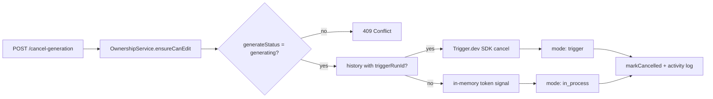

# Implementation Plan: Generation Cancellation

**Feature ID**: `generation-cancellation`
**Spec**: `./spec.md`
**Status**: `Done` (Retrospective)
**Last updated**: 2026-05-01

---

## 1. Architecture Summary

## 2. Tech Choices

| Concern            | Choice                              | Rationale                                         |
| ------------------ | ----------------------------------- | ------------------------------------------------- |
| Trigger.dev cancel | `tasks.cancelRun(runId)` SDK method | First-class API; clean teardown                   |
| In-process cancel  | `AbortController` token per run     | Native Node primitive; pipeline executor polls it |
| State transition   | New `GenerateStatusType.CANCELLED`  | Explicit terminal state, distinct from `error`    |
| Activity status    | `COMPLETED` with cancel summary     | Cancellation is a normal user-driven outcome      |

## 3. Data Model

- New enum value `CANCELLED` on `GenerateStatusType`. Migration adds the
  value to any check constraints on the `directories` table.
- No new tables/columns; reuses existing `generation_history` and
  `activity_log` tables.

## 4. API Surface

| Method | Endpoint                                 | Description                        |
| ------ | ---------------------------------------- | ---------------------------------- |
| `POST` | `/api/directories/:id/cancel-generation` | `202 Accepted` + cancellation mode |

## 5. Plugin / Web / CLI Surface

- Web: Cancel button on the directory detail page; activity views also
  surface cancel for actively-generating directories.
- CLI: not exposed (cancellation is a UI-driven operation).
- MCP: not exposed.

## 6. Background Jobs

The cancel doesn't add background work — it requests teardown of an existing
Trigger.dev run or signals an in-process AbortController.

## 7. Security & Permissions

- `DirectoryOwnershipService.ensureCanEdit` — owner or member with edit
  role.
- Rate-limited via the global Throttler (default tier).

## 8. Observability

- Activity log: action `directory_generation_cancelled`, status `COMPLETED`,
  summary "Generation cancelled for `<name>`".
- Sentry breadcrumb on the cancel path with the chosen mode.

## 9. Risks & Mitigations

| Risk                                       | Mitigation                                                                 |
| ------------------------------------------ | -------------------------------------------------------------------------- |
| Stale "generating" flag after worker crash | `mode: stale` path forces status to ERROR rather than leaving it stuck     |
| Race between cancel and natural completion | `mode: already_finished` reports the outcome without further state writes  |
| In-process token unsignal due to GC        | AbortController held by the pipeline executor; pinned for the run lifetime |

## 10. Constitution Reconciliation

See `spec.md` §9 — all gates satisfied.

## 11. References

- Spec: `./spec.md`
- Implementation:
    - `apps/api/src/directories/directories.controller.ts:516`
    - `packages/agent/src/services/directory-generation.service.ts:330`
- Cross-cutting: [`architecture/pipeline-executor`](../../architecture/pipeline-executor.md) §7
  (cancellation propagation in the executor),
  [`architecture/trigger-integration`](../../architecture/trigger-integration.md) §8
  (the four-step cancel dance into Trigger.dev)
- PR: #383
