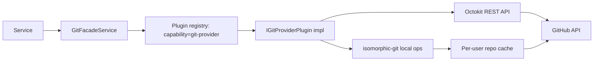

# Implementation Plan: Git Operations

**Feature ID**: `git-operations`
**Spec**: `./spec.md`
**Status**: `Done` (Retrospective)
**Last updated**: 2026-05-01

---

## 1. Architecture

## 2. Tech Choices

| Concern              | Choice                                   | Rationale                             |
| -------------------- | ---------------------------------------- | ------------------------------------- |
| Local git operations | `isomorphic-git`                         | Pure-JS, works in workers and on Node |
| Remote API (GitHub)  | `@octokit/rest`                          | Best-in-class GitHub client           |
| Plugin contract      | `IGitProviderPlugin` SDK interface       | Principle X — versioned               |
| Credential lookup    | `OAuthTokenRepository` per user+provider | Reuses existing OAuth token store     |
| Local cache          | `<workspace>/<userId>/<repo>` work       | Simple, isolated per user             |
| Push retry           | Configurable `maxRetries` per call       | Caller controls policy                |

## 3. Data Model

No new tables. Reuses:

- `oauth_tokens` for credentials.
- `plugin_settings` for provider-specific configuration.

## 4. API Surface

The facade itself is a service, not an HTTP API. It is consumed by:

- `DataGeneratorService` (data repo writes)
- `MarkdownGeneratorService` (markdown repo writes)
- `WebsiteGeneratorService` (website repo writes)
- `CommunityPrProcessorService` (PR listing/comments)
- `WorksConfigService` (file content reads)
- ... and more

## 5. Plugin Surface

`IGitProviderPlugin` (versioned in `@ever-works/plugin/git-provider`)
declares every method the facade needs. Today's only implementation is
the GitHub plugin. New providers plug in by implementing the same
interface.

## 6. Web / CLI

- Web: git provider connection UI (OAuth flow) under
  **Settings → Git Providers**.
- CLI: not exposed (the CLI uses the facade indirectly via API).

## 7. Background Jobs

None directly. Long-running clones/pushes happen inside generation
tasks (Trigger.dev) — the facade is just the API.

## 8. Security & Permissions

- Tokens in `oauth_tokens` are encrypted.
- Facade options object carries the token without logging it.
- Provider plugins are trusted code (in-process).

## 9. Observability

- Structured log line per call: operation, owner, repo, duration.
- Error class names appear in Sentry tags.

## 10. Risks & Mitigations

| Risk                                         | Mitigation                                              |
| -------------------------------------------- | ------------------------------------------------------- |
| Local cache fills disk                       | Cache is per-user; pipeline runs clean up on completion |
| Token leak via error message                 | Errors carry typed reasons, not raw responses           |
| New provider drift from `IGitProviderPlugin` | CI builds each plugin with strict tsconfig              |

## 11. Constitution Reconciliation

See `spec.md` §9.

## 12. References

- Spec: `./spec.md`
- Implementation:
    - `packages/agent/src/facades/git.facade.ts`
    - `packages/plugins/github/`
- SDK: `@ever-works/plugin/git-provider`
