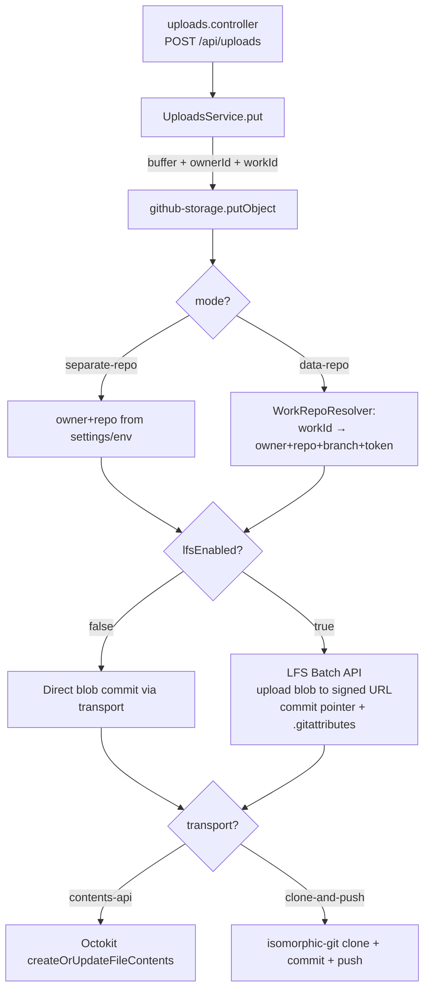

# GitHub Storage Plugin: Dual Repo Modes + Git LFS

**Feature ID**: `github-storage-lfs`
**Jira**: [EW-644](https://evertech.atlassian.net/browse/EW-644)
**Parent**: [EW-637](https://evertech.atlassian.net/browse/EW-637) — Storage Plugins (storage category + local-fs / S3 / MinIO / GitHub backends + anonymous upload endpoint).
**Plan**: [`./plan.md`](./plan.md)
**Tasks**: [`./tasks.md`](./tasks.md)
**Status**: `Draft`
**Last updated**: 2026-05-21

---

## 1. Problem

EW-637 shipped [`@ever-works/github-storage-plugin`](../../../../packages/plugins/github-storage/src/github-storage.plugin.ts), which commits each uploaded object as a file in a configured GitHub repository via `PUT /repos/{owner}/{repo}/contents/{path}` (the Octokit Contents API). Today the plugin has two operator pain points:

1. **A second repo is required.** Operators who already host the Work's data repo on GitHub have to stand up a second repo just for uploads. They'd prefer to reuse the Work's own data repo so all artifacts live together.
2. **Large files bloat the git pack.** The Contents API stores the blob directly in the tree. A 50 MB PDF lives in the pack forever, every clone pays for it, and there's no LFS opt-in. Operators expect Git LFS by default for binary uploads.

## 2. Goal

Extend the plugin so the operator picks **where uploads land** (own repo vs. the Work's data repo) and **how the bytes get there** (direct git blob vs. Git LFS), without breaking any existing `STORAGE_BACKEND=github-storage` deployment.

## 3. Non-goals

- New TypeORM entity columns. The `Work` entity already has `owner` and `storageProvider` ([`work.entity.ts:60-66`](../../../../packages/agent/src/entities/work.entity.ts)); per-Work data-repo coordinates are read from there.
- DB-side migration of existing `local-fs`, `aws-s3`, or `minio` backends.
- Multi-repo storage striping (one upload, multiple backends). Out of scope.
- A breaking change to `IStoragePlugin`. The contract is additive — `workId` is added as an optional field on `StoragePutInput`.
- Backfilling existing uploads into LFS. Existing keys keep working under the legacy direct-blob path; LFS applies to new uploads only when the toggle is on.
- Provider expansion beyond GitHub.com (GitHub Enterprise endpoints remain implicit via the existing `baseUrl` option on `Octokit`, untouched).

## 4. Concepts

| Term                       | Meaning                                                                                                                                                                                                                                            |
| -------------------------- | -------------------------------------------------------------------------------------------------------------------------------------------------------------------------------------------------------------------------------------------------- |
| **Mode A — `separate-repo`** | Plugin owns the storage repo. Operator picks `owner`/`repo` once; every upload lands there. Backwards-compatible with today's behaviour.                                                                                                            |
| **Mode B — `data-repo`**     | Plugin resolves the destination repo **per upload** from the Work's data-repo coordinates (`Work.owner`, plus the data repo identity already used by `MarkdownGeneratorService` and friends). No global owner/repo settings.                          |
| **LFS pointer write**      | A tiny text file the size of a pointer that the git tree commits. The actual bytes live on GitHub's LFS storage host, addressed by `sha256:<digest>`.                                                                                                |
| **LFS Batch API**          | The standard `POST {repo}.git/info/lfs/objects/batch` endpoint that, given `{oid, size, operation:'upload'}`, returns a signed URL to PUT the blob to. No git binary required.                                                                       |
| **Transport**              | The mechanism used to write the final pointer-or-blob into the repo: `contents-api` (Octokit, no working tree) or `clone-and-push` (isomorphic-git, in-memory working tree — matches how the platform writes to data repos today).                  |

## 5. User-visible surface

### 5.1 Plugin settings UI (`/dashboard/plugins/github-storage`)

```
┌──────────────────────────────────────────────────────────────────┐
│ Storage mode    (○) Separate GitHub repository                   │
│                 (●) Reuse Work data repository                   │
│                                                                  │
│ ──── shown only when mode = Separate ────                        │
│ Owner           [ ever-works (personal)         ▾ ]   ← reused   │
│ Repository      [ ever-works/storage-uploads    ▾ ]   ← reused   │
│ Branch          [ main ]                                          │
│ Path prefix     [ uploads ]                                       │
│                                                                  │
│ ──── always shown ────                                           │
│ [✓] Enable LFS (Large File Storage)                              │
│     LFS transport   ( ) GitHub LFS Batch API (default)           │
│                     ( ) `git` + `git-lfs` CLI                    │
│ Write transport     ( ) Auto                                     │
│                     ( ) GitHub Contents API                      │
│                     ( ) Clone + push (isomorphic-git)            │
└──────────────────────────────────────────────────────────────────┘
```

The Owner / Repository selectors reuse `OwnerFilter` + the repo list from [`apps/web/src/components/works/RepositorySelector.tsx`](../../../../apps/web/src/components/works/RepositorySelector.tsx), so the dropdown shows the same OAuth-connected orgs/repos the Work-creation flow already uses. If the user has exactly one connected org, it is preselected; if the user already has a Work with a data repo, that repo is suggested as the default.

### 5.2 Defaults

| Setting        | Default for mode `separate-repo`            | Default for mode `data-repo`                |
| -------------- | ------------------------------------------- | ------------------------------------------- |
| `mode`         | `separate-repo` (preserves current behaviour) | —                                          |
| `branch`       | `main` (existing default)                    | resolved from Work's data-repo metadata     |
| `pathPrefix`   | `uploads`                                    | `uploads`                                   |
| `lfsEnabled`   | `true`                                       | `true`                                      |
| `lfsTransport` | `api`                                        | `api`                                       |
| `transport`    | `auto` → `contents-api`                      | `auto` → `clone-and-push` (matches platform default) |

### 5.3 Backwards compatibility

- Existing `GITHUB_STORAGE_TOKEN`, `GITHUB_STORAGE_OWNER`, `GITHUB_STORAGE_REPO`, `GITHUB_STORAGE_BRANCH`, `GITHUB_STORAGE_PATH_PREFIX` env vars keep working in mode `separate-repo`. They populate the schema as `x-envVar` overrides.
- A deployment that does **not** set `mode` keeps the current direct-blob Contents-API behaviour bit-for-bit (`lfsEnabled` defaults true for new deployments, but if env vars are set and `mode`/`lfsEnabled` are unset, the plugin falls back to `lfsEnabled: false` to preserve byte-for-byte behaviour. See §8 Migration).

## 6. Architecture

### 6.1 Settings schema (additions)

```jsonc
{
  "mode": {
    "type": "string",
    "enum": ["separate-repo", "data-repo"],
    "default": "separate-repo",
    "title": "Storage mode"
  },
  "owner":  { ..., "x-widget": "github-owner", "showIf": { "field": "mode", "value": "separate-repo" } },
  "repo":   { ..., "x-widget": "github-repo",  "showIf": { "field": "mode", "value": "separate-repo" } },
  "branch": { ..., "showIf": { "field": "mode", "value": "separate-repo" } },
  "pathPrefix": { ..., "showIf": { "field": "mode", "value": "separate-repo" } },
  "lfsEnabled":   { "type": "boolean", "default": true, "title": "Enable LFS (Large File Storage)" },
  "lfsTransport": { "type": "string", "enum": ["api", "git-cli"], "default": "api", "showIf": { "field": "lfsEnabled", "value": true } },
  "transport":    { "type": "string", "enum": ["auto", "contents-api", "clone-and-push"], "default": "auto" }
}
```

`showIf` is already supported by [`PluginSettingsFormFields.tsx:41-46`](../../../../apps/web/src/components/plugins/PluginSettingsFormFields.tsx), so mode-dependent fields hide/show without new framework code. The two `x-widget` values (`github-owner`, `github-repo`) are added to the widget switch in [`PluginSettingsField.tsx`](../../../../apps/web/src/components/plugins/form/PluginSettingsField.tsx).

### 6.2 Put-object flow



### 6.3 Per-Work resolution (mode B)

A new helper inside the plugin — `WorkRepoResolver` — converts a `workId` into `{ owner, repo, branch, token, lfsCapable }`. To avoid coupling the plugin to NestJS DI, the resolver is supplied through `PluginContext` by the storage-backend factory in the API:

```ts
// apps/api/src/uploads/storage-backend.factory.ts (new)
const ctx = makeStubContext('github-storage');
if (wanted === 'github-storage') {
  (ctx as unknown as { workRepoResolver: WorkRepoResolver }).workRepoResolver = workRepoResolver;
}
await plugin.onLoad(ctx);
```

The plugin reads `context.workRepoResolver?.resolve(workId)` lazily on each `putObject`. If `workId` is unset (legacy callers, anonymous uploads), the plugin throws a clear configuration error in mode `data-repo` ("data-repo mode requires workId on the upload request"). Mode `separate-repo` ignores `workId` entirely.

### 6.4 LFS pointer write

LFS commits two artifacts:

1. **The pointer file** at `<pathPrefix>/<owner>/<hash><ext>`. Content:
   ```
   version https://git-lfs.github.com/spec/v1
   oid sha256:<sha256-of-content>
   size <bytes>
   ```
2. **The `.gitattributes` file** at the repo root, ensuring `*` under the path prefix is tracked by LFS. The plugin adds the line `${pathPrefix}/** filter=lfs diff=lfs merge=lfs -text` **idempotently** (read current contents first, skip if already present).

The blob upload itself happens **before** the pointer commit:

```
1. Compute oid = sha256(buffer), size = buffer.length
2. POST {repo}.git/info/lfs/objects/batch with {operation:"upload", objects:[{oid,size}]}
3. If `actions.upload.href` is present:
     PUT <signed url> with the buffer
4. Commit pointer file + (optionally) .gitattributes update via the chosen transport
```

If the LFS batch response shows the object already exists (`actions: {}`), step 3 is skipped — the pointer commit still happens.

### 6.5 `useGitCli` (optional)

When `lfsTransport: "git-cli"`, the plugin shells out via `execa`:

```
git clone --depth 1 <auth-url> <tmpdir>
cd <tmpdir>
git lfs install --local
git lfs track "<pathPrefix>/**"   # ensures .gitattributes
cp <upload> <pathPrefix>/<owner>/<hash><ext>
git add .gitattributes <path>
git -c user.email=bot@ever.works -c user.name="Ever Works Bot" commit -m "upload(<ownerId>): <hash><ext>"
git push origin <branch>
```

Requires `git` ≥ 2.40 and `git-lfs` ≥ 3.4 on `PATH`. Fail-fast with a clear error if either is missing. This path is reserved for advanced operators on hosts where they trust the binaries more than HTTP signed URLs.

### 6.6 Transport choice (non-LFS uploads)

| Mode             | `transport: auto` resolves to    | Why                                                                                                                       |
| ---------------- | -------------------------------- | ------------------------------------------------------------------------------------------------------------------------- |
| `separate-repo`  | `contents-api`                   | Current behaviour. No churn for existing deployments.                                                                       |
| `data-repo`      | `clone-and-push`                 | Matches how the platform writes to data repos elsewhere — see [`git-operations.ts`](../../../../packages/plugin/src/git/git-operations.ts). Same lock-file/refs pattern that the rest of the agent uses. |

Operators can override per-deployment via the explicit `contents-api` / `clone-and-push` values.

## 7. Interface deltas

### 7.1 `@ever-works/plugin` — `StoragePutInput` (additive)

```diff
 export interface StoragePutInput {
     buffer: Buffer;
     filename: string;
     mimeType: string;
     ownerId: string;
+    /**
+     * Optional Work ID. Backends that resolve their destination per-Work
+     * (e.g. github-storage in mode 'data-repo') require this; backends
+     * that don't will ignore it. Anonymous uploads leave this undefined.
+     */
+    workId?: string;
 }
```

No existing call site is required to set it. Anonymous-upload endpoints continue to pass `ownerId` only. The dashboard/Work-scoped upload routes thread `workId` through (see §10.2).

### 7.2 Plugin metadata (manifest)

`package.json`'s `everworks.plugin.envVars` array gains:

- `GITHUB_STORAGE_MODE` (`separate-repo` | `data-repo`, optional, default = `separate-repo`).
- `GITHUB_STORAGE_LFS_ENABLED` (`true` | `false`, optional).
- `GITHUB_STORAGE_LFS_TRANSPORT` (`api` | `git-cli`, optional).
- `GITHUB_STORAGE_TRANSPORT` (`auto` | `contents-api` | `clone-and-push`, optional).

`capabilities` gains `"lfs"` so the manifest signals support to operators inspecting it via `pluginsAPI.get('github-storage')`.

## 8. Migration / rollout

- **No DB migration** — the Work entity already covers the per-Work case.
- **No settings migration** — new keys default to safe values. An older settings record (no `mode`, no `lfsEnabled`) is treated as `mode = separate-repo` and `lfsEnabled = false` to preserve byte-for-byte behaviour for already-deployed `STORAGE_BACKEND=github-storage` users.
- For **fresh** plugin enables (settings record never existed), the defaults from the schema apply: `mode = separate-repo`, `lfsEnabled = true`.

## 9. Testing

See [`./tasks.md`](./tasks.md) for the full test matrix. Headlines:

- **Vitest unit (plugin package)**: mode × LFS × transport — 8 combinations, plus error cases (mode `data-repo` without `workId`, `.gitattributes` already up-to-date, LFS batch returns existing-object, Octokit 422, isomorphic-git non-ff).
- **Jest integration (`apps/api`)**: `UploadsService` + `StorageBackendFactory` resolve `workRepoResolver` and thread `workId` end-to-end. Mocks `Octokit` + `isomorphic-git` + LFS batch endpoint via `nock`.
- **Playwright e2e (`apps/web/e2e`)**: settings UI walk-through (mode toggle, showIf), persistence round-trip, mocked upload → assert pointer + blob upload calls happened in the expected order.

## 10. Acceptance criteria

- [ ] Plugin settings UI shows the mode selector and the `showIf` fields hide/show correctly without page reload.
- [ ] In mode `separate-repo`, owner+repo selectors reuse the OAuth-backed components from `RepositorySelector.tsx`.
- [ ] In mode `data-repo`, no owner/repo inputs are shown; the plugin successfully reads `Work.owner` + data repo from the Work entity for each upload.
- [ ] `lfsEnabled=true` produces an LFS pointer file commit + the blob PUT to the LFS host (asserted in tests by request-shape, not by side effect).
- [ ] `lfsEnabled=false` produces the exact same commit shape as today (regression covered by snapshot test against the pre-EW-644 output).
- [ ] `transport: clone-and-push` succeeds against a mocked isomorphic-git fixture.
- [ ] `transport: contents-api` keeps the existing direct-Octokit path.
- [ ] `lfsTransport: git-cli` is exercised by a unit test that mocks `execa` and asserts the command shape; it is **not** required to work without the binaries (the test is enough).
- [ ] Existing `STORAGE_BACKEND=github-storage` deployments with no `mode`/`lfsEnabled` settings behave identically to today (migration §8).
- [ ] PR open against `develop`, AI bot review clean per NN #14 / #18, CI green per NN #19.

## 11. Open questions

- **Lock contention with `clone-and-push` mode** under high upload concurrency: cloning + pushing per upload is slow and contention-prone if many uploads land at once for the same Work. We do not address this in this PR — the recommendation is to keep `transport: contents-api` for high-traffic mode-B deployments, and add a longer-term per-Work upload queue in a follow-up ticket (filed if observed in practice).
- **Anonymous uploads in mode `data-repo`**: out of scope. The plugin throws a configuration error if it's asked to handle one. Operators who want anonymous uploads should use mode `separate-repo`.
