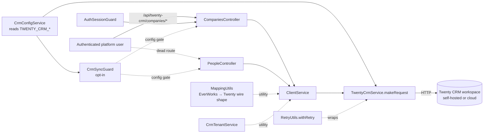

# Implementation Plan: Integrations — Twenty CRM

**Feature ID**: `integrations-twenty-crm`
**Spec**: `./spec.md`
**Tasks**: `./tasks.md`
**Status**: `Done` (retrospective — surface already shipped)
**Last updated**: 2026-05-08

---

## 1. Architecture Summary

## 2. Tech Choices

| Concern               | Choice                                                                                                                       | Rationale                                                                                                                  |
| --------------------- | ---------------------------------------------------------------------------------------------------------------------------- | -------------------------------------------------------------------------------------------------------------------------- |
| Module scope          | `@Global() forRoot()` / `forRootAsync()` so any consumer can `inject(ClientService)` without re-importing the module         | Matches `MailModule` and other Nest globals in the API.                                                                    |
| HTTP client           | `@nestjs/axios` (`HttpService.request()` + `firstValueFrom`)                                                                 | Drop-in for the `axios` instance with Nest's RxJS-friendly wrapper.                                                        |
| Config                | `@nestjs/config`'s `ConfigService.get<T>(...)` with explicit env-var keys                                                    | Same pattern as `apps/api/src/config/constants.ts` — keeps env contract grep-able.                                         |
| Auth gate             | Per-class `@UseGuards(AuthSessionGuard)` (only on `CompaniesController` today — see OQ-1)                                     | Reuses the platform-wide session guard. Class-level gate is cheaper than method-level.                                      |
| Config gate           | `CrmSyncGuard` reading `CrmConfigService.isEnabled` + `validateConfig`                                                        | Lets the integration self-disable when env vars are missing without surfacing a 500.                                       |
| Retry strategy        | `RetryUtils.withRetry` — exponential back-off, jittered delay, last-error re-throw                                            | Twenty CRM rate-limits at 429 and stresses on 5xx; jitter avoids thundering-herd retries across replicas.                  |
| Tenant addressing     | `CrmTenantService` — `tenantId = work_<workId>` / `globalTenantId` / `'global_everworks'`                                     | Future-proofing: today's single-workspace deployments use `global_everworks`; per-work tenants are a forward-compatible hook. |
| Mapping utility       | `class MappingUtils` with static methods                                                                                      | Pure functions, no DI required. Same pattern as `RetryUtils`.                                                              |
| Schema fetching       | `TwentyCrmService.makeRequest(..., schema=true)` swaps `/rest` → `/rest/metadata`                                              | Lets metadata-discovery callers (e.g. tooling, future schema-driven sync) reuse the same auth + headers.                   |
| Error wrapping        | `HttpException({message, details}, statusCode)` for upstream errors; `HttpException('Failed to communicate ...', 503)` for transport | Lets Nest's exception filter render OpenAPI-shaped errors back to the client without leaking the upstream stack.            |

## 3. Data Model

### Entities

No new database entities. The integration treats Twenty as the
remote system of record — no platform-side mirroring tables.

The `EverWorks*` types in
[`types/mapping.types.ts`](../../../../apps/api/src/integrations/twenty-crm/types/mapping.types.ts)
are projection shapes used at the boundary; the actual platform
`User` / `Work` / `Item` entities live in `@ever-works/agent/entities`
and are not changed by this feature.

### DTOs / contracts

No `@ever-works/contracts` additions. The Twenty wire format types
(`TwentyContact`, `TwentyOrganization`, `TwentyProduct`,
`TwentyDeal`) live in
[`types/twenty-crm.types.ts`](../../../../apps/api/src/integrations/twenty-crm/types/twenty-crm.types.ts)
and are consumed only by the controllers + service inside the
`integrations/twenty-crm/` folder.

## 4. API Surface

### Companies (`/api/twenty-crm/companies`)

| Method   | Endpoint                              | Description           | Status   |
| -------- | ------------------------------------- | --------------------- | -------- |
| `GET`    | `/api/twenty-crm/companies`           | List companies        | Shipped  |
| `POST`   | `/api/twenty-crm/companies`           | Create company        | Shipped  |
| `PATCH`  | `/api/twenty-crm/companies/:id`       | Update company (PUT)  | Shipped  |
| `DELETE` | `/api/twenty-crm/companies/:id`       | Delete company        | Shipped  |

- **Auth**: `@UseGuards(AuthSessionGuard)` (class-level).
- **Body**: `TwentyOrganization` — passed through verbatim. (No
  `class-validator` DTO today; see OQ-4.)
- **Errors**: surfaced via the `HttpException` wrap from
  `TwentyCrmService.makeRequest` — upstream `data.message` +
  `data.details` are forwarded; transport failures become `503`.

### People

`PeopleController` is implemented but currently NOT registered in
`TwentyCrmModule.forRoot()`. See OQ-2 — the routes are inert
until the controller is added to the `controllers: []` array.

If/when wired up, the intended surface mirrors the companies
endpoints with explicit field-projection on `POST` (only seven
allowed fields). See FR-13.

## 5. Plugin Surface (if any)

None today. The integration lives in `apps/api/` and exposes its
services as Nest `@Global()` providers. A future migration to
`packages/plugins/twenty-crm` would let other deployments swap
Twenty for another CRM (HubSpot, Salesforce, …) by writing a
sibling plugin. See OQ-1 in `tasks.md`.

## 6. Web / CLI Surface

- **Web**: not yet — there is no `apps/web` UI for Twenty CRM
  management. (The endpoints are reachable from any signed-in
  client, but no first-party page consumes them.)
- **CLI / MCP**: none.

## 7. Background Jobs

None currently. All endpoints are request-scoped CRUD.

If bulk-import or scheduled-sync features land in the future
(see OQ-8 in `tasks.md`), they would belong in `packages/tasks`
under Trigger.dev — keeping rate-limit-aware retries decoupled from
HTTP request lifecycles.

## 8. Security & Permissions

- **AuthN**: `@UseGuards(AuthSessionGuard)` on
  `CompaniesController`. Any signed-in user can read/write the
  Twenty workspace today — there is no per-workspace authorisation
  beyond the shared bearer token.
- **AuthZ**: none (no role-gating). `CrmSyncGuard` is a config
  gate, not a permission gate.
- **Secrets**: `TWENTY_CRM_API_KEY` lives in env vars only.
  `TwentyCrmService` is the only place that reads it; controllers
  never see it. The bearer token is set in the `Authorization`
  header of each request.
- **Tenant isolation**: `CrmTenantService` builds tenant prefixes
  but the controllers do NOT pass them through to
  `TwentyCrmService.makeRequest` today — every request hits the
  shared workspace. Multi-tenant prefix routing is a forward-compatible
  hook, not active code (see OQ-9 in `tasks.md`).
- **Inputs**: `CompaniesController.createCompany` accepts the body
  verbatim — class-validator DTO would reduce surface area
  (OQ-4).

## 9. Observability

- **Activity log**: this integration does NOT emit activity-log
  entries today. CRM CRUD is high-volume per-row work; if a future
  audit trail is required, the spec would need extension.
- **Logger**:
    - `TwentyCrmService.makeRequest` → `logger.debug('Making
      <method> request to <url>')` on every call.
    - `TwentyCrmService.makeRequest` (catch) →
      `logger.error('Twenty CRM API error: <msg>', {endpoint,
      method, status, data})`.
    - `CrmSyncGuard.canActivate` →
      `logger.warn('CRM integration is disabled - request blocked')`
      and `logger.error('CRM configuration validation failed:', err)`.
    - `CrmTenantService.resolveTenantContext` →
      `logger.debug('Resolved tenant context: <json>')`.
    - `CrmTenantService.validateTenantContext` →
      `logger.error('Tenant ID is required')`.
- **Metrics**: none new. Standard Nest request-duration histograms
  cover the controllers.

## 10. Phased Rollout

The feature has shipped. There is no rollout to plan.

The env-var gate (`isEnabled` short-circuit) makes the integration
self-disable when `TWENTY_CRM_*` vars are absent — so the code can
ship to all environments and only activate where configured.

## 11. Risks & Mitigations

| Risk                                                                                                  | Likelihood | Impact                                                          | Mitigation                                                                                                                                                |
| ----------------------------------------------------------------------------------------------------- | ---------- | --------------------------------------------------------------- | --------------------------------------------------------------------------------------------------------------------------------------------------------- |
| `PeopleController` ships as dead code, masking a real auth gap if it gets wired up in a future PR.   | Medium     | New endpoint live without `AuthSessionGuard`.                   | OQ-1 + OQ-2 follow-ups — either decorate + register the controller OR remove it. Tests in PR #498 already cover the controller's intended behaviour.       |
| Twenty CRM upstream changes its `/rest` schema.                                                       | Medium     | Mapping breaks; integration silently writes wrong data.         | Twenty wire-format types in `types/twenty-crm.types.ts` are the only schema lock; a contract test against a stub Twenty workspace would catch breakage.   |
| Default request path skips `withRetry`.                                                              | High       | Single transient 503 surfaces as a user-facing error.            | OQ-8 follow-up — wrap `TwentyCrmService.makeRequest` in `withRetry` by default; retry only on `isRetryableError`-positive shapes.                          |
| Bearer token leaks into a log line on a future change.                                               | Low        | Credential exposure.                                            | The token is only set in the `headers` getter of `TwentyCrmService`. Any change to that file should be reviewed for log-format additions.                  |
| `MappingUtils.mapClientToContact` mis-splits non-Western names.                                      | Medium     | First/last name ordering wrong for users with single-token names or RTL ordering. | Pinned by tests (single-token name → `firstName`, `lastName=''`). A future enhancement could accept `firstName`/`lastName` directly when the source row provides them. |
| `HttpException` from `makeRequest` exposes upstream `data.details`.                                  | Low        | Internal error structure leaks to API consumer.                 | Twenty CRM is the upstream; details are intentionally surfaced so the client can act. If Twenty leaks PII in error responses, that's a Twenty issue to fix. |

## 12. Constitution Reconciliation

- **Principle I (Plugin-first)**: PARTIAL — the integration lives in
  `apps/api/` rather than `packages/plugins/twenty-crm`. This is
  intentional today (the integration touches platform-side mapping
  types and tenant context) but is a forward-compatible candidate
  for migration. See OQ-1 in `tasks.md`.
- **Principle II (Capability-driven)**: N/A — no new capability
  interface.
- **Principle III (Source-of-truth repos)**: ✅ — platform DB stays
  the source of truth; Twenty receives a projection only.
- **Principle IV (Trigger.dev for long work)**: N/A — all work is
  request-scoped.
- **Principle V (Forward-only migrations)**: N/A — no DB schema.
- **Principle VI (Tests)**: ✅ — 107 unit tests in PR
  [#498](https://github.com/ever-works/ever-works/pull/498).
- **Principle VII (Secrets via `x-secret`)**: ✅ — API key in env vars
  only, never logged, never echoed.
- **Principle VIII (Plugin counts in canonical doc)**: N/A — not a
  plugin yet.
- **Principle IX (Behaviour-first spec)**: ✅ — `spec.md` describes
  observable behaviour only.
- **Principle X (Backwards-compatible)**: ✅ — additive, env-gated.

## 13. References

- Spec: `./spec.md`
- Tasks: `./tasks.md`
- Source: see `spec.md` §10.
- Tests: 107 unit tests across the module —
  [#498](https://github.com/ever-works/ever-works/pull/498).
- External: [Twenty CRM REST API docs](https://twenty.com/developers/section/api/rest-api).
- Related specs:
  [`auth-jwt-oauth`](../auth-jwt-oauth/spec.md),
  [`activity-log`](../activity-log/spec.md).
