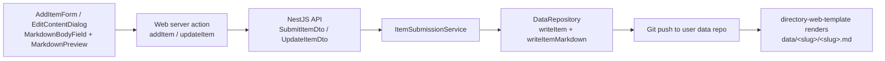

# Implementation Plan: Item Markdown Editor

**Feature ID**: `item-markdown-editor`
**Spec**: `./spec.md`
**Tasks**: `./tasks.md`
**Status**: `Draft`
**Last updated**: 2026-05-15

---

## 1. Architecture Summary

There is no new persistence boundary. The `markdown` value flows through
existing layers — only the validators, types, and surface widgets change.

## 2. Tech Choices

| Concern             | Choice                                              | Rationale                                                                  |
| ------------------- | --------------------------------------------------- | -------------------------------------------------------------------------- |
| Editor widget       | Plain `<Textarea>` (existing UI primitive)          | Smallest possible change; users already author markdown elsewhere in this UI. |
| Preview renderer    | `react-markdown` + `remark-gfm` (already in `apps/web`) | No new dep; same renderer used by `ChatMarkdown` for consistency.          |
| Preview loading     | `next/dynamic` import                                | Defers the renderer chunk until a user opens the preview pane.             |
| Validation          | class-validator `@IsOptional @IsString @MaxLength(100000)` | Matches existing DTO style in `items-generator/dto/`.                      |
| Persistence channel | Existing `<slug>.md` file + YAML `markdown` mirror   | Already what the generator and site renderer expect (Principle III).        |

## 3. Data Model

### Entities

No new entities. `ItemData.markdown?: string` already exists in
`packages/contracts/src/item/item.types.ts:132`. Items live in the user's
git data repo per Principle III, so there is no SQL column to add or
migrate.

### DTOs / contracts

- `packages/contracts/src/api/generator/submit-item.dto.ts` — add
  `markdown?: string`.
- `packages/contracts/src/api/generator/update-item.dto.ts` — add
  `markdown?: string`.
- `packages/agent/src/items-generator/dto/submit-item.dto.ts` — add
  `@IsOptional @IsString @MaxLength(100000)` validator class field.
- `packages/agent/src/items-generator/dto/update-item.dto.ts` — same.
- `packages/agent/src/generators/data-generator/data-repository.ts` —
  broaden the `Pick<ItemData, …>` constraint on `updateItemMetadata`
  to include `'markdown'`.

## 4. API Surface

No new endpoints. Both affected endpoints gain an optional field.

| Method | Endpoint                                       | Field added | Validation                |
| ------ | ---------------------------------------------- | ----------- | ------------------------- |
| `POST` | `/api/works/:id/items/submit` (existing)       | `markdown`  | optional, string, ≤100000 |
| `PUT`  | `/api/works/:id/items/update` (existing)       | `markdown`  | optional, string, ≤100000 |

Existing auth, rate-limit, and error response shapes are unchanged.

## 5. Plugin Surface (if any)

None. No new capability or plugin.

## 6. Web / CLI Surface

- New components in `apps/web/src/components/works/detail/items/`:
    - `MarkdownBodyField.tsx` — labelled textarea + collapsible preview
      toggle, used by both create and edit flows.
    - `MarkdownPreview.tsx` — thin wrapper around `ReactMarkdown` with
      shared `prose` typography.
- Edits to existing components in the same folder:
    - `AddItemForm.tsx` — `ItemFormData` gains `markdown: string`;
      renders `<MarkdownBodyField>` before the images section.
    - `AddItemModal.tsx` — initialises `markdown: ''` in state, includes
      `markdown: formData.markdown.trim() ? formData.markdown : undefined`
      in the submit payload, resets on success.
    - `ItemActions.tsx` — adds an "Edit content" dropdown entry and a new
      `EditContentDialog` component.
- i18n: keys added to `apps/web/messages/en.json` under
  `dashboard.workDetail.items.addModal` and
  `dashboard.workDetail.items`. The other 20 locale files will be
  filled by the next i18n sweep PR — same convention as recently shipped
  EW-132 keys.
- CLI surface unchanged.

## 7. Background Jobs

None.

## 8. Security & Permissions

- Both endpoints already require an authenticated user with access to the
  work; no change.
- No `@Public()` endpoints added.
- The new field is plain user content, not a credential — no `x-secret`
  treatment needed.
- Validation cap (100,000 chars) prevents trivially large payloads from
  reaching git-side work.

## 9. Observability

- Existing commit messages (`Add <name>` and the new
  `Update <name> content`) provide the audit trail in the user's data
  repo.
- No new activity-log action types, Sentry tags, or metrics.

## 10. Phased Rollout

Per the project rule that pre-launch repos skip feature-flag ceremony,
this ships as a single PR: contract + DTOs + service + UI + spec + tests,
all gated only by code review. There is no user-visible regression risk:
omitting the field reproduces the pre-change behaviour byte-for-byte.

## 11. Risks & Mitigations

| Risk                                                                      | Likelihood | Impact | Mitigation                                                                                  |
| ------------------------------------------------------------------------- | ---------- | ------ | ------------------------------------------------------------------------------------------- |
| Authors use MDX custom components and expect them to render in preview    | Medium     | Low    | Spec §6 documents that the platform preview is GFM-only; site continues to render MDX.       |
| 100,000-char cap is too low or too high                                   | Low        | Low    | Easy to revise — single `@MaxLength` constant. Spec §8 leaves it as an open question.        |
| Empty-string updates inadvertently overwrite existing bodies              | Low        | Medium | `markdownChanged` guard in the service only writes when DTO value differs from existing.    |
| `react-markdown` chunk shipped on every dashboard load                    | Medium     | Low    | `MarkdownBodyField` uses `next/dynamic` so the chunk only loads on preview-toggle.           |

## 12. Constitution Reconciliation

- **Principle I (Plugin-first)** — N/A. No external integration.
- **Principle II (Capability-driven)** — N/A. No plugin behaviour.
- **Principle III (Source-of-truth repos)** — Reinforced. Content lives
  in the user's data repo. No platform DB column added.
- **Principle IV (Trigger.dev)** — N/A. Request-scoped git work uses the
  existing in-process path used by every other item action.
- **Principle V (Forward-only migrations)** — N/A. No schema change.
- **Principle VI (Tests)** — DTO validation tests added to
  `packages/agent/src/items-generator/dto/dto.spec.ts`.
- **Principle VII (Secret hygiene)** — N/A. Not a secret.
- **Principle VIII (Plugin counts)** — N/A.
- **Principle IX (Behaviour-first)** — spec contains no class names; plan
  owns implementation details.
- **Principle X (BC)** — additive optional field on both DTOs.

## 13. References

- Spec: `./spec.md`
- Tasks: `./tasks.md`
- Related feature: [`data-generator`](../data-generator/spec.md)
