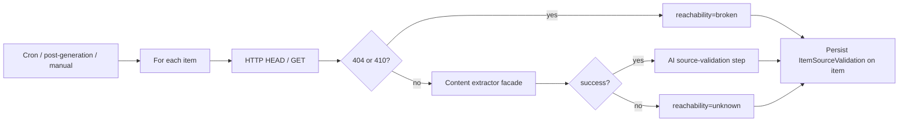

# Implementation Plan: Item Source Validation

**Feature ID**: `item-source-validation`
**Spec**: `./spec.md`
**Status**: `Done` (Retrospective)
**Last updated**: 2026-05-01

---

## 1. Architecture

## 2. Tech Choices

| Concern            | Choice                                  | Rationale                           |
| ------------------ | --------------------------------------- | ----------------------------------- |
| Reachability check | Native `fetch` with timeout + redirects | Lightweight; no extra dep           |
| Content extraction | Existing extractor facade               | Reuses configured extractor plugin  |
| AI evaluation      | AI provider facade with structured out  | Principle II                        |
| Manual re-check    | Cached result for ~60 s                 | Avoids hammering external resources |
| Scheduling         | Trigger.dev task with own cadence       | Principle IV                        |

## 3. Data Model

- Item YAML in the data repo gains an optional `source_validation` blob
  with the documented shape.
- `directory_schedules` adds a `sourceValidationCadence` column
  (additive nullable).

## 4. API Surface

| Method | Endpoint                                 | Description            |
| ------ | ---------------------------------------- | ---------------------- |
| `POST` | `/api/directories/:id/check-item-health` | Re-check a single item |

## 5. Plugin / Web / CLI

- Plugins: AI provider + content extractor only.
- Web: Items UI surfaces status indicators and the action menu (Re-check
  source, Apply suggestion).
- CLI: not exposed.

## 6. Background Jobs

- `directory-source-validation` Trigger.dev task running on the
  directory's `sourceValidationCadence` (or the main cadence as a
  fallback).
- Post-generation hook calls the same validator inline.

## 7. Security & Permissions

- Read: viewer.
- Write (manual re-check, apply suggestion): editor.
- HTTP fetches use the platform's egress, not the user's network.

## 8. Observability

- Activity log entries: `source_validation_run` with
  `{reachableCount, brokenCount, unknownCount, accurateCount, ...}`.

## 9. Risks & Mitigations

| Risk                                          | Mitigation                                               |
| --------------------------------------------- | -------------------------------------------------------- |
| False-positive `broken` from transient errors | Only `404`/`410` → `broken`; everything else → `unknown` |
| AI cost runaway on huge directories           | Validation skips items unchanged since last check        |
| Manual re-check abuse                         | Cooldown cache window                                    |

## 10. Constitution Reconciliation

See `spec.md` §9.

## 11. References

- Spec: `./spec.md`
- Implementation:
    - `packages/agent/src/services/item-source-validation-scheduler.service.ts`
    - `packages/agent/src/generators/data-generator/source-validation/`
