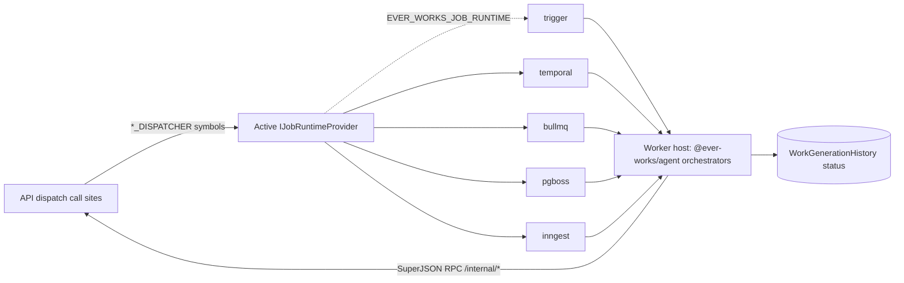

# Implementation Plan: Job-Runtime Provider Pluggability

> Translates [`spec.md`](./spec.md) into architecture and tech choices. Behaviour lives in the spec; this owns the "how." Provider research: [`providers.md`](./providers.md). Rationale: [ADR-015](../../decisions/015-job-runtime-provider-pluggability.md). Deep architecture: [`architecture/job-runtime-providers.md`](../../architecture/job-runtime-providers.md).

**Feature ID**: `job-runtime-providers`
**Spec**: `./spec.md`
**Tasks**: `./tasks.md`
**Status**: `Draft`
**Last updated**: 2026-05-28

---

## 1. Architecture Summary

The seam already exists (dispatcher interfaces + DI symbols, [`architecture/job-runtime-providers.md`](../../architecture/job-runtime-providers.md) §2). The plan binds those symbols to the active provider instead of `TriggerService`, builds the contract + conformance harness, re-houses Trigger.dev, then adds four providers.

## 2. Tech Choices

| Concern          | Choice                                                                     | Rationale                                                              |
| ---------------- | -------------------------------------------------------------------------- | ---------------------------------------------------------------------- |
| Abstraction      | New `job-runtime` capability + `IJobRuntimeProvider` in `packages/plugin/` | Plugin-first (Principle I); mirrors existing capabilities.             |
| Selection        | `EVER_WORKS_JOB_RUNTIME` env, default `trigger`                            | Mirrors ADR-005 `EVER_WORKS_*_BACKEND`; infra is global, not per-user. |
| Trigger provider | Re-house existing `TriggerService`                                         | Zero behaviour change; lowest risk.                                    |
| Temporal         | `@temporalio/{client,worker,workflow,activity}`                            | Official SDK (NN #22); MIT server, free self-host + Cloud.             |
| BullMQ           | `bullmq`                                                                   | Official SDK; already a transitive dep; Redis-native.                  |
| Postgres queue   | `pg-boss`                                                                  | Postgres-native (BullMQ can't do Postgres); reuses platform DB.        |
| Inngest          | `inngest`                                                                  | Official SDK; SaaS-only (SSPL).                                        |
| Conformance      | Shared Vitest/Jest suite against `IJobRuntimeProvider`                     | Mirrors ADR-005 `LockProvider` contract suite.                         |
| Worker hosting   | Per-provider entrypoints + compose/k8s artifacts                           | Models genuinely differ (push vs pull); cannot fully abstract.         |

## 3. Data Model

### New entities

None required on the platform schema for the core abstraction. Run state continues to live in `WorkGenerationHistory` (`triggerRunId` generalised to `runtimeRunId`, with `triggerRunId` kept as an alias column read-path for back-compat).

Optional (later): a small `job_runtime_runs` mirror table if we want a provider-neutral run index for an admin UI. **Not** in v1.

### Migrations

- If `triggerRunId` → `runtimeRunId` rename is adopted: **forward-only, two-phase** (add `runtimeRunId`, backfill from `triggerRunId`, dual-write, switch reads, drop later) per [`database.md`](../../architecture/database.md) §6.2 and workstation NN #16. Default plan: **keep `triggerRunId` as-is**, treat it as the opaque run id for all providers (cheaper, no migration). Decide in tasks T2.
- **pg-boss** creates its own `pgboss` schema in the platform DB on `boss.start()` — isolated, additive, not a platform migration.

### DTOs / contracts

`@ever-works/contracts` unchanged for external API consumers. New internal types (`JobRunStatus`, `ScheduleSpec`, `JobEnqueueOptions`, `JobRuntimeId`, `IJobRuntimeProvider`) live in `packages/plugin/src/contracts/capabilities/job-runtime.interface.ts` (shipped EW-685 P0; re-exported from `@ever-works/plugin` via the capabilities barrel).

## 4. API Surface

No new public endpoints. The internal callback controller (`/internal/trigger/*`) is generalised to `/internal/jobs/*` with `/internal/trigger/*` kept as an alias route (back-compat for the in-flight Trigger.dev worker during rollout). Auth header generalised `x-trigger-secret` → `x-internal-secret` (alias retained).

| Method | Endpoint                           | Description                                         | Status      |
| ------ | ---------------------------------- | --------------------------------------------------- | ----------- |
| `POST` | `/internal/jobs/remote/call`       | SuperJSON RPC (was `/internal/trigger/remote/call`) | Generalised |
| `GET`  | `/internal/jobs/works/:id/context` | Worker work/user/token context                      | Generalised |

## 5. Plugin Surface

- **Capability `job-runtime`** → contract at `packages/plugin/src/contracts/capabilities/job-runtime.interface.ts` (shipped EW-685 P0). No separate `job-runtime.category.ts` registration file — capability strings (`job-runtime-enqueue`, `job-runtime-cancel`, `job-runtime-status`, `job-runtime-schedule`, `job-runtime-worker-host`) live in JSDoc on the interface itself, mirroring how `dns.interface.ts` (EW-734/735) declares its capability strings.
- **New plugins** under `packages/plugins/`: `job-runtime-trigger` (re-house), `job-runtime-temporal`, `job-runtime-bullmq`, `job-runtime-pgboss`, `job-runtime-inngest`. Each: `package.json` with `everworks.plugin` (category `job-runtime`, `configurationMode: 'admin-only'`), tsup build, vitest, settings JSON-Schema with `x-secret`/`x-envVar`/`x-scope: global`.
- **Binding factory** `packages/agent/src/tasks/job-runtime.providers.ts` resolves the active provider and binds all `*_DISPATCHER` symbols to it.

## 6. Web / CLI Surface

- **Web**: none for v1 (no end-user runtime picker). Optionally, an admin read-only "active runtime" badge in settings (nice-to-have, not required).
- **CLI / internal-cli**: a `job-runtime status` diagnostic (which provider is active + reachability) — optional.
- **MCP**: none.

## 7. Background Jobs

The recurring jobs that exist today must be expressed per provider (each provider's native cron):

| Trigger                                                     | When        | What it does                         | Idempotency strategy                                                            |
| ----------------------------------------------------------- | ----------- | ------------------------------------ | ------------------------------------------------------------------------------- |
| schedule dispatcher                                         | every N min | claim + dispatch due `WorkSchedule`s | runtime-neutral CAS claim ([`scheduled-updates`](../scheduled-updates/spec.md)) |
| deploy-ready poller                                         | every 2 min | flip mid-deploy works to READY       | idempotent poll                                                                 |
| agent heartbeat dispatcher                                  | every N min | dispatch agent heartbeats            | CAS claim                                                                       |
| data-repo-sync / recurrence / mission-tick / research-rerun | various     | existing cron tasks                  | existing idempotency                                                            |

Each provider implements these via its scheduler (Trigger.dev `schedules.task`, Temporal Schedules, BullMQ repeatable, pg-boss `schedule`, Inngest cron). The CAS claim makes "exactly one firing per tick" a non-load-bearing convenience, so providers with weaker single-firing guarantees remain correct.

## 8. Security & Permissions

- All provider credentials are `x-secret: true`, `x-scope: global`, resolved through the settings hierarchy; never returned in API responses.
- The internal callback channel stays authenticated (constant-time secret compare, allow-listed RPC targets, `@SkipThrottle`) — provider-neutral.
- Self-host/air-gap providers (Temporal/BullMQ/pg-boss) MUST NOT contact any SaaS; verified by the air-gap compose profile test.
- Inngest's signing-key webhook is the trust boundary for the push model; validate signatures on the `serve()` endpoint.

## 9. Observability

- `WorkGenerationHistory` remains the canonical status surface (status, recentLogs, durationInSeconds) — provider-neutral.
- Each provider bridges run logs to its native dashboard and to the shared MonitoringModule (Sentry/PostHog), exactly as the Trigger.dev worker does today ([`monitoring.md`](../../architecture/monitoring.md)).
- Startup logs the active runtime + `experimental` warning when applicable.

## 10. Phased Rollout

1. **Phase 0 — Contract & seam (no behaviour change).** Define `job-runtime` capability + `IJobRuntimeProvider`; build the binding factory bound to `trigger` by default; amend Constitution Principle IV. Ship dark.
2. **Phase 1 — Re-house Trigger.dev.** Move `TriggerService` into `job-runtime-trigger` behind the contract. Existing trigger e2e suite must pass unchanged. This is the proof the abstraction is faithful.
3. **Phase 2 — Conformance harness.** Build the provider-agnostic suite; run it green against `trigger`.
4. **Phase 3 — pg-boss (first new provider).** Highest value (enables "just Postgres" OSS deploys). Worker entrypoint + compose profile + conformance green. GA-track.
5. **Phase 4 — BullMQ.** Redis worker + compose profile + conformance green. Experimental → GA.
6. **Phase 5 — Temporal.** Workflow/Activity split + worker deployment + `start-dev` CI + conformance green. Experimental → GA. (Largest lift.)
7. **Phase 6 — Inngest (SaaS).** `serve()` functions + cron + cancel; documented SaaS-only. Experimental.
8. **Phase 7 — Docs & matrix.** Provider deploy guides, env reference, plugin-count canonical doc, ADR/architecture cross-links finalised.

Each provider stays behind an `experimental` flag (startup warning) until its conformance suite is green in CI.

## 11. Risks & Mitigations

| Risk                                                      | Likelihood | Impact  | Mitigation                                                                                                                |
| --------------------------------------------------------- | ---------- | ------- | ------------------------------------------------------------------------------------------------------------------------- |
| Re-housing Trigger.dev subtly changes behaviour           | Med        | High    | Phase 1 gate = existing trigger e2e passes unchanged; diff is mechanical move.                                            |
| Worker-hosting models too different to share orchestrator | Med        | High    | Keep agent orchestrator + SuperJSON channel reused; only the host wrapper differs per provider; prove with pg-boss first. |
| Cooperative cancel (BullMQ/pg-boss) leaves zombie runs    | Med        | Med     | Reuse existing `throwIfGenerationCancelled` checkpoints + the three-layer terminal-write defense.                         |
| Multi-hour jobs trip BullMQ/pg-boss timeouts              | Med        | Med     | Tune lock renewal / visibility timeout; document; conformance includes a long-job case.                                   |
| Inngest per-step limits break the long pipeline           | Med        | Med     | Express pipeline as steps under Inngest; keep Inngest experimental; document the constraint.                              |
| Five providers rot at different rates                     | High       | Med     | Shared conformance suite in CI; non-default = experimental + best-effort; only `trigger` is supported-default.            |
| Maintenance/CI cost                                       | High       | Low-Med | Matrix CI runs conformance per provider; providers are independently installable plugins.                                 |

## 12. Constitution Reconciliation

- **I Plugin-first** — providers are plugins. ✓
- **II Capability-driven** — `job-runtime` capability resolved from registry. ✓
- **III Source-of-truth repos** — untouched. ✓
- **IV Long-running work via Trigger.dev** — **AMEND** to "via the configured job-runtime provider (Trigger.dev default)"; ships in Phase 0 PR with ADR-015 cross-link. ⚠️→✓
- **V Forward-only migrations** — pg-boss schema additive; any `triggerRunId` rename two-phase. ✓
- **VI Tests** — conformance suite + per-provider e2e. ✓
- **VII Secrets** — all runtime creds `x-secret`. ✓
- **VIII Plugin-count canonical doc** — updated as providers land. ✓
- **IX Behaviour-first** — behaviour in spec, impl here. ✓
- **X Backwards-compatible** — default path unchanged; additive. ✓

## 13. References

- Spec: [`./spec.md`](./spec.md) · Tasks: [`./tasks.md`](./tasks.md) · Providers: [`./providers.md`](./providers.md)
- ADRs: [ADR-015](../../decisions/015-job-runtime-provider-pluggability.md), [ADR-005](../../decisions/005-cache-and-lock-pluggability.md), [ADR-002](../../decisions/002-trigger-worker-callback-channel.md)
- Architecture: [`job-runtime-providers.md`](../../architecture/job-runtime-providers.md), [`trigger-integration.md`](../../architecture/trigger-integration.md), [`trigger-worker.md`](../../architecture/trigger-worker.md)
