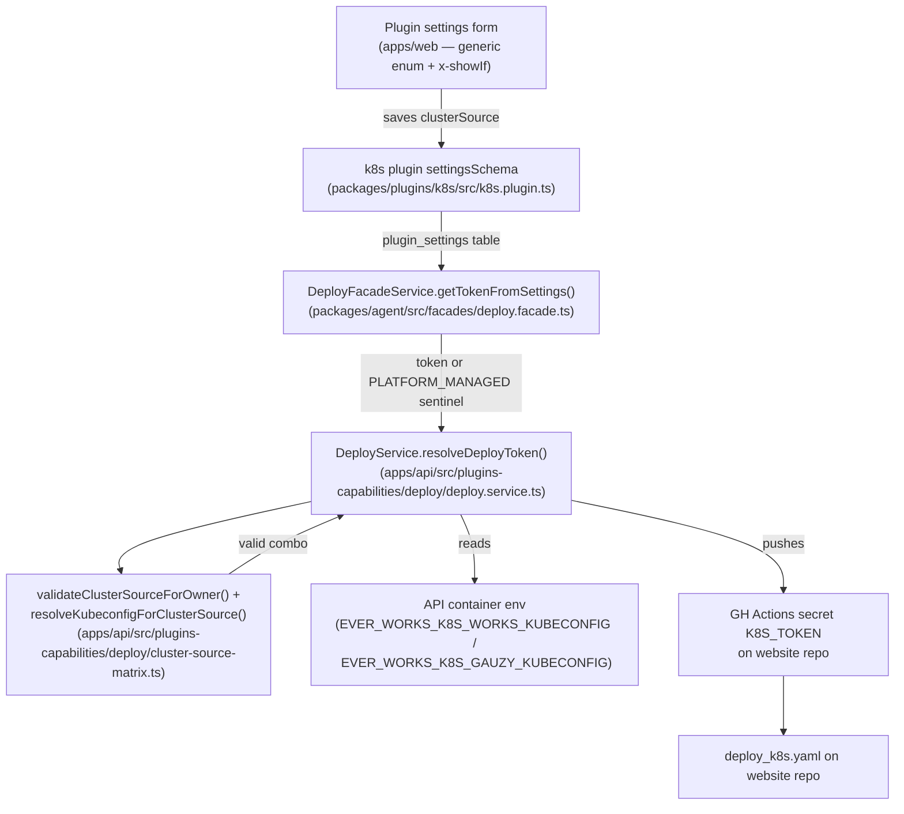
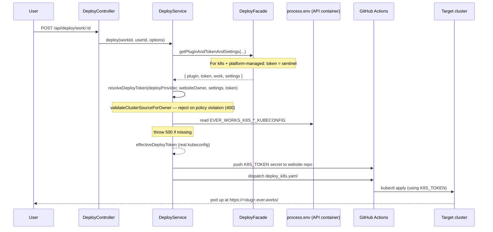

# Implementation Plan: Kubernetes Cluster-Source Matrix (EW-616)

> Translates the approved [`./spec.md`](./spec.md) into architecture and tech-choices.
> The plan owns implementation details; the spec owns behaviour.

**Feature ID**: `k8s-cluster-source-matrix`
**Spec**: `./spec.md`
**Status**: `Done`
**Last updated**: 2026-05-14

---

## 1. Architecture Summary

## 2. Module-by-module changes

### 2.1 `packages/plugins/k8s/src/types.ts`

Added the `ClusterSource` type union and `clusterSource?: ClusterSource` field on `KubernetesSettings`. JSDoc explains each value, the env-var routing for platform-managed values, and links the back-compat default behaviour.

### 2.2 `packages/plugins/k8s/src/k8s.plugin.ts`

- New `clusterSource` property in `settingsSchema.properties` (enum, default `'custom-kubeconfig'`).
- Replaced `required: ['kubeconfig']` with `allOf: [{ if: <clusterSource missing or custom-kubeconfig>, then: { required: ['kubeconfig'] } }]`.
- Added `'x-showIf': { field: 'clusterSource', value: 'custom-kubeconfig' }` to both `kubeconfig` and `kubeContext` (form renderer hides them when the user picks a platform-managed source).
- `validateConnection` short-circuits to `{ success: true, message: "Will deploy to platform-managed cluster '<x>'", details: { clusterSource } }` when the source is platform-managed (no live cluster check).
- `coerceSettings` accepts `clusterSource` only when it's a valid enum value; invalid/garbage values silently coerce to back-compat default.
- `getDeploymentSecrets` emits `K8S_CLUSTER_SOURCE` so the workflow has the chosen source as an env var (currently unused by the workflow; reserved for future templates and observability).

### 2.3 `apps/api/src/plugins-capabilities/deploy/cluster-source-matrix.ts` (new)

Pure helpers, no DI. Three exports:

- `validateClusterSourceForOwner(websiteOwner, clusterSource, { hasKubeconfig })` returns `null` on success or `{ code, message }` on failure. Three failure codes: `K8S_GAUZY_NOT_ALLOWED`, `CUSTOM_KUBECONFIG_NOT_ALLOWED_FOR_SHARED_ORG`, `CUSTOM_KUBECONFIG_MISSING_KUBECONFIG`.
- `resolveKubeconfigForClusterSource(clusterSource, userToken, env = process.env)` returns the right kubeconfig — env var for platform-managed sources, `userToken` for `custom-kubeconfig`. Throws if a platform-managed env var is missing/whitespace.
- `allowedClusterSourcesFor(websiteOwner)` returns the ordered allow-list per owner class (for future per-Work UI filtering).

Owner classification uses two predicates: `isEverWorksSharedOrg` (`ever-works` ∪ `ever-works-cloud`) and `isAdminOnlyOrg` (`ever-works` only). Both are case-insensitive and whitespace-trimmed.

### 2.4 `apps/api/src/plugins-capabilities/deploy/deploy.service.ts`

Added `resolveDeployToken(deployProvider, websiteOwner, settings, userToken)` called early in `deploy()`. For non-k8s providers it's a pass-through. For k8s:

1. Discard the `PLATFORM_MANAGED_KUBECONFIG_SENTINEL` if it's the token (the facade emits it for un-provisioned platform-managed Works).
2. `coerceClusterSource` from raw settings (back-compat: missing → `custom-kubeconfig`).
3. Call `validateClusterSourceForOwner`. On failure: `logger.warn` + `throw new BadRequestException`.
4. Call `resolveKubeconfigForClusterSource`. On thrown env-var-missing error: `logger.error` + `throw new InternalServerErrorException`.
5. Return the resolved kubeconfig. The caller then pushes it as `K8S_TOKEN` via the existing `setRequiredSecrets` path.

### 2.5 `packages/agent/src/facades/deploy.facade.ts`

`getTokenFromSettings` now special-cases `pluginId === 'k8s'`: when `settings.clusterSource?.value ∈ { k8s-works, k8s-gauzy }`, return the user-pasted kubeconfig if present, else `PLATFORM_MANAGED_KUBECONFIG_SENTINEL`. This lets `resolvePluginAndTokenWithWork` consider the Work "configured" without a saved kubeconfig, so the deploy proceeds to `DeployService` for env-var substitution.

The sentinel is `'__ever-works-platform-managed-kubeconfig__'` — a non-empty string that's deliberately unmistakable. It's exported so callers (and `DeployService.resolveDeployToken`) can pattern-match on it without duplicating the constant. The facades barrel re-exports it.

### 2.6 Platform manifests (`.deploy/k8s/k8s-manifest.{dev,stage,prod}.yaml`)

Each environment's manifest gets:

- A new top-level `Secret` resource (`ever-works-platform-kubeconfigs[-{dev,stage}]`) with `data:` containing the base64-encoded kubeconfigs. The values are spliced in by `envsubst` from workflow env vars `EVER_WORKS_K8S_WORKS_KUBECONFIG_B64` and `EVER_WORKS_K8S_GAUZY_KUBECONFIG_B64`.
- Two new entries in the `ever-works-api` container's `env:` array, both using `valueFrom.secretKeyRef` pointing at the new Secret. Kubernetes auto-base64-decodes `Secret.data` when mounting via `secretKeyRef`, so the container receives the raw kubeconfig YAML in the env var.

### 2.7 Platform workflows (`.github/workflows/deploy-do-{dev,stage,prod}.yml`)

Each workflow's `env:` block on the "Apply manifest" step now passes `EVER_WORKS_K8S_WORKS_KUBECONFIG_B64` and `EVER_WORKS_K8S_GAUZY_KUBECONFIG_B64` from repo-level GitHub Actions secrets to `envsubst`.

### 2.8 GitHub Actions secrets (repo-level)

Two new secrets on `ever-works/ever-works`:

- `EVER_WORKS_K8S_WORKS_KUBECONFIG_B64` — `base64 -w0 < k8s-works-kubeconfig.yaml`
- `EVER_WORKS_K8S_GAUZY_KUBECONFIG_B64` — `base64 -w0 < k8s-gauzy-kubeconfig.yaml`

These were provisioned out-of-band during EW-616 rollout. They are admin-controlled and the manifests reference them directly.

## 3. Why base64?

Multi-line kubeconfig YAML embedded as a value inside another YAML document is escaping-fragile (newlines inside double-quoted YAML scalars work, but trailing whitespace and stray quotes can corrupt the parse). `Secret.data` expects base64 — single-line, no escaping. `envsubst` is happy with single-line values. Kubernetes decodes the base64 transparently when mounting via `valueFrom.secretKeyRef`. The result is the kubeconfig YAML available to the app as a string env var, with no round-trip through the YAML parser.

Alternative considered: `stringData` with raw multi-line content via `envsubst`. Rejected because the kubeconfig content can contain characters that break the outer YAML's quoting (e.g. inline keys that look like another YAML key starting with `apiVersion:`).

## 4. Why a sentinel?

`DeployFacadeService.resolvePluginAndTokenWithWork` exists to ensure a Work has a usable credential before kicking off a deploy. For platform-managed cluster sources, the facade has no useful credential to return — the credential lives in the API container's env, not in plugin_settings.

The choices were:

1. **Bypass the facade.** Have `DeployService.deploy` call settings directly for k8s. Rejected — duplicates settings logic outside the facade and breaks the abstraction every other deploy plugin uses.
2. **Move clusterSource → env-var-substitution into the facade.** Rejected — the facade lives in `packages/agent/` and can't depend on the API-side validator. Pulling the validator into agent would couple the agent package to API-only concerns.
3. **Sentinel.** Adopted. The facade returns a string the API knows to discard; the API does the real substitution. Cost: one extra constant and a defensive check. Benefit: facade contract unchanged, sentinel can never leak into a pushed secret (proven by the `does not leak the sentinel` test).

## 5. Why `BadRequest` vs `InternalServerError`?

- Matrix violations (`K8S_GAUZY_NOT_ALLOWED`, `CUSTOM_KUBECONFIG_NOT_ALLOWED_FOR_SHARED_ORG`) are user-input problems — the user picked a `(websiteOwner, clusterSource)` pair that's not allowed. `400 Bad Request` is correct.
- Missing platform env vars (`EVER_WORKS_K8S_WORKS_KUBECONFIG is not configured`) are operator-side problems — the user picked a valid option and the platform isn't ready. `500 Internal Server Error` so on-call can distinguish it from real user errors. (Raised by reviewer Greptile during PR review; fix landed in the same PR.)

## 6. Sequence diagram

## 7. Risks and mitigations

| Risk                                                                                   | Mitigation                                                                                                                                                                                                                                 |
| -------------------------------------------------------------------------------------- | ------------------------------------------------------------------------------------------------------------------------------------------------------------------------------------------------------------------------------------------ |
| Platform kubeconfig leaks into a customer's website repo as the `K8S_TOKEN` secret     | The matrix forbids `Ever Works-shared GHCR + custom cluster` combos, which is the only path where a customer cluster would see the secret.                                                                                                 |
| Sentinel value leaks into a pushed secret if the facade invariant breaks in the future | `DeployService.resolveDeployToken` defensively strips it before the resolver; spec'd as FR-7 and pinned by `does not leak the sentinel` test.                                                                                              |
| Missing env var silently succeeds with empty kubeconfig                                | `resolveKubeconfigForClusterSource` throws on `undefined` and on whitespace-only values; covered by 4 unit tests.                                                                                                                          |
| Existing customer-org Works break after EW-616 deploys                                 | Back-compat default (`coerceClusterSource` returns `custom-kubeconfig` for missing values) keeps them on the existing path. Covered by `back-compat: no clusterSource + customer-owned org + user kubeconfig → uses user kubeconfig` test. |
| Long-lived platform kubeconfigs become a blast-radius problem if leaked                | Out-of-scope follow-up to rotate to short-lived service-account tokens. Documented in spec §5.                                                                                                                                             |

## 8. Rollout

EW-616 shipped in this order on 2026-05-14:

1. PR [#753](https://github.com/ever-works/ever-works/pull/753) — matrix code, validator, tests. Merged to `develop` after two rounds of bot-review fixes (Codex P1 on facade-blocking-the-substitution, Greptile P1 on the 4xx-vs-5xx distinction).
2. Cascade PRs [#762](https://github.com/ever-works/ever-works/pull/762) (develop→stage) and [#763](https://github.com/ever-works/ever-works/pull/763) (stage→main).
3. GitHub Actions secrets pushed manually (base64-encoded kubeconfigs).
4. PR [#751](https://github.com/ever-works/ever-works/pull/751) — EW-615 classic-PAT push (parent ticket).
5. PR [#765](https://github.com/ever-works/ever-works/pull/765) — manifests + workflows wire the new env vars.
6. PR [#766](https://github.com/ever-works/ever-works/pull/766) — UI conditional visibility via `x-showIf`.
7. Cascade PRs [#767](https://github.com/ever-works/ever-works/pull/767) + [#768](https://github.com/ever-works/ever-works/pull/768).
8. Production deploy completed at 2026-05-14 18:06 UTC. Both API pods (`ever-works-api-c6f765d45-{4zgq8,jj5lg}`) on `k8s-gauzy` confirmed to have both env vars mounted via `secretKeyRef`.
