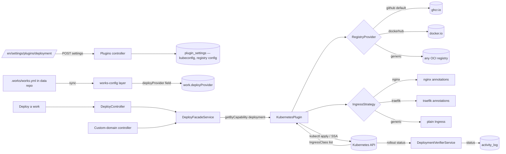

# Implementation Plan: Kubernetes Deployment Plugin

> Translates the approved [`./spec.md`](./spec.md) into architecture and tech-choices.
> The plan owns implementation details; the spec owns behaviour.

**Feature ID**: `k8s-deployment`
**Spec**: `./spec.md`
**Tasks**: `./tasks.md`
**Status**: `Done`
**Last updated**: 2026-05-05

---

## 1. Architecture Summary



**Key principle**: The plugin is the only file in the repo that knows the word "kubectl". The deploy facade and deploy service stay capability-driven. Registry kinds and ingress controllers are both strategy-registry extension points — adding a new one is a code addition inside the plugin, not a contract change.

## 2. Tech Choices

| Concern            | Choice                                                                                                                                                                                                    | Rationale                                                                                                                                                                       |
| ------------------ | --------------------------------------------------------------------------------------------------------------------------------------------------------------------------------------------------------- | ------------------------------------------------------------------------------------------------------------------------------------------------------------------------------- |
| Cluster client     | `@kubernetes/client-node` ^1.0                                                                                                                                                                            | Official client; supports kubeconfig parsing, exec auth, in-cluster auth, watches. Same library NestJS Terminus uses.                                                           |
| YAML parsing       | `js-yaml` ^4                                                                                                                                                                                              | Already a transitive dep across the monorepo; minimal footprint; safe-load by default.                                                                                          |
| Image build & push | GitHub Actions `docker/build-push-action@v6` running inside the website-template repo                                                                                                                     | Mirrors Vercel's "workflow-dispatch from website repo" pattern; no Ever Works compute. (Decision **D1** in spec §8.)                                                            |
| Default registry   | **GitHub Container Registry** (`ghcr.io/<owner>`) authenticated via the workflow's `GITHUB_TOKEN` (push) and the GitHub plugin's stored credentials (cluster pull-secret)                                 | Zero configuration for users who already authenticated GitHub; image lives next to the source repo; same auth surface as the existing `git-provider` plugin. (Decision **D2**.) |
| Other registries   | `dockerhub` (username + PAT) and `generic` (server URL + creds) ship in v1; future kinds (ECR/GCR/ACR) plug in via the same `RegistryProvider` interface                                                  | Covers self-hosted Harbor, Quay, GitLab CR, and the major clouds in one abstraction.                                                                                            |
| Registry strategy  | Discriminated union `RegistryConfig` + `RegistryProvider` interface returning `{ imageBase, dockerLogin(workflow), pullSecret(cluster) }`                                                                 | Single extension point for new kinds; deploy code never branches on `kind`.                                                                                                     |
| Manifest rendering | Hand-written TypeScript renderer producing typed JS objects (no Helm, no string templates)                                                                                                                | Strong typing; testable as pure functions; no runtime template engine.                                                                                                          |
| Apply strategy     | Server-Side Apply (SSA) with `fieldManager: 'ever-works-k8s-plugin'`                                                                                                                                      | Idempotent, conflict-aware, lets users hand-edit fields the plugin doesn't own.                                                                                                 |
| Ingress detection  | Probe `IngressClass` resources via `NetworkingV1Api.listIngressClass()` during `validateConnection`, parse `spec.controller`, mark which classes have a built-in `IngressStrategy`                        | One round-trip; user-visible result; covers the "multiple controllers in one cluster" scenario. (Decision **D3**.)                                                              |
| Ingress strategy   | Strategy-registry keyed on the controller string (`k8s.io/ingress-nginx`, `traefik.io/ingress-controller`, …) with a `generic` fallback                                                                   | Same extension-point pattern as registries; new strategy = new module + map entry.                                                                                              |
| Status polling     | Existing `DeploymentVerifierService` calling `plugin.getDeploymentStatus()`                                                                                                                               | Reuses Vercel's pattern; no new background infrastructure.                                                                                                                      |
| Works-config field | Add optional `deployProvider: string` to `WorksConfig` shape in `packages/agent/src/works-config/services/works-config.service.ts`; works-config layer dispatches the value through the lifecycle service | Single change benefits k8s, Vercel, and future plugins. (Decision **D4**.)                                                                                                      |
| Build tooling      | tsup (CJS+ESM), tsc for `--noEmit` type-check, Vitest, mirroring `packages/plugins/vercel/`                                                                                                               | Consistency with sibling plugin.                                                                                                                                                |
| Secret encryption  | Existing plugin-settings store with `x-secret: true`                                                                                                                                                      | No new crypto code.                                                                                                                                                             |

## 3. Data Model

### New entities

**None.** This feature is intentionally schema-free; it reuses:

- `plugin_settings` rows (key `'k8s'`, scope `'user'`) for kubeconfig + registry creds.
- `custom_domains` rows (already provider-agnostic per `custom-domains` spec FR-8).
- `works.deployProvider` — already a free-form string column accepting `'vercel'` or `'k8s'`.

### Migrations

**None required.** Confirms Constitution Principle V (forward-only) trivially.

### DTOs / contracts

No additions to `@ever-works/contracts`. The plugin's settings shape is private to the plugin and exposed only via its `settingsSchema` (JSON Schema), which the existing plugins API already serves generically.

The internal plugin types live in `packages/plugins/k8s/src/types.ts`:

```ts
export interface KubernetesSettings {
	kubeconfig?: string; // YAML (secret)
	kubeContext?: string; // override current-context
	namespace?: string; // default 'ever-works'
	registry?: RegistryConfig; // discriminated; default { kind: 'github' }
	ingressClass?: string; // e.g. 'nginx'
	ingressHost?: string; // default host (per-domain hosts come from custom_domains)
	tlsIssuer?: string; // cert-manager ClusterIssuer name
	replicas?: number; // default 1
}

export type RegistryConfig =
	| { kind: 'github'; owner?: string; visibility?: 'auto' | 'public' | 'private' }
	| { kind: 'dockerhub'; username: string; password: string }
	| { kind: 'generic'; server: string; username: string; password: string };

// Resolved visibility used at deploy time when the user picks `auto`:
//   - read work.websiteRepoVisibility via the GitHub plugin
//   - public repo  → 'public'
//   - private repo → 'private'

export interface KubernetesClusterInfo {
	clusterName: string;
	serverUrl: string;
	serverVersion: string;
	serverFingerprint: string; // sha256 of CA bundle, for activity-log identity
	ingressClasses: IngressClassDescriptor[];
}

export interface IngressClassDescriptor {
	name: string; // metadata.name
	controller: string; // spec.controller
	isDefault: boolean; // ingressclass.kubernetes.io/is-default-class
	hasStrategy: boolean; // built-in strategy available
}
```

### Works-config addition

Add `deployProvider?: string` to the `WorksConfig` Zod/interface schema in
[`packages/agent/src/works-config/services/works-config.service.ts`](../../../../packages/agent/src/works-config/services/works-config.service.ts) and to
[`packages/agent/src/works-config/works-config-data.ts`](../../../../packages/agent/src/works-config/works-config-data.ts) projection. The value is validated against `DeployFacadeService.getAvailableProviders()` at sync time and applied to `work.deployProvider` via the existing `WorkLifecycleService.update()` path.

## 4. API Surface

**No new endpoints.** Every k8s-related interaction reuses existing endpoints:

| Method              | Endpoint                                        | Description                                                                      | Status   |
| ------------------- | ----------------------------------------------- | -------------------------------------------------------------------------------- | -------- |
| `GET`               | `/api/plugins?category=deployment`              | Lists all deploy plugins; now returns Kubernetes too                             | Existing |
| `GET`               | `/api/plugins/k8s`                              | Plugin manifest + settings schema                                                | Existing |
| `POST`              | `/api/plugins/k8s/settings`                     | Save settings; runs `validateConnection()`                                       | Existing |
| `POST`              | `/api/plugins/k8s/validate-connection`          | Explicit connection test                                                         | Existing |
| `GET`               | `/api/deploy/providers`                         | Lists deploy providers; includes `k8s`                                           | Existing |
| `GET`               | `/api/deploy/providers/k8s/configured?userId=…` | Whether the user has a kubeconfig                                                | Existing |
| `POST`              | `/api/deploy/works/:id`                         | Deploy a work; resolves to `KubernetesPlugin` when `work.deployProvider = 'k8s'` | Existing |
| `GET\|POST\|DELETE` | `/api/deploy/works/:id/domains[…]`              | Domain CRUD; routes through `KubernetesPlugin.addDomain/...`                     | Existing |

**Auth**: same JWT or API-key auth as the existing deploy controller; work-edit permission required for mutations.
**Rate limit**: existing tier; deploy endpoint already throttled per-user.

## 5. Plugin Surface

### New plugin

`packages/plugins/k8s/` — sibling to `packages/plugins/vercel/`.

```
packages/plugins/k8s/
├── package.json                # everworks.plugin metadata, deps on @kubernetes/client-node, js-yaml
├── tsconfig.json
├── tsup.config.ts
├── vitest.config.ts
├── README.md                   # plugin-level developer notes
└── src/
    ├── index.ts                # exports KubernetesPlugin (default), public types, registry/ingress registries
    ├── types.ts                # KubernetesSettings, RegistryConfig, IngressClassDescriptor, …
    ├── k8s.plugin.ts           # IPlugin + IDeploymentPlugin implementation
    ├── kubeconfig.parser.ts    # parseAndValidate(yaml) -> { config, currentContext, server, ... }
    ├── k8s-api.service.ts      # Wraps @kubernetes/client-node clients (versions, deployments, ingressclasses, ssa)
    ├── ingress/
    │   ├── strategy.ts         # IngressStrategy interface + selectStrategy(controller)
    │   ├── strategy.registry.ts# Map<string, IngressStrategy>; register(controller, strategy)
    │   ├── nginx.strategy.ts   # k8s.io/ingress-nginx → annotations
    │   ├── traefik.strategy.ts # traefik.io/ingress-controller → annotations
    │   └── generic.strategy.ts # fallback
    ├── registries/
    │   ├── provider.ts         # RegistryProvider interface
    │   ├── provider.registry.ts# Map<RegistryKind, RegistryProvider>; register(kind, provider)
    │   ├── github.provider.ts  # GHCR; pulls owner from GitHub plugin context
    │   ├── dockerhub.provider.ts
    │   └── generic.provider.ts
    ├── manifest.renderer.ts    # buildDeployment/Service/Ingress/ImagePullSecret pure functions
    ├── domain.handler.ts       # addDomain/removeDomain/verifyDomain → ingress patches + DNS guidance
    ├── status.mapper.ts        # rollout state → DeploymentResult.status
    ├── errors.ts               # K8sPluginError + scrubError(unknown): SafeError
    └── __tests__/
        ├── k8s.plugin.spec.ts
        ├── kubeconfig.parser.spec.ts
        ├── manifest.renderer.spec.ts
        ├── domain.handler.spec.ts
        ├── status.mapper.spec.ts
        ├── errors.spec.ts
        ├── ingress/
        │   ├── nginx.strategy.spec.ts
        │   ├── traefik.strategy.spec.ts
        │   ├── generic.strategy.spec.ts
        │   └── strategy.registry.spec.ts
        ├── registries/
        │   ├── github.provider.spec.ts
        │   ├── dockerhub.provider.spec.ts
        │   ├── generic.provider.spec.ts
        │   └── provider.registry.spec.ts
        └── fixtures/                # sample kubeconfigs, sample rollout status payloads
```

### Plugin metadata (`package.json`)

```json
{
	"name": "@ever-works/k8s-plugin",
	"version": "1.0.0",
	"everworks": {
		"plugin": {
			"id": "k8s",
			"name": "Kubernetes",
			"category": "deployment",
			"capabilities": ["deployment"],
			"description": "Deploy works to a Kubernetes cluster",
			"builtIn": true,
			"systemPlugin": true,
			"autoEnable": true,
			"visibility": "user-only"
		}
	}
}
```

Notably **no `defaultForCapabilities`** — Vercel keeps that role; users opt into k8s explicitly.

### Settings schema (truncated)

```ts
{
  type: 'object',
  properties: {
    kubeconfig:    { type: 'string', title: 'kubeconfig', 'x-secret': true, 'x-scope': 'user', 'x-widget': 'textarea' },
    kubeContext:   { type: 'string', title: 'Context (optional)', description: 'Defaults to kubeconfig current-context.' },
    namespace:     { type: 'string', title: 'Namespace', default: 'ever-works' },

    registry: {
      type: 'object',
      title: 'Container registry',
      default: { kind: 'github' },
      'x-discriminator': 'kind',                  // tells the UI which sub-form to render
      oneOf: [
        {
          title: 'GitHub Container Registry (default)',
          properties: {
            kind:       { const: 'github' },
            owner:      { type: 'string', title: 'GitHub owner', description: 'Defaults to your connected GitHub account.' },
            visibility: {
              type: 'string',
              enum: ['auto', 'public', 'private'],
              default: 'auto',
              title: 'Image visibility',
              description: 'auto = match the website repo (public repo → public image, private repo → private image).'
            }
          }
        },
        {
          title: 'Docker Hub',
          properties: {
            kind:     { const: 'dockerhub' },
            username: { type: 'string', title: 'Docker Hub username' },
            password: { type: 'string', title: 'Access token', 'x-secret': true, 'x-scope': 'user', 'x-widget': 'password' }
          },
          required: ['username', 'password']
        },
        {
          title: 'Generic registry',
          properties: {
            kind:     { const: 'generic' },
            server:   { type: 'string', title: 'Server URL', description: 'e.g. registry.example.com' },
            username: { type: 'string', title: 'Username' },
            password: { type: 'string', title: 'Password', 'x-secret': true, 'x-scope': 'user', 'x-widget': 'password' }
          },
          required: ['server', 'username', 'password']
        }
      ]
    },

    ingressClass: {
      type: 'string',
      title: 'Ingress class',
      description: 'Detected at validation time. Leave blank to use the cluster default.',
      'x-widget': 'select',
      'x-options-from': 'validateConnection.details.ingressClasses[].name'
    },
    ingressHost:  { type: 'string', title: 'Default ingress host (optional)' },
    tlsIssuer:    { type: 'string', title: 'cert-manager issuer (optional)' },
    replicas:     { type: 'integer', title: 'Replicas', default: 1, minimum: 1, maximum: 10 }
  },
  required: ['kubeconfig']                        // registry has a default; namespace defaults; rest optional
}
```

`x-discriminator` and `x-options-from` are new UI hints described in the JSON-schema extensions doc; both follow the existing `x-*` pattern (additive, optional).

### Plugin class skeleton

```ts
export class KubernetesPlugin implements IPlugin, IDeploymentPlugin {
  readonly id = 'k8s';
  readonly name = 'Kubernetes';
  readonly version = '1.0.0';
  readonly category: PluginCategory = 'deployment';
  readonly capabilities = ['deployment'] as const;
  readonly providerName = 'kubernetes';
  readonly configurationMode = 'user-required' as const;
  readonly settingsSchema: JsonSchema = /* see above */;

  private api = new KubernetesApiService();

  async validateConnection(settings: Record<string, unknown>): Promise<ConnectionValidationResult> { /* parse + getServerVersion */ }
  async validateToken(token: string): Promise<boolean> { /* token here = kubeconfig string */ }
  async deploy(config, kubeconfig): Promise<DeploymentResult> { /* SSA + rollout */ }
  async getDeploymentStatus(deploymentId, kubeconfig): Promise<DeploymentResult> { /* read Deployment status */ }
  async listProjects(kubeconfig): Promise<DeploymentProject[]> { /* list namespaces with our label */ }
  async getDomains(projectId, kubeconfig, _scope): Promise<DeploymentDomain[]> { /* read Ingress hosts */ }
  async addDomain(projectId, domain, kubeconfig): Promise<AddDomainResult> { /* patch Ingress; return CNAME guidance */ }
  async removeDomain(projectId, domain, kubeconfig): Promise<boolean> { /* patch Ingress */ }
  async verifyDomain(projectId, domain, kubeconfig): Promise<DeploymentDomain> { /* DNS lookup + Ingress check */ }
  async getTeams(_kubeconfig): Promise<Array<...>> { return []; /* k8s has no "teams" */ }
  async lookupExistingDeployment(projectName, kubeconfig): Promise<{...}> { /* find Deployment by label */ }
  async onLoad(ctx): Promise<void> { /* logger init */ }
  async healthCheck(): Promise<PluginHealthCheck> { /* always healthy; cluster reachability is per-token */ }
  getManifest(): PluginManifest { /* see icon, readme, uiHints below */ }
}
```

**Token semantics**: `IDeploymentPlugin` accepts a `token: string` for most methods; for the k8s plugin this string is the **kubeconfig YAML**. The deploy facade resolves it via plugin-settings just like it resolves Vercel's API token, so no facade changes are needed.

### Registry & ingress strategy registries

Both registries follow the same shape:

```ts
// registries/provider.ts
export interface RegistryProvider {
	readonly kind: RegistryConfig['kind'];
	imageBase(config: RegistryConfig, ctx: { workSlug: string; githubOwner?: string }): string;
	workflowLogin(config: RegistryConfig, ctx: WorkflowCtx): WorkflowLoginStep[];
	pullSecret(config: RegistryConfig, ctx: ClusterCtx): V1Secret | null;
}

// ingress/strategy.ts
export interface IngressStrategy {
	readonly controller: string; // matches IngressClass.spec.controller
	annotations(input: IngressInput): Record<string, string>;
	tlsSection(input: IngressInput): V1IngressTLS[];
}
```

Default registrations live in `index.ts` and are immutable for the plugin's own use; the registries also expose a `register()` method so external code (e.g. an enterprise plugin) could register additional kinds without forking. v1 ships:

- Registries: `github` (default), `dockerhub`, `generic`.
- Ingress strategies: `k8s.io/ingress-nginx`, `traefik.io/ingress-controller`, plus a `generic` fallback selected when no controller match.

### Existing facade changes

**Two small, additive changes** required so the deploy controller can stay capability-driven instead of growing an `if (provider === 'k8s')` branch:

1. **Extend `IDeploymentPlugin`** in `packages/plugin/src/contracts/capabilities/deployment.interface.ts` with two OPTIONAL methods:

    ```ts
    /** Workflow filenames to try in order when dispatching a deploy. Defaults to ['deploy_prod.yaml']. */
    getWorkflowFilenames?(): string[];
    /** Extra GitHub Actions secrets to push to the website repo before dispatch.
     *  Keys are secret names (uppercase), values are the secret values. Called server-side only. */
    getDeploymentSecrets?(settings: Record<string, unknown>): Promise<Record<string, string>>;
    ```

    Both are optional — every existing plugin (Vercel) keeps working with no change.

2. **Update `DeployService.dispatchWithRetry`** in `apps/api/src/plugins-capabilities/deploy/deploy.service.ts:248` to:
    - Replace the hardcoded `['deploy_vercel.yaml', 'deploy_prod.yaml']` with `plugin.getWorkflowFilenames?.() ?? ['deploy_prod.yaml']`.
    - In `setRequiredSecrets` (line 204), after the existing block, call `plugin.getDeploymentSecrets?.(settings)` and push each entry through `setSecret`.

For Vercel, `getWorkflowFilenames()` returns `['deploy_vercel.yaml', 'deploy_prod.yaml']` (preserves today's behaviour). For Kubernetes, it returns `['deploy_k8s.yaml']` and `getDeploymentSecrets` returns the registry-kind-conditional secrets (`REGISTRY_USERNAME`/`REGISTRY_PASSWORD`/`REGISTRY_SERVER`, `K8S_NAMESPACE`, `K8S_INGRESS_CLASS`, etc.). The kubeconfig itself flows through the existing `<PROVIDER>_TOKEN` pattern — `setRequiredSecrets` already pushes `K8S_TOKEN = <kubeconfig YAML>` because of `setSecret(ctx, '\${provider.toUpperCase()}_TOKEN', deployToken)` (line 217).

This is the cleanest extension: zero hardcoded plugin ids in the deploy service, and the changes ship in the same PR as the k8s plugin so existing behaviour is preserved on a single commit.

### GitHub plugin coupling

When `registry.kind = 'github'`, the k8s plugin reads the user's GitHub identity from the GitHub plugin's already-stored OAuth/PAT to:

1. Resolve the default `owner` (their GitHub login or selected org).
2. Resolve the **effective image visibility** when the user leaves `visibility = 'auto'`:
    - Call the existing GitHub plugin method `getRepository(owner, repo, token)` (defined in [`packages/plugins/github/src/github.plugin.ts:116`](../../../../packages/plugins/github/src/github.plugin.ts) and returning `{ isPrivate: boolean, ... }`).
    - `isPrivate === false` → public image (no pull secret); `isPrivate === true` → private image (pull secret).
3. **Only when a private image is needed**, mint or reuse a token scoped for `read:packages` to populate the cluster `imagePullSecret`. Public images need no pull secret at all, so this step is skipped — closing FR-21.

The interaction goes through `PluginContext.getService('github')` (existing pattern) — the k8s plugin does NOT import `@ever-works/github-plugin` directly. If the GitHub plugin is not loaded or not authenticated, `validateConnection` returns `success: false` with a "connect GitHub first" message and a `setupLink` to the GitHub plugin (FR-14).

### Cluster scope (one per user/tenant)

Plugin settings live in the existing `plugin_settings` row keyed by `(pluginId='k8s', userId)` with `x-scope: 'user'` — identical to Vercel's `apiToken` storage. There is no separate `kubernetes_clusters` table, no per-work cluster column, and no per-namespace overrides. All works owned by a user that have `deployProvider = 'k8s'` deploy to the same cluster, into namespaces derived from the plugin's `namespace` setting.

If a future requirement emerges for "different clusters per work", it would be additive: a new `cluster?` field on the work plus a `KubernetesClusterRef` table, behind a feature flag. **Not in v1 scope** (FR-23, decision D6).

### Ingress detection caching

`validateConnection()` lists `IngressClass` resources on every call (FR-24, decision D3). The K8s API list call is fast on healthy clusters (single round-trip, small payload). If profiling at the §4 P95 budget shows it exceeds 3 s, the follow-up is a small per-`(userId, clusterFingerprint)` in-memory cache with a 60 s TTL inside `KubernetesApiService`. Not implemented in v1.

### Works-config plumbing

Single change in `packages/agent/src/works-config/services/works-config.service.ts`:

```ts
export interface WorksConfig {
	// … existing fields …
	deployProvider?: string; // new
}
```

Validation lives in `WorksConfigImportApplierService` (or a sibling): on apply, look up the deploy facade, check `getAvailableProviders().some(p => p.id === cfg.deployProvider)`. If yes, dispatch through `WorkLifecycleService.update({ deployProvider })` (the lifecycle service already validates this, see `apps/api/.../work-lifecycle.service.ts:184`). If no, push an `import_error` event and skip without touching the work.

This is provider-agnostic — Vercel benefits from it on day one too (FR-19).

### Vercel parity check

| Method                     | Vercel                  | Kubernetes                                                |
| -------------------------- | ----------------------- | --------------------------------------------------------- |
| `validateToken`            | `getAuthUser()`         | `getServerVersion()`                                      |
| `getTeams`                 | Vercel teams API        | returns `[]` (no concept)                                 |
| `listProjects`             | Vercel projects API     | namespaces filtered by label `ever-works.io/managed=true` |
| `lookupExistingDeployment` | search projects by name | find `Deployment` by label `ever-works.io/work-id=<id>`   |
| `getDeploymentStatus`      | poll Vercel             | read Deployment rollout status                            |
| `addDomain`                | Vercel domains API      | patch Ingress hosts                                       |
| `verifyDomain`             | Vercel DNS verification | resolve CNAME/A; check it points to Ingress LB            |

### Vercel-side changes shipping in this feature

Two small Vercel changes ride along, both of them parity work:

1. **Implement the new optional `IDeploymentPlugin.getWorkflowFilenames()` and `getDeploymentSecrets()` methods** on the Vercel plugin so that current behaviour is preserved when `DeployService` switches from a hardcoded list to `plugin.getWorkflowFilenames()`. Vercel returns `['deploy_vercel.yaml', 'deploy_prod.yaml']` and an empty `getDeploymentSecrets()`. (Tasks T24a/T24b.)
2. **`.works/works.yml` carrying `deployProvider: vercel`** now sets `work.deployProvider = 'vercel'` on sync — Vercel needs no code change for this; only the works-config tests are extended with a vercel case. (Task T6b.)

## 6. Web / CLI Surface

### Web

**No code changes** — the existing `apps/web/src/app/[locale]/(dashboard)/settings/plugins/[category]/page.tsx` is data-driven by `category` and renders any plugin with `category = 'deployment'`. The plugin's `settingsSchema` with `x-widget: 'textarea'` produces the kubeconfig text area automatically.

**Optional polish** (not required for v1):

- Custom UI hint `uiHints.helpLinks: [{ url: 'https://kubernetes.io/docs/tasks/access-application-cluster/configure-access-multiple-clusters/', label: 'How to get a kubeconfig' }]`.
- A "Test connection" button calling `POST /api/plugins/k8s/validate-connection` that streams the server version back.
- Rendering the "Connected to cluster X" details on the card after successful validation.

These polishes can ship in a follow-up PR; the spec acceptance criteria do not require them.

### CLI

`apps/cli/src/commands/work/deploy.ts` already accepts `--provider` from `work.deployProvider`; no new commands needed. `ever-works work deploy --provider k8s` works once the plugin is registered.

### MCP

No new MCP tools.

## 7. Background Jobs

**No new Trigger.dev tasks.** Status polling reuses `DeploymentVerifierService`, which already calls `plugin.getDeploymentStatus()` via the facade.

| Trigger                      | When                                       | What it does                                                        | Idempotency               |
| ---------------------------- | ------------------------------------------ | ------------------------------------------------------------------- | ------------------------- |
| existing `deployment-verify` | every 30 s after deploy starts, max 30 min | Calls `KubernetesPlugin.getDeploymentStatus()` to map rollout state | Status query is read-only |

## 8. Security & Permissions

- **Endpoints**: same auth/permission rules as Vercel. No new `@Public()` endpoints.
- **Settings access**: `kubeconfig`, `imageRegistryPassword` are `x-secret: true`, `x-scope: 'user'` — never returned by `GET /api/plugins/k8s/settings`.
- **Error scrubbing**: `errors.ts` exports `scrubError(e)` that removes:
    - The kubeconfig YAML string entirely (matched by `apiVersion: v1\nkind: Config`).
    - Any `Authorization: Bearer …` headers.
    - Client-cert PEM blocks (`-----BEGIN CERTIFICATE-----` … `-----END CERTIFICATE-----`).
    - Registry password substrings.
- **Workflow runner**: when the GitHub Actions workflow uses the kubeconfig, it writes it via `mktemp -d` and deletes the directory in a `finally`-equivalent step. Never `echo $KUBECONFIG`.
- **Activity log**: events carry only `{ workId, namespace, clusterFingerprint }`. Cluster fingerprint is `sha256(server URL + CA fingerprint)[:16]` — non-reversible cluster identity.
- **Image registry**: passwords pushed to user's GitHub repo as encrypted Actions secrets (existing `setRequiredSecrets` mechanism).

## 9. Observability

| Event                           | When                             | Fields                                                          |
| ------------------------------- | -------------------------------- | --------------------------------------------------------------- |
| `deployment_started`            | Plugin's `deploy()` enters       | `provider=k8s, workId, namespace, clusterFingerprint, imageTag` |
| `deployment_image_pushed`       | After image push step            | `imageTag, registry`                                            |
| `deployment_applied`            | After SSA apply                  | `manifests=[deployment,service,ingress?]`                       |
| `deployment_succeeded`          | Rollout reaches `available`      | `durationMs, url`                                               |
| `deployment_failed`             | Rollout fails or any step errors | `step, error (scrubbed)`                                        |
| `domain_added/verified/removed` | per `custom-domains` spec        | already wired                                                   |

Sentry tags: `provider:k8s`, `clusterId:<fingerprint>`, `step:<image-build|push|apply|rollout|domain>`. No metric dashboards required for v1; rollout failures already raise Sentry events.

## 10. Phased Rollout

1. **Phase 1 — Plugin scaffold + works-config field (PR #1)**: package, `IPlugin`/`IDeploymentPlugin` shells with stubs that throw `NotImplementedError`; **and** the `deployProvider` works-config field (provider-agnostic, validated against the deploy facade). Plugin discoverable; appears in UI as "Coming soon" (visibility = `'hidden'`).
2. **Phase 2 — Settings & connection (PR #2)**: kubeconfig parser, ingress detection, `validateConnection()` returning the IngressClass list, settings schema, registry-strategy registry with `github`/`dockerhub`/`generic`. UI shows the form; save+verify works against any cluster. `visibility = 'user-only'` flips on.
3. **Phase 3 — Deploy & status (PR #3)**: manifest renderer, ingress-strategy registry, SSA apply, `deploy()`, `getDeploymentStatus()`. End-to-end deploy works against kind in CI.
4. **Phase 4 — Domains (PR #4)**: `addDomain/removeDomain/verifyDomain` against Ingress; integrates with the `custom-domains` controller.
5. **Phase 5 — Workflow YAML in templates (PR #5)**: ship `deploy_k8s.yaml` + Dockerfile + manifests folder in `directory-web-template` and `directory-web-minimal-template`. Workflow generates `docker login` from the registry strategy and uses the matching apply flow.
6. **Phase 6 — Docs & default-on (PR #6)**: user-facing docs, `built-in-plugins.md`, demo video link, blog post draft. No feature flag — discovery is automatic.

Phases 1–4 ship behind `visibility: 'hidden'` so we can land them gradually without a half-broken UI.

## 11. Risks & Mitigations

| Risk                                                                                                 | Likelihood                    | Impact   | Mitigation                                                                                                                            |
| ---------------------------------------------------------------------------------------------------- | ----------------------------- | -------- | ------------------------------------------------------------------------------------------------------------------------------------- |
| Kubeconfig with `exec` plugin (e.g. `aws-iam-authenticator`) won't work in headless workflow runners | Medium                        | High     | Detect `users[].user.exec` at parse time; warn in `validateConnection`; document static-token alternative.                            |
| Cluster behind private VPN; workflow runner can't reach API                                          | High for self-hosted clusters | High     | Document tailscale/wireguard sidecar pattern; offer optional self-hosted GitHub Actions runner instructions.                          |
| Image registry rate limits during heavy deploys                                                      | Low                           | Medium   | Use deterministic tag → cache hits; document Docker Hub auth for private pulls.                                                       |
| Server-side apply field-manager conflicts when users hand-edit Deployments                           | Medium                        | Low      | Document our field manager; surface SSA conflict errors verbatim; users can `kubectl apply --force-conflicts` to take ownership back. |
| Kubeconfig leaks in logs from a future maintainer                                                    | Medium                        | Critical | `errors.ts` scrubber + a Vitest test that asserts every code path runs through it.                                                    |
| Rolling update gets stuck because new pod doesn't pass readiness probe                               | Medium                        | Medium   | Map "progressing for > N minutes" to `error` with a specific message; don't hang the deploy facade indefinitely.                      |
| GHCR default surprises users who don't want public images                                            | Low                           | Medium   | Default `visibility: 'private'` and surface the resulting image URL in the UI before first deploy.                                    |
| Ingress detection misses a vendor controller (e.g. AWS Load Balancer Controller)                     | Medium                        | Low      | Generic strategy still produces a working Ingress; document how to add a strategy in `packages/plugins/k8s/src/ingress/README.md`.    |
| works-config and dashboard disagree on `deployProvider`                                              | Medium                        | Medium   | Source-of-truth = data repo (Principle III); log a conflict event so users can spot drift.                                            |

## 12. Constitution Reconciliation

- **Principle I — Plugin-first**: ✅ new plugin package, no core changes.
- **Principle II — Capability-driven**: ✅ deploy facade resolves by capability; no `if (provider === 'k8s')` branches.
- **Principle III — Source-of-truth repos**: ✅ website source repo unchanged; manifests are derived state.
- **Principle IV — Trigger.dev**: ✅ status polling reuses existing `DeploymentVerifierService`.
- **Principle V — Forward-only migrations**: ✅ no schema changes.
- **Principle VI — Tests**: ✅ every FR has a test (see `tasks.md` Phase 7).
- **Principle VII — Secret hygiene**: ✅ `x-secret` on kubeconfig and registry password; explicit `scrubError`.
- **Principle VIII — Plugin counts**: ✅ `docs/plugin-system/built-in-plugins.md` updated in T22.
- **Principle IX — Behaviour-first**: ✅ this plan is the implementation doc; spec is behaviour-only.
- **Principle X — Backwards-compat**: ✅ `IDeploymentPlugin` unchanged; Vercel unchanged; existing works unaffected.

## 13. References

- Spec: [`./spec.md`](./spec.md)
- Tasks: [`./tasks.md`](./tasks.md)
- Sibling plugin: `packages/plugins/vercel/`
- Capability contract: `packages/plugin/src/contracts/capabilities/deployment.interface.ts`
- Deploy facade: `packages/agent/src/facades/deploy.facade.ts:163`
- Deploy service: `apps/api/src/plugins-capabilities/deploy/deploy.service.ts:45`
- Web settings page: `apps/web/src/app/[locale]/(dashboard)/settings/plugins/[category]/page.tsx`
- `@kubernetes/client-node`: https://github.com/kubernetes-client/javascript
- Server-Side Apply: https://kubernetes.io/docs/reference/using-api/server-side-apply/
- Related feature: [`../custom-domains/spec.md`](../custom-domains/spec.md)
