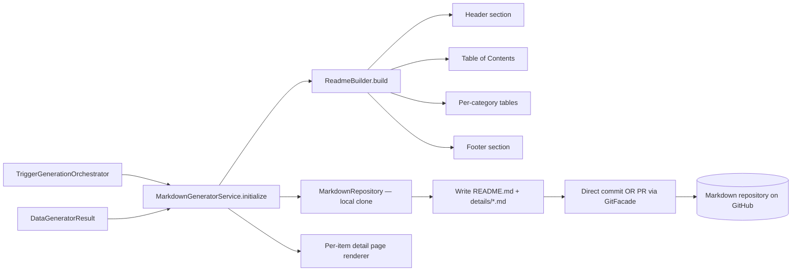

# Implementation Plan: Markdown Generator

**Feature ID**: `markdown-generator`
**Spec**: `./spec.md`
**Tasks**: `./tasks.md`
**Status**: `Done` (Retrospective)
**Last updated**: 2026-05-02

---

## 1. Architecture



The markdown generator runs **after** the data generator inside the
same Trigger.dev `directory-generation` task. It transforms the
structured items + taxonomy from the data repository into a
human-readable repo (README + per-item detail pages) suitable for
GitHub display.

## 2. Tech Choices

| Concern                     | Choice                                                     | Rationale                                                                  |
| --------------------------- | ---------------------------------------------------------- | -------------------------------------------------------------------------- |
| Working tree                | Local clone via `isomorphic-git`                           | Same toolchain as data-generator; no system git binary in worker container |
| Build approach              | String concatenation in `ReadmeBuilder`                    | No template engine — output shape is well-known and small                  |
| Header/footer customization | Per-directory `readmeConfig` (overwrite or prepend/append) | Lets users brand the directory without forking the generator               |
| Item ordering               | Featured first → `order` field → alphabetical              | Stable, predictable, user-controllable via `featured` and `order`          |
| Detail-page format          | Title + description + overview + links + tags              | Matches what GitHub renders well; no layout-only JS                        |
| Repository init             | Auto-create on first run if missing                        | Lowers onboarding friction; gated by Git provider permissions              |
| Reset before write          | `resetFiles()` clears generated content, keeps `.git`      | Prevents stale files lingering after slug renames or removals              |
| Commit strategy             | Direct push **or** PR per directory setting                | Mirrors data-generator behaviour                                           |

## 3. Data Model

No platform-database state; the markdown generator's persistent
output is the **markdown repository on GitHub**:

```text
{owner}/{directory-slug}/
├── README.md           # Top-level directory listing (header → TOC → category tables → footer)
├── details/            # One markdown file per item (filename = slug)
│   ├── tool-a.md
│   └── tool-b.md
└── LICENSE             # Auto-generated on first init
```

Inputs: the `DataGeneratorResult` (items + categories + tags) and
the `Directory.readmeConfig` field for header/footer customization.

## 4. API Surface

No public HTTP surface. The markdown generator is invoked from
`TriggerGenerationOrchestrator.run` after `DataGeneratorService.initialize`
returns successfully and at least one item changed.

```ts
interface MarkdownGeneratorResult {
	success: boolean;
	prUpdate?: { branch: string; title: string; body: string; number: number; url: string };
	error?: string;
}
```

The orchestrator passes `pr_update` from the data generator down so
markdown changes land on the same PR branch (single PR per directory
update covers both data and markdown changes).

## 5. Plugin Surface

- **Git operations** route through `GitFacadeService`
  (`git-github` plugin by default).
- No AI, search, or extractor capabilities used at this stage —
  markdown generation is deterministic templating.

## 6. Web / CLI Surface

- The directory detail page exposes header / footer customization
  inputs that write to `Directory.readmeConfig`.
- Rendered README + detail pages are visible directly on GitHub —
  the markdown repository _is_ the user-facing artifact at this layer
  (the website generator builds a separate hosted view).

## 7. Background Jobs

Runs inside the Trigger.dev `directory-generation` task — not its own
task. Conditional on the data generator reporting at least one new
or updated item (no-op runs skip markdown generation entirely).

## 8. Security & Permissions

- Authorization is upstream — the trigger task only runs after
  ownership / role gates pass at the API layer.
- Writes the generator emits are deterministic and contain no
  secrets; user-supplied custom header/footer are stored on the
  directory entity and validated for length at the DTO layer.
- No new `@Public()` endpoints.

## 9. Observability

- `GenerationLogCollector` streams "markdown generation started" /
  "completed" log lines to the history row (visible in the
  recent-logs panel and the Trigger.dev dashboard).
- Activity log records markdown PR creation as part of the broader
  `directory_generation_completed` event.

## 10. Phased Rollout

Shipped pre-Spec-Kit; retrospective set documents production
behaviour. README header/footer customization landed later as an
additive change (no flag).

## 11. Risks & Mitigations

| Risk                                                        | Mitigation                                                                                 |
| ----------------------------------------------------------- | ------------------------------------------------------------------------------------------ |
| README diff churn on cosmetic-only re-runs                  | Builder produces identical output for identical input — diff is empty when nothing changed |
| Slug rename leaves a stale `details/<old-slug>.md`          | `resetFiles()` clears `details/` before rewriting; only current items remain               |
| Custom header includes Markdown that breaks the TOC anchors | Builder generates anchors from category names independently; user header is opaque         |
| Repo creation fails (provider permissions)                  | Surface as a structured error; data generator's commit succeeds independently              |
| Large directories (1000+ items) produce a multi-MB README   | Acceptable: GitHub renders multi-MB markdown; future change could split per-category       |

## 12. Constitution Reconciliation

- **I (Plugin-first)**: Git provider is a plugin (`git-github`)
- **II (Capability-driven)**: `GitProviderCapability` covers all writes
- **III (Source-of-truth repos)**: markdown repo is one of the two source-of-truth repos per directory
- **IV (Trigger.dev)**: runs inside the `directory-generation` Trigger.dev task
- **V (Forward-only migrations)**: no DB schema; markdown layout is additive
- **VI (Tests)**: unit tests cover ReadmeBuilder ordering / TOC / header-footer logic; e2e covers PR creation
- **VII (Secret hygiene)**: tokens flow through `GitFacade` only
- **VIII (Plugin counts)**: no new plugins
- **IX (Behaviour-first)**: spec describes the produced markdown shape
- **X (Backwards-compat)**: existing READMEs continue to render; layout changes are additive only

## 13. References

- Spec: `./spec.md`
- Implementation: `packages/agent/src/markdown-generator/markdown-generator.service.ts`,
  `packages/agent/src/markdown-generator/readme-builder.ts`,
  `packages/agent/src/markdown-generator/markdown-repository.ts`
- Adjacent specs: [`features/data-generator`](../data-generator/spec.md),
  [`features/website-generator`](../website-generator/spec.md)
- Architecture: [`architecture/pipeline-overview`](../../architecture/pipeline-overview.md)
