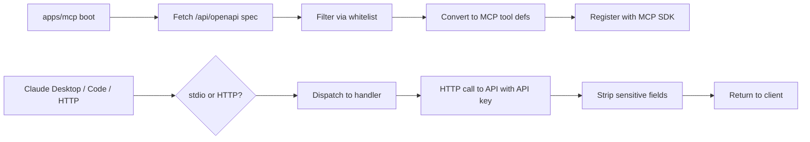

# Implementation Plan: MCP Server

**Feature ID**: `mcp-server`
**Spec**: `./spec.md`
**Status**: `Done` (Retrospective; ongoing as new tools are whitelisted)
**Last updated**: 2026-05-01

---

## 1. Architecture

## 2. Tech Choices

| Concern            | Choice                                | Rationale                                       |
| ------------------ | ------------------------------------- | ----------------------------------------------- |
| Server framework   | NestJS                                | Matches the rest of the monorepo                |
| MCP SDK            | `@modelcontextprotocol/sdk`           | First-party MCP implementation                  |
| Transport          | stdio + streamable-http               | Covers Claude Desktop, Code, and remote clients |
| Tool generation    | OpenAPI → tool defs at boot           | Single source of truth                          |
| Whitelist          | TypeScript array                      | Simple, type-checked                            |
| Response sanitiser | Field-name allowlist + key heuristics | Defence in depth on top of API-side stripping   |

## 3. Data Model

None — MCP server is stateless.

## 4. API Surface

The MCP server exposes the Model Context Protocol — not a REST API.
Tools are listed in [`spec.md`](./spec.md) §3 FR-10.

## 5. Plugin / Web / CLI

- Plugins: not directly exposed; downstream API uses plugins.
- Web: not applicable (MCP is for AI clients).
- CLI: `pnpm --filter ever-works-mcp start:stdio` or `:http`.

## 6. Background Jobs

None — every tool call is request/response. Long-running work runs on
the API side and the MCP server returns the dispatched job's
acknowledgement.

## 7. Security & Permissions

- Single static API key per MCP process.
- HTTP mode requires `Authorization: Bearer` on every request.
- Response sanitiser strips sensitive fields after the API call.
- 2-minute call timeout.

## 8. Observability

- Per-tool-call structured log line.
- Sentry for unhandled errors.

## 9. Risks & Mitigations

| Risk                                  | Mitigation                                         |
| ------------------------------------- | -------------------------------------------------- |
| Whitelist drift from API capabilities | Per-PR review of whitelist additions               |
| Sensitive field leak                  | Sanitiser + API-side `x-secret` (defence in depth) |
| Tool-call timeout abuse               | 2-minute cap; documented                           |
| API key compromise                    | Rotate via dashboard; revoke on key page           |

## 10. Constitution Reconciliation

See `spec.md` §9.

## 11. References

- Spec: `./spec.md`
- Implementation: `apps/mcp/`
