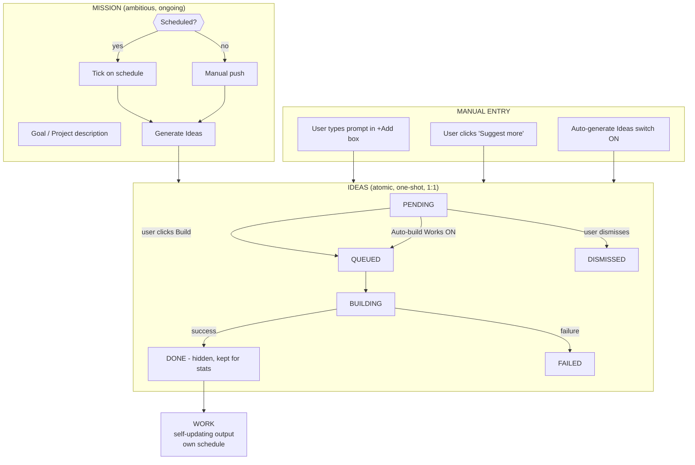

# Missions → Ideas → Works — Product Spec

**Status:** Draft v6 · **Owner:** Product (Ruslan) · **Date:** 2026-05-24
**Audience:** Product, Design, Engineering (frontend + backend + AI), AI Chat, Docs
**Internal codename (legacy):** "AI Generated Works" / "Workshop"
**Related code today:**
- `work_proposals` entity, `apps/api/src/work-proposals/*`, `packages/agent/src/user-research/*`
- Work Agent settings: `apps/api/src/work-agent/*`, `apps/web/src/components/settings/WorkAgentSettings.tsx`, `apps/web/src/app/[locale]/(dashboard)/settings/work-agent/page.tsx`, `apps/web/src/lib/api/work-agent.ts`, `apps/web/src/app/actions/settings/work-agent.ts`
- Budgets: `apps/api/src/budgets/*`, `packages/agent/src/entities/work-budget.entity.ts`, `packages/agent/src/entities/usage-ledger-entry.entity.ts`, `packages/agent/src/entities/plugin-usage-event.entity.ts`
- Templates: `apps/web/src/app/[locale]/(dashboard)/templates/page.tsx`, `apps/web/src/components/templates/TemplatesCatalog.tsx`

> Scope of this document: **product behavior** — concepts, UX, UI, flows, states, naming, AI Chat surface, dashboard surface. Implementation details are referenced where they constrain product behavior. The detailed phased execution plan lives in the sibling [PLAN doc](plan.md).
>
> **Hard rule:** This entire feature is an **extension**. Nothing currently shipping is being removed, rewritten, or significantly changed. The existing Work Agent settings page, the existing `work_proposals` pipeline, the existing `work_budgets` infra, the existing templates page, the existing `/works/new` page, and all existing creation entry points all stay; we add new surfaces and entities on top, and reuse the existing primitives as the plumbing underneath. Anywhere this spec proposes a change to existing UI, the change is **additive** (new section, new filter, new switch) or a **rename** of copy only — never a deletion of code paths. This rule is enforced project-wide by [Workspace AGENTS.md NN #20](file:///C:/Coding/Workspace/AGENTS.md) ("Feature/UX requests are ADDITIVE by default") — added 2026-05-24 in response to operator feedback during v3 iteration.

> **What changed v5 → v6 (this turn):**
> Six deferred items pulled INTO v1 (operator-confirmed). All additive, none replace existing surfaces.
> 1. **Mission Template manifest** — full schema defined at `.works/mission.yml` (NOT at repo root — operator: *"keep it under .works folder so humans also can review or build templates"*). Schema v1 covers: required `name`/`description`/`defaultPrompt`; optional `defaults` (type, cadence, outstandingIdeasCap, autoBuildWorks, guardrails, budget); optional `recommendedWorkTemplates`; optional `kb` (seedPaths, citationPolicy). Full schema in §7.5.
> 2. **Failed-Idea handling** — `Retry` button on FAILED Ideas (manual re-queue) + configurable **auto-retry policy** in Work Agent settings (system-classifies transient errors; user sets `maxAutoRetries` + `backoffSeconds` + `exponentialBackoffFactor`). Error message rendered inline on the Idea card (was just a status pill). See §3.9.
> 3. **Mission detail page extras** — adds (a) **activity timeline** component (vertical log of ticks / generations / builds / completions), and (b) **spend-over-time chart** (small line chart of monthly spend toward cap). Both live below the existing live-runs + Ideas + Works lists. See §4.3.
> 4. **Account-wide budget roll-up tile** on Dashboard — 6th stats tile showing total month-to-date spend across all Works + Ideas + Missions vs. global cap. New tile order: `[Missions] [Ideas] [Works] [Items] [Sites] [Spend]`. See §5.1.
> 5. **Re-build this DONE Idea** — explicit action on done Ideas (visible when Done filter chip is on). Creates a fresh `WorkAgentGoal` against the same Idea description; the new Work is created independent of the original. See §3.9.
> 6. **Mission Clone (Full Fork)** — new action on Mission Cards + Mission detail page. Clones metadata + KB contents + all Ideas (as new PENDING) + Works as read-only references panel. New Mission gets a fresh `<slug>-mission` repo seeded with the source's KB. See §4.4.
>
> **What changed v4 → v5 (last turn):**
> Four open architecture decisions resolved after a deep code-review pass against the live `C:/Coding/Ever Works/Code/platform` codebase. No product behavior changes — only implementation routing decisions that the PLAN now reflects concretely. Cross-referenced from spec §10.6:
>
> 1. **AI Chat tool surfaces — BOTH.** Phase 9 ships Mission/Idea verbs to both the web-side in-app chat (`apps/web/src/lib/ai/tools/` — adds tool() definitions alongside the existing `suggestWorks`/`webSearch`/`getUserInfo`) AND the MCP server (`apps/mcp/src/openapi-tools/whitelist.ts` — adds WHITELIST entries so external MCP clients like Claude Desktop / Cursor can drive Missions and Ideas). The MCP route is cheap because the new API endpoints already get `@ApiOperation` decorators from NestJS Swagger.
> 2. **Mission repo placement** — same org/account as the user's existing `<slug>-data` Work repos. Mission repo scaffolder reuses `gitFacade.createRepository()` (canonical signature at `packages/agent/src/ever-works-providers/ever-works-git.provider.ts:97`); zero new config or destination logic.
> 3. **Mission Template catalog source** — same pattern as Work Templates today (curated catalog + `+ Add custom Mission Template`). Phase 8 reuses whatever sources the Work Templates list; smallest divergence.
> 4. **Mission detail page Live Run** — renders a **list** of all in-flight runs for this Mission's child Ideas (one row per Idea-in-flight, each with its own `<LiveRun />` and `<LogList />`). Most informative for a Mission that may have several Ideas building concurrently.
>
> **What changed v3 → v4 (last turn):**
> - The unified `+ New` page lives at a **NEW route `/new`**, not at `/works/new`. The existing `/works/new` page and its content are **completely untouched** — same URL, same content, same labels, same flow. The new `/new` page is built fresh and reuses (not modifies) the existing three Work-creation block component. The sidebar `+ New Work` → `+ New` button now routes to `/new`. Direct deep-links to `/works/new` continue to work as today.
> - On `/new`, the three Work-creation blocks render with the "Work" suffix labels (Create Work with AI / Create Work Manually / Import Existing Work) — that's a render-time label set passed as props to the existing block component. On `/works/new` the labels stay exactly as today. **No existing page label changes.**
>
> **What changed v2 → v3:**
> 1. New §4.0 documents the global **`+ New`** entry page (sidebar button renamed from `+ New Work` to `+ New`). This is the **one main path** for creating anything — Mission, Idea, or Work — via a large prompt + chips, with AI Chat hidden until the user submits. (v4: this page lives at `/new`, NOT `/works/new`.) "One main path" does NOT mean "only path": every existing creation entry point stays, per [NN #20](file:///C:/Coding/Workspace/AGENTS.md).
> 2. The `+ New Mission` button on `/missions` page is **preserved** (small, top-right) as one of the additional paths. The large prompt + Type switch on `/missions` page that v2 §4.1 proposed is dropped — it was a v2 *spec-draft* addition that the operator retired before it shipped, redirecting that surface to the new `+ New` page. The page-level Cards list itself is unchanged from v2.
> 3. The `+ Add` button on `/ideas` page **stays** (inline, fast path for atomic Ideas). The page is unchanged from v2.
> 4. The existing 3 Work-creation blocks on `/works/new` (Create with AI / Create Manually / Import Existing) are **preserved with no changes**. The new `/new` page reuses the same component to render parallel blocks below the prompt input (v4: with "Work" suffix labels on the `/new` rendering only).
> 5. AI Chat sidebar is hidden on the `+ New` page until the user submits; on submit, the chat appears and Canvas opens with whatever the AI inferred (Work, Idea, or Mission, based on the selected chip and prompt content).

---

## 0. TL;DR

We are introducing two new first-class concepts in the platform and renaming/reshaping the existing "Work Proposals" surface so the three together form one coherent lifecycle:

```
Mission   →  (continuously generates)  →  Ideas   →  (one-time, 1:1)  →  Works  (self-updating)
ambitious                                  atomic                          deployed output
ongoing                                    one-shot                        scheduled refresh
```

- **Missions** — new sidebar item. The most ambitious, long-running unit: a Goal or Project that *continuously* spawns Ideas (e.g. "Build Ever Works product", "Run the best cats business worldwide").
- **Ideas** — promote the existing in-dashboard "Work Proposals" surface into a full sidebar item with its own page. An Idea is **atomic** and **one-shot**: 1 Idea → 1 Work. After the Work is built, the Idea is marked **Done** (hidden in UI, kept in DB for stats).
- **Works** — unchanged in concept (the actual self-updating deployed output: directory, blog, website, etc.). What changes is *how* a Work can come into being:
  1. Directly (existing path — user creates Work manually or via wizard).
  2. From an Idea (new — Idea → Work, 1:1).
  3. From a Mission (new — Mission → Ideas → Works, fan-out + continuous).

Sidebar (final IA):

```
Dashboard
Missions      ← NEW
Ideas         ← existing "Work Proposals" promoted to its own page
Works         ← existing
...
```

The product brand metaphor — **"The Workshop for AI"** — stays at the brand/tagline level only. There is **no sidebar item called "Workshop"** and no DB concept called "Workshop". The whole product *is* the workshop; Missions, Ideas, and Works are what you do inside it. See [Naming decisions](#7-naming-decisions) for the full rationale.

---

## 1. The Three Concepts

### 1.1 Work (existing, unchanged in nature)

A **Work** is the existing top-level unit in Ever Works — a directory, blog, website, landing site, etc. — that is *self-updating on a schedule*. Owns its own templates, generation pipelines, deploy targets. See `docs/specs/architecture/*` and the existing Works surfaces.

What changes for Works in this spec: only the **origin** of a Work. A Work can now be created from an Idea (and transitively from a Mission), in addition to all existing creation paths. No change to the Work entity's runtime behavior.

### 1.2 Idea (existing concept, promoted)

An **Idea** is an *atomic, one-shot* proposal to build a single Work.

- **Cardinality:** 1 Idea → 1 Work. Always. If the build pipeline happens to spawn more than one Work from an Idea, that's a harmless bonus, not a requirement, and it doesn't change the conceptual mapping.
- **Lifetime:** one-shot. Once the Idea is built into a Work, the Idea is **Done** — soft-hidden from the active UI list but **kept in the DB** so it remains available for stats, audit, and future re-build / re-suggest logic.
- **Content shape:**
  - **Title** — short name, *AI-generated* from the prompt body when the Idea is created (whether the source is auto-suggested, user-typed, or Mission-spawned). Editable in UI later.
  - **Details** — the actual prompt body / description that will feed the Work generation pipeline.
  - Plus the existing structured suggestions the current `WorkProposal` entity already carries (suggested categories, fields, recommended plugins, reasoning, etc.).
- **Sources** (extending the existing `WorkProposalSource` enum):
  - `AUTO_SIGNUP` — initial seed from sign-up profile (existing)
  - `USER_REFRESH` — user clicked "Suggest more" (existing)
  - `DISCOVER` (existing)
  - `SCHEDULED` — auto-generated by the "Auto-generate Ideas" loop (existing in enum; this spec wires the user-facing switch)
  - `USER_MANUAL` — **NEW** — user typed it via the "+ Add" / quick-input box
  - `MISSION` — **NEW** — generated by a Mission
- **States** (extending `WorkProposalStatus`):
  - `PENDING` — visible, not yet acted on
  - `QUEUED` — **NEW** — user explicitly queued for build (one-shot, manual flow). See §3.2.
  - `BUILDING` — **NEW** (or surface existing in-flight state) — Work generation in progress
  - `ACCEPTED` / `DONE` — Work built, `acceptedWorkId` set, hidden from active list
  - `DISMISSED` — user dismissed (existing)
  - `FAILED` — **NEW** — build failed; surface error so user can retry

### 1.3 Mission (NEW)

A **Mission** is the most ambitious unit: a Goal or Project that *continuously* drives Idea generation and (via Ideas) Work creation.

- **Cardinality:** 1 Mission → many Ideas → many Works.
- **Lifetime:** ongoing. A Mission can be:
  - **One-shot** — user pushes it forward manually; when satisfied, marks it Complete. Nothing scheduled.
  - **Scheduled** — runs on a cadence (e.g. daily), each tick: generate new Ideas + (optionally) auto-build them into Works.
- **Content shape:**
  - **Title** — short name, AI-generated from the Mission prompt, editable.
  - **Description** — the user's prompt / Goal definition (e.g. *"Build Ever Works product"*).
  - **Type / mode** — `one-shot` vs `scheduled` (the "Type" switch on the Missions page input — see §4.1).
  - **Schedule** (only when scheduled) — cadence definition (cron-like, same model as scheduled Works updates).
  - **Auto-build Works** — per-Mission toggle: should every Idea this Mission spawns be auto-built into a Work, or just queued for user review?
  - **Outstanding-Ideas cap** — per-Mission soft cap on how many `PENDING`/`QUEUED` Ideas this Mission can have at any time. Default `20`. Special value `Unlimited` lets the Mission build out a roadmap as long as it wants. The default lives in Settings (see §6.1) and is editable per-Mission. While at or above the cap, scheduled ticks SKIP the generation step and emit an "at cap, skipping" event into the Mission activity log.
  - **Mission Template** (optional) — a Mission can be scaffolded from a **Mission Template** (see §8 — Mission Templates). When set, the Mission carries `missionTemplateRepo` (e.g. `ever-works/p2p-marketplace-mission-template`) and a generated/owned **Mission repo** (e.g. `ever-works/<slug>-mission`) used to store the Mission's running KB, plans, logs, and any docs the agent accumulates. Missions without a Template still get their own Mission repo (scaffolded from a generic baseline) so the agent always has a place to persist state.
  - Linked children: `Idea[]`, transitively `Work[]`. Each child Work owned by this Mission has its own Work repo (existing concept) **plus** its data repo is linked back to the parent Mission repo for cross-reference.
- **States:**
  - `ACTIVE` — running (whether one-shot in-progress or scheduled and ticking)
  - `PAUSED` — user paused; no new Ideas generated
  - `COMPLETED` — user marked done; archived but visible in history
  - `FAILED` — generation loop hit a fatal error
- **Examples** (verbatim from spec discussion):
  - "Build Ever Works product" (Mission) → spawns Ideas like "Build a website for Ever Works", "Build a blog for Ever Works", "Open-source Ever Works on GitHub and mirror to GitLab", etc. → each becomes a Work.
  - "Run the best business related to cats, worldwide" (Mission) → spawns many Ideas continuously, executes them as Works, drops some, generates more, keeps improving.

---

## 2. Lifecycle Diagram

### 2.1 Lifecycle and origin paths



### 2.2 Sidebar IA after this change

```
Dashboard
Missions          ← NEW
Ideas             ← NEW (was "Work Proposals" on dashboard only)
Works             ← existing
Items             ← existing
Websites          ← existing
... (settings, etc.)
```

### 2.3 Relationship summary table

| Concept | Cardinality below | Lifetime | Schedule? | Soft-hides when done? |
|---|---|---|---|---|
| Mission | 1 → many Ideas | Ongoing (until user completes) | Optional (one-shot or scheduled) | No — visible with `COMPLETED` status |
| Idea | 1 → 1 Work | One-shot | No (built once) | Yes — DB-retained for stats |
| Work | leaf | Continuous (self-updating) | Yes (the existing Work scheduler) | N/A |

---

## 3. Ideas — Page, Dashboard Block, and Behaviors

### 3.1 Surfaces

- **Dashboard block** — preview only, max 3 Ideas, with `View all (N)` link to the full page (mirrors the existing "Works" preview pattern).
- **Full page** — `/ideas`, sidebar-linked, full-screen list.

### 3.2 Renames and copy changes (Dashboard + page)

| Where | Old copy | New copy |
|---|---|---|
| Dashboard block heading | `Ideas for you, {username}` / `Ideas for you` | `Ideas` |
| Action button (per card) | `Use this idea` | `Build` |
| Refresh button | `Suggest more ideas` | `Suggest more` |
| Dashboard Works block heading | `Recent Works` | `Works` |

i18n keys to update (current locations in `apps/web/messages/en.json` ≈ lines 493–518, 681):

- `proposals.header.title` → `"Ideas"`
- `proposals.header.titleWithName` → `"Ideas"` (drop the `{username}` variant; keep key for back-compat or remove if safe — see [Implementation notes](#8-implementation-notes))
- `proposals.actions.accept` → `"Build"`
- `proposals.actions.refresh` → `"Suggest more"`
- Dashboard recent-works heading key (around `.recent`) → `"Works"`

> All other locales (`ar`, `bg`, `de`, `es`, …) need parallel updates. Do not skip locales — half-translated surfaces ship to all users.

### 3.3 "Suggest more" — additive, not regenerative

- Clicking **Suggest more** must **ADD** new Ideas to the list. It must **not** replace, regenerate, or duplicate.
- "Not duplicate" = the AI MUST be aware of the user's existing Ideas (pending, queued, building, AND done, AND dismissed) when generating new ones. Concretely: pass the existing Idea titles + slugs + short descriptions into the generation prompt as both:
  - a **"do not re-suggest these"** exclusion list (to prevent literal dupes), AND
  - a **"this is the user's history — use it as context for what they're interested in / have already explored / have rejected"** signal (so suggestions improve over time rather than churning around the same patterns).
- Done Ideas are first-class context, not just exclusion. The user's words: *"when AI generate new ideas, it should see all past ideas, including those that already DONE and use that knowledge when generate new ideas."*
- Source for added Ideas: `USER_REFRESH`.

### 3.4 Quick-add input (NEW)

Above the Ideas list, on both the Dashboard block and the `/ideas` page, render a **+ Add** button (or inline input). Click → modal/inline form:

- One field: **Idea description** (the prompt body — same content as today's "Goal" field in Settings).
- Continue → server:
  1. Persists Idea with `source = USER_MANUAL`, `status = QUEUED` (manually queued).
  2. AI generates a short Title from the description (same titler used for Mission-spawned and auto-generated Ideas — one shared service).
  3. If `Auto-build Works` is ON → enqueue build immediately. If OFF → stays `QUEUED` for user to explicitly click Build.

> The user's words: *"basically it's just ability for user to add his own ideas and let system build those (as Work). But the key here is that such Idea is built end-to-end one time and next only results of it remain visible — Work."* — meaning even for the user-added case, after the Work is built the Idea goes `DONE` and disappears from the active list.

### 3.5 Ordering on `/ideas` page

Always order Ideas as:

1. **Queue first** — `QUEUED` and `BUILDING` (in queue position / start-time order).
2. **Ready next** — `PENDING` (suggested but not yet acted on), most-recently-generated first.
3. (`DONE` / `DISMISSED` hidden from the active list. Optional filter chip to surface them; out of scope for v1 unless trivial.)
4. (`FAILED` should be surfaced near the top of Queue with a retry affordance — out-of-band, not buried.)

### 3.6 Two toggles above the list

Above the list (both Dashboard block and `/ideas` page) render two switches:

| Switch | Purpose | When ON | When OFF | Settings gear |
|---|---|---|---|---|
| **Auto-generate Ideas** | Continuous background suggestion loop. Idea source = `SCHEDULED`. | New Ideas trickle into the list automatically on the configured cadence. | No background generation; user must click "Suggest more" or "+ Add". | ⚙ links to the relevant subset of the Work Agent settings — only the fields that govern the Idea-generation loop. |
| **Auto-build Works** | Auto-convert each new Idea → Work, no manual click. | Every newly created Idea (regardless of source) is immediately queued for build → `BUILDING` → `DONE`. | Ideas stay `PENDING` until user clicks **Build**. | ⚙ links to the subset of Work Agent settings that govern the Idea→Work build loop (target template, default config, etc.). |

Both gears deep-link into the **existing Work Agent settings page**, scrolled/anchored to the relevant section. We are not duplicating the settings — only surfacing a curated entry-point. See [Implementation notes](#8-implementation-notes) for the settings subset.

Per-Mission overrides: a Mission can override these globally-defaulted switches for the Ideas *it* spawns (so a single Mission can be auto-build even if the global default is off).

### 3.7 Done-Idea handling

- "Done" = `status = ACCEPTED` AND `acceptedWorkId IS NOT NULL`.
- **UI:** filter out from the default Ideas list everywhere (Dashboard block, `/ideas` page).
- **DB:** retain forever. Used for:
  - Total Ideas stat on Dashboard (counts *all* Ideas regardless of status — see §5.1).
  - Future "Re-build" / "Re-suggest" / "Similar Ideas" features.
  - Avoiding duplicate suggestions (see §3.3).
- On the resulting Work card, surface a back-link "From Idea: *<title>*" (small affordance — out of scope to design here, but the data join is `Work.id → WorkProposal.acceptedWorkId`).

### 3.8a Failure handling, retry, and re-build (NEW in v6)

#### Failed-Idea inline error detail

When an Idea ends with `status='FAILED'`, the Idea Card MUST render the failure reason inline (not just a "Failed" status pill). UI:

- Truncated error message (≤200 chars) below the title, in a muted danger-color block.
- "Show details" affordance to expand to the full error if it was longer.
- This is in addition to the existing `Retry` action (below).

The error message is persisted on the `WorkProposal` row (new column `failureMessage` — added in [PLAN Phase 0](plan.md)). The Goal-completion handler (Decision A3) sets it when transitioning Idea → FAILED.

#### Manual `Retry` button

Visible on every Idea Card whose `status='FAILED'`. Click → calls `POST /me/work-proposals/:id/retry` (new endpoint added in Phase 1):

- Re-validates the Idea exists and is currently FAILED.
- Transitions Idea → QUEUED.
- Creates a new `WorkAgentGoal` (same shape as the original build — see Decision A3 build flow).
- Returns the updated Idea + new Goal id.

#### Auto-retry policy (configured in Work Agent settings)

The platform classifies transient errors (network timeout, 429 rate-limit, 5xx upstream, plugin-internal timeouts) — list maintained in code, NOT user-configurable (Decision: simpler UI, predictable behavior). When a Goal fails with a transient error:

1. If retries-attempted-so-far < `maxAutoRetries` (user setting, default `2`, range `0–5`), the Goal-completion handler waits `backoffSeconds * (exponentialBackoffFactor ^ attempts)` (defaults: `60` + `2.0` → 60s, 120s, 240s), then re-queues the Goal automatically.
2. Idea status stays `BUILDING` across auto-retries (not flickering to FAILED then QUEUED).
3. On final failure (non-transient OR transient with exhausted retries), Idea → FAILED, `failureMessage` set, user notified per their notification preferences.

User settings for this loop live in the Work Agent settings page (§6.4 below).

#### Re-build this DONE Idea

Action on an Idea whose `status='ACCEPTED'` (Done). Visible only when the **Show done** filter chip on `/ideas` is active (since Done Ideas are hidden by default — see §3.7).

- Endpoint: `POST /me/work-proposals/:id/rebuild`. New endpoint (Phase 1).
- Behavior: creates a fresh `WorkAgentGoal` against the same Idea description, producing a NEW Work — independent of the Idea's existing `acceptedWorkId` (which stays pointing at the original Work).
- The Idea's status transitions: ACCEPTED → BUILDING → ACCEPTED (with `acceptedWorkId` re-pointed at the new Work). The original Work is NOT deleted (per [NN #20](file:///C:/Coding/Workspace/AGENTS.md)) — the user can keep, delete, or repurpose it independently.
- Optional: the rebuild endpoint accepts a `keepOriginalLink: true` flag that, when set, creates a new `WorkProposal` row (a clone of the Idea, status=PENDING) for the rebuild target rather than re-pointing the original Idea. v1 defaults to re-point; v2 may flip the default.

### 3.8 AI Chat control (mandatory)

All Idea operations must be reachable from the existing in-app AI Chat. Verbs the chat AI must understand and execute (via tool-call to the same APIs the UI uses):

- *"list my ideas"* / *"show my ideas"* (with optional status filter)
- *"add a new idea: <prompt>"* → creates `USER_MANUAL` Idea
- *"build this idea"* / *"build idea <title|id>"* → queues for build
- *"dismiss idea <title|id>"*
- *"remove idea <title|id>"* (alias for dismiss; clarify if ambiguous)
- *"enable / disable auto-build"*
- *"enable / disable auto-generate ideas"*
- *"suggest more ideas"*
- *"show my done ideas from this week"* (read-only over the retained-but-hidden set)

Implementation: expose the existing REST endpoints under `/api/work-proposals/*` as MCP / agent tools. The chat AI is *just another client* — no separate logic.

---

## 4. Missions — Entry Points, Pages, and Behaviors

### 4.0 The unified `+ New` page (NEW in v3, route corrected in v4 — the **one main path** for creating anything)

Sidebar button **`+ New Work` is renamed to `+ New`**. Clicking it opens a **new route `/new`** — a brand-new page, NOT the existing `/works/new`.

> **Route clarity (v4).** Two distinct routes coexist:
> - **`/works/new`** — UNCHANGED from today. Specifically for creating Works. Three creation blocks (Create with AI / Create Manually / Import Existing) with their existing labels. No edits.
> - **`/new`** — NEW page. The unified entry. Large prompt + chips at the top, three blocks below. Sidebar `+ New` routes here.
>
> Existing deep-links / bookmarks to `/works/new` keep working as today. Internal navigation that currently uses `/works/new` (e.g. any in-app button that says "create a Work") keeps using `/works/new`. The two pages happen to render some of the same building blocks (the three Work-creation block component is shared) but are distinct routes with distinct contents.

#### 4.0.1 Page layout (top → bottom)

```
┌──────────────────────────────────────────────────────────────────────────┐
│  What do you want to build?                                              │
│  ┌────────────────────────────────────────────────────────────────┐ →   │
│  │  e.g. "Landing page for my fintech startup with hero, pricing" │     │
│  │  [+]  [🎤]                                          0/5000     │     │
│  └────────────────────────────────────────────────────────────────┘     │
│                                                                          │
│  [Mission] [Idea] [Website] [Landing Page] [Blog] [Directory] [Awesome] │  ← chips
│                                                                          │
│  ┌────────────────┐  ┌────────────────┐  ┌────────────────┐            │
│  │  Create Work   │  │  Create Work   │  │  Import        │            │
│  │  with AI       │  │  Manually      │  │  Existing Work │            │
│  └────────────────┘  └────────────────┘  └────────────────┘            │  ← EXISTING blocks, preserved
└──────────────────────────────────────────────────────────────────────────┘
```

#### 4.0.2 Chips — ordering and meaning

In this exact order (operator-specified):

`Mission` · `Idea` · `Website` · `Landing Page` · `Blog` · `Directory` · `Awesome Repo`

- `Mission` and `Idea` are level-of-ambition chips — they tell the system "treat my prompt as a Mission" or "treat my prompt as an Idea."
- `Website`, `Landing Page`, `Blog`, `Directory`, `Awesome Repo` are **Work-Type chips** (existing) — they tell the system "create a Work of this type."
- If the user picks no chip, the AI infers the level from the prompt text (short atomic ask → Work or Idea; ambitious ongoing goal → Mission).
- If the user picks a chip, that chip's intent takes precedence over AI inference.

#### 4.0.3 AI Chat visibility on the `+ New` page

- **Hidden** until the user submits — the page is the entry input; showing the chat too creates two competing inputs.
- **Appears on submit** — the prompt text is sent as the user's first message in the chat thread; the chat then drives the create flow (Mission, Idea, or Work as appropriate); the Canvas opens with the newly-created object.

#### 4.0.4 The three creation blocks below — reused component, surface-specific labels

The block component that today renders the three Work-creation cards on `/works/new` (Create with AI / Create Manually / Import Existing) is **reused** on the new `/new` page, rendering parallel cards below the prompt input.

| Where | Label set |
|---|---|
| `/works/new` (existing — unchanged) | Create with AI · Create Manually · Import Existing |
| `/new` (new — v4) | Create Work with AI · Create Work Manually · Import Existing Work |

The "Work" suffix on the `/new` rendering disambiguates the cards from the unified prompt at top (which can create anything — Mission, Idea, or Work). On `/works/new`, where the page is already Work-only, the existing labels need no suffix.

Implementation: the block component takes a `labelSet?: 'work-only' | 'unified'` prop; `/works/new` omits it (defaults to today's behavior), `/new` passes `unified`. **Zero change to `/works/new`.**

Click destinations of each card are identical on both pages — they go to whichever sub-flow that card has always gone to. The blocks are shortcuts to existing flows, not new flows.

#### 4.0.5 Submit flow

User types in the prompt + (optionally) picks a chip + clicks arrow:

1. AI Chat side-panel appears.
2. The prompt is posted into the chat as the user's first message.
3. Based on chip and prompt content, the chat calls the appropriate create-tool: `missions.create`, `ideas.create`, or the existing Work creation flow.
4. Canvas opens with the newly-created object's detail page (Mission detail / Idea detail or Work view) — same Canvas surface used elsewhere.
5. The chat continues working in the background — user can navigate away.

#### 4.0.6 Other entry points are PRESERVED (additional paths)

Per [NN #20](file:///C:/Coding/Workspace/AGENTS.md), the `+ New` page is the one *main* path, not the *only* path. Every existing or new-in-this-spec entry point continues to work:

- **`+ New Mission`** button (small, top-right of `/missions` page) — see §4.1.
- **`+ Add`** button on `/ideas` page and Dashboard Ideas block (inline modal) — see §3.4.
- **Direct routes** from chat: `missions.create`, `ideas.create` chat verbs.
- **Mission Templates page** — "Use this Template" button on a Mission Template Card (§7).
- **Existing `/works/new` three creation blocks** — see §4.0.4 above.

None of these is removed. The unified `+ New` page is added on top as the recommended-but-not-required entry.

### 4.1 `/missions` page layout

> v3 note: the large prompt + Type switch that v2 proposed at the top of this page is dropped — operator redirected that surface to the new `+ New` page (§4.0). All other v2 content for `/missions` stays.

Top to bottom:

1. **Header row** with a small **`+ New Mission`** button top-right.
   - Behavior: routes to `/new?type=mission` with the `Mission` chip pre-selected and (if cursor-focused) the prompt input ready to type into.
   - Discoverability affordance — a user landing on `/missions` should be able to create a Mission from where they are without hunting for the sidebar `+ New`.
   - This is one of the "additional paths" per §4.0.6.
2. **Missions list** — Card grid (visual treatment mirrors the Ideas Cards on `/ideas`).
   - Each Card shows: Title, short description preview, status pill (`Active` / `Paused` / `Completed` / `Failed`), counts (`N Ideas · M Works`).
   - **Clock icon** on the Card if the Mission is `Scheduled`. **No icon** if `One-shot` (user-driven). (Same clock-icon visual language already used on scheduled Works Cards — reuse the component.)
   - Click on a Mission Card → navigates to the Mission page (§4.3).

### 4.2 Mission create flow (via either the unified `+ New` or the `+ New Mission` page button)

Both entry points end up in the same create flow:

1. Prompt + chip/intent → AI Chat picks up the message.
2. AI Chat calls `missions.create` tool with `{ instruction, type?, scheduled? }`.
3. Server: shared titler generates a short title from the prompt; (Phase 8) optionally scaffolds a Mission repo from a Mission Template; persists Mission row; if `one-shot`, runs first tick immediately.
4. Canvas opens the new Mission's detail page (§4.3) — same UX as opening any other surface in Canvas.
5. From there the AI continues to operate on the Mission, and the user can navigate away (back to `/missions`, or anywhere) without interrupting.

> Why post-into-chat rather than a silent backend call: this preserves the conversational thread, lets the user follow up (*"actually, only generate Ideas about kittens, not cats"*), and reuses the existing chat-driven UX pattern.

### 4.3 Mission page (per-Mission detail view)

Route: `/missions/{id}` (Canvas surface).

Contents:

- **Header** — Title (editable inline), description, status, schedule (if any), Type indicator (clock or not), and:
  - **Schedule switch** — toggles `One-shot` ↔ `Scheduled`. Switching to Scheduled reveals the cadence picker. Switching back disables the schedule but does not delete past activity.
  - **Auto-build Works** per-Mission toggle (overrides global default for this Mission's spawned Ideas).
  - Action buttons: `Pause` / `Resume`, `Mark complete`, `Delete`, `Run now` (manual tick).
- **Ideas belonging to this Mission** — list, same Card style as `/ideas` page but scoped (`WorkProposal.missionId = {id}`).
- **Works belonging to this Mission** — list, transitive (`Work.id` for any `Work` reachable via this Mission's Ideas' `acceptedWorkId`). Same Card style as the existing Works list.
- **Activity timeline** (NEW v6 — promoted from "optional") — vertical timeline component rendering chronological events for this Mission: ticks fired, Ideas generated, Ideas built / failed / dismissed, Works deployed, schedule changes, Pause/Resume actions, Mission status transitions. Reads from the same event stream the live-run uses. Pagination / lazy-load by month.
- **Spend-over-time chart** (NEW v6) — small line chart showing monthly spend for this Mission rolled up across all its Ideas + Works (uses the read-time roll-up from §8.2). Cap line shown as horizontal reference. Displays the current month + previous 5 months. Reuses whatever charting library Ever Works already uses (find via Phase 6 pre-flight; if none, ship without and add later).
- **Clone** action (NEW v6) — Full Fork clone, see §4.4 for semantics.

Navigation: back from Mission page → `/missions` (browser-back works; explicit "back" affordance in header).

### 4.4a Mission Clone — Full Fork semantics (NEW in v6)

Operator chose **Full Fork**: metadata + KB + Ideas (as PENDING) + Works (as references). Concretely:

#### What gets duplicated

1. **Metadata** — title (with " (clone)" suffix), description, type, schedule, autoBuildWorks, outstandingIdeasCap, guardrailsOverride, missionTemplateRepo. All editable by user before confirming the clone.
2. **Mission repo** — new `<slug>-mission` repo (auto-slug from cloned title, collision-suffixed if needed). **Initialized as a snapshot of the source Mission's repo at clone time** — KB docs, plans, logs, all copied. The new repo is fully independent; future changes to the source's repo do NOT propagate.
3. **Ideas** — for each Idea on the source Mission:
   - Source status `PENDING` / `QUEUED` / `BUILDING` / `ACCEPTED` (Done) / `FAILED` → cloned as **`PENDING`** on the new Mission (status reset). User can then build, dismiss, or let the new Mission's auto-build pick them up.
   - Source status `DISMISSED` → **skipped** (don't carry over rejected ideas).
   - The cloned Ideas have FK `missionId = newMission.id`. No FK back to source — they're independent rows. Their `source` enum value is `MISSION` (same as if generated by the new Mission's tick).
4. **Works** — NOT cloned as new Works. Instead, the new Mission row carries `sourceMissionId = <source>.id` (new FK column, nullable), and the Mission detail page renders a **"Related Works (inherited from source Mission)"** section reading source Mission's Works read-only via that FK. Existing Works keep belonging to the source Mission only.

#### What does NOT get duplicated

- No Goals or Runs from the source's history.
- No budget alerts or usage history (the new Mission starts with a clean budget ledger).
- No subscribers / watchers (if those concepts exist later).

#### Endpoint + UI

- Endpoint: `POST /me/missions/:id/clone`. Body optional: `{ title?, description?, type?, schedule? }` to override before persisting. Phase 3 PR (new).
- UI: **Clone** button on the Mission detail page header AND a context-menu item on Mission Cards on `/missions` and on the Dashboard Missions block.
- On click: opens a small modal showing the cloned title with " (clone)" suffix prefilled, editable; user confirms or cancels.
- After confirm: server creates the new Mission + new repo + cloned Ideas; navigates Canvas to the new Mission's detail page.

#### Source-Mission link UI

- The cloned Mission's detail page shows a small "Cloned from: [source Mission title]" affordance in the header, linking back.
- The source Mission's detail page shows a "Cloned as: [N other Mission(s)]" affordance (count-aggregated if many).

### 4.4 Mission scheduling

- Reuse the existing scheduled-Works cadence model (cron-like) — do NOT invent a parallel scheduling system. Each tick of a Scheduled Mission triggers the Idea-generation pipeline.
- A Scheduled Mission ticks → AI generates N new Ideas (configurable; default e.g. 1–3) → those Ideas land in `/ideas` with `source = MISSION` and `missionId = this`. If the Mission has `auto-build` ON, they are immediately queued for build.

### 4.5 AI Chat control (mandatory)

Mirror the Ideas chat surface. The AI Chat must support:

- *"list my missions"* (status filter optional)
- *"create a new mission: <prompt>"* (with optional `--scheduled <cron>` or `--one-shot`)
- *"pause mission <title|id>"* / *"resume mission ..."*
- *"complete mission ..."*
- *"run mission ... now"* (manual tick)
- *"show ideas for mission ..."*
- *"show works for mission ..."*
- *"set mission ... to scheduled <cron>"* / *"set mission ... to one-shot"*

### 4.6 Cardinality reminder

> The user's words: *"that GOAL ('Build Ever Works Product') will be defined in the new section called 'Missions' (where of course user can define many of those, not just one)."*

There is no limit on number of Missions per user. Quotas/limits are a plan-tier question, out of scope for this spec.

---

## 5. Dashboard Changes

### 5.1 Stats row (v6: six tiles)

Replace the current stats row with **six blocks in this exact order** (Total Missions added in v2; account-wide Spend tile added in v6):

```
[ Total Missions ]  [ Total Ideas ]  [ Total Works ]  [ Total Items ]  [ Active Websites ]  [ Month Spend ]
```

- **Total Missions** — NEW (v2). Count of *all* Missions for the user across all statuses (Active + Paused + Completed + Failed). Same sense-of-activity rationale as Total Ideas.
- **Total Ideas** — NEW (v2). Count of *all* Ideas for the user across all statuses (active + done + dismissed + failed). Sense-of-activity gauge, not just open-queue size.
- Total Works, Total Items, Active Websites — existing counters; preserve current definitions, just confirm order.
- **Month Spend** — NEW (v6). Account-wide month-to-date spend rolled up across all Works + Ideas + Missions for this user, formatted as currency. If a global account-wide cap is set (Work Agent settings), the tile shows `$X.XX / $Y.YY` with a small progress bar; otherwise just `$X.XX`. Click → opens an account-wide budget detail page (or, in v1, scrolls/links to the Work Agent settings page's Budgets sub-section). Uses the read-time roll-up query pattern from §8.2.

**Counting policy.** All five stats are simple `COUNT(*)` queries over the relevant table with a `userId` filter. No caching layer needed for v1 — the user confirmed: *"it's just count in DB records in my opinion."* If profiling later shows row-counts in the hundreds of thousands and slow dashboards, revisit with materialized counts on the user row.

### 5.2 Ideas preview block (above Works, below Missions block — see §5.4)

- Heading: `Ideas` (renamed — see §3.2).
- **Max 3 cards.** Same Card design as the `/ideas` page.
- `View all (N)` link in the top-right, identical pattern to the existing `View all (N)` next to Recent Works.
- The two toggles (`Auto-generate Ideas`, `Auto-build Works`) + the `+ Add` button + the gear icons all appear here too — i.e. the Dashboard block is a *true preview* of the `/ideas` page, not a stripped-down variant. Anything the user can do on `/ideas` they can do here, on the first 3 Ideas.

### 5.3 Works block

- Rename `Recent Works` → `Works`.
- No behavior change otherwise.

### 5.4 Missions preview block (NEW — placed ABOVE Ideas block on Dashboard)

The user confirmed in v2: *"do that Missions Block on the Dashboard page, above Ideas."*

- Heading: `Missions`.
- **Max 3 cards.** Same Card visual as the `/missions` page (see §4.1).
- `View all (N)` link in the top-right — identical pattern to Ideas and Works blocks.
- **Live counters inside each Card**, updating without a hard refresh (poll / SSE / SWR revalidate — pick the same mechanism the existing Live Run UI uses on the Work Agent settings page so we have one source of truth):
  - `N Ideas` — number of Ideas this Mission has spawned (all-time).
  - `M Works` — number of Works built via this Mission's Ideas (all-time).
  - `K Sites` — number of currently-deployed Websites among those Works.
  - User's request: *"each of such Missions Cards can have some 'moving' counters inside."*
- Cards show the same clock-icon-when-scheduled signal as on `/missions`.
- Click any Card → Mission detail page (Canvas surface).
- The quick-add Mission input is NOT on the Dashboard preview block (would be too crowded with five tiles + three preview blocks). Only on `/missions`.

### 5.5 Dashboard layout (top → bottom, v2)

```
┌──────────────────────────────────────────────────────────────────────────┐
│ [Missions] [Ideas] [Works] [Items] [Sites] [Spend $X/$Y]                │  ← stats row (v6: 6 tiles)
├──────────────────────────────────────────────────────────────────────────┤
│ Missions                                              View all (N) →    │
│ [Mission Card]  [Mission Card]  [Mission Card]                          │  ← NEW
├──────────────────────────────────────────────────────────────────────────┤
│ Ideas       [Auto-gen] ⚙   [Auto-build] ⚙   [+ Add]   View all (N) →  │
│ [Idea Card]  [Idea Card]  [Idea Card]                                   │  ← reshaped
├──────────────────────────────────────────────────────────────────────────┤
│ Works                                                 View all (N) →    │
│ [Work Card]   [Work Card]   [Work Card]                                 │  ← rename only
└──────────────────────────────────────────────────────────────────────────┘
```

---

## 6. Work Agent Settings Page — Deep Analysis and Mapping

The user's v2 insight (verbatim): *"for that Agent Work page, it feels like things like 'Live run' should be what displayed on either Ideas page or Missions page for running AI. Block 'Recent Goals' is what we should basically use to Queue manually new idea (or new mission!? not sure). Other Guardrails / Work agent Planning etc, are really some settings or maybe belong to ideas / missions pages somewhere etc."*

That is exactly right. The current `apps/web/src/components/settings/WorkAgentSettings.tsx` is a single-page prototype that telescopes the entire Ideas+Missions+Settings model into one screen. We are NOT removing it — we are unbundling its responsibilities onto the proper first-class surfaces while keeping the settings page as the canonical settings home AND as a power-user/debug view.

### 6.1 Section-by-section map of the existing Work Agent page

The Work Agent settings page (`/settings/work-agent`) has five sections today. Here is how each maps to the new model. **Every map is additive** — the section stays on the settings page, AND its responsibility is *also* surfaced on the new first-class page.

| # | Existing section | Stays on settings page? | Where it ALSO surfaces in v2 | New behavior |
|---|---|---|---|---|
| 1 | **Agent toggles** (`enabled`, `autoApproveLowImpact`, `dailySuggestionsEnabled`, `dryRunByDefault`) | Yes — canonical | The `dailySuggestionsEnabled` toggle is **the** global Auto-generate Ideas switch. Surface it as the **Auto-generate Ideas** switch on the Dashboard Ideas block + `/ideas` page (read/write the same field through the same API). | Bidirectional sync: flipping the switch in either place writes to `PUT /me/work-agent/preferences`. |
| 2 | **Guardrails** (`maxWorksPerRun`, `maxItemsPerWork`, `maxBudgetCentsPerRun`, `requireApprovalAboveBudgetCents`, `requireApprovalBeforeCreate`, `requireApprovalBeforeDelete`) | Yes — canonical | The two ⚙ gears on `/ideas` deep-link here, scrolled to two new anchors (§6.2, §6.3). The Mission detail page (§4.3) has a "Mission Guardrails" sub-section that exposes per-Mission overrides on top of these globals. | Schema extension: add `idea_overrides` and `mission_overrides` JSON columns on `work_agent_preferences` (or a sibling table) — defer the actual rich override UI to Phase 4, see [PLAN](plan.md). |
| 3 | **Queue** (textarea + "Prepare plan" button + per-goal dry-run toggle) | Yes — power-user/debug surface | This is **the** primitive that becomes (a) the `+ Add Idea` quick-add on `/ideas` and Dashboard Ideas block, AND (b) the Mission quick-add input on `/missions`. The Ideas variant calls the create endpoint with `maxWorksPerRun=1` and `source='user-manual'`; the Mission variant creates a Mission and (optionally) immediately triggers its first tick. | The settings page's Queue section becomes labeled *"Advanced — direct goal queue"* in v1 to signal it's the low-level surface. Functionality unchanged. |
| 4 | **Live Run** (status pill + progress bar + per-run metrics + tail of logs) | Yes — global "currently running" debug view | Two new surfaces consume the same `WorkAgentRun` + `WorkAgentRunLog` data: <br>(a) Per-Idea inline progress on each Idea Card on `/ideas` and Dashboard Ideas block whenever the Idea is `BUILDING` (small variant — just a thin progress bar + percent). <br>(b) Full Live Run block on the Mission detail page (§4.3) when any Idea spawned by this Mission is currently running. Same component as today, scoped by Mission via `WorkAgentRun.missionId` filter. | Extract `<LiveRun />` and `<LogList />` from `WorkAgentSettings.tsx` into shared components under `apps/web/src/components/work-agent/`. Keep the existing usage. Reuse on the new surfaces. **No rewrite of the component logic.** |
| 5 | **Recent Goals** (cards of past goals with cancel button) | Yes — power-user/debug surface | The Ideas list at `/ideas` IS the user-facing Recent Goals — but with the proper Idea-shaped Card (title, description, suggested cats/fields/plugins, status, Build/Dismiss actions) instead of the raw instruction-text Card the settings page shows. Recent Goals on the settings page continues to show the raw `WorkAgentGoal` rows for inspection/cancellation. | When implementing Idea Cards on `/ideas`, model them on the existing Recent Goals card shape so the visual language stays consistent. Cancel-running-Idea button reuses `cancelWorkAgentGoalAction`. |

### 6.2 Settings anchor — "Auto-generate Ideas" (target of left ⚙ gear)

The ⚙ next to the Auto-generate Ideas switch on `/ideas` and Dashboard Ideas block deep-links to `/settings/work-agent#auto-generate-ideas`. We add this anchor by introducing a **new sub-section** in the Agent (section 1) section:

- The `dailySuggestionsEnabled` toggle (already present) — re-labeled "Auto-generate Ideas (background suggestion loop)" with a stronger description tying it to `/ideas`.
- **New field:** cadence / frequency (default daily — currently hardcoded server-side; promote to a user setting).
- **New field:** per-tick batch size (default e.g. 3 Ideas per generation cycle).
- **New field:** topics-to-bias-toward / topics-to-avoid (free-text or chips; v1 can ship as a single free-text "preferences" field and iterate).
- **New field:** model selection — only if already exposed on the Work Agent page for goals; reuse the same control.

> These four "new fields" are not invented; the cadence and batch size live in code today as constants. Promoting them to user settings is the work. See [PLAN Phase 4](plan.md).

### 6.3 Settings anchor — "Auto-build Works" (target of right ⚙ gear)

The ⚙ next to the Auto-build Works switch on `/ideas` and Dashboard Ideas block deep-links to `/settings/work-agent#auto-build-works`. We add this anchor by introducing a **new sub-section** in the Guardrails (section 2) section, plus a couple of new fields:

- The existing `maxWorksPerRun`, `maxItemsPerWork`, `maxBudgetCentsPerRun`, `requireApprovalAboveBudgetCents`, `requireApprovalBeforeCreate`, `requireApprovalBeforeDelete` apply as today — they govern auto-built Works too. Restate that explicitly in the sub-section copy.
- **New field:** "Default template for auto-built Works" (template picker — reuses the existing TemplatesCatalog selector).
- **New field:** "Default deploy target" (reuses existing deploy-target picker, if surfaced; otherwise defer to v1.1).
- **New field:** Max auto-built Works per day (throttle — default e.g. 5, special value `Unlimited`).
- **New field:** Default outstanding-Ideas cap per Mission (the user's Mission cap from §1.3 — default `20`, special value `Unlimited`).

### 6.4 Mission-level overrides

A Mission's per-Mission switches (§4.3) override the global defaults *for Ideas that Mission spawns*. Global defaults still apply to Ideas from other sources (`AUTO_SIGNUP`, `USER_REFRESH`, `USER_MANUAL`, `DISCOVER`, `SCHEDULED`).

Concretely, the Mission detail page (§4.3) carries:

- `auto_build_works` (override) — boolean, default = global.
- `outstanding_ideas_cap` (override) — int or `Unlimited`, default = global.
- `schedule` (override) — cadence specific to this Mission's tick loop.
- `guardrails` (override) — sparse `Partial<WorkAgentGuardrails>`; any unset field falls back to global.

### 6.5 What we are NOT doing on the Work Agent settings page

- Not deleting any section. Not moving server-side code out of `apps/api/src/work-agent/*`. Not removing types from `apps/web/src/lib/api/work-agent.ts`.
- Not removing the global "currently running" Live Run view from the settings page even though it's now duplicated by the per-Mission and per-Idea views — for power users / debug / "what is the agent doing right now across all my Missions" it remains the most useful surface.
- Not collapsing the Queue section even though `/ideas` and `/missions` give nicer surfaces for the same action — it stays for explicit power-user goal-queueing with custom `maxWorksPerRun` etc.

### 6.6 What we ARE adding to the Work Agent settings page

Five things, all additive:

1. The two new anchors (§6.2, §6.3) so deep-links from `/ideas` land in the right place.
2. The promoted-to-setting fields (cadence, batch size, throttle, Mission cap default) — new `<NumberField>` / `<ToggleRow>` rows in the existing sections, using the same components.
3. A small "See this in the new view →" link inside the Recent Goals and Live Run section headers, pointing to `/ideas` and (for Mission-owned runs) the relevant Mission page. Discoverability, not a redirect.
4. (NEW v6) **Auto-retry policy** sub-section (anchor `#auto-retry`) under the Guardrails section. Three fields:
   - `maxAutoRetries` (NumberField, 0–5, default `2`) — how many automatic retries on transient errors before giving up.
   - `backoffSeconds` (NumberField, 10–3600, default `60`) — initial backoff between retries.
   - `exponentialBackoffFactor` (NumberField, 1.0–4.0, default `2.0`) — multiplier per attempt (so attempts wait `60s`, `120s`, `240s` for defaults).
   - Help-text under the section explains: "Ever Works automatically retries failed Idea builds when the failure is transient (network timeout, rate limit, upstream 5xx). The list of transient error types is maintained by the platform. For non-transient failures, use the Retry button on the failed Idea card."
5. (NEW v6) **Account-wide budgets** sub-section (anchor `#account-budgets`) under the existing Budgets sub-section (§6.3 / §8.4). Two fields:
   - `accountWideMonthlyCapCents` (MoneyField, 0–unlimited, default `unlimited`) — caps total month-to-date spend across all Works + Ideas + Missions for this account. Drives the Dashboard `Month Spend` tile (§5.1).
   - `accountWideAllowOverage` (ToggleRow, default ON for v1) — if true, soft-cap with alerts; if false, hard-block at cap.

---

## 7. Mission Templates

The user confirmed in v2 that Mission Templates are in scope: *"yes, we will want to build Missions templates too."*

### 7.1 Concept

A **Mission Template** is to a **Mission** what a **Work Template** is to a **Work** — a reusable starting point hosted as a Git repo in the `ever-works` organization.

But the *role* of the template differs between the two:

| | Work Template | Mission Template |
|---|---|---|
| Repo name convention | `<slug>-template` (existing — e.g. `directory-web-template`) | `<slug>-mission-template` (NEW — e.g. `p2p-marketplace-mission-template`, `flowers-delivery-mission-template`) |
| What the repo contains | **Codebase** for the implementation of a Work (Next.js, etc.) | **Documentation** / KB / playbook / prompt scaffolding for the Mission itself — *"the idea is that platform will use one of such template, allow to modify it per entered mission statement (custom prompt user provided after selected template) and execute it"* |
| Per-instance repo created on use | `<slug>-data` repo (existing — stores Work data) | `<slug>-mission` repo (NEW — stores the running Mission's KB, plans, logs, generated Ideas list, references to spawned Works' data repos) |
| Where the template gets cloned to | The new Work is generated from it | The new Mission gets its own repo seeded from the Mission Template, then evolves over time as the agent works on the Mission |

The user's words for the directionality: *"for 'Works' we use Template as a codebase for 'implementation' of Work, but for Missions, we use Template as a source of documentation for Mission repo itself (so structure is Mission Template repo → Mission repo)."*

### 7.2 Mission repo (per-Mission)

Every Mission (whether template-derived or scaffolded from a generic baseline) gets its own repo in the target organization, named e.g. `<owner-or-org>/<mission-slug>-mission`.

Contents the agent maintains in this repo over the Mission's life:

- The Mission's effective **prompt / Goal description** (versioned).
- A **knowledge base** of context the agent has gathered (research, competitor analysis, market notes — whatever Mission-relevant docs the Mission Template seeded plus what the agent adds).
- The **plan** the agent is currently executing (what Ideas it has identified, in what order, why).
- A running **log** of every tick: what Ideas were generated, which were built into Works, which were dismissed, why.
- **Back-references** to the data repos of all Works spawned by this Mission (so the Mission repo is the index of its children).

The agent that executes a Mission has read+write access to the Mission repo — same architectural pattern as the existing Work agent ↔ `-data` repo relationship.

### 7.3 Mission KBs cascade into Work KBs

When a Mission spawns an Idea, and that Idea becomes a Work, the Work's KB (used by the existing Work generation pipeline) is **seeded** with relevant context from the Mission's KB. The exact merge policy is an implementation detail (see plan) — at minimum the Mission's Goal description and any explicitly tagged "applies to spawned Works" sections of the Mission KB are inherited.

### 7.4 Templates page changes

The existing templates page (`/templates`, served by `apps/web/src/components/templates/TemplatesCatalog.tsx`) already has a `kind: TemplateKind` prop and filter UX (currently `'all' | 'built_in' | 'custom'`). We add a **filter switch** at the top:

- `Mission Templates` (default) ← NEW
- `Work Templates` ← existing list

User's words: *"By default Mission Templates should be displayed."*

The existing built-in/custom sub-filter continues to apply within whichever kind is selected. The "+ Add custom template" flow (CreateCustomTemplateDialog.tsx) extends naturally to add a custom Mission Template by entering a repo URL that ends in `-mission-template`.

### 7.5 Mission Template detection + manifest (v6: full schema defined)

Templates are detected as Mission Templates by either:

1. **Naming convention** — repo name suffix `-mission-template`, OR
2. **Manifest declaration** — a `.works/mission.yml` file (see schema below).

When both are present, the manifest is authoritative. When only the name suffix is present, the platform uses defaults for everything the manifest would have declared.

#### Why `.works/` and not the repo root

Operator-specified (v6): *"keep it under .works folder, not in the root of the manifest template repo… humans also will review such template for missions (or even can build those) and for them it's best to have this structure."*

The `.works/` folder convention serves both agents and humans:

- Humans browsing the repo see a clean top-level (`docs/`, `assets/`, `README.md`, etc.) with `.works/` as a discoverable opt-in marker that the repo is an Ever Works artifact.
- Future Mission Template additions (e.g. lifecycle hooks, custom prompt overlays) land under `.works/` too, keeping the convention focused.
- Mirrors the convention many tools already follow (`.github/`, `.vscode/`).

#### Schema v1 — `.works/mission.yml`

```yaml
# .works/mission.yml — schema v1 (Ever Works Mission Template manifest)

# Required
name: "P2P Marketplace Mission"           # Display name shown in Templates catalog
description: |                            # Free-form, supports markdown
  Playbook for launching and growing a peer-to-peer marketplace business.
  Spawns Ideas for the storefront, blog, vendor onboarding pages, comparison pages, ...

defaultPrompt: |                          # Prefilled into the Mission Goal input on +New page
  Launch a peer-to-peer marketplace business in a niche of my choice.
  Generate content + supporting websites that drive vendor signups + buyer awareness.

# Optional — defaults if omitted use platform settings
defaults:
  type: scheduled                         # one-shot | scheduled
  cadence: "0 9 * * MON"                  # cron — only used when type=scheduled
  outstandingIdeasCap: 15                 # int or "unlimited"
  autoBuildWorks: false                   # if true, every spawned Idea auto-builds
  guardrails:                             # sparse overrides of global Work Agent guardrails
    maxItemsPerWork: 200
    requireApprovalBeforeCreate: false
  budget:                                 # sparse override of global Mission budget defaults
    monthlyCapCents: 50000
    allowOverage: false

# Optional — advisory: which Work Templates this Mission prefers when spawning Works
recommendedWorkTemplates:
  - directory-web-template                # repo slug, looked up in Work Templates catalog
  - directory-web-minimal-template

# Optional — KB seed: where the agent should read for context when starting
kb:
  seedPaths:                              # directories within this template repo to seed Mission KB from
    - docs/playbook
    - docs/research
    - docs/competitor-analysis
  citationPolicy: prefer-internal         # prefer-internal | mix | external-ok
```

#### Field reference

| Field | Required | Default if omitted | Notes |
|---|---|---|---|
| `name` | yes | — | Shown in Templates catalog Card title. |
| `description` | yes | — | Markdown allowed. Rendered in the Card detail view. |
| `defaultPrompt` | yes | — | Prefilled into the Mission Goal input on the `+ New` page when the user picks this template. |
| `defaults.type` | no | `one-shot` | If `scheduled`, `cadence` must be set. |
| `defaults.cadence` | no | (none) | Cron expression. Validated server-side at template-ingest time. |
| `defaults.outstandingIdeasCap` | no | global default (20) | Special string `"unlimited"` accepted. |
| `defaults.autoBuildWorks` | no | global default (false) | Per-Mission override of global Auto-build. |
| `defaults.guardrails.*` | no | inherit globals | Sparse — any field omitted falls through. Schema mirrors `WorkAgentGuardrails`. |
| `defaults.budget.*` | no | inherit globals | Per-Mission budget overrides. |
| `recommendedWorkTemplates` | no | none | When set, the Mission's spawned Idea→Work generation biases template selection toward these (advisory, not enforced). |
| `kb.seedPaths` | no | none | Directories under the **template** repo to copy into the new **Mission** repo when scaffolding. Each path is recursively copied. |
| `kb.citationPolicy` | no | `prefer-internal` | Hint for the agent: `prefer-internal` = bias toward Mission KB sources, `mix` = no bias, `external-ok` = allow extensive external sourcing. |

#### Parser + validation

- Parser is a new service `MissionTemplateManifestService` (Phase 8 PR JJ — new). Reads `.works/mission.yml` from the template repo at ingest time (when a user adds a custom template OR when the catalog is refreshed).
- Schema validated with Zod (matches the rest of the codebase's validation style).
- Unknown top-level keys → warning, ignored (forward-compat).
- Invalid required fields → reject the template with a clear error surfaced in the catalog UI.

#### Schema versioning

- Manifest carries no explicit version field in v1. The platform parses schema v1 by file presence.
- Future schema bumps add a top-level `schemaVersion: 2` field. v1 manifests are forever-valid.

### 7.6 What about the existing TemplatesCatalog?

Pure extension. We add the kind-switch toggle at the top of the page; everything else (cards, fork, archive, customize, set-default, sync-with-base, refresh) keeps working unchanged for Work Templates and gets a parallel implementation path for Mission Templates that reuses the same components where possible.

---

## 8. Budgets / Usage — Integration

The user confirmed in v2: *"we should have it integrated with our Budgets somehow so that budgets / usage calculated not only per Work, but also per Idea, per Mission etc etc and display in relevant places. For now no need to have tied to payment plans, but maybe do have some Settings for those limits etc."*

### 8.1 Today's budgets model

Today (`packages/agent/src/entities/work-budget.entity.ts`, EW-602): a `work_budgets` row carries `workId`, `scope` (`global | plugin`), optional `pluginId`, `monthlyCapCents`, `currency`, `allowOverage`. Enforced by a `BudgetGuardService`. Companion entities `usage_ledger_entry`, `plugin_usage_event`, `work_budget_alert_state` track spend and trigger alerts.

This is great infra. We **do not rewrite it.** We generalize.

### 8.2 Extension

Add a polymorphic owner to the budget and usage entities:

- `WorkBudget.ownerType` (new enum: `work | idea | mission`) and `ownerId` (uuid). The existing `workId` column stays for v1 back-compat — populated when `ownerType = work`; the new code reads `ownerType + ownerId`. Migration backfills `ownerType = 'work', ownerId = workId` for every existing row. Eventually `workId` can be removed; not in v1.
- Same polymorphic owner on `usage_ledger_entry` and `plugin_usage_event` — usage attributed to a Work today is also attributed to its parent Idea (if any) and to its parent Mission (if any), via roll-up. Two approaches:
  - **Roll-up at write time** — every usage event writes one row per owner level (denormalized; cheaper reads, more storage).
  - **Roll-up at read time** — write one row per leaf event; sum upward via JOINs at read time (normalized; cheaper writes, slightly more complex reads).
  - Recommendation: roll-up at read time using FK joins (`Work.acceptedFromIdeaId`, `Idea.missionId`). Storage is cheap, write paths stay narrow. Caching the rolled-up sums on parent rows is a later optimization.

### 8.3 Where budgets/usage display

- **Per-Work**: existing surfaces, unchanged.
- **Per-Idea**: on the Idea Card (small spend indicator), on the Idea detail / build-progress view.
- **Per-Mission**: on the Mission Card on `/missions` and on the Dashboard Missions block (small spend tile alongside the Ideas/Works/Sites counters). On the Mission detail page, a dedicated "Budget & Usage" section mirroring the existing Work-level UI.
- **Account-wide**: a tile or sub-page rolling everything up (out of scope for v1 if too heavy; see PLAN).

### 8.4 Where budget limits get configured

- **Global defaults** live on the Work Agent settings page (§6.6), under a new "Budgets" sub-section. Per-Idea default cap, per-Mission default cap, per-account aggregate cap. Special value `Unlimited` for each.
- **Per-Mission override** on the Mission detail page (§4.3).
- **Per-Work** stays where it lives today (the existing per-Work budget UI).

### 8.5 No payment-plan tier coupling (yet)

Per user: *"For now no need to have tied to payment plans, but maybe do have some Settings for those limits etc."* So in v1 these are user-configurable soft caps with alerts (and optional hard-block via `allowOverage = false`), not gated by subscription tier. Wiring to plan tiers is a follow-up.

### 8.6 Alerts

Existing `WorkBudgetAlertState` machinery (`packages/agent/src/entities/work-budget-alert-state.entity.ts`, `apps/api/src/budgets/budget-alert.handler.ts`) extends to Idea and Mission scopes by the same `ownerType + ownerId` model. Alert delivery channels (email, in-app, etc.) are unchanged.

---

## 9. Naming Decisions

### 9.1 Why "Missions" (and not "Workshops" / "Goals" / "Projects" / "Products" / "Ventures")

This was discussed at length. The decision:

- **Sidebar: `Missions`** (plural, matches `Works` / `Ideas` plural-sidebar pattern).
- **Each item: a `Mission`** (singular).
- **No sidebar item called `Workshop`.** "Workshop" stays at the brand/tagline level only — the product *is* "The Workshop for AI." Introducing a sidebar `Workshop` and then putting `Missions` underneath would (a) re-create the brand collision the team explicitly avoided, and (b) add a hierarchy level that earns nothing — users would have to learn "Workshop is the room where Missions live" before doing anything.

Candidates considered and rejected:

| Name | Why not |
|---|---|
| Workshops (plural sidebar) | Brand collision with "The Workshop for AI" tagline. Also semantically a *place*, not a *thing being pursued* — "I have 5 Workshops" reads as "5 rooms." |
| Goals / Projects / Products | Worn out, ambiguous, low-signal. |
| Ventures | Decent — slightly too business/commercial; not all Missions are commercial. Hold in reserve. |
| Pursuits | Distinctive and ongoing-flavored but less common; users need a beat to map it. |
| Quests | Too whimsical for the founder/B2B audience. |
| Charters | Too dry/corporate. |

### 9.2 Hierarchy at a glance

| Brand | Section | Items |
|---|---|---|
| **The Workshop for AI** (tagline only — not in product UI as a noun) | (no sub-section) | `Missions` → `Ideas` → `Works` |

Three distinct, non-colliding nouns at every level. No shared word ambiguity for users or for the chat AI.

### 9.3 Route, DB, and chat vocabulary alignment

When implementing, every name must align with `Missions`:

- **Routes:** `/missions`, `/missions/{id}` — *not* `/workshop`, *not* `/goals`.
- **DB:** entity `Mission` (table `missions`), `WorkProposal.missionId` (nullable FK). *Not* `workshop_id`.
- **API:** `/api/missions/*`. *Not* `/api/workshops/*`.
- **Chat AI vocabulary:** "Mission" / "Missions" everywhere — the AI must not synonymize as "workshop / project / goal" in its replies.
- **Brand assets** (homepage, deck, README) continue to say "The Workshop for AI" — that line is independent of the in-product naming.

---

## 10. Implementation Notes

> High-level pointers for the implementing engineer. The full phased execution plan lives in [the sibling PLAN doc](plan.md).

### 10.1 Existing code we are extending (all additive — no rewrites)

- `packages/agent/src/entities/work-proposal.entity.ts` — the Idea entity. Extend `WorkProposalStatus` (`QUEUED`, `BUILDING`, `FAILED`), extend `WorkProposalSource` (`USER_MANUAL`, `MISSION`), add `missionId?: string` FK. Existing rows valid as-is.
- `apps/api/src/work-proposals/work-proposals.controller.ts` + `*.service.ts` — REST surface for Ideas. Add `POST /work-proposals` (user-manual create), `POST /work-proposals/{id}/build` (queue for build — internally creates a `WorkAgentGoal` with `maxWorksPerRun=1` and `ideaId=<this>`), reuse existing dismiss endpoint.
- `packages/agent/src/user-research/*` — the proposal generation logic. Extend its prompt to (a) accept an exclusion list (existing Idea titles/slugs/descriptions across ALL statuses including DONE — §3.3), (b) accept a `missionContext` parameter so Mission-spawned generation is biased by the Mission's Goal + Mission KB.
- `apps/api/src/work-agent/*` and `apps/web/src/components/settings/WorkAgentSettings.tsx` — the canonical home of preferences/guardrails/live-run/recent-goals. See §6 for the full additive map. Concretely:
  - Add anchor IDs (`#auto-generate-ideas`, `#auto-build-works`) and promote four hardcoded constants to user settings (cadence, batch size, throttle, Mission cap default).
  - Extract `<LiveRun />` + `<LogList />` + `<StatusPill />` from this single file into reusable components under `apps/web/src/components/work-agent/`, then USE them from the new `/ideas`, `/missions`, and Mission-detail pages. Keep the settings-page usage unchanged.
- `apps/web/src/components/templates/TemplatesCatalog.tsx` — add a kind-switch toggle (`Mission Templates` ↔ `Work Templates`); default = Mission Templates. Mission Template handling reuses every existing component path (cards, fork, archive, customize, sync-with-base).
- `apps/web/messages/*.json` — i18n updates for §3.2 renames in **every locale** (ar, bg, de, en, es, … — user confirmed: *"yes, localize all"*).
- Dashboard stats endpoint + component — add Total Missions + Total Ideas tiles, reorder per §5.1. Simple `COUNT(*)` per user — no caching layer (§5.1).
- Existing scheduled-Works cadence/cron infra (BullMQ / Trigger.dev) — reuse for Mission scheduling. Do not duplicate.
- `packages/agent/src/entities/work-budget.entity.ts` + `usage-ledger-entry.entity.ts` + `plugin-usage-event.entity.ts` + `work-budget-alert-state.entity.ts` + `apps/api/src/budgets/*` — generalize via `ownerType + ownerId` (§8.2). Existing rows backfilled to `ownerType='work'`. Existing per-Work APIs unchanged.

### 10.2 New code

- `Mission` entity (table `missions`) and TypeORM migration (per workspace AGENTS.md NN #16).
- `MissionsModule` (API): controller, service, DTOs, status/source enums, schedule field, overrides JSON, outstanding-Ideas cap, Mission Template ref, Mission repo ref.
- Mission tick worker — for `Scheduled` Missions, ticks on cadence; reuses the user-research proposal generator with `missionContext`; honors the outstanding-Ideas cap (skip + log when at cap); persists Ideas with `source = MISSION` + `missionId`. If Mission `auto-build = true`, immediately queues each new Idea for build (creating a `WorkAgentGoal` with `maxWorksPerRun=1`).
- Mission repo scaffolder — creates `<owner>/<slug>-mission` from selected Mission Template (or generic baseline if none); seeds initial KB; gives the agent push access (existing GitHub plugin path).
- `MissionTemplatesModule` (API): catalog/list/import for Mission Template repos, mirroring the existing Work Templates path.
- Web routes:
  - `app/[locale]/(dashboard)/missions/page.tsx` — list + quick-add + Type switch.
  - `app/[locale]/(dashboard)/missions/[id]/page.tsx` — Mission detail (Live Run, Ideas list, Works list, schedule switch, per-Mission guardrail overrides, Mission Template + repo links).
  - `app/[locale]/(dashboard)/ideas/page.tsx` — Ideas full-page list + quick-add + two toggles + filter chip for Done (§3.7, now in scope per v2).
- Card components for Missions and full-page Ideas (reuse Idea Card already used in the dashboard `proposals` block — extract it from there into `components/ideas/IdeaCard.tsx` and reuse from both surfaces — strict extraction, no behavior change).
- Quick-add inputs (Missions page top, Ideas page top, Dashboard Ideas block top) — under the hood all three call existing `/api/work-agent/goals` (for Ideas) or new `/api/missions` (for Missions).
- AI Chat tool definitions for all Mission verbs (§4.5) and extended Idea verbs (§3.8) — register as MCP tools that wrap the same controllers the UI uses.

### 10.3 The shared titler

A single AI title-generation service is used in four places: user-manual Idea, Mission-spawned Idea, Mission itself, and (optionally) Work title fallback. One service, multiple callers — do not duplicate.

### 10.4 Migration of existing Work Proposals + Budgets

All existing `work_proposals` rows are valid Ideas. Migrations required:

- `work_proposals`: extend allowed values for `status` (`QUEUED`, `BUILDING`, `FAILED`) and `source` (`USER_MANUAL`, `MISSION`) — current columns are `varchar` (per entity), so an enum-alter is not strictly required, but if a CHECK constraint exists it needs broadening. Add nullable `missionId uuid` column + FK. Add index on `(userId, status, missionId, generatedAt)` (the existing index is `(userId, status, generatedAt)`).
- `work_budgets` + `usage_ledger_entries` + `plugin_usage_events` + `work_budget_alert_states`: add `ownerType varchar(16)` + `ownerId uuid` columns; backfill `ownerType='work', ownerId=workId`; add index on `(ownerType, ownerId)`. Existing `workId` columns stay for v1 back-compat.
- New `missions` table per the entity definition above.
- New `work_agent_preferences` columns for the promoted constants (cadence, batch size, throttle, Mission cap default, Idea defaults JSON, Mission defaults JSON).

All migrations are additive. None drop columns in v1. None break the existing API.

### 10.6 v5 — Architecture decisions resolved (anchor for PLAN)

After deep code-read of `C:/Coding/Ever Works/Code/platform` on 2026-05-24, these were locked:

| Decision | Resolution | Concrete touchpoint in code |
|---|---|---|
| AI Chat tool surfaces | Both web-side AND MCP | `apps/web/src/lib/ai/tools/` + `apps/mcp/src/openapi-tools/whitelist.ts` (auto-derives from `@ApiOperation` decorators on the new controllers) |
| Mission repo placement | Same as `-data` repos | `gitFacade.createRepository()` at `packages/agent/src/ever-works-providers/ever-works-git.provider.ts:97` |
| Mission Template catalog | Same pattern as Work Templates | `apps/web/src/components/templates/TemplatesCatalog.tsx` + whatever sources its catalog list today (Phase 8 PR X grounds this) |
| Mission detail Live Run | List of all in-flight runs (one row per Idea) | Reuses `<LiveRun />` + `<LogList />` extracted in Phase 4 PR K |
| Build-from-Idea pipeline | New endpoint creates a `WorkAgentGoal` with `maxWorksPerRun=1` + `ideaId`; on Goal completion the existing accept-flow auto-runs (sets `acceptedWorkId`) — existing `POST /me/work-proposals/:id/accept` stays for user-created Works | `apps/api/src/work-proposals/work-proposals.controller.ts` (existing accept at L172–189) + `apps/api/src/work-agent/work-agent.controller.ts` |
| Test runner for web snapshots | Vitest | `apps/web/vitest.config.ts` (existing; no snapshot files yet, so Phase 4 PR K creates the first ones) |
| Trigger.dev cron pattern | `schedules.task({ id, cron, run })` with NestJS app context inside `run()` | Copy from `packages/tasks/src/tasks/trigger/work-schedule-dispatcher.task.ts` |
| WorkProposalStatus enum location | Imported from `@ever-works/agent/user-research` (not from entities directly) | `apps/api/src/work-proposals/work-proposals.controller.ts:19` |

### 10.5 Open questions / deferred (v2)

- **Mission Template manifest schema** — yet to be defined (user: *"structure of repos is yet to be defined"*). Ship Phase 6 with naming-convention detection only; pin manifest schema in a follow-up.
- **Live counters refresh mechanism** for Dashboard Missions block — pick whichever the existing Live Run UI uses (poll or SSE) so we have one mechanism.
- **Failed Idea retry UX** — surface a button, no auto-retry in v1.
- **Mission templates' default Work Template recommendations** — could the Mission Template manifest declare preferred Work Templates for spawned Works? Yes; deferred to manifest spec.
- **Plan-tier quota coupling** — explicitly out of scope for v1 (§8.5).
- **Account-wide budget roll-up tile** — defer if heavy.
- **Cross-user collaboration on Missions** — out of scope (§11).
- **Idea→Work re-build / re-suggest** — DONE Ideas are kept in DB and fed into the suggester as context (§3.3); explicit "re-build this DONE Idea" action is deferred unless trivial.

---

## 11. Out of Scope (v6)

Items promoted INTO scope in v6 — removed from this list — are: Mission Template manifest schema (now §7.5), "Re-build this DONE Idea" (now §3.9), account-wide budget tile (now §5.1 / §6.6), Mission Clone (now §4.4a), activity timeline + spend-over-time chart (now §4.3), Failed-Idea error detail + Retry + auto-retry policy (now §3.9 / §6.6).

Items still deferred after v6:

- **Cross-user / collaborative Missions** — single-owner Missions only in v1.
- **Standalone Mission analytics dashboard** — per-Mission timeline + spend chart yes (now in scope, §4.3), but no separate analytics surface aggregating across all Missions in v1.
- **Importing Missions from external project management tools** (Jira, Linear, …). Per operator: *"more like Templates for Missions will be enough I think."*
- **Plan-tier coupling of budget limits** — per-account caps yes (§8), tier-based enforcement no.
- **Manifest schema beyond v1** — schema v2 features (lifecycle hooks, custom prompt overlays, multi-template composition) reserved for a future spec.

---

## 12. Appendix — Trace from Operator's Original Notes

For audit, every behavior in this spec maps back to a specific statement in the original Discord-style spec from Ruslan (2026-05-24). Captured here so nothing was lost in synthesis:

| Original statement (paraphrased) | Where in this spec |
|---|---|
| "Auto-build Works" switch — auto-create Work from every Idea | §3.6, §6.2 |
| Gear icon next to Auto-build deep-links to Settings subset | §3.6, §6.2 |
| Rename "Ideas for you, evereq" → "Ideas" in Dashboard | §3.2 |
| Rename "Suggest more ideas" → "Suggest more" | §3.2 |
| "Suggest more" adds Ideas, doesn't regenerate, no duplicates | §3.3 |
| Dashboard shows MAX 3 Ideas + View all (N) link | §5.2 |
| New `/ideas` page replicating Dashboard block at full scale | §3.1, §3.5–3.6 |
| New sidebar item "Ideas" | §2.2 |
| Ideas → Works lifecycle (queue of ideas, system generates Works) | §1.2, §2.1 |
| New sidebar item originally called "Workshop" → renamed to "Missions" | §7 |
| Workshop UI similar to Claude Desktop large-prompt-input | §4.1 |
| Routines-like: one-shot OR continuous Missions | §1.3, §4.4 |
| For each Idea, AI generates Title (editable) + Details | §1.2, §8.3 |
| Dashboard "Total Ideas" tile | §5.1 |
| Rename "Recent Works" → "Works" in Dashboard | §3.2, §5.3 |
| Rename "Use this idea" → "Build" | §3.2 |
| Ideas controllable via AI Chat | §3.8 |
| Idea→Work always 1:1 (extra Works fine but not required) | §1.2 |
| After Work created, Idea → "Done", hidden in UI, kept in DB | §3.7 |
| Two switches above Ideas list: Auto-build Works + Auto-generate Ideas | §3.6 |
| `+ Add` button on Ideas page for manual user Ideas | §3.4 |
| Mission = generates Ideas continuously per Goal/Project | §1.3, §4.4 |
| Examples: cats directory (Idea) vs best cats business (Mission) | §1.3 |
| Examples: Build Ever Works product = Mission; build website for it = Idea | §1.3, §4.6 |
| Workshop section, user can define many Missions | §4.1, §4.6 |
| (Decision) Drop "Workshop" sidebar; just call items "Missions" | §7 |
| Missions page = Cards list, like Ideas page | §4.1 |
| Clock icon on scheduled Missions; no icon on one-shot | §4.1 |
| Quick-add block at top of Missions page, even with chat expanded | §4.1, §4.2 |
| Quick-add input + "Type" switch + arrow button | §4.1 |
| Submit posts to AI Chat → AI works → Canvas opens Mission page | §4.2 |
| Mission page shows Mission content: linked Ideas + Works | §4.3 |
| Mission page has schedule switch (one-shot vs scheduled) | §4.3 |
| Ideas page: quick-add input above list, queue ordering | §3.4, §3.5 |
| (v2) Dashboard Missions block above Ideas | §5.4, §5.5 |
| (v2) Total Missions in Dashboard stats row | §5.1 |
| (v2) Live counters in Mission Cards (Ideas/Works/Sites) | §5.4 |
| (v2) Mission counts via simple COUNT — no cache | §5.1 |
| (v2) Outstanding-Ideas cap setting per Mission, default 20, Unlimited supported | §1.3, §6.3 |
| (v2) Done filter chip on Ideas | §3.7 ("now in scope per v2"), §10.2 |
| (v2) DONE Ideas used as context for new Idea generation | §3.3 |
| (v2) Budgets generalized to per-Idea + per-Mission scope | §8 |
| (v2) Budget config UX (no plan-tier coupling yet) | §8.4, §8.5 |
| (v2) Mission Templates as a new template kind | §7 |
| (v2) Mission Templates default-selected on /templates | §7.4 |
| (v2) Mission Template naming convention `*-mission-template` | §7.1, §7.5 |
| (v2) Per-Mission `<slug>-mission` repo for KB + plans + logs | §7.2 |
| (v2) Mission KB cascades into spawned Works' KB | §7.3 |
| (v2) Deep analysis of Work Agent settings page → unbundle but DO NOT remove | §6 |
| (v2) `Live Run` UI surfaces on per-Idea Card + per-Mission detail | §6.1 (row 4) |
| (v2) `Recent Goals` settings UI = primitive of /ideas list | §6.1 (row 5) |
| (v2) `Queue` settings textarea = primitive of /ideas +Add and /missions quick-add | §6.1 (row 3) |
| (v2) `dailySuggestionsEnabled` = global Auto-generate Ideas switch | §6.1 (row 1) |
| (v2) Promote four hardcoded constants (cadence, batch size, throttle, Mission cap default) to user settings | §6.2, §6.3 |
| (v2) Pure extension — no rewrites, no removals | header rule, §6.5, §10.1 |
| (v2) Localize all new copy across all locales | §10.1, §13 |
| (v3) Sidebar `+ New Work` renamed to `+ New` | §4.0 |
| (v3) Unified `+ New` page = the **one main path** (existing entry points preserved) | §4.0, §4.0.6 |
| (v3) Large prompt + Mission/Idea/Work chips at top of `+ New` page | §4.0.1, §4.0.2 |
| (v3) Chip order `Mission` → `Idea` → `Website` → `Landing Page` → `Blog` → `Directory` → `Awesome Repo` | §4.0.2 |
| (v3) Existing 3 Work-creation blocks below input, renamed with "Work" suffix | §4.0.4 |
| (v3) AI Chat hidden on `+ New` page until submit | §4.0.3 |
| (v3) On submit: chat appears, Canvas opens with created object | §4.0.5 |
| (v3) `+ New Mission` button preserved on `/missions` page (additional path, top-right) | §4.1 |
| (v3) Large prompt + Type switch on `/missions` page (v2 §4.1) — dropped before shipping | §4.1 (v3 note) |
| (v3) `+ Add` button on `/ideas` page — preserved inline (additional path) | §3.4, §4.0.6 |
| (v3) NN #20 ("Feature/UX requests are ADDITIVE by default") added to Workspace AGENTS.md | header rule, §4.0, §4.0.6 |
| (v4) Unified entry page lives at NEW route `/new`, NOT `/works/new` | §4.0, §4.0.4 |
| (v4) `/works/new` content + labels stay EXACTLY as today (zero change) | §4.0, §4.0.4 |
| (v4) Three creation blocks rendered on both pages via shared component + per-surface label set | §4.0.4 |
| (v4) `+ New Mission` button routes to `/new?type=mission` (not `/works/new?type=mission`) | §4.1 |
| (v5) AI Chat tools land on BOTH web-side (`apps/web/src/lib/ai/tools/`) AND MCP server WHITELIST (`apps/mcp/src/openapi-tools/whitelist.ts`) | §10.6, PLAN Phase 9 |
| (v5) Mission repos created via existing `gitFacade.createRepository()` to same org as `-data` repos | §10.6 |
| (v5) Mission Template catalog reuses Work Templates' source pattern | §10.6, §7.4 |
| (v5) Mission detail Live Run = list of all in-flight runs (one per child Idea) | §10.6, §4.3 |
| (v5) Build-from-Idea = new endpoint creates a Goal with `maxWorksPerRun=1` + `ideaId`; existing accept endpoint stays for user-created Works | §10.6 |
| (v5) Web snapshot tests = Vitest (`apps/web/vitest.config.ts`) | §10.6, PLAN Phase 4 |
| (v6) Mission Template manifest at `.works/mission.yml` (not repo root) — rich schema | §7.5 |
| (v6) Failed-Idea error message inline on Card + manual Retry button | §3.9 |
| (v6) Auto-retry policy (system-classifies transient errors; user configures attempts + backoff) | §3.9, §6.6 |
| (v6) Mission detail page: activity timeline + spend-over-time chart | §4.3 |
| (v6) Account-wide budget roll-up tile = 6th Dashboard stat (`Month Spend`) | §5.1, §6.6 |
| (v6) Re-build this DONE Idea — explicit endpoint + button | §3.9 |
| (v6) Mission Clone (Full Fork) — metadata + KB + Ideas (as PENDING) + Works (as references) | §4.4a |
| (v6) `sourceMissionId` FK on `missions` table for Clone traceability | §4.4a |

If you spot something in the original conversation that's missing from this map, that's a spec defect — flag and patch.

---

## 13. Sign-off Checklist (before kicking implementation)

- [ ] Product (Ruslan): naming, scope, lifecycle correct.
- [ ] Design (Ruslan): Missions page mockup matches §4.1 (picture referenced but not pasted in spec — pin it under `assets/missions-quick-add-mock.png` once shared).
- [ ] Engineering: confirms migration path in §10.4 is safe given current `work_proposals`, `work_budgets`, and `work_agent_preferences` shapes.
- [ ] AI / pipelines: confirms exclusion+context prompt change (§3.3) and Mission-context generation (§4.4, §10.3) are feasible.
- [ ] Backend: confirms Work Agent settings page additive plan (§6) preserves all existing behavior.
- [ ] Templates: confirms Mission Templates filter-switch addition to `TemplatesCatalog.tsx` (§7.4) is a non-invasive extension.
- [ ] Budgets: confirms polymorphic-owner generalization (§8.2) preserves existing per-Work guard semantics.
- [ ] Localization: list of strings for translation handed to translators (not just shipped in English) — all five locales (ar, bg, de, en, es) at minimum, plus any others present in `apps/web/messages/`.
- [ ] Chat AI: tool-definitions for new Mission verbs + extended Idea verbs are in the registry.
