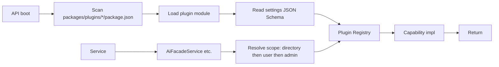

# Implementation Plan: Plugin System

**Feature ID**: `plugin-system`
**Spec**: `./spec.md`
**Status**: `Done` (Retrospective; ongoing as new plugins ship)
**Last updated**: 2026-05-01

---

## 1. Architecture

## 2. Tech Choices

| Concern          | Choice                                     | Rationale                              |
| ---------------- | ------------------------------------------ | -------------------------------------- |
| Discovery        | Static glob at boot (`packages/plugins/*`) | No runtime install; safe + fast        |
| Plugin runtime   | ESM, in-process                            | Simplicity; trust is operational       |
| Settings storage | Encrypted in `plugin_settings`             | Principle VII                          |
| SDK package      | `@ever-works/plugin` (separate workspace)  | Reusable contracts; versioned          |
| AI plugin base   | `BaseAiProvider` + LangChain wrapper       | Most providers share OpenAI-compat API |

## 3. Data Model

- `plugin_settings` table: `(scope, scopeId, pluginId, settings_json, createdAt, updatedAt)`.
- Three scopes: `admin` (scopeId = null), `user` (scopeId = userId),
  `directory` (scopeId = directoryId).
- Encrypted columns for `x-secret` fields (envelope encryption with the
  platform's master key).

## 4. API Surface

| Method   | Endpoint                                    | Description                           |
| -------- | ------------------------------------------- | ------------------------------------- |
| `GET`    | `/api/plugins`                              | List installed plugins + capabilities |
| `GET`    | `/api/plugins/:id`                          | Plugin metadata + settings schema     |
| `GET`    | `/api/plugins/:id/settings/:scope/:scopeId` | Read settings (secrets stripped)      |
| `PUT`    | `/api/plugins/:id/settings/:scope/:scopeId` | Write settings                        |
| `DELETE` | `/api/plugins/:id/settings/:scope/:scopeId` | Clear settings (cascade fall-through) |

## 5. Plugin Surface

The plugin SDK (`packages/plugin/`):

- `src/abstract/` — base classes (`BasePlugin`, `BaseAiProvider`, etc.).
- `src/<capability>/` — capability interfaces.
- `src/ai/` — LangChain wrapper (`AiOperations`).
- `src/helpers/` — schema utilities, secret redaction.

## 6. Web / CLI

- Web: per-plugin settings UI rendered from JSON Schema with
  `form-schema-provider` enhancements; secret fields show as
  "configured" without revealing the value.
- CLI: `ever-works plugin list / get / set` commands.

## 7. Background Jobs

Pipeline plugins are themselves drivers of background work; the plugin
system itself doesn't add background jobs.

## 8. Security & Permissions

- `admin-only` plugins: only platform admins can configure.
- `user-required` / `hybrid`: users provide their own credentials.
- Secrets encrypted at rest; redacted in logs and API responses.

## 9. Observability

- Plugin load failures: warning log + Sentry breadcrumb.
- Capability resolution: trace span per resolve.

## 10. Risks & Mitigations

| Risk                                   | Mitigation                                              |
| -------------------------------------- | ------------------------------------------------------- |
| Plugin code crashes the API process    | Each capability call is wrapped in try/catch            |
| Drift between plugin metadata and code | CI builds each plugin individually with strict tsconfig |
| Secret leak through error messages     | Redaction helpers + integration tests for redaction     |

## 11. Constitution Reconciliation

See `spec.md` §9 — this feature is the canonical implementation of
Principles I, II, VII, VIII, X.

## 12. References

- Plugin SDK: `packages/plugin/`
- Plugin packages: `packages/plugins/`
- Canonical plugin list: `docs/plugin-system/built-in-plugins.md`
- Constitution: `.specify/memory/constitution.md`
