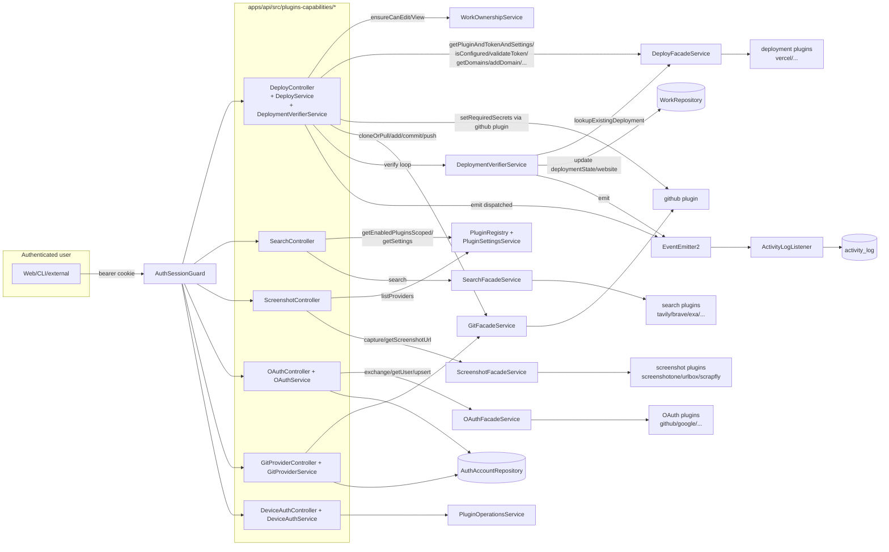

# Implementation Plan: Plugins Capabilities (HTTP Surface)

**Feature ID**: `plugins-capabilities`
**Spec**: `./spec.md`
**Tasks**: `./tasks.md`
**Status**: `Done` (retrospective; surface already implemented on `develop`)
**Last updated**: 2026-05-08

---

## 1. Architecture Summary

## 2. Tech Choices

| Concern                      | Choice                                                                         | Rationale                                                                                                                           |
| ---------------------------- | ------------------------------------------------------------------------------ | ----------------------------------------------------------------------------------------------------------------------------------- |
| HTTP shell                   | NestJS controllers under `apps/api/src/plugins-capabilities/<cap>/`            | One sub-module per capability mirrors the agent-package facade boundary; modules are mounted in `api.module.ts` (lines 18-71).      |
| Auth                         | Global `AuthSessionGuard` via `@UseGuards`                                     | Same guard the rest of the API uses; no new auth surface for plugins-capabilities.                                                  |
| Per-work permission gate     | `WorkOwnershipService.ensureCanEdit` / `.ensureCanView`                        | Pre-existing service already used by the works controller; centralises owner-vs-member-vs-collaborator logic.                       |
| Provider resolution          | Per-capability facade in `@ever-works/agent/facades`                           | Keeps plugin lookup + secret retrieval out of the controller; facades are exported via `FacadesModule`.                             |
| Plugin enumeration           | `PluginRegistryService.getEnabledPluginsScoped(cap, workId, userId)`           | Single source of truth for "which plugins are active for this scope?" — consumes the four-level cascade.                            |
| Settings reads               | `PluginSettingsService.getSettings({userId, workId, includeSecrets})`          | Same service the plugin admin UI uses; `includeSecrets:true` only ever runs server-side.                                            |
| Background polling           | In-memory `setInterval` queue keyed by `workId` in `DeploymentVerifierService` | Verification is short (≤13 min) and naturally fits a single-process poller; full Trigger.dev migration is OQ-3.                     |
| Cross-service notification   | `EventEmitter2` from `@nestjs/event-emitter`                                   | Decouples deploy services from `ActivityLogService`; the listener-side spec is pinned in [`activity-log`](../activity-log/spec.md). |
| GitHub Actions secret writes | Via the `github` plugin's `setActionSecret` / `setActionVariable`              | Plugin owns the libsodium-encrypted Actions API surface; deploy service only knows "key/value/repo".                                |
| Domain validation            | `class-validator` `@Matches` regex on `AddDomainDto.domain`                    | Reject malformed input at the DTO layer so the controller can assume a syntactically-valid hostname.                                |
| Batch deploy concurrency     | Rolling batches of 5 with 2 000 ms interval-sleep                              | Empirically chosen to stay under GitHub Actions secrets-API rate limits (5 req/s soft cap).                                         |
| Activity-log emission        | Fire-and-forget `.catch(() => {})` from controller                             | Audit-write failures MUST NOT propagate back to the user; the controller's success response is independent of the audit log.        |

## 3. Data Model

No new entities or migrations.

The surface reads/writes the existing tables:

- `works` — `deploymentState`, `deploymentStartedAt`, `website` updated by
  `DeploymentVerifierService` via `WorkRepository.update`.
- `auth_accounts` — upserted by `OAuthService.handleOAuthCallback` with
  the `plugin:`-prefixed `providerId`.
- `plugin_settings` (read-only here) — settings cascade resolved via
  `PluginSettingsService`.
- `activity_log` (write-only here) — emitted via `ActivityLogService.log`
  (deploy controller) and indirectly via `ActivityLogListener` consuming
  the three deploy events.

### DTOs

All under `apps/api/src/plugins-capabilities/<cap>/dto/`:

- `deploy/dto/deploy.dto.ts` — `DeployWorkDto { teamScope?: string }`,
  `ValidateTokenDto { providerId: string }`, `GetTeamsDto { providerId:
string }`.
- `deploy/dto/batch-deploy.dto.ts` — `BatchDeployItemDto { workId,
teamScope? }`, `BatchDeployDto { works[], teamScope? }`,
  `BatchDeployItemResultDto`, `BatchDeployResponseDto`.
- `deploy/dto/domain.dto.ts` — `AddDomainDto { domain: string @Matches(<regex>) }`.
- `search/dto/search.dto.ts` — `SearchDto { query, maxResults?,
includeDomains?, excludeDomains? }`.
- `screenshot/dto/screenshot.dto.ts` — `CaptureScreenshotDto` (URL +
  viewport + format + behaviour flags) and `GetScreenshotUrlDto` (alias).

## 4. API Surface

### Deploy (`/api/deploy/*`)

| Method   | Endpoint                                       | Auth    | Body / Query     | Response shape                                                              |
| -------- | ---------------------------------------------- | ------- | ---------------- | --------------------------------------------------------------------------- |
| `GET`    | `/api/deploy/providers`                        | session | —                | `{status, providers[]}`                                                     |
| `GET`    | `/api/deploy/providers/:providerId/configured` | session | path             | `{status, configured, available, enabled?, message}`                        |
| `POST`   | `/api/deploy/works/:id`                        | session | `DeployWorkDto`  | `{status: 'pending', slug, owner, repository, message}` or `400 BadRequest` |
| `POST`   | `/api/deploy/validate-token`                   | session | —                | `{status, valid, userInfo: null, message}`                                  |
| `POST`   | `/api/deploy/teams`                            | session | —                | `{status, teams: [], message}` (placeholder; see OQ-1)                      |
| `POST`   | `/api/deploy/works/:id/teams`                  | session | path             | `{status, teams[]}` or `400 BadRequest`                                     |
| `POST`   | `/api/deploy/works/:id/check`                  | session | path             | `{status, canDeploy, isShared, ownerHasToken, userHasToken}`                |
| `POST`   | `/api/deploy/works/:id/lookup`                 | session | path             | `{status, website, deploymentState, found}` or `400 BadRequest`             |
| `POST`   | `/api/deploy/batch`                            | session | `BatchDeployDto` | `BatchDeployResponseDto`                                                    |
| `GET`    | `/api/deploy/works/:id/domains`                | session | path             | `{status, domains[]}` or `400 BadRequest`                                   |
| `POST`   | `/api/deploy/works/:id/domains`                | session | `AddDomainDto`   | `{status, …addDomainResult}` or `400 BadRequest`                            |
| `DELETE` | `/api/deploy/works/:id/domains/:domain`        | session | path             | `{status, removed}` or `400 BadRequest`                                     |
| `POST`   | `/api/deploy/works/:id/domains/:domain/verify` | session | path             | `{status, domain}` or `400 BadRequest`                                      |

### Search (`/api/search/*`)

| Method | Endpoint                         | Body        | Response                                                |
| ------ | -------------------------------- | ----------- | ------------------------------------------------------- |
| `GET`  | `/api/search/check-availability` | —           | `{status, available, activeProvider \| null, message?}` |
| `POST` | `/api/search/`                   | `SearchDto` | `{status, results, provider}` or `400 BadRequest`       |

### Screenshot (`/api/screenshot/*`)

| Method | Endpoint                                    | Body / Query           | Response                                                     |
| ------ | ------------------------------------------- | ---------------------- | ------------------------------------------------------------ |
| `GET`  | `/api/screenshot/check-availability?workId` | query                  | `{status, available, providers[], activeProvider}`           |
| `POST` | `/api/screenshot/capture`                   | `CaptureScreenshotDto` | `{status, imageUrl, cacheUrl, imageBase64 \| null}` or `400` |
| `POST` | `/api/screenshot/get-url`                   | `GetScreenshotUrlDto`  | `{status, imageUrl}` or `400 BadRequest`                     |

### OAuth (`/api/oauth/*`)

| Method   | Endpoint                                  | Query                                 | Response                                    |
| -------- | ----------------------------------------- | ------------------------------------- | ------------------------------------------- |
| `GET`    | `/api/oauth/providers`                    | —                                     | `{configured, providers[]}`                 |
| `GET`    | `/api/oauth/:providerId/connection`       | —                                     | `OAuthConnectionInfo` (200 even on failure) |
| `GET`    | `/api/oauth/:providerId/connect/url`      | `callbackUrl?, state?, forceConsent?` | `{url, state}` or `400 BadRequest`          |
| `GET`    | `/api/oauth/:providerId/callback/plugins` | `code, state?`                        | `OAuthConnectionInfo` or `400 BadRequest`   |
| `GET`    | `/api/oauth/:providerId/user`             | —                                     | `{success, user? \| error?}` (200 always)   |
| `DELETE` | `/api/oauth/:providerId`                  | —                                     | `204` (undefined body)                      |

### Git Provider (`/api/git-providers/*`)

| Method | Endpoint                                       | Query             | Response                                            |
| ------ | ---------------------------------------------- | ----------------- | --------------------------------------------------- |
| `GET`  | `/api/git-providers`                           | —                 | `{configured, providers[]}`                         |
| `GET`  | `/api/git-providers/:providerId/connection`    | —                 | `GitProviderConnectionInfo` (200 always)            |
| `GET`  | `/api/git-providers/:providerId/organizations` | —                 | `{success, organizations[] \| error?}` (200 always) |
| `GET`  | `/api/git-providers/:providerId/repositories`  | `page?, perPage?` | `{success, repositories[] \| error?}` (200 always)  |
| `GET`  | `/api/git-providers/:providerId/user`          | —                 | `{success, user \| error?}` (200 always)            |

### Device Auth (`/api/device-auth/*`)

| Method | Endpoint                            | Body | Response           |
| ------ | ----------------------------------- | ---- | ------------------ |
| `GET`  | `/api/device-auth/:pluginId/status` | —    | `DeviceAuthStatus` |
| `POST` | `/api/device-auth/:pluginId/start`  | —    | `DeviceAuthStatus` |

## 5. Plugin Surface

No new capability interfaces. The optional plugin contract methods used by
the deploy service:

- `IDeploymentPlugin.getWorkflowFilenames?(): string[]` — list of GitHub
  Actions workflow filenames to try, in order. Default fallback:
  `['deploy_prod.yaml']`. Vercel plugin currently returns
  `['deploy_vercel.yaml', 'deploy_prod.yaml']` to preserve legacy behavior.
- `IDeploymentPlugin.getDeploymentSecrets?(settings): Promise<Record<string, string>>` —
  extra GitHub Actions secrets to push (e.g. k8s registry creds, custom
  namespace). Failure here is logged but does NOT abort the dispatch.
- `IDeploymentPlugin.providerName?: string` — display name override used in
  activity-log summaries; falls back to `plugin.name`, then `plugin.id`.

The deploy service additionally invokes a fixed set of methods on the
loaded `github` plugin (it reads the registered plugin via
`pluginRegistry.get('github')` and treats it as `any`):

- `getRepositoryPublicKey(owner, repo, token)` — GitHub Actions secrets
  use libsodium-encrypted boxes; the public key fetch is a prerequisite.
- `setActionSecret({key, value, owner, repo}, publicKey, token)` — encrypt
    - PUT into Actions secrets.
- `setActionVariable({key, value, owner, repo}, token)` — PUT into Actions
  variables (used for `DEPLOY_PROVIDER`).
- `enableDeploymentWorkflows(owner, repo, token, withDelay?)` — re-enable
  workflows when GitHub auto-disables them after an inactive period.
- `dispatchWorkflow({workflow, inputs, branch, owner, repo}, token)` —
  fire the `workflow_dispatch` event.

## 6. Web / CLI Surface

No new pages or CLI commands ship with this spec — the platform's
existing UI consumes these endpoints (e.g. the deploy dashboard, the
plugin settings page, the OAuth connect button, the search bar in the
chat conversation surface).

## 7. Background Jobs

| Trigger                        | When                              | What it does                                                                  | Idempotency strategy                                                                                                                           |
| ------------------------------ | --------------------------------- | ----------------------------------------------------------------------------- | ---------------------------------------------------------------------------------------------------------------------------------------------- |
| In-memory `setInterval` (10 s) | Once per `startVerification` call | Polls `deployFacade.lookupExistingDeployment`; updates `work.deploymentState` | Per-`workId` cancellation map: a new `startVerification` cancels the prior one; `terminated` boolean guard prevents duplicate terminal events. |
| Synchronous batch loop         | Per `POST /api/deploy/batch`      | Rolling batches of 5; 2 000 ms sleep between batches                          | None at the service layer; controller skips `startVerification` for non-`pending` results.                                                     |

No Trigger.dev tasks ship in this surface today. OQ-3 documents the
planned migration path for the verifier.

## 8. Security & Permissions

- **Auth**: every endpoint behind global `AuthSessionGuard` (no `@Public`
  routes in `plugins-capabilities/`).
- **Per-work**: every `:id`-scoped endpoint runs `WorkOwnershipService.ensureCanEdit`
  (mutating) or `.ensureCanView` (read-only). Non-creator callers route
  facade calls under the **owner's** `userId` so plugin settings resolve
  to the owner's configuration, not the caller's.
- **Secrets**:
    - `x-secret: true` plugin settings are read with `includeSecrets: true`
      on the server only and never echoed in responses.
    - GitHub Actions secrets are written via libsodium-encrypted PUT
      through the `github` plugin; the deploy service only logs the
      _count_ of plugin-supplied secrets, never the keys.
    - `CRON_SECRET` is regenerated on every dispatch (32-byte hex from
      `crypto.randomBytes`), preventing stale-secret reuse.
- **OAuth state**: `randomBytes(16).toString('hex')` is used as the
  default `state` value when callers don't supply one. The OAuth state
  is passed through to the provider but its server-side verification on
  callback is the OAuth facade's responsibility (see
  [`auth-jwt-oauth`](../auth-jwt-oauth/spec.md) OQ-2).
- **Rate limiting**: relies on the global throttler config in
  [`config`](../auth-jwt-oauth/spec.md) — no per-endpoint override here.
- **Domain regex**: rejects path/scheme/whitespace at the DTO layer,
  preventing injection into provider-side domain APIs.

## 9. Observability

- **Activity-log emissions** (controller-emitted, fire-and-forget): - `POST /api/deploy/works/:id` → `actionType: DEPLOYMENT, action:
'work.deployed', status: COMPLETED, summary: 'Triggered deployment
for <work.name> via <providerName>'` (only when
  `deploymentInitiated === true`). - `POST /api/deploy/batch` → `actionType: DEPLOYMENT, action:
'deployment.batch_started', status: COMPLETED, summary: 'Triggered
batch deploy for <N> works', details: {workIds: [...]}`.
- **Activity-log emissions** (listener-emitted, via deploy events):
    - `DeploymentDispatchedEvent` → emitted by `DeployService.deploy` on
      successful dispatch.
    - `DeploymentCompletedEvent` → emitted by `DeploymentVerifierService`
      on `state === 'READY'`; payload includes the resolved `url`.
    - `DeploymentFailedEvent` → emitted by `DeploymentVerifierService` on
      `state ∈ {ERROR, TIMEOUT, CANCELED, UNKNOWN}`; payload includes
      `terminalState` and `error?`.
- **Logger output**: every service has a per-instance `Logger`; key log
  lines:
    - `Starting verification for work <id>`
    - `Cleaning up verification for work <id> - <state>`
    - `Attempting to dispatch workflow "<file>" for <owner>/<repo>`
    - `Successfully dispatched workflow "<file>" for <owner>/<repo>`
    - `Pushed <N> plugin-specific secrets for <pluginId> to <owner>/<repo>`
    - `Workflow dispatch failed. Updating repository for <owner>/<repo>`
- **NO activity-log emission** for: search, screenshot, OAuth, git-provider,
  device-auth — these are per-call CRUD-style endpoints and the
  audit-volume cost outweighs the visibility gain.

## 10. Phased Rollout

This is a **retrospective** plan: every phase below has already shipped.

1. **Phase 1 — Sub-module scaffolding (shipped)**: `DeployModule`,
   `SearchModule`, `ScreenshotModule`, `OAuthModule`, `GitProviderModule`,
   `DeviceAuthModule` mounted in `api.module.ts` with their respective
   facades imported via `FacadesModule`.
2. **Phase 2 — Capability-driven plugin contracts (shipped)**: optional
   `getDeploymentSecrets` + `getWorkflowFilenames` added to
   `IDeploymentPlugin`; `DeployService` now resolves them with safe
   fallbacks for legacy plugins.
3. **Phase 3 — Event-driven activity-log (shipped)**: `DeployService` /
   `DeploymentVerifierService` emit `DeploymentDispatchedEvent` /
   `DeploymentCompletedEvent` / `DeploymentFailedEvent`; the
   `ActivityLogListener` is the sole consumer in production.
4. **Phase 4 — Spec backfill (this PR)**: pin the surface in a Spec Kit
   feature so the hourly-tracker task can mark it Done.

## 11. Risks & Mitigations

| Risk                                                                                                                                        | Likelihood | Impact | Mitigation                                                                                                                                                |
| ------------------------------------------------------------------------------------------------------------------------------------------- | ---------- | ------ | --------------------------------------------------------------------------------------------------------------------------------------------------------- |
| API restart during a verification poll loses in-flight verification.                                                                        | Medium     | Low    | Documented in OQ-3; users can manually `POST /api/deploy/works/:id/lookup` to re-resolve. Migration to a Trigger.dev task is the long-term fix.           |
| GitHub Actions API rate-limit (secrets endpoint, ~5 req/s) on batch deploys.                                                                | Low        | Medium | Rolling batches of 5 with 2 000 ms sleep between them; per-work secret writes use `Promise.all` of 4 + N (plugin extras), well under per-call limits.     |
| Plugin-provided `getDeploymentSecrets` throws and corrupts dispatch.                                                                        | Low        | High   | Caught + logged + dispatch continues. Plugin authors must not assume `getDeploymentSecrets` is the source of truth for required secrets.                  |
| Two `startVerification` calls race for the same work and emit duplicate terminals.                                                          | Low        | Low    | `terminated` boolean idempotency guard; prior poller is cancelled before the new one is registered.                                                       |
| OAuth callback received with stale state → silent token replacement.                                                                        | Low        | High   | Documented in OQ-2; current flow trusts the OAuth facade to verify state. Spec follow-up: see [`auth-jwt-oauth`](../auth-jwt-oauth/spec.md) OQ-2.         |
| `auth_accounts` row collision when the same provider is connected via two flows.                                                            | Low        | Medium | `buildPluginProviderId` namespaces plugin OAuth from social OAuth (`plugin:<id>` vs `<id>`); two distinct rows can co-exist. UI may need to surface both. |
| Domain regex falsely rejects valid TLDs that include digits (e.g. emoji TLDs).                                                              | Very low   | Low    | Documented limitation; current regex covers the standard ASCII TLD set.                                                                                   |
| Asymmetric error envelope (deploy/search/screenshot throw 4xx; OAuth/git-provider/device-auth wrap into 200) confuses external integrators. | Medium     | Low    | Documented in OQ-2; consistency is desirable but a migration would be a breaking change for existing UI clients.                                          |
| Search resolution always picks the first configured plugin — user can't override per call.                                                  | Low        | Low    | Documented in OQ-4; screenshot already supports `providerOverride`, search may follow.                                                                    |

## 12. Constitution Reconciliation

| Gate                                        | Status     | Notes                                                                                                      |
| ------------------------------------------- | ---------- | ---------------------------------------------------------------------------------------------------------- |
| Principle I — Plugin-first                  | ✅         | Every capability resolves through a plugin under `packages/plugins/`.                                      |
| Principle II — Capability-driven            | ✅         | Every endpoint resolves through a facade + `PluginRegistryService` capability lookup.                      |
| Principle III — Source-of-truth repos       | ✅         | Deploy writes via `WebsiteUpdateService`; OAuth writes to `auth_accounts` (not user repos).                |
| Principle IV — Long-running via Trigger.dev | ⚠️ Future  | In-memory verifier is documented as a follow-up (OQ-3) for migration to Trigger.dev.                       |
| Principle V — Forward-only migrations       | ✅         | No schema changes ship in this surface.                                                                    |
| Principle VI — Tests accompany              | ⚠️ Partial | 5 controller specs + 4 service specs; deploy controller spec is flagged as a follow-up (T-DEPLOY-CTRL).    |
| Principle VII — `x-secret` hygiene          | ✅         | `includeSecrets:true` only on the server; secret values never echoed in responses or activity-log entries. |
| Principle VIII — Plugin counts canonical    | ✅         | Not applicable — this spec discusses the HTTP surface only.                                                |
| Principle IX — Behaviour-first              | ✅         | Spec describes user-observable behaviour; implementation lives here in the plan.                           |
| Principle X — Backwards-compatible          | ✅         | Optional plugin contract methods preserve compatibility with older plugins.                                |

## 13. References

- Spec: [`./spec.md`](./spec.md)
- Tasks: [`./tasks.md`](./tasks.md)
- Source: [`apps/api/src/plugins-capabilities/`](../../../../apps/api/src/plugins-capabilities/)
- Module wiring: [`apps/api/src/api.module.ts`](../../../../apps/api/src/api.module.ts) (lines 18-71)
- Related ADRs: none specific to this surface; see the constitution.
- Coverage tracker: [`COVERAGE-TRACKER.md`](../../../../COVERAGE-TRACKER.md)
