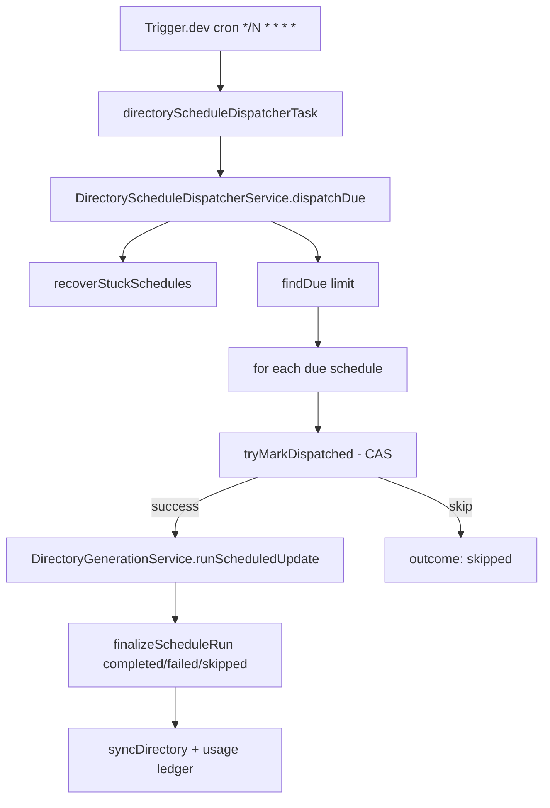

# Implementation Plan: Scheduled Directory Updates

**Feature ID**: `scheduled-updates`
**Spec**: `./spec.md`
**Status**: `Done` (Retrospective)
**Last updated**: 2026-05-01

---

## 1. Architecture Summary

## 2. Tech Choices

| Concern          | Choice                                           | Rationale                                                       |
| ---------------- | ------------------------------------------------ | --------------------------------------------------------------- |
| Cron runtime     | Trigger.dev `schedules.task`                     | Principle IV; survives restarts, dashboards, retries            |
| Mutual exclusion | SQL CAS (`UPDATE … WHERE nextRunAt IS NOT NULL`) | The schedule row IS the lock; no Redis or `DistributedTaskLock` |
| Drift            | `scheduledFor` anchor preserved at claim         | Bounded drift across the lifetime of the schedule               |
| Billing          | `UsageLedgerEntry` rows on completion            | Per-run accounting, separate from plan caps                     |

## 3. Data Model

- `directory_schedules` table with columns:
  `id, directoryId, userId, cadence, status, nextRunAt, scheduledFor, lastRunAt, lastRunStatus, failureCount, maxFailureBeforePause, alwaysCreatePullRequest, billingMode, providerOverrides, createdAt, updatedAt`.
- `usage_ledger` table for per-run accounting.
- Migrations:
    - Initial table creation.
    - Addition of `every_3_hours`, `every_8_hours`, `every_12_hours` to the
      cadence enum (additive).
    - Addition of `scheduledFor` column for drift correction (nullable).
    - Addition of `providerOverrides` column (jsonb, nullable).

## 4. API Surface

| Method   | Endpoint                            | Description                            |
| -------- | ----------------------------------- | -------------------------------------- |
| `GET`    | `/api/directories/:id/schedule`     | Read schedule + allowed cadences       |
| `PUT`    | `/api/directories/:id/schedule`     | Create/update schedule                 |
| `DELETE` | `/api/directories/:id/schedule`     | Cancel schedule (resets to `disabled`) |
| `POST`   | `/api/directories/:id/schedule/run` | Run-now (preserves slot if ahead)      |

## 5. Plugin / Web / CLI

- Web: schedule settings form on the directory detail page; "Run Now"
  button; status badges.
- CLI: `ever-works directory schedule …` commands wrap the API.
- Plugin facades: schedule resolution honours `providerOverrides` —
  capabilities are looked up with the override-aware scope.

## 6. Background Jobs

The dispatcher cron task is the entry point. It uses no separate locks
(see `directory-schedule-dispatcher.md` deep-dive for the reasoning).

## 7. Security & Permissions

- All endpoints require directory edit rights.
- Cron tasks run with elevated DB access (no per-user auth scope).
- Schedule rows are readable by directory owners and members.

## 8. Observability

- Per-tick summary returned to Trigger.dev with counts + per-schedule outcomes.
- Auto-pause emits a notification via `NotificationsService`.
- Activity log entries on each dispatch (`directory_scheduled_run`).

## 9. Risks & Mitigations

| Risk                         | Mitigation                                                     |
| ---------------------------- | -------------------------------------------------------------- |
| Slow tick overlaps next tick | CAS claim ensures at-most-once dispatch per slot               |
| Worker crash mid-generation  | Zombie recovery flips stuck schedules to ERROR after timeout   |
| Drift accumulation           | `scheduledFor` anchor prevents drift across runs               |
| Billing leak on cancel       | Usage ledger entries only added on completion, not on dispatch |

## 10. Constitution Reconciliation

See `spec.md` §9 — all gates satisfied.

## 11. References

- Spec: `./spec.md`
- Internal architecture: `docs/agent-services/directory-schedule-dispatcher.md`
- Cross-cutting: [`architecture/trigger-integration`](../../architecture/trigger-integration.md) §10
  (cron dispatcher task), [`architecture/cache`](../../architecture/cache.md)
  (CAS claim contract uses the same TypeORM tier as the cache table)
- Implementation files: see spec §10.
