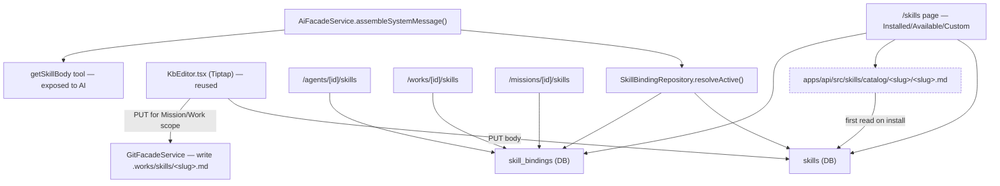

# Implementation Plan: Skills

**Feature ID**: `skills`
**Spec**: [`./spec.md`](./spec.md)
**Tasks**: [`./tasks.md`](./tasks.md)
**Status**: `Draft`
**Last updated**: 2026-05-25

---

## 1. Architecture Summary



## 2. Tech Choices

| Concern                     | Choice                                                                                                                                                     | Rationale                                                                      |
| --------------------------- | ---------------------------------------------------------------------------------------------------------------------------------------------------------- | ------------------------------------------------------------------------------ |
| Catalog storage             | In-monorepo at `apps/api/src/skills/catalog/<slug>/<slug>.md` + `metadata.json`                                                                            | Smallest ship-distance; atomic versioning with code.                           |
| Catalog read                | Eager load on startup, cached in memory; LRU re-read on file change in dev                                                                                 | ≤10 MB starter catalog fits easily; no DB round-trips on hot path.             |
| Frontmatter parsing         | `gray-matter` (already a dep transitively via Tiptap markdown extension; add direct if needed) + zod schema                                                | Consistent with `WorksConfigService` patterns.                                 |
| DB                          | TypeORM entities under `packages/agent/src/entities/`                                                                                                      | Same pattern as Agents and existing entities.                                  |
| Resolver                    | One repository method joining `skills` + `skill_bindings`, returns `ResolvedSkill[]`                                                                       | Single source of truth; reduces controller complexity.                         |
| Injection                   | `AiFacadeService.assembleSystemMessage({skills, maxTokens})` returns the system-message segment to concatenate before/after `WorkAdvancedPrompts` content. | Co-located with existing system-message assembly; no parallel injection point. |
| Tool registration           | Reuse the existing tool-loop helper used by `agent-pipeline`/`claude-code` plugins; register `getSkillBody` per-call when any skill is bound.              | Zero new tool plumbing.                                                        |
| File storage (Mission/Work) | `GitFacadeService.commit()` for `.works/skills/<slug>.md`                                                                                                  | Same path used by `.works/works.yml` writes.                                   |
| File storage (Tenant)       | Inline in `skills.instructionsMd` TEXT column                                                                                                              | Mirrors Agent tenant fallback.                                                 |
| Editor                      | `KbEditor.tsx` reused with Tiptap StarterKit + Markdown export                                                                                             | Identical UX to KB pages; supports autosave.                                   |
| Pagination of catalog       | Server-side, `limit/offset` query params                                                                                                                   | Catalog grows large; default page size 50.                                     |

## 3. Data Model

### 3.1 New entities

```typescript
// packages/agent/src/entities/skill.entity.ts
export type SkillOwnerType = 'tenant' | 'mission' | 'idea' | 'work' | 'agent';

@Entity({ name: 'skills' })
@Index('uq_skills_owner_slug', ['ownerType', 'ownerId', 'slug'], { unique: true })
@Index('idx_skills_owner', ['ownerType', 'ownerId'])
export class Skill {
	@PrimaryGeneratedColumn('uuid') id: string;

	@Column({ length: 16 }) ownerType: SkillOwnerType;
	@Column('uuid') ownerId: string;

	@Column({ length: 80 }) slug: string;
	@Column({ length: 120 }) title: string;
	@Column({ type: 'text' }) description: string;

	@Column('simple-json') frontmatter: {
		name: string;
		description: string;
		allowedTools?: string[];
		tags?: string[];
		[key: string]: unknown;
	};

	@Column({ type: 'text' }) instructionsMd: string; // body, sans frontmatter
	@Column({ length: 64 }) contentHash: string;
	@Column({ type: 'varchar', length: 200, nullable: true }) sourcePath?: string | null; // path within scope's repo, when applicable
	@Column({ type: 'varchar', length: 80, nullable: true }) sourceCatalogSlug?: string | null;
	@Column({ type: 'varchar', length: 16, nullable: true }) sourceCatalogVersion?: string | null;
	@Column({ type: 'varchar', length: 16, default: '1.0.0' }) version: string;

	@CreateDateColumn() createdAt: Date;
	@UpdateDateColumn() updatedAt: Date;
}
```

```typescript
// packages/agent/src/entities/skill-binding.entity.ts
export type SkillBindingTargetType = 'agent' | 'work' | 'mission' | 'idea' | 'tenant';

@Entity({ name: 'skill_bindings' })
@Index('uq_skill_binding', ['skillId', 'targetType', 'targetId'], { unique: true })
@Index('idx_skill_binding_target', ['targetType', 'targetId'])
export class SkillBinding {
	@PrimaryGeneratedColumn('uuid') id: string;
	@Column('uuid') skillId: string;
	@Column({ length: 16 }) targetType: SkillBindingTargetType;
	@Column('uuid', { nullable: true }) targetId?: string | null; // null when targetType='tenant' (userId is sufficient)
	@Column({ type: 'uuid' }) userId: string; // for fast row-level visibility filtering

	@Column({ type: 'boolean', default: true }) injectIntoAgent: boolean; // tag for resolution
	@Column({ type: 'boolean', default: false }) injectIntoGenerator: boolean; // tag for Generator runs
	@Column({ type: 'int', default: 100 }) priority: number; // lower = higher priority

	@CreateDateColumn() createdAt: Date;
}
```

### 3.2 Migrations

`CreateSkillsTables.ts` — creates `skills`, `skill_bindings`, and the indexes above.

## 4. API Surface

| Method | Endpoint                            | Description                                               | Status |
| ------ | ----------------------------------- | --------------------------------------------------------- | ------ |
| GET    | `/skills/catalog`                   | Paginated list of platform-shipped skills.                | New    |
| GET    | `/skills/catalog/:slug`             | Full body + metadata for a catalog skill.                 | New    |
| POST   | `/skills/install`                   | Install a catalog skill at the requested scope.           | New    |
| GET    | `/skills`                           | List the user's `skills` rows, filterable by `ownerType`. | New    |
| POST   | `/skills`                           | Create a custom skill.                                    | New    |
| GET    | `/skills/:id`                       | Read one (body + frontmatter + bindings count).           | New    |
| PATCH  | `/skills/:id`                       | Update body / frontmatter.                                | New    |
| DELETE | `/skills/:id`                       | Delete (cascades to bindings).                            | New    |
| GET    | `/skills/:id/bindings`              | List all bindings of this Skill.                          | New    |
| POST   | `/skills/:id/bindings`              | Create a binding (body specifies `targetType+targetId`).  | New    |
| DELETE | `/skill-bindings/:id`               | Remove one binding.                                       | New    |
| GET    | `/agents/:id/skills`                | Convenience: resolve active skills for an Agent.          | New    |
| GET    | `/works/:id/skills`                 | Convenience: resolve active skills for a Work generator.  | New    |
| POST   | `/missions/:id/skills/from-catalog` | Install + bind in one shot at Mission scope.              | New    |

Validation via class-validator + zod for frontmatter.

## 5. Plugin Surface

No new plugin. Skills hook into the existing `AiFacadeService` and the tool-loop helper.

## 6. Web / CLI Surface

| Route                                         | File                                                         | Notes                                         |
| --------------------------------------------- | ------------------------------------------------------------ | --------------------------------------------- |
| `/skills`                                     | `apps/web/src/app/[locale]/(dashboard)/skills/page.tsx`      | Three sections: Installed, Available, Custom. |
| `/skills/[id]`                                | `apps/web/src/app/[locale]/(dashboard)/skills/[id]/page.tsx` | Body editor (Tiptap) + Bindings tab.          |
| `/skills/new`                                 | `apps/web/src/app/[locale]/(dashboard)/skills/new/page.tsx`  | Create form.                                  |
| `/agents/[id]/skills`                         | tab under `/agents/[id]/`                                    | Toggle attached + inherited list.             |
| `/works/[id]/skills`                          | tab under `/works/[id]/` (between Generator and Plugins)     | Installed + Available + Inherit.              |
| `/missions/[id]/skills`, `/ideas/[id]/skills` | tabs under the respective detail pages                       | Same shape.                                   |

Sidebar item "Skills" placed directly below "Plugins" (additive — see [agents/spec.md §5.1](../agents/spec.md#51-sidebar-i18n-keys-additive) for the i18n key already reserved).

## 6.1 Rate limits per endpoint

| Endpoint                    | Cap                    |
| --------------------------- | ---------------------- |
| `POST /skills`              | 30/min/user            |
| `POST /skills/install`      | 60/min/user            |
| `PATCH /skills/:id`         | 60/min/user (autosave) |
| `POST /skills/:id/bindings` | 60/min/user            |
| `GET /skills/catalog`       | global throttler only  |

## 7. Background Jobs

None. Resolution and injection are synchronous within an AI call.

## 8. Security & Permissions

- All `/skills/*` routes are `@CurrentUser()` scoped; cross-user → 404.
- Frontmatter is parsed strictly; unknown top-level keys allowed (forward-compat) but a curated subset validated.
- Secret-scan regex on every save body, identical to Agent files.
- Bindings only allow targets the user owns (Work/Mission/Idea/Agent ownership checked server-side).
- Catalog reads are public-to-the-user (any auth'd user may browse); install action requires the same auth.

## 9. Observability

- Activity log events from architecture §10: `SKILL_INSTALLED`, `SKILL_ATTACHED_TO_AGENT`, `SKILL_INVOKED`.
- New event `SKILL_FILE_EDITED` for Mission/Work file saves (mirrors `AGENT_FILE_EDITED`).
- Sentry tag `skill.slug` on errors in the resolver / tool calls.
- PostHog: `skill_installed`, `skill_attached`, `skill_invoked`.

## 10. Phased Rollout

**Phase 1 — Data + read-only API + catalog reader.**

- Entities, migration, repositories.
- Catalog file reader + in-memory cache.
- `GET /skills/catalog` + `GET /skills`.

**Phase 2 — Mutations + UI.**

- `POST /skills/install`, `POST /skills`, `PATCH /skills/:id`, bindings CRUD.
- `/skills` list page + create page + detail page (Body + Bindings).
- Sidebar item + i18n.

**Phase 3 — Injection into AI calls.**

- `SkillBindingRepository.resolveActive()`.
- `AiFacadeService.assembleSystemMessage()` extension.
- `getSkillBody` tool auto-registration when bound skills present.
- Token budgeting with priority-based drop.
- `SKILL_INVOKED` activity row.

**Phase 4 — Tabs across detail pages.**

- Skills tab on Agent, Work, Mission, Idea detail pages.
- Inherit-from-scope listing.

**Phase 5 — Mission Template integration.**

- Scaffolder copies `.works/skills/` from template repo.
- `skills` rows materialized + auto-binds from template's agent.yml.

**Phase 6 — Starter catalog seed.**

- Ship 10+ example skills (`pr-review`, `release-notes`, `kb-summarize`, `image-alt-text`, `seo-meta`, `internal-link-suggestions`, `competitive-research`, `commit-message-format`, `test-coverage-gap`, `dependency-bump-checklist`).
- Smoke-test each at install + attach + inject.

## 11. Risks & Mitigations

| Risk                                                                  | Likelihood | Impact | Mitigation                                                                                              |
| --------------------------------------------------------------------- | ---------- | ------ | ------------------------------------------------------------------------------------------------------- |
| Token budget exceeded → low-priority skills silently dropped          | Medium     | Low    | Surface drop in `agent_run_logs` + tooltip in UI.                                                       |
| Catalog file corrupt → all installs fail                              | Low        | Medium | Each catalog read returns per-file errors; bad entries are skipped, not the whole list.                 |
| Power-user binds 100+ skills, prompt blows up                         | Low        | Medium | Hard cap of 100 active bindings per target.                                                             |
| `getSkillBody` over-fetches and inflates cost                         | Medium     | Low    | Cost rolls into AgentBudget (existing); budget cap caps the blast radius.                               |
| `WorkAdvancedPrompts` + Skills double-inject conflicting instructions | Medium     | Low    | Documented assembly order: WorkAdvancedPrompts first, then `## Skills` section; user-tunable per Agent. |

## 12. Constitution Reconciliation

Same posture as Agents (no new plugin; reuses AI facade; additive YAML; secret-scan on bodies; tests required).

## 13. References

- Spec: [`./spec.md`](./spec.md)
- Tasks: [`./tasks.md`](./tasks.md)
- Architecture: [`../../architecture/agents-skills-tasks.md`](../../architecture/agents-skills-tasks.md)
- Agents feature: [`../agents/spec.md`](../agents/spec.md), [`../agents/plan.md`](../agents/plan.md)
- AI Facade: [`../../architecture/ai-facade.md`](../../architecture/ai-facade.md)
- WorkAdvancedPrompts (analog): [`../advanced-prompts/spec.md`](../advanced-prompts/spec.md)
