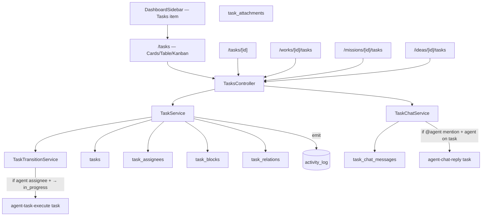

# Implementation Plan: Task tracking

**Feature ID**: `task-tracking`
**Spec**: [`./spec.md`](./spec.md)
**Tasks**: [`./tasks.md`](./tasks.md)
**Status**: `Draft`
**Last updated**: 2026-05-25

---

## 1. Architecture Summary



## 2. Tech Choices

| Concern                       | Choice                                                                                | Rationale                                                                                |
| ----------------------------- | ------------------------------------------------------------------------------------- | ---------------------------------------------------------------------------------------- |
| Persistence                   | TypeORM entities                                                                       | Consistent with Works/Missions/Agents.                                                    |
| Kanban                        | Reuse `WorksKanbanView.tsx` column-config shape; copy + adapt to Task columns         | Existing UX is known-good; no new dnd library needed (current implementation is dnd-free).|
| Description editor            | Reuse `KbEditor.tsx` (Tiptap)                                                          | Wikilinks + mentions + markdown export already wired.                                     |
| Chat                          | New light Tiptap instance for chat input; mentions reuse the same extension            | Familiar UX; supports `@user-or-agent` and `[[kb-doc]]`.                                  |
| Cycle detection (parent/sub)  | Server-side recursive CTE / iterative descendant walk on every write                  | DB has the data; cheap up to a few hundred descendants.                                   |
| Status transitions            | A small state-machine class `TaskTransitionService` with `assertCanTransition(from, to, ctx)` | Centralizes the rules listed in spec §3.2.                                                 |
| Agent dispatch                | Domain event raised by `TaskTransitionService` → `agent-task-execute` Trigger.dev run; debounced per `(taskId, agentId)` | Reuses existing dispatcher pattern.                                                       |
| Chat → agent dispatch         | Same mechanism; mention parser extracts `@<slug>`; Trigger.dev run per matched Agent  | Same.                                                                                     |
| Attachments                   | FK to `work_knowledge_upload` rows                                                     | Reuse existing upload flow + storage; no new infra.                                       |
| Activity feed                 | New event types (architecture §10) routed through `ActivityLogService.recordActivity` | One pipeline, multiple consumers.                                                          |
| Sort/filter on `/tasks`       | Server-side via query params; `localStorage` persisted view mode + filters             | Mirrors Works list.                                                                       |
| Tasks ↔ Spend                 | Add nullable `taskId` to `plugin_usage_events`; index `(taskId, occurredAt)`           | Per-task cost view.                                                                       |
| Future plugin path            | `IExternalTaskTrackerPlugin` interface declared in `packages/plugin/src/contracts/capabilities/task-tracker.interface.ts`; no facade consumes it yet | Lets specs reference the interface and lets a future plugin land without refactor.        |

## 3. Data Model

### 3.1 New entities

```typescript
// packages/agent/src/entities/task.entity.ts
export enum TaskStatus {
    BACKLOG = 'backlog',
    TODO = 'todo',
    IN_PROGRESS = 'in_progress',
    IN_REVIEW = 'in_review',
    BLOCKED = 'blocked',
    DONE = 'done',
    CANCELLED = 'cancelled'
}
export enum TaskPriority { P0 = 'p0', P1 = 'p1', P2 = 'p2', P3 = 'p3', P4 = 'p4' }

@Entity({ name: 'tasks' })
@Index('idx_tasks_user_status', ['userId', 'status'])
@Index('idx_tasks_work', ['workId', 'status'])
@Index('idx_tasks_mission', ['missionId', 'status'])
@Index('idx_tasks_idea', ['ideaId', 'status'])
@Index('idx_tasks_parent', ['parentTaskId'])
export class Task {
    @PrimaryGeneratedColumn('uuid') id: string;
    @Column('uuid') userId: string;
    @Column({ length: 16, unique: true }) slug: string;   // human-readable: T-12345

    @Column({ length: 200 }) title: string;
    @Column({ type: 'text', nullable: true }) description?: string | null;

    @Column({ type: 'varchar', length: 16, default: TaskStatus.BACKLOG }) status: TaskStatus;
    @Column({ type: 'varchar', length: 16, nullable: true }) previousStatus?: TaskStatus | null; // for blocked-unblocked restore
    @Column({ type: 'varchar', length: 4, default: TaskPriority.P3 }) priority: TaskPriority;

    @Column('simple-json', { nullable: true }) labels?: string[] | null;

    @Column('uuid', { nullable: true }) missionId?: string | null;
    @Column('uuid', { nullable: true }) ideaId?: string | null;
    @Column('uuid', { nullable: true }) workId?: string | null;

    @Column('uuid', { nullable: true }) parentTaskId?: string | null;

    @Column({ length: 16 }) createdByType: 'user' | 'agent';
    @Column('uuid') createdById: string;

    @Column({ type: 'boolean', default: true }) requireAllApprovers: boolean;

    @Column({ type: 'timestamp', nullable: true }) startedAt?: Date | null;
    @Column({ type: 'timestamp', nullable: true }) completedAt?: Date | null;

    @CreateDateColumn() createdAt: Date;
    @UpdateDateColumn() updatedAt: Date;
}
```

```typescript
// task-assignee.entity.ts (same shape used for reviewers, approvers via separate tables)
@Entity({ name: 'task_assignees' })
@Index('uq_task_assignee', ['taskId', 'assigneeType', 'assigneeId'], { unique: true })
export class TaskAssignee {
    @PrimaryGeneratedColumn('uuid') id: string;
    @Column('uuid') taskId: string;
    @Column({ length: 8 }) assigneeType: 'user' | 'agent';
    @Column('uuid') assigneeId: string;
    @CreateDateColumn() createdAt: Date;
}
// task-reviewer.entity.ts — same shape, table `task_reviewers`, adds `reviewedAt`, `reviewState`
// task-approver.entity.ts — same shape, table `task_approvers`, adds `approvedAt`, `approvalState`
```

```typescript
// task-blocks.entity.ts
@Entity({ name: 'task_blocks' })
@Index('uq_task_block', ['taskId', 'blockedByTaskId'], { unique: true })
export class TaskBlock {
    @PrimaryGeneratedColumn('uuid') id: string;
    @Column('uuid') taskId: string;
    @Column('uuid') blockedByTaskId: string;
    @CreateDateColumn() createdAt: Date;
}
```

```typescript
// task-relations.entity.ts
@Entity({ name: 'task_relations' })
@Index('uq_task_relation', ['taskId', 'relatedTaskId'], { unique: true })
export class TaskRelation {
    @PrimaryGeneratedColumn('uuid') id: string;
    @Column('uuid') taskId: string;
    @Column('uuid') relatedTaskId: string;
    @Column({ length: 16 }) kind: 'related' | 'duplicates' | 'follow-up';
    @CreateDateColumn() createdAt: Date;
}
```

```typescript
// task-chat-message.entity.ts
@Entity({ name: 'task_chat_messages' })
@Index('idx_task_chat_task_created', ['taskId', 'createdAt'])
export class TaskChatMessage {
    @PrimaryGeneratedColumn('uuid') id: string;
    @Column('uuid') taskId: string;
    @Column({ length: 8 }) authorType: 'user' | 'agent';
    @Column('uuid') authorId: string;
    @Column({ type: 'text' }) body: string;
    @Column('simple-json', { nullable: true })
    mentions?: { type: 'user' | 'agent' | 'kb'; id?: string; slug?: string }[] | null;
    @Column('simple-json', { nullable: true })
    attachments?: { uploadId: string }[] | null;
    @CreateDateColumn() createdAt: Date;
}
```

```typescript
// task-attachment.entity.ts
@Entity({ name: 'task_attachments' })
@Index('uq_task_attachment', ['taskId', 'uploadId'], { unique: true })
export class TaskAttachment {
    @PrimaryGeneratedColumn('uuid') id: string;
    @Column('uuid') taskId: string;
    @Column('uuid') uploadId: string;   // FK to work_knowledge_upload
    @CreateDateColumn() createdAt: Date;
}
```

### 3.2 Additive changes to existing entities

- `plugin_usage_events` gains `taskId uuid NULL` + `(taskId, occurredAt)` index.
- `ActivityActionType` enum strings gain the values listed in architecture §10. Confirmed location: [`packages/agent/src/entities/activity-log.types.ts`](../../../packages/agent/src/entities/activity-log.types.ts) — a TypeScript enum; extend in place.

### 3.3 Additional new entities (deepened in round 2)

```typescript
// user-task-counter.entity.ts — atomic per-user counter for the slug
@Entity({ name: 'user_task_counter' })
export class UserTaskCounter {
    @PrimaryColumn('uuid') userId: string;
    @Column({ type: 'int', default: 0 }) lastSlugNumber: number;
    @UpdateDateColumn() updatedAt: Date;
}
```

```typescript
// task-watcher.entity.ts — explicit subscriptions
@Entity({ name: 'task_watchers' })
@Index('uq_task_watcher', ['taskId', 'userId'], { unique: true })
export class TaskWatcher {
    @PrimaryGeneratedColumn('uuid') id: string;
    @Column('uuid') taskId: string;
    @Column('uuid') userId: string;
    @CreateDateColumn() createdAt: Date;
}
```

```typescript
// task-kb-mention.entity.ts — for the "Related" panel
@Entity({ name: 'task_kb_mentions' })
@Index('uq_task_kb_mention', ['taskId', 'kbDocumentId'], { unique: true })
export class TaskKbMention {
    @PrimaryGeneratedColumn('uuid') id: string;
    @Column('uuid') taskId: string;
    @Column('uuid') kbDocumentId: string;
    @CreateDateColumn() createdAt: Date;
}
```

Reserve-only column on `tasks` (v1 always null; v2 populates):
- `promotedToIdeaId: uuid | null`

**Recurring-task columns (v1, per operator F5 override):**
- `isRecurring: boolean` (default `false`) — when `true`, this row is a template; new instances are cloned from it.
- `recurrenceRule: string | null` — RFC 5545 RRULE (parsed via `rrule` npm package).
- `recurrenceTimezone: varchar(64) | null` — defaults to `'UTC'`.
- `nextOccurrenceAt: timestamp | null` — pre-computed for dispatcher; indexed `(isRecurring, nextOccurrenceAt)` for the dispatcher hot path.
- `recurrenceEndsAt: timestamp | null` — optional end date.
- `recurrenceMaxOccurrences: int | null` — optional max count.
- `recurrenceOccurredCount: int default 0` — running counter.
- `parentRecurringTaskId: uuid | null` — set on cloned instances; points back at the template.

New Trigger.dev cron task `task-recurrence-dispatcher` (every minute):
- File: `packages/tasks/src/tasks/trigger/task-recurrence-dispatcher.task.ts`.
- Pattern: identical to `mission-tick.task.ts` and `agent-heartbeat-dispatcher` — schedules.task + service call.
- Service: `TaskRecurrenceDispatcherService.dispatchDue()` queries due templates, CAS-claims each, clones into a fresh `tasks` row, advances `nextOccurrenceAt`.

### 3.3 Migrations

- `CreateTasksTables.ts` — `tasks`, `task_assignees`, `task_reviewers`, `task_approvers`, `task_blocks`, `task_relations`, `task_chat_messages`, `task_attachments` + indexes.
- `AddTaskIdToPluginUsageEvents.ts` — adds `taskId` + index.

## 4. API Surface

| Method | Endpoint                                | Description                                              | Status |
| ------ | --------------------------------------- | -------------------------------------------------------- | ------ |
| GET    | `/tasks`                                | List with filters (status, scope, assignee, label, priority) | New |
| POST   | `/tasks`                                | Create                                                    | New    |
| GET    | `/tasks/:id`                            | Read full (with sub-tasks, attachments, chat preview)    | New    |
| PATCH  | `/tasks/:id`                            | Update title/description/status/priority/labels          | New    |
| DELETE | `/tasks/:id`                            | Cascade-delete                                            | New    |
| POST   | `/tasks/:id/transition`                 | Explicit state-machine transition (incl. force-flag)     | New    |
| POST   | `/tasks/:id/assignees`                  | Add assignee                                              | New    |
| DELETE | `/tasks/:id/assignees/:assigneeId`      | Remove                                                    | New    |
| POST   | `/tasks/:id/reviewers`                  | (same shape)                                              | New    |
| POST   | `/tasks/:id/approvers`                  | (same shape)                                              | New    |
| POST   | `/tasks/:id/blocks`                     | Add blocker                                               | New    |
| DELETE | `/tasks/:id/blocks/:blockId`            | Remove                                                    | New    |
| POST   | `/tasks/:id/relations`                  | Add related/duplicates/follow-up                          | New    |
| GET    | `/tasks/:id/chat?cursor=...`            | Paginated chat                                            | New    |
| POST   | `/tasks/:id/chat`                       | Post message                                              | New    |
| PATCH  | `/task-chat-messages/:id`               | Edit within 5 min                                          | New    |
| POST   | `/tasks/:id/attachments`                | Attach existing upload OR upload+attach                  | New    |
| GET    | `/tasks/:id/spend?since=...`            | Per-task spend rollup                                     | New    |

All routes are `@CurrentUser()`-scoped; cross-user → 404.

## 5. Plugin Surface

`packages/plugin/src/contracts/capabilities/task-tracker.interface.ts` (new file, interface only):

```typescript
export interface IExternalTaskTrackerPlugin extends IPlugin {
    listTasks(filter): Promise<ExternalTaskDto[]>;
    createTask(input): Promise<ExternalTaskDto>;
    updateTask(id, patch): Promise<ExternalTaskDto>;
    deleteTask(id): Promise<void>;
    listChat(taskId): Promise<ExternalChatDto[]>;
    postChat(taskId, body): Promise<ExternalChatDto>;
}
```

No plugin implements it in v1.

## 6. Web / CLI Surface

| Route                                | File                                                                                          | Notes                                                                  |
| ------------------------------------ | --------------------------------------------------------------------------------------------- | ---------------------------------------------------------------------- |
| `/tasks`                             | `apps/web/src/app/[locale]/(dashboard)/tasks/page.tsx`                                         | Server fetch; client component for view toggle + filters.              |
| `/tasks/new`                         | `apps/web/src/app/[locale]/(dashboard)/tasks/new/page.tsx`                                     | Create form (also reachable from `+ Add Task` quick action).           |
| `/tasks/[id]`                        | `apps/web/src/app/[locale]/(dashboard)/tasks/[id]/page.tsx`                                    | Full detail page (no tabs; sectioned scroll).                          |
| `/works/[id]/tasks`                  | tab under `/works/[id]/` between Items and KB                                                  | Reuses the global list component scoped by `workId`.                   |
| `/missions/[id]/tasks`               | tab under `/missions/[id]/`                                                                    | Same.                                                                  |
| `/ideas/[id]/tasks`                  | tab under `/ideas/[id]/`                                                                       | Same.                                                                  |

Components:
- `TasksKanbanView.tsx` — adapted clone of `WorksKanbanView.tsx`; columns by status.
- `TaskCard.tsx` — visual card used in Cards + Kanban (priority chip, label chips, assignee avatars, sub-task progress badge).
- `TaskRow.tsx` — table row.
- `TaskDetail/*` — header, sidebar, description, sub-tasks, attachments, activity, related, chat.

CLI: no v1.

## 7. Background Jobs

| Trigger ID                    | When dispatched                                                              | Idempotency                                                                                        |
| ----------------------------- | ---------------------------------------------------------------------------- | -------------------------------------------------------------------------------------------------- |
| `agent-task-execute`          | On Task `* → in_progress` if any Agent is assignee, one run per Agent.       | Dedup key `(taskId, agentId, generation)` — same agent isn't re-dispatched while a run is active.  |
| `agent-chat-reply`            | On `task_chat_messages` insert that mentions an Agent on the task.           | Dedup key = chatMessageId; replay-safe.                                                            |
| `task-recurrence-dispatcher`  | Cron `* * * * *` UTC. Polls `tasks WHERE isRecurring AND nextOccurrenceAt <= now()`. | CAS-claim via `casClaimRecurrence(taskId, expectedNextOccurrenceAt)`; double-fires impossible.     |

Both live in `packages/tasks/src/tasks/trigger/`. Both pre-allocate an `agent_runs` row and use the existing remote-proxy callback channel.

## 8. Security & Permissions

- All `/tasks/*` routes are `@CurrentUser()`; cross-user 404.
- Work-scoped tasks honor `WorkMember` roles (OWNER/MANAGER/EDITOR can write; VIEWER read).
- Chat mentions are validated against the user's assignable Agents/users; unknown mentions are stripped from the stored `mentions` field but the raw text stays in `body`.
- Secret scan on `description` + `body` writes.

## 8.1 Notification wiring

Reuse the existing `Notification` entity ([`packages/agent/src/entities/notification.entity.ts`](../../../packages/agent/src/entities/notification.entity.ts)) which already supports `type` (INFO/WARNING/ERROR/SUCCESS), `category` (extend with `TASK`), `actionUrl`, `actionLabel`, `metadata`, `isPersistent`, `expiresAt`, `deduplicationKey`.

New service `TaskNotificationService.emit(event, context)` is a thin wrapper:

```typescript
// for each recipient that has the corresponding pref enabled,
//   insert one Notification row with deduplicationKey scoped per (taskId, eventType, day)
//   if user has emailEnabled for this event, queue a mail send via MailService
```

Recipients computed by `TaskNotificationService.recipients(event)`:
- `task.assigned` → newly-added human assignee.
- `task.chat.mentioned` → mentioned humans.
- `task.in_review` → all approvers.
- `task.done | task.cancelled` → watchers (assignees implicit).

No new transport — same in-app feed + transactional mail pipeline used by Budget Threshold and Onboarding emails.

## 8.2 Rate limits per endpoint

| Endpoint                        | Cap                       |
| ------------------------------- | ------------------------- |
| `POST /tasks`                   | 60/min/user                |
| `PATCH /tasks/:id`              | 60/min/user                |
| `POST /tasks/:id/transition`    | 60/min/user                |
| `POST /tasks/:id/chat`          | 30/min/user/task           |
| `POST /tasks/:id/attachments`   | 30/min/user                |

`POST /tasks/:id/chat` accepts an optional `Idempotency-Key` header to dedupe UI double-clicks; matching key within 24h returns the existing row.

## 9. Observability

- Activity log: `TASK_CREATED`, `TASK_UPDATED`, `TASK_ASSIGNED`, `TASK_COMMENTED`, `TASK_COMPLETED` (architecture §10).
- Sentry tag `task.id` propagated through `agent-task-execute` runs.
- PostHog: `task_created`, `task_completed`, `task_chat_message_posted`, `task_blocked`.

## 10. Phased Rollout

**Phase 1 — Data + read/write API + list page.**
1.1 Entities + migrations + repositories.
1.2 Controller + service for CRUD + assignees + blockers + relations.
1.3 `/tasks` list page (Cards + Table; Kanban in Phase 3).
1.4 Sidebar item + i18n.

**Phase 2 — Detail page + chat.**
2.1 `/tasks/[id]` page with all sections except chat.
2.2 Chat backend (`task_chat_messages`) + UI panel.
2.3 Wikilinks + mentions extension in chat input.

**Phase 3 — Kanban + per-target tabs.**
3.1 `TasksKanbanView.tsx`.
3.2 Tabs on `/works/[id]`, `/missions/[id]`, `/ideas/[id]`.
3.3 Filter dropdowns by scope + assignee + label + priority.

**Phase 4 — Agent integration.**
4.1 `agent-task-execute` Trigger.dev task.
4.2 `agent-chat-reply` Trigger.dev task.
4.3 Dispatch hooks in `TaskTransitionService` + `TaskChatService`.
4.4 `taskId` column on `plugin_usage_events`.
4.5 Per-task spend endpoint.

**Phase 5 — Dashboard surfaces.**
5.1 "Tasks in progress" tile.
5.2 "Recent Tasks" block on `/`.

**Phase 6 — Reserved plugin interface.**
6.1 Author `IExternalTaskTrackerPlugin` interface (no implementation).
6.2 Document it in `plugin-sdk.md`.

## 11. Risks & Mitigations

| Risk                                                                | Likelihood | Impact   | Mitigation                                                                                |
| ------------------------------------------------------------------- | ---------- | -------- | ----------------------------------------------------------------------------------------- |
| Cycle detection slows on large hierarchies                          | Low        | Low      | Soft-cap parent depth at 5; reject deeper inserts.                                        |
| Agent dispatch storms on rapid status churn                         | Medium     | Medium   | Dedup key + 30 s debounce; visible "Recently dispatched, waiting" banner on the Task.     |
| Chat spam blows out budget                                          | Medium     | Medium   | Per-Agent budget already enforced; admin can rate-limit `task-chat-reply` per task.       |
| Drag-drop accidentally fires hundreds of patches                    | Medium     | Low      | Patch debounced by 250 ms; only `status` change writes a row.                              |
| Wikilink to non-existent KB doc                                     | Low        | Low      | Render as broken-link chip with "Create KB doc?" affordance.                              |
| Future plugin path branches in code drift                           | Low        | Low      | v1 controller has the branch stub + an e2e test asserting it's unreachable today.         |

## 12. Constitution Reconciliation

| Principle                          | Met? | Notes                                                                                |
| ---------------------------------- | ---- | ------------------------------------------------------------------------------------ |
| I — Plugin-First                   | ✓    | Interface reserved.                                                                  |
| II — Capability-Driven Resolution  | ✓    | Future plugin will route through a facade.                                           |
| III — Source-of-Truth Repos        | △    | Task content in DB (mutable, high frequency). Documented deviation.                  |
| IV — Background via Trigger.dev    | ✓    | Two Trigger.dev tasks.                                                                |
| V — Forward-Only Migrations        | ✓    | Additive.                                                                            |
| VI — Tests Prerequisite            | ✓    | State machine, cycle detection, dispatch dedup, Playwright e2e.                       |
| VII — Secret Hygiene               | ✓    | Secret scan on bodies.                                                                |
| VIII — Plugin Counts Single Source | N/A  | No new plugin.                                                                        |
| IX — Behaviour-First               | ✓    | Spec is behavior.                                                                     |
| X — Backwards Compatibility        | ✓    | Pure addition.                                                                        |

## 12.1 Mission/Idea detail page tab strip — additive change

The current Mission detail page (`MissionDetailClient.tsx`) renders a single-column section layout (Overview / live runs / Ideas / Works / Spend / Activity). Adding new "Tasks" / "Agents" / "Skills" tabs requires **introducing the tab pattern** for the first time. Approach:

1. Create a new `MissionTabs.tsx` component modeled on `WorkTabs.tsx`.
2. Default tab "Overview" wraps the existing `MissionDetailClient` body as-is (no UX regression).
3. New tabs are siblings.

The Idea detail page does not exist today (Ideas render as cards). Creating `/ideas/[id]` with tabs is a larger Idea-feature addition that this task-tracking spec depends on. Plan to either:
- (a) Block this feature on Ideas getting its detail page in a separate PR.
- (b) Ship the Idea-Tasks tab on the existing Ideas list page (`/ideas`) as a per-card expansion drawer for v1.

★ Recommended: (b). Smaller surface; defers the Idea detail page to its own future spec.

See [QUESTIONS F1](../../QUESTIONS-agents-skills-tasks.md#f1--missionidea-detail-pages-dont-have-tab-strips-today).

## 13. References

- Spec: [`./spec.md`](./spec.md)
- Tasks: [`./tasks.md`](./tasks.md)
- Architecture: [`../../architecture/agents-skills-tasks.md`](../../architecture/agents-skills-tasks.md)
- Agents feature: [`../agents/spec.md`](../agents/spec.md), [`../agents/plan.md`](../agents/plan.md)
- Skills feature: [`../skills/spec.md`](../skills/spec.md)
