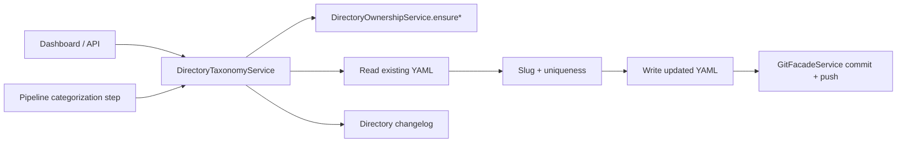

# Implementation Plan: Taxonomy System

**Feature ID**: `taxonomy-system`
**Spec**: `./spec.md`
**Status**: `Done` (Retrospective)
**Last updated**: 2026-05-01

---

## 1. Architecture



## 2. Tech Choices

| Concern            | Choice                              | Rationale                                     |
| ------------------ | ----------------------------------- | --------------------------------------------- |
| Storage            | YAML files in the data repo         | Principle III                                 |
| Slug generation    | `slugifyText()` shared util         | Consistent across categories/tags/collections |
| Uniqueness check   | Case-insensitive in-memory match    | Cheap; data fits in memory                    |
| Role enforcement   | `DirectoryOwnershipService.ensure*` | Single source of truth                        |
| Mutation atomicity | One git commit per CRUD operation   | Simple recovery model                         |

## 3. Data Model

No DB schema. Storage:

```
<slug>-data/
  categories.yml
  tags.yml
  collections.yml
  data/<item-slug>/item.yml   # references by id
```

## 4. API Surface

| Method   | Endpoint                                         | Description       |
| -------- | ------------------------------------------------ | ----------------- |
| `GET`    | `/api/directories/:id/categories-tags`           | List all three    |
| `POST`   | `/api/directories/:id/categories`                | Create category   |
| `PUT`    | `/api/directories/:id/categories/:categoryId`    | Update category   |
| `DELETE` | `/api/directories/:id/categories/:categoryId`    | Delete category   |
| `POST`   | `/api/directories/:id/tags`                      | Create tag        |
| `PUT`    | `/api/directories/:id/tags/:tagId`               | Update tag        |
| `DELETE` | `/api/directories/:id/tags/:tagId`               | Delete tag        |
| `POST`   | `/api/directories/:id/collections`               | Create collection |
| `PUT`    | `/api/directories/:id/collections/:collectionId` | Update collection |
| `DELETE` | `/api/directories/:id/collections/:collectionId` | Delete collection |

## 5. Plugin / Web / CLI

- Plugins: AI generation in the Standard Pipeline goes through the
  taxonomy service.
- Web: dedicated tabs under **Items → Categories / Tags / Collections**.
- CLI: not directly exposed.

## 6. Background Jobs

None — taxonomy mutations are inline.

## 7. Security & Permissions

- Read: viewer role.
- Write: editor role.
- Both via `DirectoryOwnershipService`.

## 8. Observability

- `category_change`, `tag_change`, `collection_change` entries in the
  Directory Changelog.

## 9. Risks & Mitigations

| Risk                                          | Mitigation                                               |
| --------------------------------------------- | -------------------------------------------------------- |
| Items left dangling after category delete     | Documented behaviour; UI can surface a cleanup hint      |
| Two concurrent creates race for the same slug | Read-modify-write within one git session resolves to one |
| Renamed entity loses references               | Slug id is immutable on update                           |

## 10. Constitution Reconciliation

See `spec.md` §9.

## 11. References

- Spec: `./spec.md`
- Implementation:
    - `packages/agent/src/services/directory-taxonomy.service.ts`
    - `packages/agent/src/services/directory-ownership.service.ts`
- Related: [`collections/spec.md`](../collections/spec.md)
