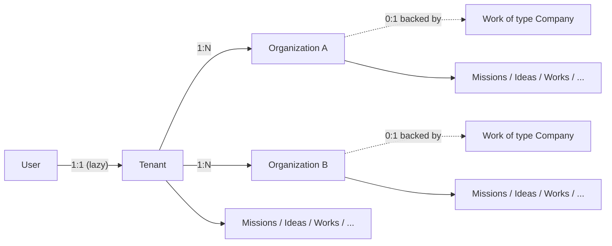

# Tenants & Organizations — Product Spec

**Status:** Draft v1 · **Owner:** Product (Ruslan) · **Date:** 2026-05-27
**Audience:** Product, Engineering (backend + frontend + AI), Design
**Internal codename:** "Workspace foundation"
**Related code today:**

- `users` entity, `apps/api/src/auth/*`, `apps/api/src/onboarding/*`
- `users.username` referenced by `github-app-onboarding.service.ts:223-229` (existing suffix-on-collision pattern) and `onboarding-account.adapter.ts:138-145` (asserted DB UNIQUE constraint)
- `Work.organizationId` already exists as forward-looking nullable UUID column ([`work.entity.ts:96-116`](../../../../packages/agent/src/entities/work.entity.ts), migration [`1779977000000-AddWorkOrganizationId.ts`](../../../../apps/api/src/migrations/1779977000000-AddWorkOrganizationId.ts))
- `WorkKnowledgeDocument.organizationId` already exists with the same forward-looking treatment ([`work-knowledge-document.entity.ts:62-67`](../../../../packages/agent/src/entities/work-knowledge-document.entity.ts))
- Spec §7.6 (referenced in `work.entity.ts` comments) anticipated this entity

> **Scope of this document:** product behavior — concepts, relationships, UX, UI, flows, states, naming. Implementation details are referenced where they constrain behavior. The phased execution plan lives in the sibling [plan.md](plan.md); the task checklist in [tasks.md](tasks.md); acceptance criteria in [acceptance.md](acceptance.md).
>
> **Hard rule (NN #20 — additive by default):** Nothing currently shipping is removed or rewritten. Every column added is nullable on insert and additive to existing tables. Every UI surface is layered on top of existing UI. Existing users keep working with zero migration: they have no Tenant and no Organization until they explicitly create one.

---

## 0. TL;DR

We introduce two new internal entities — **Tenant** and **Organization** — to give every user a scope they own and an optional sub-scope (or several sub-scopes) for registered companies.

```
User  ─1───1─►  Tenant  ─1───N─►  Organization
                                       │
                                       └─◄── (one Work of type Company can back each Org)
```

- **Tenant** — fully internal concept. Never appears in the UI. One per user, created on demand the first time the user creates an Organization. The default scope for everything the user owns.
- **Organization** — user-facing. UI label varies by context: in settings and switcher it reads "Organization"; in the new-item chips and Stripe-Atlas registration flow it reads "Company". Same row in DB either way. A Tenant can have zero, one, or many Organizations.
- **Switcher** — a small icon at the top-left of the sidebar (where the Ever Works logo lives today). Hidden while the user has zero Organizations; appears with chevron + Org logo/name once one exists. Cycles between the user's Organizations.
- **URL slug** — `user.username` (URL-safe form) when the user has no Org active; `organization.slug` when an Org is active. Same path shape: `/{slug}/missions/...`.

Existing users: no Tenant row, no Organization row, no `tenantId` set on their existing entities. Everything keeps working. The moment they create their first Organization and choose "**upgrade current account**", a Tenant is created for them, the Organization is linked to it, and their existing rows are backfilled with `tenantId` (and, for rows they want under the Org, `organizationId`).

---

## 1. The Two Concepts

### 1.1 Tenant (internal-only, NEVER shown in UI)

A **Tenant** is the user's private account scope. It is the always-present default container for everything the user creates.

- **Cardinality:** 1 User : 1 Tenant. The User table gains a nullable `tenantId` FK column. A Tenant row is created the first time the user creates an Organization (lazy creation — see §5.1).
- **UI visibility:** none. The word "Tenant" never appears in any user-facing string. It is a backend / DB concept only. The user sees their account name (handle) or their Organization name, never the Tenant.
- **Why this exists:** every row in the system needs to know _which user's scope_ it belongs to. Putting `userId` on every row works only as long as we assume 1:1 user:scope; the Tenant abstraction lets us evolve that later (e.g. shared workspaces, agency client scopes) without re-plumbing every entity.
- **Properties:**
    - `id` (uuid)
    - `ownerUserId` (uuid, unique, FK to `users.id`)
    - `slug` (varchar, mirrors `users.username` for routing; unique)
    - `displayName` (varchar; falls back to username)
    - `createdAt`, `updatedAt`

### 1.2 Organization (user-facing — UI label varies)

An **Organization** is a sub-scope inside the Tenant — typically representing a registered legal entity (a Company), but it could also be an unincorporated team, a brand, a side project, anything the user wants to keep isolated from their main account.

- **Cardinality:** 1 Tenant : 0..N Organizations. A Tenant can have many Organizations. Each Organization belongs to exactly one Tenant.
- **UI labels (same DB row, different wording per surface):**
    - **"Organization"** — in the switcher popover heading, in the Settings → Organization page, anywhere the user is managing scope.
    - **"Company"** — in the `+ New` page chips ("Mission · Idea · Website · Landing Page · Store · Blog · Directory · Awesome Repo · Company"), in Stripe Atlas registration copy, in the Work-of-type-Company flow.
    - When a Work of type Company is created and succeeds (e.g. Stripe Atlas registration completes), a corresponding Organization row is created (or linked) — see §5.4.
- **Properties:**
    - `id` (uuid)
    - `tenantId` (uuid, FK to `tenants.id`)
    - `slug` (varchar, **globally unique** — coexists with `users.slug` in the URL namespace, see §6.2)
    - `legalName` (varchar; the registered name if it's a real Company)
    - `displayName` (varchar; what shows in the switcher chip)
    - `countryCode` (varchar(2), nullable)
    - `registrationProvider` (varchar, nullable: `'stripe-atlas' | 'manual' | …`)
    - `registrationStatus` (varchar: `'draft' | 'pending' | 'registered'`)
    - `linkedWorkId` (uuid, nullable, FK to `works.id`) — the Work of type Company that backs this Organization, if any
    - `createdAt`, `updatedAt`
- **Logo / avatar:** v1 uses a deterministic generated avatar from the slug initials (no upload). v1.1 may add upload to the Settings → Organization page.

### 1.3 "Company" vs "Organization" — display wording

The user explicitly chose: **DB always says `organizations` / `organizationId`; UI says "Company" wherever it reads more naturally to a founder.**

| UI surface                     | Wording                                                     |
| ------------------------------ | ----------------------------------------------------------- |
| `+ New` page chips             | **Company** (alongside Mission, Idea, Website, etc.)        |
| Stripe Atlas registration flow | **Register Company**                                        |
| Settings page section          | **Organization**                                            |
| Switcher popover heading       | **Organizations**                                           |
| Switch chip in sidebar         | display name of the selected Organization (no label prefix) |
| API endpoints                  | `/api/organizations` (technical name; not user-visible)     |
| DB columns                     | `organizationId`                                            |

This is a wording-only choice; no two entities, no two tables, no two API surfaces.

---

## 2. Relationships & Scoping Rules

### 2.1 Relationship diagram



### 2.2 Scoping rules for entities

Every business-level entity gains two new columns:

- `tenantId` — required (NOT NULL) **after** the user's first Organization create (which triggers Tenant creation). Until then, existing rows have `NULL` — see §5.1 lazy backfill. New rows on a user who already has a Tenant are written with `tenantId` set on insert.
- `organizationId` — always nullable. NULL means "belongs directly to the Tenant, not to any specific Organization." Set means "scoped to this Organization."

A row's effective scope:

- `organizationId IS NOT NULL` → scoped to that Organization. The switcher must be on that Organization to see it.
- `organizationId IS NULL AND tenantId IS NOT NULL` → scoped to the Tenant root. Visible when no Organization is selected (i.e. the bare account view).
- `tenantId IS NULL` → legacy / pre-Tenant row. Visible in the bare account view of its owning user.

### 2.3 Three tiers of entities (which columns each tier gets)

#### Tier A — top-level business objects (both `tenantId` + `organizationId`)

- `Mission`, `Work`_, `Task`, `Agent`, `Skill`, `WorkProposal` (Ideas), `Conversation`, `Notification`, `ApiKey`, `Template`, `TemplateCustomization`, `UserSubscription`, `WorkSchedule`, `WorkDeployment`, `OnboardingRequest`, `WorkKnowledgeDocument`_, `WebhookSubscription`, `GithubAppInstallation`, `GithubAppUserLink`
- (\*) `Work.organizationId` and `WorkKnowledgeDocument.organizationId` already exist as free-form UUID columns; they get upgraded to FK referencing `organizations.id` in this work. `tenantId` is added fresh.

#### Tier B — user-scoped but org-irrelevant (`tenantId` only)

- `AuthAccount`, `AuthSession`, `AuthVerification`, `RefreshToken`, `UserTemplatePreference`, `UserTaskCounter`
- No `organizationId` — these are user-identity records, never scoped to a sub-org.

#### Tier C — children that denormalize `tenantId` (and `organizationId` where applicable) — per user decision

- `ConversationMessage`, `TaskAssignee`, `TaskApprover`, `TaskReviewer`, `TaskWatcher`, `TaskBlock`, `TaskChatMessage`, `TaskKbMention`, `TaskAttachment`, `TaskRelation`, `AgentRun`, `AgentRunLog`, `AgentBudget`, `AgentMembership`, `SkillBinding`, `WorkMember`, `WorkInvitation`, `WorkGenerationHistory`, `WorkKnowledgeChunk`, `WorkKnowledgeCitation`, `WorkKnowledgeTag`, `WorkKnowledgeUpload`, `WebhookDelivery`, `UsageLedgerEntry`, `PluginUsageEvent`, `ActivityLog`
- These rows denormalize `tenantId` for cheap scoping/RLS-style queries without joins.
- For `organizationId`: denormalize when the parent has it (most do — TaskAssignee inherits from Task, etc.).
- Service-layer responsibility: every create path sets `tenantId` (and `organizationId` if parent has one) on insert. No backfill needed for new installs; lazy backfill on first-Org-upgrade for the user's existing rows (§5.1).

#### Tier D — global / system (neither column)

- `SubscriptionPlan` (global catalog), `Cache` (system-level).

### 2.4 What an Organization "owns"

The user explicitly said: _"each company might have own Works (e.g. few websites, apps etc) and also Agents and also Tasks associated with such company and Human employees etc."_

So an Organization can directly own:

- Missions, Ideas, Works, Tasks, Agents, Skills (Tier A: any of these can carry `organizationId = thisOrg.id`)
- Knowledge documents (KB org-overlay)
- Human members (via `WorkMember` denormalized with `organizationId` — though full org-membership management is v1.1)

A Mission scoped to an Organization spawns Ideas scoped to the same Organization, which become Works scoped to the same Organization. The fan-out preserves scope automatically because every child inherits `organizationId` from its parent at create time.

---

## 3. Username — Uniqueness and URL Safety

Today's state (verified 2026-05-27):

- `user.entity.ts:40` declares `@Column()` with no `unique: true`.
- `github-app-onboarding.service.ts:223-229` runs a suffix-on-collision loop using `userRepository.findByUsername`.
- `onboarding-account.adapter.ts:140-145` _asserts_ a DB UNIQUE constraint exists, but no migration adds one and TypeORM's auto-sync may have created it inconsistently across environments.

This spec fixes the contract:

### 3.1 Database

Add a UNIQUE index on `users.username` (case-insensitive on Postgres via `lower(username)` expression index). Migration is straightforward — no live users with duplicates to resolve because the platform is not yet live. The migration adds a one-time guard: if duplicates exist, the migration _fails loudly_ with a clear message; operator decides resolution.

Also add `users.slug` — a URL-safe denormalized form of username (lowercase ASCII, hyphens). Maintained on insert and on every username update via a service-layer hook. Unique index on `users.slug` (case-insensitive equivalent on Postgres).

### 3.2 Two flows for collisions

| Flow               | Trigger                                                                                                                                             | Behavior                                                                                                                                                                                                                                                                                                   |
| ------------------ | --------------------------------------------------------------------------------------------------------------------------------------------------- | ---------------------------------------------------------------------------------------------------------------------------------------------------------------------------------------------------------------------------------------------------------------------------------------------------------- |
| **Programmatic**   | OAuth callback, GitHub App install, social-auth registration, anonymous claim, any code path where the user is not interactively picking a username | Existing `findByUsername` + suffix loop (extract into shared `UsernameAllocatorService`). User never sees a "taken" error — they get `ever`, `ever-2`, `ever-3` automatically.                                                                                                                             |
| **Interactive UI** | Username field on a signup or settings form                                                                                                         | Debounced `GET /api/users/check-username?value=...` returns `{ available: boolean, suggestion?: string }`. On collision, surface "username taken — suggested: `ever-2`" with the suggestion pre-filled in the input. User accepts or types another. The form blocks submit until the value is `available`. |

### 3.3 URL safety

`users.slug` is the URL-safe form. Generated from `username` via:

1. Lowercase.
2. Replace any non-`[a-z0-9-]` with `-`.
3. Collapse runs of `-` to a single `-`.
4. Strip leading/trailing `-`.
5. If empty after normalization (degenerate username), fall back to `u-{first-8-chars-of-uuid}`.
6. If the result collides with an existing `users.slug` OR `organizations.slug`, append `-2`, `-3`, … (same suffix loop as username).

The slug only changes when the username changes (and the slug recomputation goes through the same allocator, so it never collides). **No `slug_redirects` table** (user-confirmed: not needed; rename history is out of scope).

---

## 4. URL Routing

### 4.1 Path shape

```
/{slug}/missions/...
/{slug}/works/...
/{slug}/tasks/...
/{slug}/agents/...
/{slug}/settings/...
```

Always a slug at the front **on new surfaces**. Existing un-prefixed routes (`/missions/...`, `/works/...`) continue to resolve via session-scoped lookup for the lifetime of v1 — see §4.4 for the additive coexistence rule.

### 4.2 Slug resolution

Middleware on every request:

1. Read `:slug` from the URL.
2. Look up in `organizations.slug` first.
    - Hit → context is the Organization (resolves `tenantId` via the row's FK). All queries downstream are scoped `WHERE tenantId = X AND (organizationId = Y OR includeUnscoped)`.
3. If no hit, look up in `users.slug`.
    - Hit → context is the bare Tenant of that user. All queries downstream are scoped `WHERE tenantId = X AND organizationId IS NULL`.
4. No hit → 404.

Why Organization first: a user with username `acme` and an Organization with slug `acme` is a collision the slug allocator prevents at write time, but defensive precedence is "Org wins" because Orgs are explicitly created.

### 4.3 Authorization

The slug only tells us _which scope the request is viewing_. The authn layer separately verifies the requesting user is the owner of the Tenant (today, 1:1 user:Tenant). For Organizations, the requesting user must be the owner of the Tenant the Org belongs to (today; org-membership management with multiple human members is v1.1).

A request to `/acme-inc/missions/...` by a user who doesn't own the underlying Tenant returns **404** (not 403, to avoid leaking existence). Same as GitHub's behavior for private org URLs.

### 4.4 What about existing URLs?

Today's URLs (`/missions/...` with no slug, scoped via session) keep working for the lifetime of v1 alongside the new slug-prefixed routes. New surfaces (Switcher, Org create, settings) always use the slug-prefixed routes. Migration from old to new is gradual; no hard cutover. **(NN #20 — additive.)**

---

## 5. Flows

### 5.1 User signup (no change to UX, no Tenant created)

1. User signs up via any existing path (email/password, OAuth, anonymous claim, GitHub App).
2. `User` row created as today. `tenantId` is **NULL**.
3. No `Tenant` row created. No `Organization` row created.
4. User lands in the dashboard. Sidebar shows the Ever Works logo at top-left (no chevron, no switcher).
5. Everything the user creates from here is `tenantId = NULL, organizationId = NULL`. Existing behavior — nothing changes.

> **Rationale (user-confirmed):** _"we are NOT live yet, so we don't need any backfill. For existing users, it all should keep working as they will not have Orgs yet."_

### 5.2 User creates their FIRST Organization

This is the inflection point. User clicks "**+ Create Organization**" (the only option in the empty-state switcher popover when zero Orgs exist) OR creates a Work of type Company (§5.4).

**Step 1 — modal: "Create Organization":**

- Input: `Name` (required) — used to derive `slug` and `displayName`.
- Auto-suggested slug shown live as user types (debounced collision check vs `users.slug` + `organizations.slug`).
- Submit → server validates, creates Organization in pending state.

**Step 2 — dialog: "Upgrade current account, or create new Organization?"**

> **Default option: Upgrade current account.** (User-confirmed.)
>
> Copy (suggested — refine in implementation):
>
> - **Upgrade current account** _(default, pre-selected)_
>     > "All your existing missions, ideas, works, and other items become part of **{Org name}**. You won't have a separate personal account anymore."
> - **Create with empty data**
>     > "Start **{Org name}** fresh. Your existing items stay on your personal account, separate from the new Organization."

**Step 3a — "Upgrade current account" branch:**

1. Server creates the Tenant row for this user (lazy creation): `INSERT INTO tenants(ownerUserId, slug, displayName) VALUES (user.id, user.slug, user.username)`.
2. Sets `users.tenantId = newTenant.id`.
3. Sets `organizations.tenantId = newTenant.id`.
4. **Lazy backfill (per-tier — Tier B has no `organizationId` column):**
    - **Tier A + Tier C** rows owned by this user: UPDATE to set BOTH `tenantId = newTenant.id` AND `organizationId = newOrg.id` (move existing items into the new Org).
    - **Tier B** rows owned by this user: UPDATE to set `tenantId = newTenant.id` ONLY. Tier B entities (`AuthAccount`, `AuthSession`, `AuthVerification`, `RefreshToken`, `UserTemplatePreference`, `UserTaskCounter`) are user-identity records and **do not have an `organizationId` column** ([§2.3](#23-three-tiers-of-entities-which-columns-each-tier-gets)) — setting `organizationId` on them would fail the migration.
5. Switcher in UI updates to show the Org chip; URL slug changes from `user.slug` to `org.slug`; client navigates to the Org's dashboard.

**Step 3b — "Create with empty data" branch:**

1. Server creates the Tenant row (lazy, same as 3a step 1).
2. Sets `users.tenantId = newTenant.id`.
3. Sets `organizations.tenantId = newTenant.id`.
4. **Backfills the user's existing rows with `tenantId` only** across all three tiers (Tier A, B, C) — `organizationId` is NOT touched on any row, so existing items stay at the Tenant root rather than entering the new Org.
5. The Org is created empty. Switching to it shows zero items. The bare-Tenant view (clicking the user-named entry in the switcher) still shows the user's existing items.

> **Crucial detail:** in both branches we backfill `tenantId` on existing rows at this moment. Before this moment, those rows had `tenantId = NULL`. After this moment, the user has a real Tenant and every one of their rows knows about it. The `organizationId` column is only touched on Tier A + Tier C, and only in branch 3a.

> **First-Org guard:** the backfill is gated by a server-side check — `upgradeFromAccount` only runs when the user has exactly one Organization (the one just created). Calling it again after the user has created additional Organizations returns **409 Conflict** to prevent retroactively pulling items into a non-first Org.

### 5.3 User creates a SECOND (or third, …) Organization

Same as §5.2 but:

- Tenant already exists; reuse it.
- "Upgrade current account" option is NOT shown (only the user's first Org gets that option). Subsequent Orgs always start empty.
- Step 2 dialog is replaced with a single confirm: "Create Organization **{Org name}**" → confirm.

### 5.4 User registers a Company via a Work of type Company

This is the Stripe-Atlas (or similar) path. UI label is **"Register Company"** (not "Create Organization") even though the underlying outcome is the same — an Organization row is created.

1. User goes to `+ New`, picks the **Company** chip, fills in the prompt and details.
2. A Work of type Company is created in the user's current scope (Tenant root, or the currently-selected Organization — though typically users register a Company from their bare Tenant view).
3. Stripe Atlas (or the chosen registration provider) runs.
4. On success:
    - An `Organization` row is created with `legalName`, `countryCode`, `registrationProvider`, `registrationStatus = 'registered'`.
    - The Work's `id` is recorded on `organizations.linkedWorkId`.
    - User is presented with the same Step 2 dialog from §5.2 (**upgrade current account, or create empty**), with the same "upgrade" default.
5. The Work itself stays where it was created (no relocation — user explicitly rejected the move-the-Work behavior). It carries `organizationId = newOrg.id` so it's now visible in the Org scope as well.

> **User-confirmed quote:** _"I don't want this [relocation]. If user want to register a company he do it and we create Company 'Work' item (repo) etc inside his current Workspace! It's just workspace itself instead of show his personal details will be tied to the company that operates."_

### 5.5 Switcher behavior

The switcher icon lives at the top-left of the sidebar — the slot where the Ever Works logo currently shows.

#### Empty state (zero Organizations)

- The slot continues to show the **Ever Works logo** exactly as today.
- **No chevron**, no popover trigger. The user sees no UI hint that switching is possible — because it isn't, yet.

> **Where the first-Org create flow is reachable from (the switcher is intentionally silent — so we need explicit entry points elsewhere):**
>
> 1. **`+ New` page → "Company" chip** (§6.3) — the primary discoverable path. Picking the Company chip submits into the Register-Company sub-flow (§5.4), which spawns the first Organization once registration succeeds.
> 2. **Settings → Account → "Create your first Organization"** — a small banner / CTA on the existing account-settings page. Always present until the user has at least one Org; quietly disappears after.
> 3. **AI Chat verb** — _"create an organization called Acme Inc"_ maps to the same `POST /api/organizations` endpoint via the MCP tool surface.
>
> Without one of these entry points, the empty-state UI would be a dead end. Implementation lands in [Phase 10](plan.md#phase-10--company-chip-on--new-page--work-of-type-company--org-wire-up) (chip) and [Phase 8/9](plan.md#phase-8--workspaceswitcher-ui-sidebar-07-reskin) (settings banner).

#### Active state (1+ Organizations)

- The slot shows the **currently active Organization** (logo/initial avatar + display name).
- A small chevron (`⇅` icon, vertical) appears to the right.
- Clicking opens a popover (shadcn `<Command>` inside `<Popover>` — see [sidebar-07 TeamSwitcher](https://ui.shadcn.com/blocks#sidebar-07) component).

#### Popover contents

```
┌─────────────────────────────────┐
│ Organizations                   │  ← heading
├─────────────────────────────────┤
│ [Avatar] Acme Inc          ✓   │  ← currently active
│ [Avatar] Globex LLC             │
├─────────────────────────────────┤
│  +  Create Organization         │
└─────────────────────────────────┘
```

- Heading is **"Organizations"** (NOT "Workspaces", NOT "Tenants").
- Currently active row has a check icon.
- Clicking a different Org → switches scope, navigates to that Org's dashboard, URL slug changes.
- "+ Create Organization" → opens the modal from §5.2.

#### Where is the bare-Tenant view?

When the user has 1+ Organizations and is currently viewing the bare Tenant (their pre-Org items), the switcher chip shows the **user's display name** (their username, or whatever non-Org label fits) and the popover lists Organizations below it. Bare Tenant is implicit (not labeled "Personal" — user-confirmed).

Two design options to surface bare Tenant in the popover:

- **(a)** Don't list it — clicking the user-name chip at top toggles between "back to my account" and the currently-active Org. _Simpler, slightly less discoverable._
- **(b)** List the bare Tenant as the first row, labeled with the user's display name (e.g. "ever"). _More uniform with the Org rows._

**Recommendation:** **(b)** — uniform list, no special case. Each row in the popover is just a scope; the bare Tenant is "the scope without an Org filter applied."

### 5.6 Default Organization on next login

The most recently active scope is persisted on the User row as `users.lastScopeOrganizationId: uuid | null` — `null` means bare Tenant. On the next login, the user lands in that scope.

> **Migration:** the `users.lastScopeOrganizationId` column lands as part of [Phase 2](plan.md#phase-2--add-tenantid-to-users-add-tenantid-to-tier-b-entities) alongside `users.tenantId` — same migration file, same nullable+FK pattern, no backfill (NULL means "default to bare Tenant"). The lazy-upgrade flow in Phase 6 sets it to the new Org's id when the user picks the "Upgrade current account" branch.

---

## 6. UI Implementation Notes

### 6.1 Switcher component

- Reuse shadcn [sidebar-07](https://ui.shadcn.com/blocks#sidebar-07) `TeamSwitcher` component as the base; rename to `WorkspaceSwitcher` (internal name) and re-label the popover heading to "Organizations".
- Empty state (zero Orgs): render the existing Ever Works logo component as-is. Wrap the logo in a conditional: if `organizations.length === 0 && !isLoading`, just render the logo. Otherwise, render the switcher.
- Active state: avatar = `Organization.displayName.charAt(0)` deterministic-color background, OR a future uploaded logo (v1.1).

### 6.2 Routes

- New routes (App Router): `apps/web/src/app/[slug]/` — accepts the slug param, validates via middleware, sets a request-scoped scope context.
- Old routes (`apps/web/src/app/(dashboard)/...`) — keep working for sessions where slug routing is not yet rolled out.
- Both can coexist; the slug-prefixed routes are the new canonical, the un-prefixed routes are the legacy aliases.

### 6.3 `+ New` page — Company chip

Add **Company** to the chips on the unified `+ New` page (§4.0 of the [Missions/Ideas/Works spec](../../../../../../Workspace/knowledge/notes/2026-05-24-missions-ideas-works-spec.md)). Order: `Mission · Idea · Website · Landing Page · Store · Blog · Directory · Awesome Repo · Knowledge Base · Company`. Picking the Company chip routes the submit into the Register-Company flow (§5.4).

> The user-facing chip is labeled "Company", but downstream entities are Organization rows. The wording-vs-DB split (§1.3) holds.

### 6.4 Settings → Organization page (new)

A new page at `/{slug}/settings/organization` (only present when the active scope is an Organization). Surfaces:

- `displayName`, `legalName`, `countryCode`, `slug` (with collision check on save), avatar/logo (v1.1).
- Registration provider + status (read-only if `'registered'`).
- Link to the Work that backs this Org (`organizations.linkedWorkId`) — opens the Work detail in Canvas.

Members management (inviting other humans into the Org) is **v1.1** (deferred — user said earlier _"so let's not go into it today"_). For v1, the Tenant owner is the sole member of every Org in their Tenant.

### 6.5 Existing pages — no copy changes

Per NN #20, no existing UI string changes. The only UI additions are:

- Switcher slot (replaces visual of the Ever Works logo only once user has 1+ Org).
- `Company` chip on `+ New` page (added to the existing chip list).
- Settings → Organization sub-page (new sub-route only).
- Create Organization modal + post-create dialog (new modals, surfaced by the Switcher's "+ Create Organization" entry).

---

## 7. Open Decisions & Out-of-Scope (v1.1+)

- **Multi-tenant per user** — today, 1 User : 1 Tenant. If someone wants truly isolated separate accounts (different billing, different members, different Stripe customers), that becomes 1 User : N Tenants. Trivial schema change (drop the unique on `tenants.ownerUserId`); flagged as v1.1 if demand emerges.
- **Org-membership (inviting other humans into an Org)** — deferred to v1.1. v1 ships with the Tenant owner as sole member of every Org. The existing `WorkMember` / `WorkInvitation` Work-scoped invitations keep working; an Org-scoped equivalent (`OrganizationMember` / `OrganizationInvitation`) lands in v1.1.
- **Holdco / subsidiaries (Org-inside-Org)** — explicitly out of scope. Decision recorded in earlier brainstorm: keep strictly two levels (Tenant → Organization).
- **Slug rename history / redirects** — explicitly out of scope. User said no slug_redirects table.
- **Org logo upload** — v1.1. v1 uses deterministic generated avatars.

---

## 8. Cross-References

- Implementation plan: [plan.md](plan.md)
- Task checklist: [tasks.md](tasks.md)
- Acceptance criteria: [acceptance.md](acceptance.md)
- Companion Workspace note: [`Workspace/knowledge/notes/2026-05-27-tenants-and-organizations-spec.md`](../../../../../../Workspace/knowledge/notes/2026-05-27-tenants-and-organizations-spec.md)
- Related product spec: [Missions → Ideas → Works](../../../../../../Workspace/knowledge/notes/2026-05-24-missions-ideas-works-spec.md)
- Existing forward-looking columns: [`work.entity.ts`](../../../../packages/agent/src/entities/work.entity.ts) `organizationId`, [`work-knowledge-document.entity.ts`](../../../../packages/agent/src/entities/work-knowledge-document.entity.ts) `organizationId`
- Existing username pattern: [`github-app-onboarding.service.ts`](../../../../apps/api/src/integrations/github-app/github-app-onboarding.service.ts) lines 223-229
- shadcn switcher reference: <https://ui.shadcn.com/blocks#sidebar-07>
