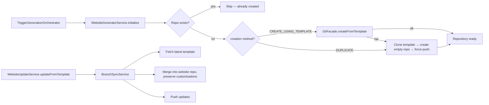

# Implementation Plan: Website Generator

**Feature ID**: `website-generator`
**Spec**: `./spec.md`
**Tasks**: `./tasks.md`
**Status**: `Done` (Retrospective)
**Last updated**: 2026-05-02

---

## 1. Architecture



The website generator runs as the **third stage** of the
`work-generation` Trigger.dev task, after the data and markdown
generators. Its primary job is **idempotent repository creation** —
on the first run it provisions the user's website repo from a
canonical template; on subsequent runs it skips creation and
optionally syncs template updates if the work has auto-update
enabled.

## 2. Tech Choices

| Concern                 | Choice                                             | Rationale                                                             |
| ----------------------- | -------------------------------------------------- | --------------------------------------------------------------------- |
| Default creation method | `DUPLICATE`                                        | Works on personal + org accounts; full control over the process       |
| Fallback method         | `DUPLICATE` when `CREATE_USING_TEMPLATE` fails     | GitHub's template feature has org-permission edge cases               |
| Template repo           | `ever-works/directory-web-template` (configurable) | One canonical Next.js base; user repos diverge by user customizations |
| Template branch         | `main` (stable) or `stage` (beta)                  | Beta opt-in via `useBetaVersion` work setting                         |
| Idempotence             | Skip when target repo already exists               | Repeat runs (e.g. weekly schedules) must not clobber the user's repo  |
| Naming                  | `{work-slug}-web`                                  | Mirrors data (`-data`) and markdown (no suffix) naming convention     |
| Auto-update             | Opt-in per work; runs through `BranchSyncService`  | Avoids surprising users who customised their website repo             |

## 3. Data Model

The website generator owns no TypeORM entity of its own. Persistent
state is split between:

- **`Work.websiteAutoUpdate`** — the auto-update opt-in /
  beta-version flags + last check / last update timestamps.
- **The user's website repository on GitHub** — the actual
  artifact, structured as the template defines (Next.js App Router).

```ts
interface WebsiteAutoUpdateConfig {
	enabled: boolean;
	useBetaVersion: boolean;
	lastChecked?: Date;
	lastUpdated?: Date;
	lastError?: string;
}
```

## 4. API Surface

The website generator is invoked from the trigger orchestrator
(no public surface for the creation flow itself).

For auto-update configuration:

| Method | Endpoint                             | Auth                  | Description                              |
| ------ | ------------------------------------ | --------------------- | ---------------------------------------- |
| `PUT`  | `/api/works/:id/website-auto-update` | JWT (editor or above) | Enable/disable auto-update + beta toggle |
| `POST` | `/api/works/:id/website-update`      | JWT (editor or above) | Trigger an immediate template merge      |

```ts
class UpdateWebsiteRepositoryDto {
	autoUpdate?: boolean;
	useBetaVersion?: boolean;
}
```

`WebsiteGeneratorResult` returned to the orchestrator:

```ts
interface WebsiteGeneratorResult {
	success: boolean;
	repositoryUrl?: string;
	error?: string;
}
```

## 5. Plugin Surface

- Git operations route through `GitFacadeService`
  (`git-github` plugin) — repository creation, clone, force-push,
  template-instantiation, branch operations.
- Deployment is **not** the website generator's concern — see the
  separate `DeployService` and the `vercel` plugin.

## 6. Web / CLI Surface

- Web: work detail page exposes "Website" tab with
    - the website repo URL and a one-click open
    - auto-update toggle + beta opt-in
    - "Update from template now" button
- CLI: `everworks generate <id>` triggers the same orchestrator;
  no dedicated CLI command for website-only.

## 7. Background Jobs

The creation flow runs inline inside the
`work-generation` Trigger.dev task. A separate scheduled job
(`work-schedule-dispatcher`) re-triggers generation on a
cadence; if `websiteAutoUpdate.enabled` is on, the website generator
calls `WebsiteUpdateService.updateFromTemplate` during that run to
fetch the latest template changes.

## 8. Security & Permissions

- Creation requires the user's GitHub OAuth token with `repo` scope.
- The generator never grants access to the template repo — it
  duplicates content into the user's namespace, where the user has
  full ownership.
- Auto-update merges template changes; user customizations are
  preserved by `BranchSyncService` (per-file three-way merge).
- No new `@Public()` endpoints.

## 9. Observability

- `GenerationLogCollector` streams "website generation started" /
  "completed" / "skipped (already exists)" lines to the history row.
- `Work.websiteAutoUpdate.lastError` records the most recent
  auto-update failure surface for the dashboard to display.
- Activity log records `website_repository_created` and
  `website_template_updated` events.

## 10. Phased Rollout

Shipped pre-Spec-Kit. The auto-update feature was added later as an
additive opt-in; no rollout flag was needed because behaviour
without the field is "do nothing", which preserves prior semantics.

## 11. Risks & Mitigations

| Risk                                                                        | Mitigation                                                                               |
| --------------------------------------------------------------------------- | ---------------------------------------------------------------------------------------- |
| `CREATE_USING_TEMPLATE` fails on org accounts with template-creation policy | Fallback to `DUPLICATE` is automatic and logged; user sees a successful run              |
| Auto-update overwrites user customizations                                  | `BranchSyncService` performs a per-file merge; conflicts surface as PR for user review   |
| Repository name collision (slug already used by another repo)               | Creation surfaces a clear error; user can rename the work to retry                       |
| Template repo (`ever-works/directory-web-template`) is unavailable          | Run fails with a structured `WEBSITE_TEMPLATE_NOT_FOUND` error code                      |
| Force-push during DUPLICATE on a repo that already has commits              | Existence check happens **before** creation; force-push only on empty repos created here |

## 12. Constitution Reconciliation

- **I (Plugin-first)**: Git provider is the `git-github` plugin
- **II (Capability-driven)**: `GitProviderCapability` covers all repo / template / branch ops
- **III (Source-of-truth repos)**: website repo is the third source-of-truth repo per work (data + markdown + website)
- **IV (Trigger.dev)**: runs inside the `work-generation` task
- **V (Forward-only migrations)**: only schema touched is the `Work.websiteAutoUpdate` JSON field — added additively
- **VI (Tests)**: unit tests cover both creation methods, the fallback path, and the existence-skip path
- **VII (Secret hygiene)**: GitHub OAuth tokens flow through `GitFacade`; never logged
- **VIII (Plugin counts)**: no new plugins
- **IX (Behaviour-first)**: spec describes idempotence, fallback, and naming convention before implementation
- **X (Backwards-compat)**: works without an explicit creation method default to `DUPLICATE`

## 13. References

- Spec: `./spec.md`
- Implementation: `packages/agent/src/website-generator/website-generator.service.ts`,
  `packages/agent/src/website-generator/website-update.service.ts`
- Branch sync: `packages/agent/src/website-generator/branch-sync.service.ts`
- Adjacent specs: [`features/data-generator`](../data-generator/spec.md),
  [`features/markdown-generator`](../markdown-generator/spec.md)
- Architecture: [`architecture/pipeline-overview`](../../architecture/pipeline-overview.md)
