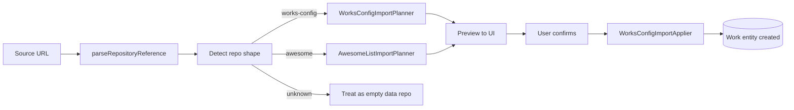

# Implementation Plan: Work Import

**Feature ID**: `work-import`
**Spec**: `./spec.md`
**Status**: `Done` (Retrospective)
**Last updated**: 2026-05-01

---

## 1. Architecture

## 2. Tech Choices

| Concern        | Choice                                      | Rationale                                     |
| -------------- | ------------------------------------------- | --------------------------------------------- |
| Repo detection | Try `works.yml` paths; fall back to README  | `works-config` has highest fidelity           |
| Awesome parser | Markdown AST traversal of nested lists      | Tolerates varied formatting; no JS evaluation |
| Dry-run        | Planner returns a preview without DB writes | UX — user can review before committing        |
| Slug conflict  | Case-insensitive lookup against `works`     | Matches GitHub repo naming                    |

## 3. Data Model

- Additive columns on `works`: `worksConfigPath` (nullable string),
  `importedFromUrl` (nullable string).

## 4. API Surface

| Method | Endpoint                    | Description                      |
| ------ | --------------------------- | -------------------------------- |
| `POST` | `/api/works/import/preview` | Dry-run; returns parsed preview  |
| `POST` | `/api/works/import`         | Confirm import; creates the work |

## 5. Plugin / Web / CLI

- Plugins: uses existing git provider + (optional) AI plugins for content
  enrichment.
- Web: import wizard with paste-URL → preview → confirm steps.
- CLI: `ever-works work import <url>`.

## 6. Background Jobs

Awesome-List item normalisation (extracting structured fields per item)
runs as a Trigger.dev fan-out task once the work is created.

## 7. Security & Permissions

- User's git provider plugin credentials read the source repo.
- Slug uniqueness scoped per user.

## 8. Observability

- Activity log: `work_import` action with status and detected shape.

## 9. Risks & Mitigations

| Risk                                                          | Mitigation                                          |
| ------------------------------------------------------------- | --------------------------------------------------- |
| Awesome-List with non-standard format                         | Skip on parse failure; user can hand-author later   |
| Plugin id changed after the source's `works.yml` was authored | Validation + clear error                            |
| Race between two users importing same repo                    | First-creator wins; second gets uniqueness conflict |

## 10. Constitution Reconciliation

See `spec.md` §9.

## 11. References

- Spec: `./spec.md`
- Implementation:
    - `packages/agent/src/works-config/services/works-config-import-planner.service.ts`
    - `packages/agent/src/works-config/services/works-config-import-applier.service.ts`
    - `packages/agent/src/import/`
