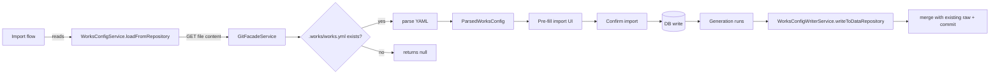

# Implementation Plan: `.works/works.yml` Source-Controlled Work Configuration

**Feature ID**: `works-config`
**Spec**: `./spec.md`
**Tasks**: `./tasks.md`
**Status**: `Done` (Retrospective)
**Last updated**: 2026-05-01

---

## 1. Architecture Summary

## 2. Tech Choices

| Concern        | Choice                                                  | Rationale                                |
| -------------- | ------------------------------------------------------- | ---------------------------------------- |
| YAML parsing   | `yaml` package                                          | Standards-compliant, round-trip-friendly |
| Git access     | `GitFacadeService` (existing)                           | Principle II — no direct Octokit usage   |
| Persistence    | Mirror to existing `works` columns; raw blob not stored | Avoid double source-of-truth             |
| Background job | None                                                    | Sync runs inline with generation         |

## 3. Data Model

No schema changes — the writer mirrors existing `works` columns
(`name`, `initialPrompt`, `model`, `providers`, `scheduledCadence`,
`scheduledUpdatesEnabled`, `websiteRepositoryTarget`) into the YAML file.

## 4. API Surface

No new endpoints. `.works/works.yml` is read during the existing
`POST /api/works/import` flow and written by the work generation
flow.

## 5. Plugin Surface

None — the service references existing plugin facades for git access only.

## 6. Web / CLI Surface

The import flow's existing UI displays parsed values in disabled form fields
labeled "From .works/works.yml". No new pages.

## 7. Background Jobs

None — `.works/works.yml` is read at import time and written at the end of each
generation, both in-process.

## 8. Security & Permissions

- `loadFromRepository` uses the user's git credentials (their installed
  plugin's OAuth token / GitHub App token). The platform never reads with
  elevated privileges.
- The writer commits as the platform's git identity (per the user's
  configured `gitProvider` plugin).
- `.works/works.yml` MUST NOT contain secrets — enforced by the writer (which
  only writes non-secret fields) and by reviewer convention.

## 9. Observability

- Parse failures: activity-log action `work_import` with status `failed`
  and `details.reason = 'works_config_parse_error'`.
- Plugin-id validation failures: activity-log action `work_import` with
  status `failed` and `details.reason = 'unknown_plugin_id'`.
- Sync failures: activity-log action `works_config_sync_failure` with the
  error message.

## 10. Phased Rollout

The feature shipped behind no flag — small enough to land directly. Future
breaking changes to the `.works/works.yml` schema would ship a new version field
and a migration step in the parser.

## 11. Risks & Mitigations

| Risk                                                     | Likelihood | Impact | Mitigation                                                                                     |
| -------------------------------------------------------- | ---------- | ------ | ---------------------------------------------------------------------------------------------- |
| User commits a secret in `.works/works.yml` accidentally | Low        | Med    | Writer never writes secret fields; reviewer convention; docs                                   |
| Renaming a field breaks existing hand-authored files     | Med        | Med    | Field aliases (multiple keys map to the same parsed property)                                  |
| Sync push race vs concurrent manual edits                | Low        | Low    | Writer runs inside the same git session that just committed                                    |
| YAML round-trip drops comments                           | High       | Low    | Documented limitation; users who want comments use `.works/works.yml` and accept the trade-off |

## 12. Constitution Reconciliation

See `spec.md` §9. All gates satisfied.

## 13. References

- Spec: `./spec.md`
- Tasks: `./tasks.md`
- Implementation:
    - `packages/agent/src/works-config/services/works-config.service.ts`
    - `packages/agent/src/works-config/services/works-config-writer.service.ts`
    - `packages/agent/src/works-config/services/works-config-import-planner.service.ts`
    - `packages/agent/src/works-config/services/works-config-import-applier.service.ts`
    - `packages/agent/src/works-config/services/works-config-restore.service.ts`
- Tests: `packages/agent/src/works-config/__tests__/`
