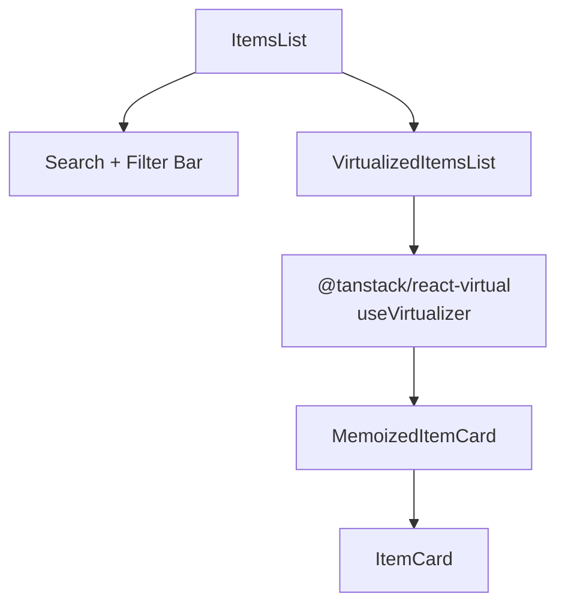

# Data Tables and Lists

The Ever Works dashboard uses several patterns for displaying collections of data: virtualized item lists for large datasets, HTML tables for tabular data, card grids for plugin browsing, and divided lists for member management. This page documents each pattern and the components that implement them.

## Component Overview

| Component         | Pattern                                  | Virtualized | Source                                                |
| ----------------- | ---------------------------------------- | ----------- | ----------------------------------------------------- |
| `ItemsList`       | Card grid / list with search and filters | Yes         | `components/works/detail/items/ItemsList.tsx`         |
| `HistoryTable`    | HTML table with status badges            | No          | `components/works/detail/history/HistoryTable.tsx`    |
| `PluginGrid`      | Card grid with category grouping         | No          | `components/plugins/PluginGrid.tsx`                   |
| `WorkPluginsList` | Card list with capability selectors      | No          | `components/works/detail/plugins/WorkPluginsList.tsx` |
| `MembersList`     | Divided list with role badges            | No          | `components/works/detail/members/MembersList.tsx`     |

## ItemsList -- Virtualized Item Grid

**Source:** `apps/web/src/components/works/detail/items/ItemsList.tsx`

The `ItemsList` component displays work items in a searchable, filterable, virtualized grid. It uses `@tanstack/react-virtual` to efficiently render hundreds or thousands of items without performance degradation.

### Architecture



### Props

```typescript
interface ItemsListProps {
	items: ItemData[];
	addItemRef?: React.RefObject<((item: ItemData) => void) | null>;
}
```

The `addItemRef` allows parent components to imperatively add new items to the list (e.g., when a user creates an item through the UI).

### Features

| Feature                  | Description                                                    |
| ------------------------ | -------------------------------------------------------------- |
| **Text search**          | Filters items by name and description                          |
| **Category filter**      | Dropdown to filter by category                                 |
| **View toggle**          | Switch between grid and list views                             |
| **Virtualization**       | Only renders visible rows plus 5 overscan rows                 |
| **Responsive columns**   | 1 column on mobile, 2 on tablet, 3 on desktop                  |
| **Memoized cards**       | `React.memo` wrapper prevents unnecessary re-renders           |
| **Sort order**           | Featured items first, then by `order` field, then alphabetical |
| **Duplicate prevention** | New items are checked by slug to prevent duplicates            |

### Responsive Column Layout

The `useColumnCount` hook adjusts the grid column count based on viewport width:

| Viewport Width  | View Mode | Columns |
| --------------- | --------- | ------- |
| < 640px         | Grid      | 1       |
| 640px -- 1023px | Grid      | 2       |
| >= 1024px       | Grid      | 3       |
| Any             | List      | 1       |

### Virtualization Details

The virtualizer is configured with these parameters:

```typescript
const rowVirtualizer = useVirtualizer({
	count: rows.length,
	getScrollElement: () => scrollContainerRef.current,
	estimateSize: () =>
		viewMode === 'list'
			? LIST_ITEM_HEIGHT + GAP // 80 + 16 = 96px
			: GRID_ROW_HEIGHT + GAP, // 200 + 16 = 216px
	overscan: 5,
	scrollMargin
});
```

| Parameter      | Value                      | Description                                            |
| -------------- | -------------------------- | ------------------------------------------------------ |
| `estimateSize` | 96px (list) / 216px (grid) | Estimated row height                                   |
| `overscan`     | 5                          | Extra rows rendered above and below the viewport       |
| `scrollMargin` | Calculated                 | Offset from the scroll container to the list component |

Items are grouped into rows based on the column count. In grid mode with 3 columns, every 3 items form one virtual row.

### Sort Algorithm

Items are sorted in this priority order:

1. **Featured items first** -- items with `featured: true` appear at the top
2. **Order field** -- items with a numeric `order` value are sorted ascending
3. **Alphabetical** -- remaining items are sorted by name using `localeCompare`

```typescript
function sortItems(items: ItemData[]): ItemData[] {
	return [...items].sort((a, b) => {
		if (!!a.featured !== !!b.featured) return a.featured ? -1 : 1;
		const orderA = typeof a.order === 'number' ? a.order : Infinity;
		const orderB = typeof b.order === 'number' ? b.order : Infinity;
		if (orderA !== orderB) return orderA - orderB;
		return a.name.localeCompare(b.name);
	});
}
```

## HistoryTable -- Generation History

**Source:** `apps/web/src/components/works/detail/history/HistoryTable.tsx`

The `HistoryTable` displays work generation run history as an HTML table with status badges, duration formatting, and token usage.

### Columns

| Column        | Field                       | Description                            |
| ------------- | --------------------------- | -------------------------------------- |
| Run           | `status`                    | Status badge with color coding         |
| Started At    | `startedAt` / `createdAt`   | Timestamp rendered by `ShowDateTime`   |
| Duration      | `durationInSeconds`         | Formatted as `Xh Ym`, `Xm Ys`, or `Xs` |
| New Items     | `newItemsCount`             | Items created in this run              |
| Updated Items | `updatedItemsCount`         | Items updated in this run              |
| Total Items   | `totalItemsCount`           | Total items after this run             |
| Tokens        | `metrics.total_tokens_used` | Formatted as `X.XK` or `X.XM`          |

### Status Color Coding

| Status       | Color | CSS Classes                                       |
| ------------ | ----- | ------------------------------------------------- |
| `generating` | Blue  | `bg-blue-100 text-blue-800` / dark variants       |
| `generated`  | Green | `bg-emerald-100 text-emerald-800` / dark variants |
| `error`      | Red   | `bg-red-100 text-red-800` / dark variants         |
| `cancelled`  | Gray  | `bg-gray-200 text-gray-800` / dark variants       |

### Formatting Utilities

The component includes three formatting functions:

```typescript
// Duration: seconds -> human-readable
formatDuration(3661); // "1h 1m"
formatDuration(125); // "2m 5s"
formatDuration(45); // "45s"

// Tokens: number -> abbreviated
formatTokens(1500000); // "1.5M"
formatTokens(12500); // "12.5K"
formatTokens(500); // "500"

// Cost: number -> USD
formatCost(0.0523); // "$0.0523"
```

### Trigger.dev Link

When an entry has a `triggerRunId`, the table shows a link to the Trigger.dev cloud dashboard for that run.

## PluginGrid -- Plugin Browsing

**Source:** `apps/web/src/components/plugins/PluginGrid.tsx`

The `PluginGrid` renders plugin cards in a responsive grid layout with optional category grouping.

### Props

```typescript
interface PluginGridProps {
	plugins: UserPlugin[];
	grouped: boolean; // Group by category or flat grid
	searchQuery: string; // Current search (for empty state)
	onClearSearch: () => void;
}
```

### Layout Modes

| Mode      | `grouped` | Description                               |
| --------- | --------- | ----------------------------------------- |
| Flat grid | `false`   | All plugins in a single responsive grid   |
| Grouped   | `true`    | Plugins organized under category headings |

Both modes use the same responsive grid: `grid-cols-1 md:grid-cols-2 lg:grid-cols-3 gap-4`.

### Category Grouping

When `grouped` is `true`, plugins are organized using `groupByCategory()`:

```typescript
function groupByCategory(plugins: UserPlugin[]): Record<string, UserPlugin[]> {
	return plugins.reduce(
		(acc, plugin) => {
			(acc[plugin.category] ??= []).push(plugin);
			return acc;
		},
		{} as Record<string, UserPlugin[]>
	);
}
```

Each category section renders a heading using `getCategoryLabel()` followed by a grid of `PluginCard` components.

### Empty State

The grid shows contextual empty states:

- **With search query**: Search icon, "No results" message, and "Clear search" button.
- **Without search**: Simple "No plugins" message.

## MembersList -- Work Members

**Source:** `apps/web/src/components/works/detail/members/MembersList.tsx`

The `MembersList` displays work collaborators in a divided list format with role badges and permission-based management controls.

### Layout

```mermaid
flowchart TB
    subgraph MembersList
        O[Owner Row - highlighted background]
        M1[MemberRow - with role badge]
        M2[MemberRow - with role badge]
        E[Empty State - "No members"]
    end
```

### Owner Display

The owner is always displayed first with:

- An avatar circle showing the first letter of their username
- A "Creator" role badge
- Their email address

### Member Management

Each `MemberRow` component receives a `canManage` prop determined by `canManageMembers(work.userRole)`. When `true`, the row shows management controls (role change, remove member).

### Props

```typescript
interface MembersListProps {
	work: Work;
	members: WorkMember[];
	owner: WorkOwner;
	onMemberRemoved: (memberId: string) => void;
	onMemberUpdated: (member: WorkMember) => void;
}
```

## Pattern Comparison

| Concern        | ItemsList                       | HistoryTable                | PluginGrid     | MembersList   |
| -------------- | ------------------------------- | --------------------------- | -------------- | ------------- |
| Data volume    | Hundreds to thousands           | Tens                        | Tens           | Small (< 20)  |
| Virtualization | Yes (`@tanstack/react-virtual`) | No                          | No             | No            |
| Search/filter  | Yes (text + category)           | No                          | Via parent     | No            |
| View modes     | Grid + List toggle              | Table only                  | Flat + Grouped | List only     |
| Responsive     | 1/2/3 columns                   | Horizontal scroll           | 1/2/3 columns  | Single column |
| Memoization    | `React.memo` on cards           | No                          | No             | No            |
| Sorting        | Featured > order > alpha        | Chronological (server-side) | By category    | Owner first   |

## When to Use Each Pattern

- **Virtualized grid/list** (`ItemsList` pattern): Use for collections that may grow to hundreds or thousands of items. Requires `@tanstack/react-virtual` and a scroll container reference.
- **HTML table** (`HistoryTable` pattern): Use for tabular data with a fixed set of columns and moderate row counts (under ~100 rows).
- **Card grid** (`PluginGrid` pattern): Use for browsable collections where each item needs a rich card display with images, descriptions, and actions.
- **Divided list** (`MembersList` pattern): Use for small collections where each item needs inline management controls and the total count is predictable.
