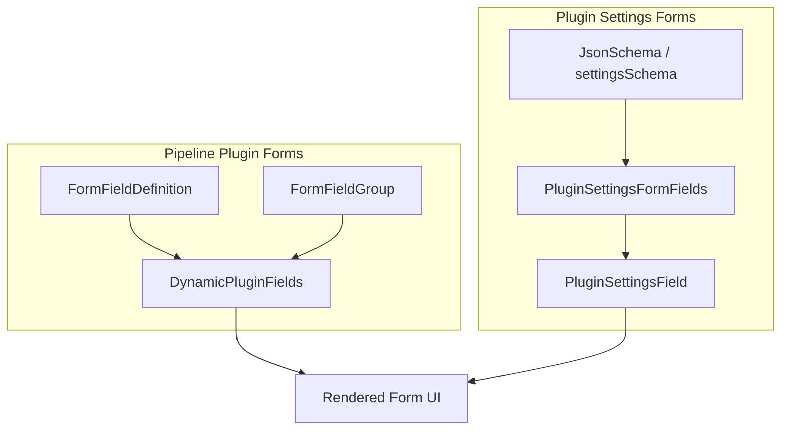
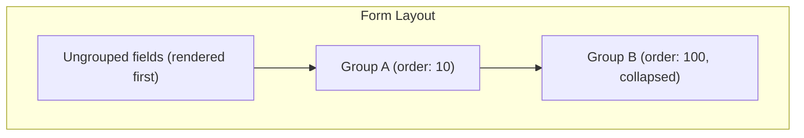
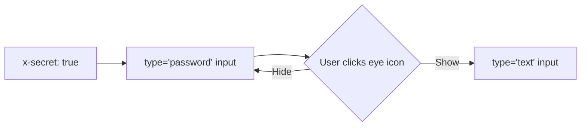
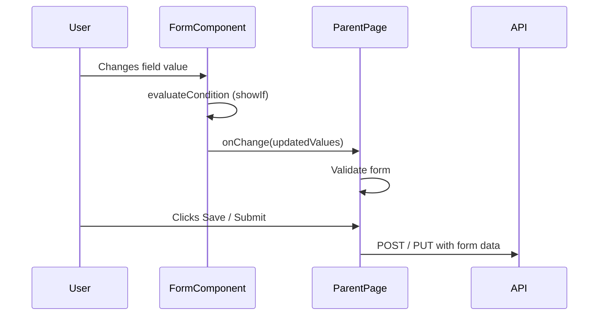

# Form System

The Ever Works dashboard uses two complementary form systems for rendering dynamic, schema-driven forms: **DynamicPluginFields** for pipeline plugin forms and **PluginSettingsFormFields** for plugin configuration. Both are client components that render fields from declarative schemas, supporting conditional visibility, field grouping, and validation.

## Form System Overview



| Form System            | Source Component               | Schema Source                                      | Used By                                          |
| ---------------------- | ------------------------------ | -------------------------------------------------- | ------------------------------------------------ |
| Dynamic Plugin Fields  | `DynamicPluginFields.tsx`      | `FormFieldDefinition[]` from `IFormSchemaProvider` | Generator form (per-work pipeline config)        |
| Plugin Settings Fields | `PluginSettingsFormFields.tsx` | `JsonSchema` from plugin `settingsSchema`          | Plugin settings page, work plugin settings modal |

## DynamicPluginFields

**Source:** `apps/web/src/components/works/detail/generator/DynamicPluginFields.tsx`

This component renders form fields defined by pipeline plugins that implement `IFormSchemaProvider` (such as the Apify plugin). Plugins declare their fields using `FormFieldDefinition` objects, and this component turns them into interactive form controls.

### Props

```typescript
interface DynamicPluginFieldsProps {
	fields: FormFieldDefinition[];
	groups?: FormFieldGroup[];
	values: Record<string, unknown>;
	onChange: (values: Record<string, unknown>) => void;
}
```

### Supported Field Types

| Type       | Renders                        | Value Type |
| ---------- | ------------------------------ | ---------- |
| `text`     | Text input                     | `string`   |
| `url`      | URL input                      | `string`   |
| `password` | Password input (masked)        | `string`   |
| `number`   | Number input with min/max      | `number`   |
| `textarea` | Multi-line text area (4 rows)  | `string`   |
| `boolean`  | Toggle switch                  | `boolean`  |
| `select`   | Dropdown select                | `string`   |
| `tags`     | Tag input (Enter/comma to add) | `string[]` |

### Field Grouping

Fields can be organized into collapsible groups using `FormFieldGroup`:

```typescript
interface FormFieldGroup {
	name: string; // Group identifier (matches field.group)
	title: string; // Display title
	description?: string;
	collapsible?: boolean;
	collapsed?: boolean; // Initial collapsed state
	order?: number; // Sort order (lower = first)
}
```

Groups are sorted by `order` and rendered as card-style sections. Collapsible groups show a chevron toggle. Fields without a `group` property are rendered first, before any grouped fields.



### Conditional Visibility (showIf)

Fields can be conditionally shown based on other field values using the `showIf` property:

```typescript
interface ShowIfCondition {
	field: string; // Name of the field to check
	operator: string; // Comparison operator
	value: unknown; // Expected value
}
```

Supported operators:

| Operator       | Description             | Example                                                     |
| -------------- | ----------------------- | ----------------------------------------------------------- |
| `eq`           | Equal                   | `{ field: 'mode', operator: 'eq', value: 'advanced' }`      |
| `neq` / `ne`   | Not equal               | `{ field: 'enabled', operator: 'neq', value: false }`       |
| `gt`           | Greater than            | `{ field: 'count', operator: 'gt', value: 5 }`              |
| `gte`          | Greater than or equal   | `{ field: 'count', operator: 'gte', value: 10 }`            |
| `lt`           | Less than               | `{ field: 'count', operator: 'lt', value: 100 }`            |
| `lte`          | Less than or equal      | `{ field: 'count', operator: 'lte', value: 50 }`            |
| `contains`     | String contains         | `{ field: 'url', operator: 'contains', value: 'github' }`   |
| `not_contains` | String does not contain | `{ field: 'url', operator: 'not_contains', value: 'test' }` |
| `in`           | Value is in array       | `{ field: 'type', operator: 'in', value: ['a', 'b'] }`      |

When `showIf` is an array, all conditions must be true (AND logic).

### Tags Field

The `tags` type renders a specialized input for string arrays:

- Press **Enter** or **comma** to add a tag.
- Click the **X** button on a tag to remove it.
- Tags are deduplicated (no duplicates allowed).
- Tags auto-add on blur (when the input loses focus).

### Deduplication

Fields are deduplicated by name (first occurrence wins) using a `useMemo` filter. This prevents duplicate fields when multiple plugins contribute fields with the same name.

## PluginSettingsFormFields

**Source:** `apps/web/src/components/plugins/PluginSettingsFormFields.tsx`

This component renders plugin configuration forms from the plugin's `settingsSchema` (JSON Schema). It is used by both the user-level plugin settings page and the work-level plugin settings modal.

### Props

```typescript
interface PluginSettingsFormFieldsProps {
	visibleProperties: Record<string, PluginSettingsSchemaProperty>;
	getFieldValue: (key: string, propSchema: PluginSettingsSchemaProperty) => unknown;
	handleFieldChange: (key: string, value: unknown, isSecret: boolean) => void;
	settingsSchema?: PluginSettingsSchema;
	pluginId: string;
	validationError: string | null;
	renderFieldExtra?: (key: string, propSchema: PluginSettingsSchemaProperty) => ReactNode;
}
```

### Conditional Visibility

Plugin settings also support `showIf` conditions, but with a simpler equality check:

```typescript
if (propSchema.showIf) {
	const depValue = getFieldValue(propSchema.showIf.field, depSchema);
	if (depValue !== propSchema.showIf.value) return null;
}
```

### Validation Error Display

When validation fails, an error banner is displayed below the fields with an `AlertCircle` icon. If the error mentions "User-level required settings," a link to the plugin settings page is included.

## PluginSettingsField

**Source:** `apps/web/src/components/plugins/form/PluginSettingsField.tsx`

This is the individual field renderer for plugin settings. It reads the JSON Schema property definition and renders the appropriate input control.

### Supported Schema Types

| Schema Type / Extension                | Renders                     | Notes                                  |
| -------------------------------------- | --------------------------- | -------------------------------------- |
| `object`                               | `PluginSettingsObjectField` | Nested object with sub-fields          |
| `array`                                | `PluginSettingsArrayField`  | Array of items                         |
| `boolean`                              | Toggle switch               | Uses checkbox with custom styling      |
| `enum` (any type)                      | Dropdown select             | Options from `schema.enum`             |
| `number` / `integer`                   | Number input                | Respects `minimum`, `maximum`, `step`  |
| `string` with `x-widget: model-select` | `PluginModelSelect`         | Model dropdown populated from provider |
| `string` (default)                     | Text input                  | With secret masking support            |
| `null`                                 | Disabled display            | Shows "null" placeholder               |

### Secret Field Handling

Fields marked with `x-secret: true` in the schema render as password inputs with a show/hide toggle:



The toggle uses the `Eye` and `EyeOff` icons from Lucide React.

## Schema Extensions Reference

Both form systems use custom JSON Schema extensions (prefixed with `x-`) to control rendering:

| Extension  | Applies To      | Description                                          |
| ---------- | --------------- | ---------------------------------------------------- |
| `x-secret` | Settings fields | Renders as masked password input with toggle         |
| `x-widget` | Settings fields | Custom widget type (`model-select`)                  |
| `x-scope`  | Settings fields | Setting scope: `user` or `global`                    |
| `x-hidden` | Settings fields | Hides the field from the UI                          |
| `x-envVar` | Settings fields | Maps the setting to an environment variable fallback |

## Form Data Flow



Both form systems follow the controlled component pattern -- the parent page owns the form state and passes it down as `values` (or through `getFieldValue`). Field changes bubble up through the `onChange` callback.

## Example: Plugin Providing Form Fields

Here is how the Apify plugin defines form fields that `DynamicPluginFields` renders:

```typescript
// In the plugin (IFormSchemaProvider)
getFormFields(): FormFieldDefinition[] {
    return [
        {
            name: 'apify_datasetId',
            type: 'text',
            label: 'Dataset ID',
            description: 'The Apify dataset ID to import items from',
            placeholder: 'e.g., 5uxB4x3zYjV5S7nFd',
            group: 'apify'
        },
        {
            name: 'apify_filterByRelevance',
            type: 'boolean',
            label: 'Filter by Relevance',
            description: 'Only import items relevant to the work prompt',
            defaultValue: true,
            group: 'apify'
        }
    ];
}
```

The `group: 'apify'` value associates each field with the "Apify" group section defined in `getFormGroups()`.
