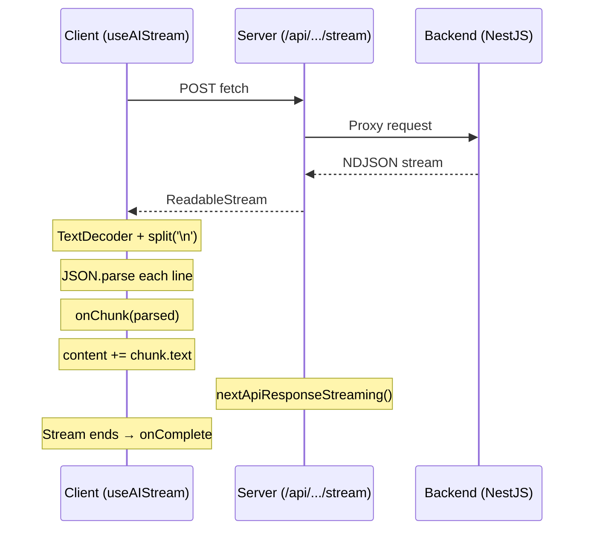

# Web Hooks Reference

## Overview

The Ever Works web application uses a collection of custom React hooks to encapsulate reusable stateful logic. All hooks live in `apps/web/src/lib/hooks/` and follow the `use-*.ts` naming convention. They are client-only (`'use client'`) since they depend on browser APIs (localStorage, fetch, DOM events) and React state.

## Architecture

```
apps/web/src/lib/hooks/
├── use-ai-stream.ts          # Streaming AI responses via ReadableStream
├── use-chat-history.ts       # Chat message state management
├── use-sidebar-persistence.ts # Sidebar width/collapsed localStorage persistence
├── use-keyboard-shortcuts.ts  # Global keyboard shortcuts
├── use-plugin-settings.ts     # Plugin settings form management
├── use-provider-selection.ts  # AI/search/screenshot provider selection
├── use-theme.ts               # Dark/light theme with system preference
├── use-plugin-toggle.ts       # Plugin enable/disable with optimistic updates
├── use-local-storage.ts       # Generic localStorage hook (SSR-safe)
└── use-mounted.ts             # Mounted state for hydration safety
```

## Components

### useAIStream

**File:** `apps/web/src/lib/hooks/use-ai-stream.ts`

**Signature:**

```typescript
function useAIStream(options: {
	onChunk?: (chunk: unknown) => void;
	onComplete?: (content: string) => void;
	onError?: (error: Error) => void;
}): {
	streamMessage: (url: string, body: unknown) => Promise<void>;
	isStreaming: boolean;
	content: string;
	error: Error | null;
	reset: () => void;
};
```

| Return Value    | Type                                            | Description                                |
| --------------- | ----------------------------------------------- | ------------------------------------------ |
| `streamMessage` | `(url: string, body: unknown) => Promise<void>` | Initiates a streaming request              |
| `isStreaming`   | `boolean`                                       | Whether a stream is currently active       |
| `content`       | `string`                                        | Accumulated content from all chunks so far |
| `error`         | `Error \| null`                                 | Error if the stream failed                 |
| `reset`         | `() => void`                                    | Resets content, error, and streaming state |

This hook handles NDJSON (newline-delimited JSON) streaming responses. When `streamMessage` is called:

1. A `fetch` POST request is sent to the given URL with the body as JSON.
2. The response body `ReadableStream` is read with a `TextDecoder`.
3. Incoming text is split on newlines and each line is parsed as JSON.
4. The `onChunk` callback receives each parsed object.
5. Content chunks are concatenated into the `content` state.
6. When the stream ends, `onComplete` fires with the full content.
7. On error, `onError` fires and the error is stored in state.

```tsx
const { streamMessage, isStreaming, content, reset } = useAIStream({
	onChunk: (chunk) => console.log('Received:', chunk),
	onComplete: (fullContent) => saveMessage(fullContent),
	onError: (err) => toast.error(err.message)
});

// Start streaming
await streamMessage('/api/ai-conversations/chat/stream', {
	messages: conversationHistory,
	providerId: selectedProvider
});
```

### useChatHistory

**File:** `apps/web/src/lib/hooks/use-chat-history.ts`

**Signature:**

```typescript
function useChatHistory(): {
	messages: ChatMessage[];
	error: string | null;
	isLoading: boolean;
	setMessages: (msgs: ChatMessage[]) => void;
	loadHistory: () => Promise<void>;
	resetHistory: () => void;
};
```

| Return Value   | Type                            | Description                                |
| -------------- | ------------------------------- | ------------------------------------------ |
| `messages`     | `ChatMessage[]`                 | Current conversation messages              |
| `error`        | `string \| null`                | Error message if loading failed            |
| `isLoading`    | `boolean`                       | Whether history is being loaded            |
| `setMessages`  | `(msgs: ChatMessage[]) => void` | Replace the entire message list            |
| `loadHistory`  | `() => Promise<void>`           | Fetch conversation history from the server |
| `resetHistory` | `() => void`                    | Clear all messages and start fresh         |

**Types:**

```typescript
type ChatMessageRole = 'user' | 'assistant' | 'system';

interface ChatMessage {
	id: string;
	role: ChatMessageRole;
	content: string;
	createdAt?: string;
}
```

This hook manages the chat message array. Messages are stored in React state and can be loaded from the server (for conversation persistence) or manipulated locally. It is consumed by `ChatProvider` to provide the message state to the entire chat UI tree.

```tsx
const { messages, setMessages, loadHistory, resetHistory } = useChatHistory();

// Load existing conversation
useEffect(() => {
	loadHistory();
}, []);

// Add a new user message
setMessages([...messages, { id: nanoid(), role: 'user', content: userInput }]);
```

### useSidebarPersistence

**File:** `apps/web/src/lib/hooks/use-sidebar-persistence.ts`

**Signature:**

```typescript
function useSidebarPersistence(): {
	sidebarWidth: number;
	sidebarCollapsed: boolean;
	handleSidebarWidthChange: (width: number) => void;
	handleSidebarCollapsedChange: (collapsed: boolean) => void;
};
```

**Constants:**

```typescript
const SIDEBAR_WIDTH_DEFAULT = 320;
const SIDEBAR_WIDTH_MIN = 320; // exported
const SIDEBAR_WIDTH_MAX = 440; // exported
```

| Return Value                   | Type                           | Description                        |
| ------------------------------ | ------------------------------ | ---------------------------------- |
| `sidebarWidth`                 | `number`                       | Current sidebar width in pixels    |
| `sidebarCollapsed`             | `boolean`                      | Whether the sidebar is collapsed   |
| `handleSidebarWidthChange`     | `(width: number) => void`      | Update and persist width           |
| `handleSidebarCollapsedChange` | `(collapsed: boolean) => void` | Update and persist collapsed state |

Wraps `useLocalStorage` with custom serializers:

- **Width** is stored as a string key `sidebar-width`, parsed as `parseInt(raw, 10)`, and validated against `SIDEBAR_WIDTH_MIN` and `SIDEBAR_WIDTH_MAX`. Invalid values fall back to the default (320).
- **Collapsed** is stored as key `sidebar-collapsed` with values `'1'` (true) or `'0'` (false).

Both setters are wrapped in `useCallback` for stable references.

```tsx
const { sidebarWidth, sidebarCollapsed, handleSidebarWidthChange, handleSidebarCollapsedChange } =
	useSidebarPersistence();
```

### useKeyboardShortcuts

**File:** `apps/web/src/lib/hooks/use-keyboard-shortcuts.ts`

**Signature:**

```typescript
function useKeyboardShortcuts(options: { onOpenHelp?: () => void }): void;
```

Registers global keyboard event listeners on mount. The registered shortcuts are:

| Shortcut              | Action                                               |
| --------------------- | ---------------------------------------------------- |
| `Ctrl+K` (or `Cmd+K`) | Open search                                          |
| `C`                   | Create new work (only when no input is focused) |
| `?`                   | Open help drawer (calls `onOpenHelp`)                |

The hook checks `document.activeElement` to avoid triggering shortcuts while the user is typing in an input, textarea, or contenteditable element. Listeners are cleaned up on unmount.

```tsx
useKeyboardShortcuts({
	onOpenHelp: () => setHelpDrawerOpen(true)
});
```

### usePluginSettings

**File:** `apps/web/src/lib/hooks/use-plugin-settings.ts`

**Signature:**

```typescript
function usePluginSettings(options: {
	schema: JSONSchema;
	initialSettings: Record<string, unknown>;
	scopes?: string[];
	onSave: (settings: Record<string, unknown>) => Promise<void>;
	fallbackSettings?: Record<string, unknown>;
	scope?: string;
}): {
	settings: Record<string, unknown>;
	errors: Record<string, string>;
	isDirty: boolean;
	isSaving: boolean;
	handleFieldChange: (field: string, value: unknown) => void;
	handleSave: () => Promise<void>;
	resetSettings: () => void;
};
```

| Return Value        | Type                                      | Description                             |
| ------------------- | ----------------------------------------- | --------------------------------------- |
| `settings`          | `Record<string, unknown>`                 | Current settings values                 |
| `errors`            | `Record<string, string>`                  | Validation errors per field             |
| `isDirty`           | `boolean`                                 | Whether settings have been modified     |
| `isSaving`          | `boolean`                                 | Whether a save operation is in progress |
| `handleFieldChange` | `(field: string, value: unknown) => void` | Update a single field                   |
| `handleSave`        | `() => Promise<void>`                     | Validate and save settings              |
| `resetSettings`     | `() => void`                              | Reset to initial values                 |

This hook manages a dynamic form generated from a JSON Schema. It:

1. Initializes field values from `initialSettings`, falling back to `fallbackSettings`.
2. Tracks changes to mark the form as dirty.
3. Validates fields against the schema (required fields, pattern matching, etc.).
4. On save, sanitizes the settings (trims strings, removes empty values) and calls `onSave`.
5. Supports scoped settings where fields belong to specific capability scopes.

```tsx
const { settings, errors, isDirty, handleFieldChange, handleSave } = usePluginSettings({
	schema: plugin.settingsSchema,
	initialSettings: currentSettings,
	onSave: async (newSettings) => {
		await updatePluginSettings(plugin.id, newSettings);
	}
});
```

### useProviderSelection

**File:** `apps/web/src/lib/hooks/use-provider-selection.ts`

**Signature:**

```typescript
function useProviderSelection(initial?: ProviderSelectionState): {
	providers: ProviderSelectionState;
	handleProviderChange: (field: string, value: string) => void;
	buildSelectedProviders: () => SelectedProviders;
	getUnconfiguredProviders: () => string[];
	syncResolvedPipeline: (pipeline: ResolvedPipeline) => void;
};
```

| Return Value               | Type                                     | Description                                |
| -------------------------- | ---------------------------------------- | ------------------------------------------ |
| `providers`                | `ProviderSelectionState`                 | Current provider selections                |
| `handleProviderChange`     | `(field: string, value: string) => void` | Update a provider selection                |
| `buildSelectedProviders`   | `() => SelectedProviders`                | Build the final provider config object     |
| `getUnconfiguredProviders` | `() => string[]`                         | List providers that need configuration     |
| `syncResolvedPipeline`     | `(pipeline: ResolvedPipeline) => void`   | Sync state with a server-resolved pipeline |

Manages the state for selecting AI providers, search providers, and screenshot providers. Used by `ChatProvider` and the generator configuration form. The `buildSelectedProviders` method assembles the final object sent to the backend when starting a generation or chat session.

### useTheme

**File:** `apps/web/src/lib/hooks/use-theme.ts`

**Signature:**

```typescript
function useTheme(): {
	theme: 'light' | 'dark';
	isDark: boolean;
	toggleTheme: () => void;
	mounted: boolean;
};
```

| Return Value  | Type                | Description                                        |
| ------------- | ------------------- | -------------------------------------------------- |
| `theme`       | `'light' \| 'dark'` | Current theme                                      |
| `isDark`      | `boolean`           | Convenience boolean for dark mode checks           |
| `toggleTheme` | `() => void`        | Switch between light and dark                      |
| `mounted`     | `boolean`           | Whether the component has mounted (for SSR safety) |

Manages the theme state with three layers:

1. **localStorage** - Persists the user's explicit choice under a `theme` key.
2. **System preference** - Respects `prefers-color-scheme: dark` media query if no explicit choice is stored.
3. **DOM class** - Toggles the `dark` class on the `<html>` element to activate Tailwind's dark mode variants.

The `mounted` flag prevents hydration mismatches by defaulting to a safe value during SSR and updating after mount.

```tsx
const { isDark, toggleTheme, mounted } = useTheme();

if (!mounted) return null; // Prevent hydration flash

return <button onClick={toggleTheme}>{isDark ? <Sun /> : <Moon />}</button>;
```

### usePluginToggle

**File:** `apps/web/src/lib/hooks/use-plugin-toggle.ts`

**Signature:**

```typescript
function usePluginToggle(options: { pluginId: string; enabled: boolean; visibility?: 'public' | 'private' }): {
	isEnabled: boolean;
	isPending: boolean;
	handleToggle: (newState: boolean) => void;
	showEnablePanel: boolean;
	showDisableWarning: boolean;
};
```

| Return Value         | Type                          | Description                                   |
| -------------------- | ----------------------------- | --------------------------------------------- |
| `isEnabled`          | `boolean`                     | Current enabled state (optimistic)            |
| `isPending`          | `boolean`                     | Whether a toggle operation is in progress     |
| `handleToggle`       | `(newState: boolean) => void` | Toggle the plugin on/off                      |
| `showEnablePanel`    | `boolean`                     | Whether to show the enable confirmation panel |
| `showDisableWarning` | `boolean`                     | Whether to show the disable warning           |

Implements optimistic UI updates for plugin enable/disable:

1. When toggled, the local state updates immediately.
2. The server action is called in the background.
3. If the server action fails, the local state is rolled back.
4. A warning is shown when disabling a plugin that may affect active works.

## Implementation Details

### SSR Safety

All hooks that access browser APIs (localStorage, window, document) handle SSR safely:

- `useLocalStorage` returns the default value during SSR and hydrates from localStorage after mount.
- `useTheme` uses a `mounted` flag to prevent rendering theme-dependent UI before hydration.
- `useKeyboardShortcuts` only attaches event listeners in a `useEffect` (which does not run during SSR).

### The useLocalStorage Foundation

Several hooks (`useSidebarPersistence`, `useTheme`) build on `useLocalStorage`:

```typescript
function useLocalStorage<T>(
	key: string,
	defaultValue: T,
	options?: {
		serialize?: (value: T) => string;
		deserialize?: (raw: string) => T;
		validate?: (value: T) => boolean;
	}
): [T, (value: T) => void];
```

This hook reads from and writes to `localStorage` with custom serialization/deserialization and optional validation. Invalid values (or missing keys) fall back to `defaultValue`.

### Streaming Architecture

The `useAIStream` hook is the client-side counterpart to the server's streaming API. The flow:



## Styling & Theming

Hooks themselves do not contain styling, but they enable styling behaviors:

- `useTheme` controls the `dark` class on `<html>`, enabling all `dark:` Tailwind variants project-wide.
- `useSidebarPersistence` provides the width value that is applied as an inline `style={{ width }}` on the sidebar element.

## Usage Examples

### Custom Component with Multiple Hooks

```tsx
'use client';

import { useTheme } from '@/lib/hooks/use-theme';
import { useKeyboardShortcuts } from '@/lib/hooks/use-keyboard-shortcuts';
import { useSidebarPersistence } from '@/lib/hooks/use-sidebar-persistence';

export function AppShell({ children }) {
	const { isDark, toggleTheme, mounted } = useTheme();
	const { sidebarWidth, sidebarCollapsed } = useSidebarPersistence();

	useKeyboardShortcuts({
		onOpenHelp: () => setHelpOpen(true)
	});

	if (!mounted) return null;

	return (
		<div className={isDark ? 'dark' : ''}>
			<aside style={{ width: sidebarCollapsed ? 64 : sidebarWidth }}>{/* sidebar content */}</aside>
			<main>{children}</main>
		</div>
	);
}
```

### Streaming Chat with useAIStream

```tsx
'use client';

import { useState } from 'react';
import { useAIStream } from '@/lib/hooks/use-ai-stream';

export function SimpleChat() {
	const [messages, setMessages] = useState([]);
	const { streamMessage, isStreaming, content, reset } = useAIStream({
		onComplete: (fullContent) => {
			setMessages((prev) => [...prev, { role: 'assistant', content: fullContent }]);
			reset();
		}
	});

	const handleSend = async (text: string) => {
		setMessages((prev) => [...prev, { role: 'user', content: text }]);
		await streamMessage('/api/ai-conversations/chat/stream', {
			messages: [...messages, { role: 'user', content: text }]
		});
	};

	return (
		<div>
			{messages.map((msg, i) => (
				<div key={i}>{msg.content}</div>
			))}
			{isStreaming && <div>{content}</div>}
		</div>
	);
}
```

## Related Components

- [Dashboard Layout](./dashboard-layout.md) - Consumes useSidebarPersistence, useTheme, useKeyboardShortcuts
- [AI Components Deep Dive](./ai-components-deep-dive.md) - Consumes useAIStream, useChatHistory, useProviderSelection
- [Settings Components](./settings-components.md) - Consumes usePluginSettings, usePluginToggle
- [UI Component Library](./ui-component-library.md) - Hooks provide state that drives UI component rendering
